---

---

# 一、MySQL数据库

## 1、SQL语句问题

### 1、基本数据类型

MySQL中的数据类型有很多，主要分为三类：数值类型、字符串类型、日期时间类型。

#### **（1）数值类型**

| 类型        | 大小   | 有符号(SIGNED)范围                                    | 无符号(UNSIGNED)范围                                       | 描述               |
| ----------- | ------ | ----------------------------------------------------- | ---------------------------------------------------------- | ------------------ |
| TINYINT     | 1byte  | (-128，127)                                           | (0，255)                                                   | 小整数值           |
| SMALLINT    | 2bytes | (-32768，32767)                                       | (0，65535)                                                 | 大整数值           |
| MEDIUMINT   | 3bytes | (-8388608，8388607)                                   | (0，16777215)                                              | 大整数值           |
| INT/INTEGER | 4bytes | (-2147483648，2147483647)                             | (0，4294967295)                                            | 大整数值           |
| BIGINT      | 8bytes | (-2^63，2^63-1)                                       | (0，2^64-1)                                                | 极大整数值         |
| FLOAT       | 4bytes | (-3.402823466 E+38，3.402823466351 E+38)              | 0 和 (1.175494351  E-38，3.402823466 E+38)                 | 单精度浮点数值     |
| DOUBLE      | 8bytes | (-1.7976931348623157 E+308，1.7976931348623157 E+308) | 0 和  (2.2250738585072014 E-308，1.7976931348623157 E+308) | 双精度浮点数值     |
| DECIMAL     |        | 依赖于M(精度)和D(标度)的值                            | 依赖于M(精度)和D(标度)的值                                 | 小数值(精确定点数) |

```sql
示例: 
    年龄字段 ---不会出现负数, 而且人的年龄不会太大
	age tinyint unsigned
	
	分数 ---总分100分, 最多出现一位小数
	score double(4,1)
```

#### （2）**字符串类型**

| 类型       | 大小                  | 描述                         |
| ---------- | --------------------- | ---------------------------- |
| CHAR       | 0-255 bytes           | 定长字符串(需要指定长度)     |
| VARCHAR    | 0-65535 bytes         | 变长字符串(需要指定长度)     |
| TINYBLOB   | 0-255 bytes           | 不超过255个字符的二进制数据  |
| TINYTEXT   | 0-255 bytes           | 短文本字符串                 |
| BLOB       | 0-65 535 bytes        | 二进制形式的长文本数据       |
| TEXT       | 0-65 535 bytes        | 长文本数据                   |
| MEDIUMBLOB | 0-16 777 215 bytes    | 二进制形式的中等长度文本数据 |
| MEDIUMTEXT | 0-16 777 215 bytes    | 中等长度文本数据             |
| LONGBLOB   | 0-4 294 967 295 bytes | 二进制形式的极大文本数据     |
| LONGTEXT   | 0-4 294 967 295 bytes | 极大文本数据                 |

char 与 varchar 都可以描述字符串，char是定长字符串，指定长度多长，就占用多少个字符，和字段值的长度无关 。而varchar是变长字符串，指定的长度为最大占用长度 。相对来说，char的性能会更高些。

```sql
示例： 
    用户名 username ---长度不定, 最长不会超过50
	username varchar(50)
	
	手机号 phone ---固定长度为11
	phone char(11)
```

#### （3）**日期时间类型**

| 类型      | 大小 | 范围                                       | 格式                | 描述                     |
| --------- | ---- | ------------------------------------------ | ------------------- | ------------------------ |
| DATE      | 3    | 1000-01-01 至  9999-12-31                  | YYYY-MM-DD          | 日期值                   |
| TIME      | 3    | -838:59:59 至  838:59:59                   | HH:MM:SS            | 时间值或持续时间         |
| YEAR      | 1    | 1901 至 2155                               | YYYY                | 年份值                   |
| DATETIME  | 8    | 1000-01-01 00:00:00 至 9999-12-31 23:59:59 | YYYY-MM-DD HH:MM:SS | 混合日期和时间值         |
| TIMESTAMP | 4    | 1970-01-01 00:00:01 至 2038-01-19 03:14:07 | YYYY-MM-DD HH:MM:SS | 混合日期和时间值，时间戳 |

```sql
示例: 
	生日字段  birthday ---生日只需要年月日  
	birthday date
	
	创建时间 createtime --- 需要精确到时分秒
	createtime  datetime
```

### 2、连接

**数据中的连接join分为内连接、自然连接、外连接，外连接又分为左外连接、右外连接、全外连接** 

|      | 表一 |      |      | 表二 |      |
| :--: | :--: | :--: | :--: | :--: | :--: |
|  A   |  B   |  C   |  C   |  D   |  E   |
|  1   |  2   |  3   |  3   |  4   |  5   |
|  5   |  6   |  7   |  8   |  9   |  1   |

当然，这些分类都是在连接的基础上，是从两个表中记录的笛卡尔积中选取满足连接的记录。笛卡尔积简单的说就是一个表里的记录要分别和另外一个表的记录匹配为一条记录，即如果表1有3条记录，表2也有三条记录，经过笛卡尔运算之后就应该有3\*3即9条记录。如下表：

| A    | B    | C    | C    | D    | E    |
| ---- | ---- | ---- | ---- | ---- | ---- |
| 1    | 2    | 3    | 3    | 4    | 5    |
| 5    | 6    | 7    | 8    | 9    | 1    |
| 1    | 2    | 3    | 8    | 9    | 1    |
| 5    | 6    | 7    | 3    | 4    | 5    |

#### **（1）自然连接（natural join）** 

自然连接是一种特殊的等值连接，他要求两个关系表中进行比较的必须是相同的属性列，无须添加连接条件，并且在结果中消除重复的属性列。 sql语句：Select …… from 表1 natural join 表2 ，结果：

| A    | B    | C    | D    | E    |
| ---- | ---- | ---- | ---- | ---- |
| 1    | 2    | 3    | 4    | 5    |

#### **（2）内连接（inner join）** 

内连接基本与自然连接相同，不同之处在于自然连接要求是同名属性列的比较，而内连接则不要求两属性列同名，可以用using或on来指定某两列字段相同的连接条件。

**隐式内连接：Select …… from 表1 , where 表1.A = 表2.E**

**显式内连接**：Select …… from 表1 inner join 表 2 on 表1.A = 表2.E ，结果： 

| A    | B    | 表1.C | 表2.C | D    | E    |
| :--- | ---- | ----- | ----- | ---- | ---- |
| 5    | 6    | 7     | 3     | 4    | 5    |
| 1    | 2    | 3     | 8     | 9    | 1    |

自然连接时某些属性值不同则会导致这些元组会被舍弃，那如何保存这些会被丢失的信息呢，外连接就解决了相应的问题。**外连接**分为左外连接、右外连接、全外连接。外连接必须用using或on指定连接条件。

#### **（3）左外连接（left outer join)** 

左外连接相当于查询表1(左表)的所有数据，当然也包含表1和表2交集部分的数据。
sql语句：Select …… from 表1 **left outer join** 表2 on 表1.C=表2.C , 结果： 

| A    | B    | 表1.C | 表2.C | D    | E    |
| :--- | ---- | ----- | ----- | ---- | ---- |
| 1    | 2    | 3     | 3     | 4    | 5    |
| 5    | 6    | 7     | null  | null | null |

#### **（4）右外连接(rignt outer join)** 

右外连接相当于查询表2(右表)的所有数据，当然也包含表1和表2交集部分的数据。 
Select …… from 表1 **rignt outer join** 表2 on 表1.C=表2.C , 结果：

| A    | B    | 表1.C | 表2.C | D    | E    |
| :--- | ---- | ----- | ----- | ---- | ---- |
| 1    | 2    | 3     | 3     | 4    | 5    |
| null | null | null  | 8     | 9    | 1    |

MySQL 中没有直接支持全连接（FULL JOIN）的语法

### 3、内连接和外连接的区别

左连接（left join）：返回包括左表中的所有记录和右表中连接字段相等的记录；

右连接（right join）：返回包括右表中的所有记录和左表中连接字段相等的记录；

内连接（inner join）：等值连接：只返回两表中连接字段相等的行；

全外连接（MySQL不支持）：返回左右表中所有的记录和左右表中连接字段相等的记录。

### 4、union和union all的区别

区别1：取结果的并集

- union: 对两个结果集进行并集操作, 不包括重复行,相当于distinct, 同时进行默认规则的排序;
- union all: 对两个结果集进行并集操作, 包括重复行, 即所有的结果全部显示, 不管是不是重复;

区别2：获取结果后的操作

- union: 会对获取的结果进行排序操作

- union all: 不会对获取的结果进行排序操作

区别3：语法

- `UNION`: 使用 `UNION` 时，两个查询的列数和数据类型必须完全匹配。
- `UNION ALL`: 对于 `UNION ALL`，两个查询的列数和数据类型也需要匹配，但它对匹配的要求较为宽松。

### 5、SQL语句查询速度慢的原因

**内在原因：**

1. **未优化的查询：**查询语句可能没有经过充分优化，缺乏合适的索引或者使用了不恰当的查询方式，导致数据库引擎难以高效执行查询。
2. **缺乏索引：**表没有适当的索引，或者索引没有被正确使用，这会导致数据库引擎需要进行全表扫描，而不是利用索引来快速定位数据。
3. **大量数据量：**查询涉及到大量的数据时，不论是否有索引，都可能导致查询速度慢。在处理大规模数据时，应该采取合适的分页、缓存等策略。
4. **查询涉及复杂操作：**涉及到多表连接、子查询或复杂的聚合操作可能会导致查询性能下降。应当谨慎设计查询，考虑表结构和索引的优化。

**外在原因：**

1. **网络延迟：**查询的速度受到网络传输速度的影响，特别是在分布式环境中，数据库服务器与应用服务器之间的网络延迟可能成为瓶颈。
2. **硬件性能：**数据库服务器硬件性能不足，例如 CPU、内存、磁盘速度等。如果硬件资源无法满足查询需求，会导致查询速度下降。
3. **并发访问：**当多个用户同时执行大量查询时，数据库系统可能会面临并发访问的挑战，需要合理的并发控制和资源管理。
4. **数据库配置：**不正确的数据库配置也可能导致性能问题。例如，数据库连接池的配置、缓冲池大小、线程数等。
5. **未进行周期性维护：**数据库可能需要进行周期性的维护操作，如索引重建、统计信息更新等，以保持高性能。

### 5、为什么不用select \*

1.  **多取了不需要的列：** 毋庸置疑，使用 \* 查询时，会把所有的列都查询出来，会查找出来好多我们并不需要的列，在SQL语句复杂等情况下查询的成本就比较高，内存和CPU的消耗也比较大。
2.  **杜绝了覆盖索引的可能：** 覆盖索引是效率很高很推荐的查询方式，而使用select \* 就表示肯定用不到覆盖索引。（**覆盖索引**是指索引本身包含了查询所需的所有信息，而无需回表到主表。如果查询只需要使用到了索引中的列，数据库引擎就可以直接从索引中获取数据，而不需要再次访问主表。这样的查询效率通常更高，因为不需要额外的 I/O 操作。）
3.  **增加传输时间和网络开销：** 使用select \* 多查找出来的数据，会增加数据传输的时间，尤其是一些很大的类型比如log或者MD5，即使 mysql 服务器和客户端是在同一台机器上，使用的协议还是 tcp，通信也是需要额外的时间。
5.  **改变表结构时可能出现错误：** 如果表的结构发生变化，例如添加或删除列，使用 SELECT * 的查询结果也会受到影响，可能会导致应用程序的错误。
5.  **查询结果不可控：**SELECT *返回的列的顺序可能与表的定义不同，这使得查询结果的列顺序不可控。如果查询结果用于应用程序的特定逻辑，这可能导致错误。
6.  **数据冗余：**在某些情况下，可能需要从表中排除一些列，以防止敏感数据泄漏。使用 `SELECT *` 可能导致不必要的数据冗余，包含敏感信息。
7.  **增加了IO次数：** 如果表中存在字段是大字段例如text、varchar等，当字段超过728字节后，就会把超出的数据放到另一个地方，在查询结果读取时，就会增加IO操作。

### 6、说一下drop，delete和truncate的区别

```java
drop table 表名称    delete from 表名称 where 列名称 = 值    truncate table 表名称
```

1. **删除内容：**DROP用于删除数据库、表、索引、视图等整个数据库对象。DROP 命令不仅删除数据，而且删除整个表结构，包括表定义、索引、触发器等。delete 语句用于删除表中的行。delete语句执行删除的过程是每次从表中删除一行，truncate table 删除表中的所有行，但表结构及其列、约束、索引等保持不变。新行标识所用的计数值重置为该列的种子。执行速度一般来说: drop\> truncate \> delete。
2. **事务方面：**delete语句是数据库操作语言(dml)，这个操作会放到 rollback segement 中，事务提交之后才生效并，且同时将该行的删除操作作为事务记录在日志中保存，以便进行进行回滚操作。如果有相应的trigger，执行的时候将被触发。truncate、drop 是数据库定义语言(ddl)，操作立即生效，原数据不放到 rollback segment 中，不能回滚，操作不触发 trigger。

## 2、常用的存储引擎

存储引擎就是存储数据的方式，一张表是由**数据+表结构+索引**组成的，

在 InnoDB 中，表的数据存储在聚簇索引中，聚簇索引包含了表的所有列。InnoDB 存储引擎也会有多个文件包括数据文件（聚簇索引）和辅助索引文件。MyISAM中的数据和索引不存储在一起，MEMORY 将数据存储在内存中，断电消失，只存表结构一个文件。

InnoDB：

1. 支持数据持久化
1. 支持事务：提供了对事务的支持，具有 ACID 特性（原子性、一致性、隔离性、持久性）。
1. 支持行级锁：需要修改的行少的时候使用，而且在修改频繁时效率很高
1. 支持表级锁：批量修改多行数据时使用
1. 支持外键：降低增删改出错率
1. 有且只有一个聚簇索引

MyISAM：

1. 支持数据持久化
2. 支持表级锁
3. 只有非聚簇索引


项目中使用了什么存储方式

答：项目中使用了InnoDB

1.  涉及多个用户操作的过程中对同一张表的数据同时做修改的情况，InnoDB支持行级锁，所以使用该引擎
2.  支付相关，支持事务，维护数据的完整性
3.  项目中有两张…表，两表之间的外键关系是…，需要外键约束

## 3、索引

### （1）索引的优点，为什么要创建索引

- 第一，通过创建唯一性索引，可以保证数据库表中每一行数据的唯一性。

- 第二，可以大大加快数据的检索速度，这也是创建索引的**最主要的原因**。

- 第三，可以加速表和表之间的连接

- 第四，在使用分组和排序子句进行数据检索时，同样可以显著减少查询中分组和排序的时间。


### （2）索引的缺点

- 第一，创建索引和维护索引要耗费时间，这种时间随着数据量的增加而增加。

- 第二，索引需要占物理空间，除了数据表占数据空间之外，每一个索引还要占一定的物理空间，如果要建立聚簇索引，那么需要的空间就会更大。

- 第三，当对表中的数据进行增加、删除和修改的时候，索引也要动态的维护，这样就降低了数据的维护速度。


### （3）聚簇索引与非聚簇索引

**聚簇索引：**将数据与索引放到一起存储，索引树结构的叶子节点保存了**行数据**

**非聚簇索引：**将数据与索引分开存储，索引树结构的叶子节点放的是**指向数据的指针**（或者说是地址）。

**InnoDB 存储引擎：**

- **聚簇索引：**
  - 将数据与主索引（主键索引）放在一起存储，叶子节点保存了行数据本身。
  - 如果没有显式定义主键，InnoDB 会选择一个唯一且非空的索引作为聚簇索引。
  - 聚簇索引的叶子节点中存放的是实际数据本身。
- **非聚簇索引：**
  - 除主索引外的其他索引都是非聚簇索引。
  - 叶子节点存放的是对应行数据的主键值。

**MyISAM 存储引擎：**

- **非聚簇索引：**
  - 数据和索引是分开存储的，索引的叶子节点不存放实际数据，而是存放指向数据的指针或地址。

**关于一张表只有一个聚簇索引的说明：**

在 InnoDB 中，一张表只能有一个聚簇索引，通常是主键索引，如果没有显式定义主键，则会选择一个唯一非空的索引作为聚簇索引。在 MyISAM 中，表的数据存储和索引存储是分开的，因此没有聚簇索引的概念。

### （4）什么样的字段适合创建索引

- 在**经常需要搜索**的列上，可以加快搜索的速度；

- 在作**为主键**的列上，强制该列的唯一性和组织表中数据的排列结构；

- 经常用于**连接条件**的字段，这些列主要是一些外键，可以加快连接的速度；

- 在经常需要**根据范围进行搜索**的列上创建索引，因为索引已经排序，其指定的范围是连续的；

- 在经常**需要排序和分组**的列上创建索引，因为索引已经排序，这样查询可以利用索引的排序，加快排序查询时间；

- 在经常使用**在WHERE子句中**的列上面创建索引，加快条件的判断速度。


### （5）什么字段不适合创建索引

- 频繁更新的字段不适合建立索引
- where条件中用不到的字段不适合建立索引

- 表数据可以确定比较少的不需要建索引

- 数据重复且分布比较均匀的的字段不适合建索引（唯一性太差的字段不适合建立索引），例如性别，真假值

- 参与列计算的列不适合建索引

### （6）索引的底层数据结构

索引可选的数据结构：二叉树，红黑树，hash，B树，**B+树**

- **二叉树：** 对于依次递增的数据列是不合适的，因为它与全表扫描查询的效率一样。

- **Hash：**每插入一个元素，都要计算它的hash值，根据哈希值找到该元素的存储位置。但Hash并不适用于范围查找，因为所存的数据是没有规律的，它只是通过hashcode计算来确定它在哈希表中的位置。

- **红黑树：**红黑树即为平衡二叉树的一种，当左右子树的高度差\>1时，会进行自旋。它的效率要高于普通二叉树。它能够精确定位，并且范围查找的效率也很高。但是当Mysql数据量很大时，那么索引的体积也会很大，有可能内存放不下，所以需要从磁盘上进行读写。如果树的层级太高，则读写磁盘的次数（I/O交互）就很多，性能就会差。

- **B树：**红黑树唯一的缺点是树的高度是不可控的，所以就高度进行改进提出B树。普通二叉树、红黑树一个节点只能保存一个元素；但B树可以自定义一个节点存储多个元素。但B树的每个节点存储了数据和索引。

  B树是一**种多路平衡树**，用这种存储结构存储大量的数据的时候，他整个树的**高度**相比二叉树来说会矮很多，而对于数据库来说，所有的数据都是存在磁盘上的，而磁盘IO的效率实际上是比较低的，特别是在随机磁盘IO的情况下，效率就更低，**所以树的高度能够决定磁盘IO的次数，**磁盘的IO次数越小，那么性能的提升就越大。


### （7）为什么B+树比B树更适合做索引

1.  B+树的所有数据都存储在叶子节点，非叶子节点只存储索引。（更稳定、因为对B+树的每次查询操作最终都会落到叶子节点上）
2.  叶子节点的数据使用双向链表的方式进行关联。范围查询和顺序访问比较方便。

### （8）索引失效的情况

- **未使用索引列进行查询：** 如果查询条件中的列没有被索引，数据库引擎就无法使用索引来加速查询。确保查询条件中的列在索引中。
- **对索引列进行了函数操作：** 如果在查询条件中对索引列进行了函数操作，可能会导致索引失效。数据库无法利用索引来处理这种情况。如果要对索引列进行运算，需要建立函数索引。
- **对索引列进行数学运算：**若对索引列进行数学运算，如+、-、*、/等，索引同样会失效。因为数据库无法直接利用索引进行这些运算
- **通配符在开头的LIKE操作：**在LIKE操作中，如果通配符位于开头（如LIKE '%keyword'），索引将失效，因为数据库无法高效匹配这种模式。
- **列类型不匹配：**若在查询条件中使用与索引列类型不匹配的值，如字符串与数值类型混用，索引可能无法正常工作。
- **使用NOT操作：**NOT操作同样会导致索引失效，因为它会对查询条件进行取反操作，使得索引无法直接匹配。
- **小表扫描：** 对于小表，全表扫描可能比使用索引更为高效。数据库引擎可能会选择不使用索引，而是直接扫描整个表。
- **数据分布不均匀：** 如果索引列的数据分布不均匀，例如某些值的频率非常高，而另一些值的频率非常低，索引可能会失效。这是因为数据库引擎可能认为全表扫描更为高效。
- **单独引用复合索引里非第一位置的索引列：**复合索引的最左前缀原则表示，只有使用索引的最左列，才能充分利用索引。


1) 没有查询条件，或者查询条件没有建立索引
2) 查询的数量是大表的大部分，应该是30％以上。
3) 索引本身失效
4) 提示不使用索引
5) 统计数据不真实
6) CBO计算走索引花费过大的情况。其实也包含了上面的情况，这里指的是表占有的block要比索引小。
12) 1,\<\> 2,单独的\>,\<,(有时会用到，有时不会)

14),表没分析.

19)当变量采用的是times变量，而表的字段采用的是date变量时.或相反情况。

20)B-tree索引 is null不会走,is not null会走,位图索引 is null,is not null 都会走

21)联合索引 is not null 只要在建立的索引列（不分先后）都会走, in null时 必须要和建立索引第一列一起使用,当建立索引第一位置条件是is null 时,其他建立索引的列可以是is null（但必须在所有列 都满足is null的时候）,或者=一个值； 当建立索引的第一位置是=一个值时,其他索引列可以是任何情况（包括is null =一个值）,以上两种情况索引都会走。其他情况不会走。

### （9）如果没有命中索引或者运行超时，应该如何定位

使用数据库的 **EXPLAIN**命令，可以查看数据库优化器生成的查询计划，了解查询是如何执行的，以及是否使用了索引。

### （10）索引的类型有哪些

- **单列索引：**单列索引是基于单个列的索引，最简单、最常见的索引类型。用于提高根据该列进行的查询效率。
- **复合索引：**复合索引是基于多个列的索引，允许在这些列上进行联合查询。最左前缀原则指的是只有在查询条件中使用了索引的最左列或最左列的组合时，索引才会被有效使用。
- **唯一索引：**唯一索引要求索引列的值在整个表中是唯一的，用于确保数据的唯一性，但允许有空值。如果是组合索引，则列值的组合必须唯一。
- **主键索引：**主键索引是一种特殊的唯一索引，一个表只能有一个主键，不允许有空值。
- **全文索引：**全文索引主要用来查找文本中的关键字，而不是直接与索引中的值相比较。全文索引跟其它索引大不相同，它更像是一个搜索引擎，而不是简单的where语句的参数匹配。

## 4、说说对数据库优化的理解

MySQL数据库优化是多方面的，原则是减少系统的瓶颈，减少资源的占用，增加系统的反应速度。例如，通过优化文件系统，提高磁盘IO的读写速度；通过优化操作系统调度策略，提高MySQL在高负荷下的负载能力；优化表结构、索引、查询语句等使查询响应更快。

- **查询优化：**我们可以通过使用索引、使用连接代替子查询的方式来提高查询速度
- **慢查询分析：**我们可以通过分析慢查询日志，来发现引起慢查询的原因，从而有针对性得进行优化
- **插入优化：**我们可以通过禁用索引、禁用检查等方式来提高查询速度，在插入之后再启用索引和检查
- **数据库结构优化：**我们可以通过将字段很多的表拆分成多张表、增加中间表、增加冗余字段等方式进行优化。

## 5、如何优化查询语句

- **使用索引：**如果查询时没有使用索引，查询语句将扫描表中所有的记录，在数据量大的情况下，这样查询的速度会很慢。如果使用索引进行查询，查询语句可以根据索引快速定位到待查询记录，从而减少查询的记录数，达到提高查询速度的目的。

- **优化子查询：**执行子查询时，MySQL需要为内层查询语句的查询结果建立一个临时表，然后外层查询语句从临时表中查询记录，查询完毕后，再撤销这些临时表。因此子查询的速度会受到一定的影响，如果查询的数据量比较大，影响也会随之增大。可以使用连接来代替子查询，连接查询不需要建立临时表，其速度比子查询要快，如果使用索引，性能会更好。

## 6、如何插入数据会更高效

- **禁用索引：**在大量插入数据时，可以考虑禁用索引，待数据插入完成后再重新建立索引，以提高插入速度。
- **禁用唯一性检查：**在插入大量数据时，关闭唯一性检查可以减少插入过程中的性能开销。
- **使用批量插入：**一次性插入多条记录的方式比逐条插入更高效。
- **使用LOAD DATA INFILE：**通过 LOAD DATA INFILE 命令导入数据，速度通常比使用 INSERT 语句更快。
- **禁用外键检查：**如果表中定义了外键约束，可以考虑在插入数据时暂时禁用外键检查，以提高插入性能。
- **禁用自动提交：**在大量插入数据时，将事务设置为手动提交模式，以减少事务提交的开销。

## 7、表中包含几千万条数据怎么办

- **优化SQL和索引**：通过优化查询语句和表的索引，可以提高查询性能和数据库的响应速度。
- **增加缓存，如 Redis**：利用缓存可以减轻数据库的负载，提高数据访问速度。Redis等缓存系统可以存储频繁访问的数据，减少对数据库的查询压力。
- **读写分离**：通过主从复制或主主复制，可以将读操作和写操作分离到不同的数据库服务器上，提高数据库的并发处理能力和读取性能。
- **使用MySQL自带的分区表**：MySQL支持分区表功能，可以将大表分割成多个子表，每个子表存储一部分数据，从而提高查询性能和管理效率。
- **垂直或水平拆分**：通过垂直拆分将大表拆分成多个具有相关性的小表，或者通过水平拆分将数据分布到多个数据库中，可以降低单个表的数据量，提高数据库的可扩展性和性能。

## 8、MySQL的慢查询优化

- **优化步骤：**开启慢查询日志，分析慢查询日志，利用**EXPLAIN **关键字可以模拟优化器执行SQL查询语句，来分析查询语句。

- **常见慢查询优化：**

1. **处理索引未生效的情况**：见上文3.(8)
2. **优化表结构**：
   - 将使用频率较低的字段分离出来形成新表，减少主表的宽度，提高查询效率。
   - 对于经常需要联合查询的表，建立中间表，将需要联合查询的数据插入中间表，然后在应用程序中进行关联查询。
3. **分解关联查询**：将关联查询拆分成单表查询，然后在应用程序中进行关联，可以减少数据库的负载，提高查询效率。

## 9、事务

### （1）事务和事务的四大特性（举例说明）

事务是指数据库管理系统（DBMS）中一组操作的执行，这些操作要么全部成功执行，要么全部不执行，不会出现部分执行的情况。事务通常具有以下四个特性，通常被称为 ACID 特性

- **原子性（Atomicity）：**事务中的所有操作要么全部执行成功，要么全部失败回滚，不会出现部分执行的情况。

  举例：比如我们现在有一个任务要让A账户向B账户转100元，那么我们就需要执行两句：第一个是A账户-100第二个是B账户+100。原子性就是保证这两条数据要么都成功要不都不成功，如果成功一般那么就会出现总数多出100或者少100这样就会造成顾客损失或者公司损失，所以出现不成功或者成果一半就要回滚。

- **一致性（Consistency）：**一致性是指事务必须使数据库从一个一致性状态变换到另一个一致性状态，也就是说一个事务执行之前和执行之后都必须处于一致性状态。

  举例：拿转账来说，假设用户A和用户B两者的钱加起来一共是5000，那么不管A和B之间如何转账，转几次账，事务结束后两个用户的钱相加起来应该还得是5000，这就是事务的一致性。

- **隔离性（Isolation）：**事务的执行不受其他事务的影响，即一个事务的执行不会受到其他事务的干扰。要达到这么一种效果：对于任意两个并发的事务T1和T2，在事务T1看来，T2要么在T1开始之前就已经结束，要么在T1结束之后才开始，这样每个事务都感觉不到有其他事务在并发地执行。

  举例：比如一个人A在发出转账请求时，B去同时查看两个账户余额，B要不看见都是转账前的状态都是1000块，要不看到的都是转账后的状态，一个900一个1100，而不会看到一个900一个1000或者一个1000一个1100这种中间状态。

- **持久性（Durability）：**一旦事务提交，对数据的修改就是永久性的，即使系统发生故障，数据也不会丢失。

  举例：当我们在使用 JDBC 提交事务后，如果提示用户事务操作完成，那么我们就可以相信事务已经被正确提交，即使在程序执行过程中发生了数据库系统的故障，事务提交的结果也不会受到影响。这保证了数据的持久性，确保了数据库的稳定性和可靠性。


### （2）事务是如何回滚的

回滚意味着撤销尚未保存到物理数据库中的操作，但ROLLBACK 命令默认回滚整个事务，也即事务中的所有修改操作都无效。但是 SQL 允许回滚事务的一部分，此时需要在事务中设置一个标记点，在该标记点之后的 SQL 语句将被回滚，之前的 SQL 语句将被成功执行。设置标记点使用 SAVEPOINT 命令，回滚到标记点使用 ROLLBACK TO 命令。

### （3）显示事务和隐式事务

- 显式事务，事务具有明显的开启(BEGIN TRANSACTION)和结束(COMMIT)的标记，需要注意的是必须先设置自动提交功能为禁用。
- 隐式事务，事务没有明显的开启和结束的标记，比如INSERT，UPDATE，DELETE语句。

### （4）多个事务并发操作数据库会产生哪些问题

- **丢失更新：**两个事务同时修改相同的数据，并且后提交的事务会覆盖先提交的事务，导致数据更新丢失。
- **脏读：**事务A读取了事务B未提交的数据，由于事务B回滚，导致了事务A的数据不一致，结果事务A出现了脏读。（破坏了隔离性）。
- **不可重复读：**一个事务在自己没有更新数据库数据的情况，同一个查询操作执行两次或多次得到的结果数值不同，因为别的事务更新了该数据，并且提交了事务。（破坏一致性，主要发生在UPDATE，DELETE语句中）。
- **幻读：**事务A读的时候读出了N条记录，事务B在事务A执行的过程中增加了1条，事务A再读的时候就变成了N+1条，这种情况就叫做幻读。（破坏一致性，主要发生在INSERT语句中）。

**注意：幻读是指一种结构上的改变，比如说条数发生了改变；不可重复读是指读出的数值发生了改变。**

### （5）数据库事务的隔离级别

- **未提交读(Read Uncommitted)：**最低的隔离级别，如果一个事务已经开始写数据，则另外一个数据则不允许同时进行写操作，但允许其他事务读此行数据。一个事务可以读取另一个事务尚未提交的数据。**可能导致脏读、不可重复读和幻读问题**。只保证持久性，**事务读取时不加锁**。
- **已提交读(Read Committed)：**读取数据的事务允许其他事务继续访问该行数据，但是未提交的写事务将会禁止其他事务访问该行。可以避免脏读，但是仍然**可能出现不可重复读和幻读问题**。**事务读取时加行级共享锁（读到加锁，读完释放）**。
- **可重复读(Repeatable Read)：**读取数据的事务将会禁止写事务(但允许读事务)，写事务则禁止任何其他事务。可以避免脏读和不可重复读，但仍然**可能出现幻读问题**。**读取时加行级共享锁，事务结束时释放**。MySQL默认的隔离级别是可重复读。
- **序列化(Serializable)：**最高的隔离级别，确保所有事务串行执行，事务之间完全隔离。可以避免所有并发问题。**读取时加表级共享锁，事务结束时释放**。但会导致性能下降，因为事务无法并发执行。

## 10、MySQL建表的约束条件有哪些

- **主键约束 (PRIMARY KEY)**：唯一性，非空性。一个表只能有一个主键，主键约束可以由一个或多个列组成。

- **唯一约束 (UNIQUE)**：唯一性，可以空，但只能有一个。一个表可以有多个唯一约束，唯一约束可以由一个或多个列组成。

- **非空约束 (NOT NULL)**：确保列中的值不为空，即必须在插入数据时提供非空值。如果尝试插入空值，将触发错误。

- **外键约束 (FOREIGN KEY)**：需要建立两表间的关系并引用主表的列。

- **检查约束 (CHECK)**：对该列数据的范围、格式的限制。检查约束允许在插入或更新数据时验证列中的值是否符合指定的条件。

- **默认约束 (DEFAULT)** ：该数据的默认值

  在 MySQL 中，默认约束并不是一个直接的概念，与其他一些数据库管理系统（如 SQL Server）不同，在 MySQL 中，你不能直接为列设置默认约束，而是通过在创建表时使用 DEFAULT 关键字为列指定默认值来实现默认值的设置。

## 11、关系型数据库和非关系型数据库的区别

- **数据存储方式不同**：
  - 关系型数据库：数据存储在表格中，以行和列的形式组织，支持复杂的关系和规范化数据模型。数据表可以彼此关联协作存储，也很容易提取数据。
  - 非关系型数据库：数据以更灵活的形式存储，可以是文档、键值对、图形等形式，适用于半结构化和非结构化数据。
- **扩展方式不同**：
  - 关系型数据库：通常采用纵向扩展，通过提高服务器性能来应对增长的需求，存在性能瓶颈。
  - 非关系型数据库：采用横向扩展，通过添加更多的节点来分担负载，实现高可扩展性和高并发访问。
- **对事务性的支持不同**：
  - 关系型数据库：提供高度的事务支持，具有ACID（原子性、一致性、隔离性、持久性）特性，适用于需要严格事务控制的应用场景。
  - 非关系型数据库：通常在事务支持方面比较灵活，根据数据库类型和配置的不同，事务支持程度有所不同，适用于对事务性要求不是很高的场景。

## 12、锁机制

### （1）表级锁和行级锁（哪个更适合并发）

锁是数据库在**并发访问**时保证**数据一致性和完整性**的主要机制。

**表级锁**

- **锁定粒度大**：一次性将整个表锁定。
- **简单实现**：获取和释放锁的速度快，系统负面影响较小。
- **避免死锁**：由于锁定整个表，可以很好地避免死锁问题。
- **适用存储引擎**：适用于非事务性存储引擎，如 MyISAM、MEMORY、CSV 等。
- **锁定资源争用**：由于锁定粒度大，锁定资源争用的概率较高。

**行级锁**

- **锁定粒度小**：针对数据行进行锁定。
- **并发处理能力**：由于锁定力度小，**可以提供更大的并发处理能力，适用于高并发应用系统。**
- **资源消耗大**：获取和释放锁需要的消耗较大。
- **容易发生死锁**：因为锁定粒度小，容易发生死锁情况。
- **适用存储引擎**：适用于事务性存储引擎，如 InnoDB。

### （2）悲观锁与乐观锁

**悲观锁**

当要对数据库中的一条数据进行修改的时候，为了避免同时被其他人修改，最好的办法就是直接对该数据进行加锁以防止并发。这种借助数据库锁机制，在修改数据之前先锁定，再修改的方式被称之为悲观并发控制，又称悲观锁。

**悲观锁主要分为共享锁和排他锁：**

- **共享锁（Shared Locks）**：又称为读锁，简称 S 锁。共享锁就是多个事务对于同一数据可以共享一把锁，都能访问到数据，但是只能读不能修改。
- **排他锁（Exclusive Locks）**：又称为写锁，简称 X 锁。排他锁就是不能与其他锁并存，如果一个事务获取了一个数据行的排他锁，其他事务就不能再获取该行的其他锁。

**悲观锁实现方式**

悲观锁的实现，往往依靠数据库提供的锁机制。在数据库中，悲观锁的流程如下：

1.  在对记录进行修改前，先尝试为该记录加上排他锁。
2.  如果加锁失败，说明该记录正在被修改，那么当前查询可能要等待或者抛出异常。具体响应方式由开发者根据实际需要决定。
3.  如果成功加锁，那么就可以对记录做修改，事务完成后就会解锁了。
4.  期间如果有其他对该记录做修改或加排他锁的操作，都会等待解锁或直接抛出异常。

------

**乐观锁**

我们在使用乐观锁时会假设在极大多数情况下不会形成冲突，只有在数据提交的时候，才会对数据是否产生冲突进行检验。如果数据产生冲突了，则返回错误信息，进行相应的处理。

**乐观锁的实现方式 CAS(Compare and set)**

MySql最经常使用的乐观锁时进行**版本控制**，也就是在数据库表中增加一列，记为version，当我们将数据读出时，将版本号一并读出，当数据进行更新时，会对这个版本号进行加1，更新数据时比较版本号，如果一致则提交更新，否则放弃更新或者进行相应的处理。

## 13、视图

视图是一种虚拟的表，具有和物理表相同的功能。可以对视图进行增，改，查，操作，视图通常是有一个表或者多个表的行或列的子集。对视图的修改不影响基本表。它使得我们获取数据更容易，相比多表查询。视图本**身并不包含任何数据，它只包含映射到基表的一个查询语句，**当基表数据发生变化，视图数据也随之变化。

- **创建视图的语法：**视图创建后，可以像操作表一样操作视图，主要是**查询操作**。

```sql
CREATE [OR REPLACE] VIEW view_name [(column_alias[, column_alias...])]
AS
SELECT column1, column2, ...
FROM table_name
WHERE condition;
```

- **视图的作用：**如果需要经常执行某项复杂查询，可以基于这个复杂查询建立视图，此后查询此视图即可，简化复杂查询；

- **视图本质上就是一条SELECT语句**，所以当访问视图时，只能访问到所对应的SELECT语句中涉及到的列，对基表中的其它列起到安全和保密的作用，可以限制数据访问。

# 二、操作系统

## 1、进程和线程的区别

- **概念**：
  - **进程**是程序执行的实例，是资源分配的基本单位，包含程序执行所需的资源和线程。
  - **线程**是进程的执行单元，是 CPU 调度的基本单位，多个线程共享进程的资源。
- **从属关系**：
  - 进程是独立的执行实体，而线程是在进程内部执行的实体，一个进程可以包含多个线程。
- **描述侧重点**：
  - 进程是操作系统分配资源的基本单位，而线程是操作系统进行调度的基本单位。
- **共享资源**：
  - 多个线程可以共享同一个进程的资源，而进程之间的资源通常是独立的，不共享。
- **上下文切换**：
  - 由于线程共享进程的资源，线程的上下文切换比进程的上下文切换要快。
- **操纵者**：
  - 操作系统负责进程的管理和调度，而线程的创建、调度和销毁由编程人员控制。

## 2、进程之间的通信方式，介绍一下管道

- **管道（Pipe）**：管道是一种半双工通信机制，用于具有亲缘关系的进程间通信，通常在父子进程或者兄弟进程之间使用。管道是通过`pipe()`系统调用创建的，数据在管道中单向流动。

  管道的实质是一个内核缓冲区，进程以先进先出的方式从缓冲区存取数据：管道一端的进程顺序地将进程数据写入缓冲区，另一端的进程则顺序地读取数据，该缓冲区可以看做一个循环队列，读和写的位置都是自动增加的，一个数据只能被读一次，读出以后再缓冲区都不复存在了。当缓冲区读空或者写满时，有一定的规则控制相应的读进程或写进程是否进入等待队列，当空的缓冲区有新数据写入或慢的缓冲区有数据读出时，就唤醒等待队列中的进程继续读写。

- **命名管道（Named Pipes 或 FIFO）**：命名管道允许无亲缘关系的进程之间进行通信。它们是一种特殊类型的文件，在文件系统中有对应的路径。可以使用`mkfifo()`函数或者命令行工具创建。

  一旦建立，任何进程都可以通过文件名将其打开和进行读写，当不再被进程使用时，FIFO在内存中释放，但磁盘节点仍然存在。和无名管道的主要区别在于，命名管道有一个名字，命名管道的名字对应于一个磁盘索引节点，有了这个文件名，任何进程有相应的权限都可以对它进行访问。

- **消息队列（Message Queues）**：消息队列允许进程之间通过消息进行通信。每个消息都有一个类型，接收进程可以选择接收特定类型的消息。消息队列通常用于进程间异步通信，可以使用`msgget()`、`msgsnd()`和`msgrcv()`等系统调用进行操作。

  消息队列，就是一个消息的链表，是一系列保存在内核中消息的列表。用户进程可以向消息队列添加消息，也可以向消息队列读取消息。消息队列与管道通信相比，其优势是对每个消息指定特定的消息类型，接收的时候不需要按照队列次序，而是可以根据自定义条件接收特定类型的消息。可以把消息看做一个记录，具有特定的格式以及特定的优先级。对消息队列有写权限的进程可以向消息队列中按照一定的规则添加新消息，对消息队列有读权限的进程可以从消息队列中读取消息。


- **共享内存（Shared Memory）**：共享内存允许多个进程访问同一块内存区域，因此可以快速地交换数据。共享内存通常是通过将一块内存区域映射到多个进程的地址空间来实现的，可以使用`shmget()`、`shmat()`等系统调用进行操作。

- **信号量（Semaphores）**：信号量是一种计数器，用于控制对共享资源的访问。它可以防止多个进程同时访问共享资源，也可以用于进程之间的同步。可以使用`semget()`、`semop()`等系统调用操作信号量。

  信号量用于进程间同步，若要在进程间传递数据需要结合共享内存。信号量基于操作系统的 PV 操作，程序对信号量的操作都是原子操作。每次对信号量的 PV 操作不仅限于对信号量值加 1 或减 1，而且可以加减任意正整数。支持信号量组。

- **套接字（Sockets）**：套接字是一种网络通信机制，也可以用于进程间通信。在本地机器上，套接字可以用于不同进程之间的通信，例如 UNIX 套接字（Unix Domain Socket）。

## 3、进程的常见状态，以及各状态之间的转换

- 新建状态（New）：进程刚被创建，但是操作系统尚未分配资源给它。
- **就绪状态（Ready）**：进程已经准备好运行，但是尚未获取到CPU资源。
- **运行状态（Running）**：进程正在执行，它已经获取了CPU资源并且正在执行指令。
- **阻塞状态（Blocked）**：进程暂时无法执行，因为它在等待某些事件的发生，比如等待I/O操作完成、等待信号量的值变为非零等。
- 终止状态（Terminated）：进程已经完成了它的任务，或者由于某种原因被终止。一旦进程终止，它会释放所占用的资源，并且其在操作系统的进程表中被标记为已终止。

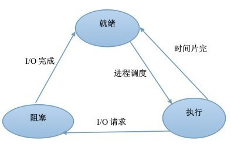

## 4、线程同步的方式

- **互斥锁（Mutex Lock）：**互斥锁是一种最基本的同步机制，它可以确保在任意时刻只有一个线程可以访问共享资源。通过在临界区周围加锁和解锁操作，可以防止多个线程同时访问临界区。
- **信号量（Semaphore）**：信号量是一种用于控制对共享资源访问的同步原语，它允许指定数量的线程同时访问共享资源。信号量提供了对资源访问的计数，并且可以在资源被占用时阻塞等待，直到资源可用。
- **事件（Event）：**事件是一种线程间通信机制，用于协调多个线程的执行顺序和状态转换。通常使用等待（Wait）和通知（Notify）的方式进行线程间的同步和通信。

## 5、多线程和多进程的不同

- **资源分配和共享：**

  多线程：共享同一进程的地址空间和资源，数据共享简单，但需要注意线程安全。

  多进程：拥有独立的地址空间和资源，进程间不共享内存，需要使用进程间通信机制进行通信。

- **创建和销毁开销：**

  多线程：线程的创建、销毁和切换开销较小。

  多进程：进程的创建、销毁和切换开销较大。但是进程之间相互独立，一个进程的崩溃不会影响其他进程，提高了系统的稳定性和可靠性。

- **适用场景和应用领域：**

  多线程：适用于共享数据、I/O密集型任务，以及利用多核处理器的场景。

  多进程：适用于资源隔离、稳定性要求高，以及CPU密集型任务和多机分布式环境中的扩展。

## 6、多线程和单线程的区别

多线程是指在一个进程中，并发执行了多个线程，每个线程都实现了不同的功能。

在单核CPU中，将CPU分为很小的时间片，在每一时刻只能有一个线程在执行，是一种微观上轮流占用CPU的机制。由于CPU轮询的速度非常快，所以看起来像是“同时”在执行一样。

多线程会存在线程上下文切换，会导致程序执行速度变慢。

多线程不会提高程序的执行速度，反而会降低速度。但是对于用户来说，可以减少用户的等待响应时间，提高了资源的利用效率。

## 7、多线程的创建方式

- 继承**Thread类**创建线程
- 实现**Runnable接口**创建线程

- 使用**匿名内部类**的形式创建线程

- 使用**lambda表达式**创建线程

```java
public class MultiThreadCreationExample {
    public static void main(String[] args) {
        // 1. 继承 Thread 类创建线程
        Thread thread1 = new MyThread();
        thread1.start();

        // 2. 实现 Runnable 接口创建线程
        Runnable myRunnable = new MyRunnable();
        Thread thread2 = new Thread(myRunnable);
        thread2.start();

        // 3. 使用匿名内部类创建线程
        Thread thread3 = new Thread(new Runnable() {
            @Override
            public void run() {
                System.out.println("Thread created using anonymous inner class.");
            }
        });
        thread3.start();

        // 4. 使用 lambda 表达式创建线程
        Thread thread4 = new Thread(() -> {
            System.out.println("Thread created using lambda expression.");
        });
        thread4.start();
    }

    // 1. 继承 Thread 类创建线程
    static class MyThread extends Thread {
        public void run() {
            System.out.println("Thread created by extending Thread class.");
        }
    }

    // 2. 实现 Runnable 接口创建线程
    static class MyRunnable implements Runnable {
        public void run() {
            System.out.println("Thread created by implementing Runnable interface.");
        }
    }
}
```

## 8、线程的常见状态

- **新建状态（New）**：当通过new操作符创建一个线程时，线程处于新建状态，此时尚未开始运行。

- **就绪状态（Runnable）**：在调用线程的start()方法后，线程进入就绪状态。处于就绪状态的线程已经准备好执行，并等待获取CPU时间片。

- **运行状态（Running）**：当线程获取到CPU时间片后，它进入运行状态，并执行run()方法中的代码。

- **阻塞状态（Blocked）**：线程可能会由于某些原因而进入阻塞状态，例如等待I/O操作完成、调用sleep方法进入睡眠状态、等待获取锁、等待某个触发条件等情况。在阻塞状态下，线程暂时放弃CPU时间片，让其他线程执行。

- **死亡状态（Dead）**：线程死亡可能是由于run方法自然退出，也可能是由于未捕获的异常终止了run方法。线程死亡后不可再次启动。

  为了确定线程在当前是否存活着（就是要么是可运行的，要么是被阻塞了），需要使用**isAlive**方法。如果是可运行或被阻塞，这个方法返回true； 如果线程仍旧是new状态且不是可运行的， 或者线程死亡了，则返回false

## 9、并行与并发

**并发（concurrency）：** 指宏观上看起来两个程序在同时运行，比如说在单核CPU上的多任务。但是从微观上看两个程序的指令是交织着运行的，你的指令之间穿插着我的指令，我的指令之间穿插着你的，在单个周期内只运行了一个指令。这种并发并不能提高计算机的性能，只能提高效率。

**并行（parallelism）**： 指严格物理意义上的同时运行，比如多核cpu，两个程序分别运行在两个核上，两者之间互不影响，单个周期内每个程序都运行了自己的指令，也就是运行了两条指令。这样说来并行的确提高了计算机的效率和性能。所以现在的cpu都是往多核方面发展。

## 10、死锁

### （1）什么是死锁

是一组互相竞争资源的进程因互相等待而导致的永久阻塞的现象。

### （2）死锁的四个必要条件

- **互斥条件(Mutual exclusion)：**资源不能被共享，只能由一个进程使用。
- **请求与保持条件(Hold and wait)：**一个进程或线程在持有至少一个资源的同时，又提出了新的资源请求，并且由于其他进程或线程正在持有这些资源而被阻塞。
- **非剥夺条件(No pre-emption)：**已经分配给一个进程或线程的资源无法被强制性地收回，只能由持有它的进程或线程主动释放。
- **循环等待条件(Circular wait)：**多个进程互相等待对方释放资源。

### （3）死锁应该是如何避免

- **银行家算法**：银行家算法通过动态地分配资源，可以破坏**"请求与保持条件"和"循环等待条件"**。它在分配资源时，会检查系统状态，确保分配资源不会导致系统陷入死锁状态。
- **资源分级**：通过资源分级，可以规定资源的优先级和获取顺序，从而破坏**"请求与保持条件"和"循环等待条件"**。高优先级的资源可能无法被低优先级的进程抢占，从而降低了发生死锁的概率。
- **资源有序分配**：指定获取锁的顺序可以破坏**"循环等待条件"**。通过规定资源申请的顺序，避免了进程之间形成循环等待的情况，从而降低了死锁的发生概率。
- **超时机制**：引入超时机制可以破坏**"请求与保持条件"和"循环等待条件"**。如果一个进程在等待资源的时间超过一定的阈值，就放弃等待并释放已经占有的资源，从而打破了死锁的循环等待状态。
- **避免嵌套锁**：避免嵌套锁可以破坏**"请求与保持条件"**。因为如果一个进程已经持有一个锁，再去请求另一个锁可能会导致死锁的发生，因此避免了嵌套锁可以降低死锁的风险。

## 11、操作系统进程调度算法

-   **先来先服务算法**：进程按照它们进入就绪队列的顺序获得 CPU 时间。是一种非抢占的调度算法。
-   **最短作业优先调度算法**：选择估计执行时间最短的进程优先执行，能够最小化平均等待时间，但需要准确估计下一个 CPU 区间的长度。
-   **优先级调度算法**：按照优先级选择进程执行，可抢占或非抢占。优先级高的进程先执行，但低优先级进程可能会发生饥饿。通常采用老化策略来解决饥饿问题。
-   **时间片轮转调度算法**：将 CPU 时间划分成时间片，每个进程被分配一个时间片来执行，如果进程执行时间超过一个时间片，它将被抢占并放回就绪队列等待。
-   **多级队列调度算法**：将就绪队列分成多个独立的队列，每个队列采用不同的调度算法，采用固定优先级抢占调度。进程被永久分配到一个队列中。
-   **多级反馈队列调度算法**：允许进程在队列之间移动，根据进程使用的 CPU 时间多少，进程会被转移到不同优先级的队列中，以防止饥饿发生。

## 12、缓冲区溢出

缓冲区溢出是指当程序向缓冲区（例如数组）写入数据时，超出了缓冲区本身的容量，导致数据溢出到了相邻的内存区域。这种情况通常发生在程序没有正确检查输入数据的长度或边界的情况下，导致写入数据超出了缓冲区的限制。

## 13、缓冲区溢出的危害

- **程序崩溃**：当缓冲区溢出时，可能会覆盖到程序的关键数据、函数返回地址或其他重要信息，导致程序执行异常，甚至直接崩溃或异常终止。
- **安全漏洞**：缓冲区溢出是许多安全漏洞的根源之一。黑客可以利用缓冲区溢出漏洞注入恶意代码，执行未经授权的操作，甚至控制整个系统。这种攻击方式常见于网络攻击、恶意软件和计算机病毒中。
- **信息泄漏**：缓冲区溢出可能导致敏感信息泄漏，因为溢出的数据可能覆盖了内存中存储的敏感信息，例如密码、用户凭证、私密文件等。
- **远程代码执行**：如果攻击者成功利用缓冲区溢出漏洞注入恶意代码并执行，他们可以远程控制受影响的系统，执行任意操作，窃取敏感信息，甚至导致系统崩溃。
- **拒绝服务攻击**：攻击者可以利用缓冲区溢出漏洞导致程序崩溃或系统资源耗尽，从而阻止正常用户访问服务，造成拒绝服务攻击（DoS）或分布式拒绝服务攻击（DDoS）。

在当前网络与分布式系统安全中，被广泛利用的50%以上都是缓冲区溢出，其中最著名的例子是1988年利用fingerd漏洞的蠕虫。而缓冲区溢出中，最为危险的是堆栈溢出，因为入侵者可以利用堆栈溢出，在函数返回时改变返回程序的地址，让其跳转到任意地址，带来的危害一种是程序崩溃导致拒绝服务，另外一种就是跳转并且执行一段恶意代码，比如得到shell，然后为所欲为。通过往程序的缓冲区写超出其长度的内容，造成缓冲区的溢出，从而破坏程序的堆栈，使程序转而执行其它指令，以达到攻击的目的。

## 14、如何预防缓冲区溢出

- **输入验证**：对于用户输入的数据进行严格的验证，确保输入数据的长度和内容符合预期。
- **边界检查**：在程序中实施边界检查，确保写入数据不会超出缓冲区的长度。
- **使用安全编程语言和库函数**：使用安全编程语言（如Rust）和库函数，这些语言和函数在内存管理和边界检查方面提供了更多的保护机制，减少了缓冲区溢出的风险。

# 三、计算机网络

## 1、OSI七层模型

### （1）有哪七层协议

- **物理层（Physical Layer）**:负责传输原始比特流，并定义了物理介质的规范。例如，使用以太网电缆连接到路由器或者通过Wi-Fi连接到无线网络。
- **数据链路层（Data Link Layer）**:负责通过物理介质传输数据帧，并提供了错误检测和纠正。比如，通过以太网连接到局域网，或者通过Wi-Fi连接到路由器。常见的数据链路层协议有**Ethernet（IEEE 802.3）以太网协议、PPP（Point-to-Point Protocol）点到点协议。**
- **网络层（Network Layer）**:负责在不同网络之间路由数据包，进行地址转换和流量控制。比如在刷抖音短视频的时候，服务器会通过许多路由器连接到页面，其间通过IP地址进行路由转发。常见的网络层协议有**IP，ICMP以及ARP**等协议。
- **传输层（Transport Layer）**:提供端到端的数据传输服务，负责数据分段、传输控制、错误检测和恢复。举例来说，通过HTTP使用TCP协议下载网页，或者通过UDP协议进行视频流传输。常见的传输层协议有**TCP和UDP**等协议。
- **会话层（Session Layer）**：管理不同应用程序之间的会话连接。比如美团支付的时候可以使用微信支付，那会话层就需要建立美团和微信这两个APP的连接。
- **表示层（Presentation Layer）**:对数据进行编码，让计算机能够识别数据。比如BMP是图片的编码、MP3是声音的编码、AVI是视频的编码。除此之外，用户还可以自定义编码格式，只有自己人才知道解码方式，可以实现对数据加密。
- **应用层（Application Layer）**:为用户提供网络服务，如电子邮件、文件传输、网页浏览等。常见的应用层协议有**HTTP和FTP**等协议。 

### （2）每一层都有哪些协议

- **数据链路层（Data Link Layer）：Ethernet（IEEE 802.3）、PPP（Point-to-Point Protocol）**、HDLC（High-Level Data Link Control）、MAC（Media Access Control）等。

- **网络层（Network Layer）**：**IP（Internet Protocol）、ICMP（Internet Control Message Protocol）、ARP（Address Resolution Protocol）**、OSPF（Open Shortest Path First）、BGP（Border Gateway Protocol）等。
- **传输层（Transport Layer）**：**TCP（Transmission Control Protocol）、UDP（User Datagram Protocol）**、SCTP（Stream Control Transmission Protocol）等。
- **应用层（Application Layer）**：**HTTP（Hypertext Transfer Protocol）、FTP（File Transfer Protocol）**、SMTP（Simple Mail Transfer Protocol）、POP3（Post Office Protocol 3）、IMAP（Internet Message Access Protocol）、SSH（Secure Shell）、DNS（Domain Name System）等。

### （3）交换机和路由器分别在哪一层，两者的区别是什么

- **工作层级**：交换机工作在数据链路层，而路由器工作在网络层。
- **转发方式**：交换机使用 MAC 地址进行转发，而路由器使用 IP 地址进行转发。
- **主要功能**：交换机用于局域网内部的数据交换，而路由器则连接不同的网络，并负责将数据从一个网络传输到另一个网络，包括连接到互联网的功能。
- **广播控制**：路由器可以分割广播域，因为它们在不同的网络之间传输数据，而交换机通常不能跨越不同的广播域。

- **配置复杂性**：路由器的配置通常比交换机复杂，因为它们涉及到更多的网络配置和路由协议的设置。
- **防火墙功能**：路由器可以提供基本的防火墙功能，通过过滤数据包来控制网络流量，但专业的防火墙通常是单独的设备或者软件。

## 2、TCP和UDP

### （1）TCP和UDP的区别

- **连接性**：TCP需要进行三次握手建立连接，而UDP是无连接的，可以直接发送数据。
- **确认机制**：TCP具有确认机制和重传机制，可以保证数据的可靠性；UDP不提供确认和重传机制，数据传输不可靠。
- **分片和重组**：TCP可能会对大数据包进行分片和重组，而UDP不进行分片和重组操作。
- **报文头部大小**：TCP头部通常包含20个字节，而UDP头部只有8个字节。

### （2）两者的使用场景

**UDP:**

- **强调传输性能而不是传输的完整性时：** UDP适用于对实时性要求较高的应用，如音频和视频流传输。在这些情况下，即使丢失一些数据包也不会对整体体验造成太大影响。
- **数据传输时间很短，连接过程占主体的情况下：** 例如，DNS交换通常是短暂的，因此使用UDP可以减少连接的开销，提高效率。把 SNMP（Simple Network Management Protocol，简单网络管理协议）建立在UDP上的部分原因是设计者认为当发生网络阻塞时，UDP较低的开销使其有更好的机会去传送管理数据。

**TCP:**

- **信息安全性和完整性要求高的情况下：** TCP适用于对数据传输的完整性、可控制性和可靠性要求较高的应用场景。比如，邮件传输中，确保邮件内容不被篡改或丢失是非常重要的。

### （3）视频为什么用UDP，它的优点是什么

视频可以丢帧，对传输的完整性要求不高，UDP传输速度快。

### （4）TCP可以保证可靠传输的原因（TCP为什么比UDP可靠）

- **连接建立和断开：** TCP在传输数据之前需要建立连接，这是通过三次握手来实现的。连接建立后，数据传输完成后还要进行四次挥手来断开连接，这确保了双方都知道数据的传输状态，从而避免了数据丢失或者乱序。
- **序列号和确认机制：** TCP使用序列号对每个数据包进行标记，接收端收到数据包后会发送确认信息给发送端，确认收到哪些数据。如果发送端未收到确认信息，就会重新发送数据包，确保数据的可靠传输。
- **重传机制：** 如果发送端未收到确认信息，或者收到的确认信息表明数据包未成功传输，TCP会触发重传机制，重新发送丢失或者错误的数据包，直到确认收到为止。
- **流量控制：** TCP通过滑动窗口机制来进行流量控制，控制发送端发送数据的速率，使得接收端可以及时处理接收到的数据，防止数据丢失或者溢出。
- **拥塞控制：** TCP还实现了拥塞控制机制，通过动态调整发送速率来适应网络的拥塞程度，防止网络拥塞导致数据丢失或者延迟增加。

### （5）TCP三次握手


### （6）为什么是三次握手

- **全双工通信需求：** TCP 是一种全双工通信协议，即客户端和服务器都能同时发送和接收数据。在建立连接之前，双方都需要确认彼此的接收能力和发送能力，因此需要进行双向的确认，这是三次握手的基础。

- **避免死锁问题：** 如果客户端不发送确认，服务器将不知道自己发送的确认是否已经被接收，这可能会导致死锁问题。通过三次握手，客户端和服务器都能够确认对方的状态，避免了这种潜在的死锁情况。

  

> 全双工通信是指在通信双方之间可以同时进行双向数据传输的通信协议或通信方式。简单来说，它允许通信双方同时发送和接收数据，而不会发生冲突。
>
> 在全双工通信中，每个通信参与者都可以独立地发送和接收数据，无需等待对方完成发送或接收。这种通信方式可以实现实时的双向数据传输，使得通信更加高效和灵活。
>
> 举例来说，电话通话就是一种全双工通信。当你在电话中与对方交谈时，你可以同时听到对方说话并回复，而不需要等待对方说完才能发言。这种同时进行发送和接收的能力使得电话通话具有双向交流的特性，称为全双工通信。
>
> 在计算机网络中，TCP/IP 协议是一种支持全双工通信的协议，它允许客户端和服务器之间同时进行双向的数据传输，以实现高效的通信。
>


> 半双工通信是指通信双方之间可以进行双向数据传输，但不能同时进行。换句话说，通信的两个参与者可以轮流发送和接收数据，但不能同时进行发送和接收操作。
>
> 在半双工通信中，每个通信参与者都具有发送和接收数据的能力，但需要遵循一定的规则来控制数据的发送和接收顺序，以避免数据冲突和混乱。
>
> 举例来说，对讲机就是一种常见的半双工通信设备。当一个人按下对讲机上的按钮并说话时，其他人必须等待他说完后才能发言。换句话说，每个参与者可以发送和接收数据，但不能同时进行这两个操作。
>
> 在计算机网络中，一些低带宽的通信介质或简单的通信协议可能采用半双工通信方式，例如以太网协议中的 CSMA/CD（Carrier Sense Multiple Access with Collision Detection）就是一种半双工通信方式，它允许设备在发送数据之前检测到信道上是否有其他设备在发送数据，以避免碰撞。
>

### （7）TCP三次握手时第三次的ack包丢失了会怎样？

- **Server 端**：第三次的ACK在网络中丢失，Server 端将保持在 SYN_RECV 状态，并且会根据 TCP的超时重传机制，会在一定的时间间隔内重发 SYN+ACK 包，以便Client重新发送ACK包。如果重发指定次数之后，仍然未收到 client 的ACK应答，那么一段时间后，Server自动关闭这个连接。
- **Client 端处理**：Client 端在接收到 Server 端的 SYN+ACK 包后，即认为连接已经建立，状态变为 established。如果 Client 端在发送 ACK 包后丢失了，而且在此期间向 Server 发送了数据，则 Server 端将以 RST （复位）包作为响应，表示连接出现错误。

### （8）TCP四次挥手


### （9）为什么要四次挥手

服务端响应断开连接的请求时，其ACK和FIN包并不是一起发送给客户端的，因为第一次由客户端发给服务端的FIN信号表示的是客户端想要断开连接。服务端先给出ACK确认信号，表示已经收到FIN请求，然后当自己也可以结束的时候，再次发送FIN信号，所以需要挥手交互需要四次。

由于 TCP 是全双工的，每一方向的关闭都需要单独的确认。因此，总共需要四次挥手才能完全关闭连接。

### （10）为什么要等待2MSL

MSL即报文最大的生存时间。2MSL是为了保证服务端能收到ACK报文。

虽然按道理，四个报文都发送完毕，我们可以直接进入CLOSE状态了，但是我们必须**假设网络是不可靠的，有可以最后一个ACK丢失**。所以TIME_WAIT状态就是用来重发可能丢失的ACK报文。在Client发送出最后的ACK回复，但该ACK可能丢失。

Server如果没有收到ACK，将不断重复发送FIN片段。所以Client不能立即关闭，它**必须确认Server接收到了该ACK。**Client会在发送出ACK之后进入到TIME_WAIT状态。Client会设置一**个计时器**，等待2MSL的时间。如果在该时间内再次收到FIN，那么Client会重发ACK并再次等待2MSL。所谓的2MSL是两倍的MSL(Maximum Segment Lifetime)。MSL指一个片段在网络中最大的存活时间，**2MSL就是一个发送和一个回复所需的最大时间。**如果直到2MSL，Client都没有再次收到FIN，那么Client推断ACK已经被成功接收，则结束TCP连接。

### （11）TCP的拥塞避免机制

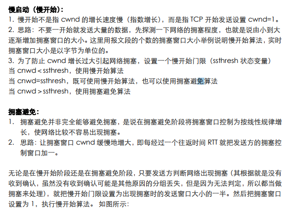

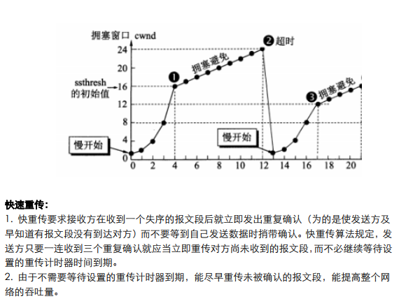

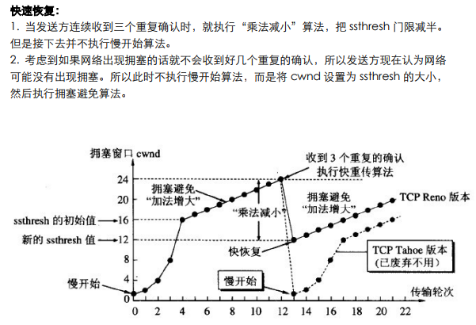

自己结合图片理解即可

### （12）TCP的滑动窗口

TCP是双工的协议，会话的双方都可以同时接收和发送数据。TCP会话的双方都各自维护一个发送窗口和一个接收窗口。滑动窗口解决的是流量控制的问题，就是如果接收端和发送端对数据包的处理速度不同，如何让双方达成一致。接收端的缓存传输数据给应用层，但这个过程不一定是即时的，如果发送速度太快，会出现接收端数据overflow，流量控制解决的是这个问题。

所谓滑动窗口，可以理解成接收端所能提供的缓冲区大小。TCP利用一个滑动的窗口来告诉发送端对它所发送的数据能提供多大的缓 冲区。由于窗口由16位bit所定义，所以接收端TCP 能最大提供65535个字节的缓冲。由此，可以利用窗口大小和第一个数据的序列号计算出最大可接收的数据序列号。

**滑动窗口本质上是描述接受方的TCP数据报缓冲区大小的数据**，发送方根据这个数据来计算自己最多能发送多长的数据。如果发送方收到接受方的窗口大小为0的TCP数据报，那么发送方将停止发送数据，等到接受方发送窗口大小不为0的数据报的到来。

## 3、HTTP

### （1）常见的状态码

- **1xx（信息性状态码）**：服务器收到请求，需要请求者继续执行操作。

  - **100 Continue 继续**: 服务器已经收到请求的头部，并且客户端应该继续发送请求的其余部分。
  - **101 Switching Protocols 切换协议**: 请求者已要求服务器切换协议。

- **2xx（成功状态码）**：表示请求被成功接收、理解、接受。

  - **200 OK  请求成功**: 请求成功。
  - **201 Created 已创建**: 请求已经被实现，而且有一个新的资源已经依据请求的需要而建立。
  - **204 No Content 无内容**: 服务器成功处理了请求，但没有返回任何内容。

- **3xx（重定向状态码）**：表示需要客户端采取进一步的操作才能完成请求。

  - **301 Moved Permanently 永久移动**: 被请求的资源已永久移动到新位置。

  - **302 Found 找到资源** : 请求的资源现在临时从不同的 URI响应请求。

  - **304 Not Modified 未修改**: 资源未修改，客户端可以使用缓存的版本。

    当客户端发送一个条件GET请求（通常是包含了一个`If-Modified-Since`头部），它告诉服务器：只有当资源在指定的时间之后发生了修改，才返回资源的内容。如果资源在这段时间内没有发生变化，服务器就会返回 304 Not Modified，而不返回资源内容。

    这个状态码的含义是，虽然客户端请求了资源，但是服务器判断该资源自上次请求后并没有被修改过，因此无需重新传输整个资源。相反，客户端可以使用它已经缓存的版本，从而节省了网络带宽和加载时间。

    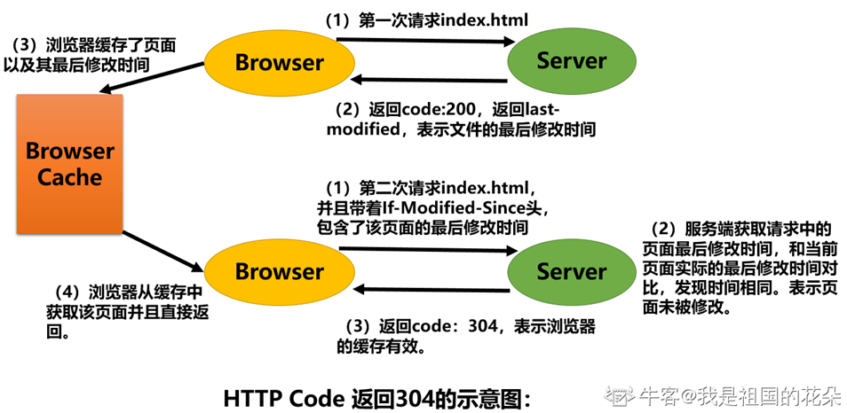

  - **307 Temporary Redirect 临时重定向** ： 表示请求的资源已经临时移动到了另一个位置，但客户端应该继续使用原始的请求URI来进行以后的请求。

    与302不同，307要求客户端在重定向时保持原始请求方法，即POST请求将保持POST，不会被转换为GET。307状态码保留了原始请求中的请求体（请求数据），而302不保留，可能会将POST请求转换为GET请求。

- **4xx（客户端错误状态码）**：表示客户端提交的请求有错误。

  - **400 Bad Request 错误请求**: 服务器无法理解请求的语法。

  - **401 Unauthorized 未授权**: 请求要求身份验证。

  - **403 Forbidden 禁止访问**: 服务器理解请求客户端的请求，但是拒绝执行此请求。通常原因是服务器上某些文件或目录设置了权限，客户端权限不够。

  - **404 Not Found 未找到**: 服务器找不到请求的资源。用户输入错误的链接，该链接指向的网页不存在。除此之外，也可以在服务器端拒绝请求且不想说明理由时使用。

  - **405 Method Not Allowed 方法不允许**：表明客户端所发送的请求中包含的HTTP方法（如GET、POST、PUT等）对于目标资源是不被允许的。

    在HTTP响应中，如果服务器返回了405状态码，那么根据标准，服务器还应该在响应头部包含一个"Allow"头信息，其中列出了目标资源所支持的HTTP请求方法的列表。这使得客户端可以知道对于该资源可以使用哪些请求方法。

    另外PUT和DELETE方法对服务器上的资源进行写操作，大多数的网页服务器默认情况下可能不允许这些请求方法，因此对于这些请求会返回405错误。

  - **408 Request Timeout 请求超时**: 请求超时，当客户端向服务器发送请求后，如果在服务器等待请求的过程中超出了服务器设定的时间限制，服务器就会返回408状态码。
  - **410 Gone 已删除**：已删除，当服务器上的资源被永久删除，并且不会再恢复时，服务器会返回410状态码。

- **5xx（服务器错误状态码）**：表示服务器在处理请求的过程中有错误或异常。

  - **500 Internal Server Error 服务器内部错误**: 服务器内部错误，服务器遇到错误，无法完成请求。可能是由于服务器程序错误、配置问题、数据库连接问题、资源耗尽等原因导致的。这种错误通常不是由客户端造成的，而是服务器端自身的问题。
  - **501 Not Implemented 未实现**：服务器不支持客户端所请求的功能或者方法，因此无法完成请求。通常，这种情况发生在客户端发送了服务器不支持的方法（如未实现的HTTP方法）或者请求头部中包含了服务器不理解的参数时。
  - **502 Bad Gateway 错误的网关**：服务器作为网关或代理，从上游服务器收到无效响应。
  - **503 Service Unavailable 服务不可用**:服务器暂时无法处理请求，通常是由于服务器过载或者维护导致的。这种状态码通常是暂时性的，客户端可以在稍后再次尝试请求，或者通过其他方式获得服务。
  - **504 Gateway Timeout 网关超时**：服务器作为网关或代理，但是没有及时从上游服务器收到请求。
  - **505 HTTP Version Not Supported HTTP版本不支持**：服务器不支持客户端所使用的HTTP协议版本。

### （2）HTTP请求方法都有哪些

- **GET**：从服务器获取指定资源的数据。GET方法的请求是幂等的，意味着对同一资源的多次GET请求应该返回相同的结果。
- **POST**：向服务器提交数据，用于创建新资源或者提交数据给服务器处理。POST方法通常用于提交表单数据或者上传文件等操作。
- **PUT**：将请求的数据存储到指定的URI位置。PUT方法通常用于更新资源，但也可以用于创建新资源，如果指定的URI已经存在资源，则会被完全替换。
- **DELETE**：从服务器删除指定的资源。
- **HEAD**：类似于GET方法，但服务器只返回响应头部，不返回实际的资源内容。通常用于获取资源的元数据，如大小、类型等。
- **OPTIONS**：用于获取目标资源支持的通信选项，即服务器支持的HTTP方法。客户端可以使用OPTIONS方法来确定服务器对资源所支持的方法。
- **TRACE**：用于测试服务器的连接性，客户端发出TRACE请求后，服务器会将请求消息回显给客户端，用于诊断和调试。
- **CONNECT**：用于建立与目标服务器的代理连接，通常用于实现TLS/SSL隧道代理。

**NOTICE：**

**方法名称的区分大小写**：HTTP方法名称是区分大小写的，如果请求的资源不支持所使用的请求方法，服务器应该返回状态码405（Method Not Allowed），表明对于指定资源不支持该方法。而如果服务器不认识或者不支持所使用的请求方法，应该返回状态码501（Not Implemented）。

**HTTP服务器应该实现的方法**：HTTP服务器至少应该实现GET、HEAD和POST方法，这是HTTP协议的基本要求。其他方法都是可选的，服务器可以根据需要选择实现支持。此外，特定的HTTP服务器可以支持扩展自定义的方法，这些方法可以根据特定的业务需求来定义和实现。

### （3）GET 和POST请求的区别

- **请求用途**：
  - **GET 请求**：用于获取资源，进行查询操作。
  - **POST 请求**：用于传输实体对象，执行添加、修改、删除等操作。
- **参数传递方式**：
  - **GET 请求**：参数通过URL传递。
  - **POST 请求**：参数放在请求体中。
- **用户行为影响**：
  - **GET 请求**：可以直接回退和刷新，不会对用户和进程产生影响。
  - **POST 请求**：在回退和刷新时可能会重复提交数据。
- **TCP数据包**：
  - **GET 请求**：产生一个TCP数据包，请求头和请求体一并发送。
  - **POST 请求**： 产生两个TCP数据包，先发送请求头，再发送请求体。
- **缓存机制**：
  - **GET 请求**：通常被浏览器缓存。
  - **POST 请求**：请求默认不缓存。
- **安全性**：
  - **GET 请求**：通常不太安全，因为数据在 URL 中可见，用户和密码等敏感信息会暴露在 URL 中，并且会被浏览器保存在历史记录、服务器日志等地方。
  - **POST 请求**：相对较安全，因为数据作为请求的一部分发送，不会暴露在 URL 中，也不会被保存在历史记录中。
- **数据长度限制**：
  - **GET 请求**：受浏览器和服务器对 URL 长度的限制，通常不适合传输大量数据，URL 长度有限制，可能会丢失数据或被截断。
  - **POST 请求**：没有固定长度限制，可以传输大量数据，通常用于向服务器提交表单数据、上传文件等

- **幂等性**：
  - **GET 请求**：是幂等的，即无论调用多少次都不会对资源状态产生影响。
  - **POST 请求**：不是幂等的，因为每次调用都可能对资源状态产生变化，比如向数据库插入新记录。

### （4）HTTP和HTTPS的区别

-   **数据传输安全性**：
    - HTTP是超文本传输协议，数据传输是明文的，容易被窃听和篡改。
    - HTTPS是基于SSL/TLS加密的HTTP协议，数据在传输过程中经过加密处理，提供更高的安全性，可以防止窃听和篡改。
-   **证书和身份认证**：
    - HTTP不需要证书，信息的发送和接收都不受保护。
    - HTTPS需要服务器端和客户端都拥有数字证书，用于验证通信双方的身份，确保通信安全可靠。
-   **端口**：
    - HTTP默认使用端口80进行通信。
    - HTTPS默认使用端口443进行通信。
-   **连接方式**：
    - HTTP是无状态的连接，每次请求都是独立的，不保留连接状态。
    - HTTPS基于SSL/TLS协议构建，可以建立安全的连接并保持状态，可以进行加密传输、身份认证等操作。

### （5）SSL/TLS协议的作用

SSL（Secure Sockets Layer 安全 套接字 层）和TLS（Transport Layer Security 传输层安全）是用于加密网络通信的安全协议。

- **加密通信防窃听**：SSL/TLS协议通过加密技术，将**数据在传输过程中进行加密**，使得即使被截获，也无法直接读取数据内容。这保护了通信的隐私性，防止敏感信息在传输过程中被窃取。
- **数据完整性保护**：**具有校验机制，数据被篡改即刻发现**，SSL/TLS协议使用消息认证码（MAC）或哈希函数来验证数据的完整性。这确保了数据在传输过程中没有被篡改、损坏或伪造，保护了通信的完整性。
- **身份认证**：**配备身份证书，防止被冒充**，SSL/TLS协议使用数字证书对通信双方的身份进行认证。服务器会提供数字证书，客户端可以验证该证书的合法性，并确保正在通信的是预期的服务器。这防止了中间人攻击和伪造服务端的情况发生。
- 安全协商：SSL/TLS协议允许客户端和服务器协商加密算法、密钥长度和其他安全参数。这样，通信双方可以在连接建立阶段确定最合适的安全机制，以确保通信的安全性。
- 防止重放攻击：SSL/TLS协议采用随机数和时间戳等机制，防止通信中的数据被重复使用。这有助于防止攻击者利用重放攻击重新发送已经捕获的数据。


### （6）SSL/TLS协议的运行机制

   ---------------------------------------------------------------------------非对称加密阶段----------------------------------------------------------------------------------------

- **客户端向服务端发送请求**：客户端发起请求连接到服务器叫做**ClientHello**请求。在这一步，客户端主要向服务器提供以下信息：

  + 支持的协议版本，比如TLS 1.0版
  + 一个客户端生成的随机数，稍后用于生成"对话密钥"
  + 支持的加密方法，比如RSA公钥加密

- **服务端向客户端发送数字证书，证书包含公钥**：服务器收到客户端请求后，向客户端发出回应，这叫做**SeverHello**。服务器的回应包含以下内容。

  + 确认使用的加密通信协议版本，比如TLS 1.0版本。
  + 一个服务器生成的随机数，稍后用于生成"对话密钥"。
  +  确认使用的加密方法，比如RSA公钥加密。
  + 数字证书，证书包含了服务器的公钥以及其他相关信息，证书是由权威的证书颁发机构（CA）签发的，用于证明服务器的身份。

  除了上面这些信息，如果服务器需要确认客户端的身份，就会再包含一项请求，要求客户端提供"客户端证书"。比如，金融机构往往只允许认证客户连入自己的网络，就会向正式客户提供USB密钥，里面就包含了一张客户端证书。

- **客户端校验证书**：客户端会对服务器发送的证书进行验证，确保证书的合法性和可信度。这包括检查证书是否过期、是否由信任的CA签发等。如果验证通过，客户端信任该证书。如果证书没有问题，客户端就会从证书中取出服务器的公钥。然后，向服务器发送下面三项信息。

  + **一个随机数，该随机数用服务器公钥加密**，防止被窃听。该随机数是整个握手阶段出现的第三个随机数，又称"**pre-master key**"。有了它以后，客户端和服务器就同时有了三个随机数，接着双方就用事先商定的加密方法，各自生成本次会话所用的同一把"会话密钥"。
  + 编码改变通知，表示随后的信息都将用双方商定的加密方法和密钥发送。
  + 客户端握手结束通知，表示客户端的握手阶段已经结束。这一项同时也是前面发送的所有内容的hash值，用来供服务器校验。

  为什么一定要用三个随机数，来生成"会话密钥"，不管是客户端还是服务器，都需要随机数，这样生成的密钥才不会每次都一样。由于SSL协议中证书是静态的，因此十分有必要引入一种随机因素来保证协商出来的密钥的随机性。

  -----------------------------------------------------------------------------对称加密阶段-------------------------------------------------------------------------------------

- **建立对称加密通道**：服务器收到客户端发送的加密后的**第三个随机数pre-master key**，使用自己的**私钥**进行解密，接下来，客户端和服务器使用pre-master key和前两个随机数作为种子，通过协商过程生成**对称加密**算法和密钥。然后，向客户端最后发送下面信息。

  + 编码改变通知，表示随后的信息都将用双方商定的加密方法和密钥发送。
  + 服务器握手结束通知，表示服务器的握手阶段已经结束。这一项同时也是前面发送的所有内容的hash值，用来供客户端校验。

  至此，整个握手阶段全部结束。接下来，客户端与服务器进入加密通信，就完全是使用普通的HTTP协议，只不过用"会话密钥"加密内容。


### （7）HTTP协议post请求头Content-type有哪些

- **application/x-www-form-urlencoded**：
  - 最常见的 POST 提交数据的方式，浏览器的原生 form 表单，如果不设置 enctype 属性，那么最终就会以这种方式提交数据。
- **multipart/form-data**：
  - 在表单的enctype属性设为multipart/form-data时，表单数据会被编码为一条消息，以标签为单元，用分隔符分开。文件上传时一般会使用这种方式。
- **application/json**：
  - 当我们使用 JSON 格式提交数据时，可以设置 Content-Type 为 application/json。
- **text/xml**：
  - 当提交 XML 格式的数据时，可以设置 Content-Type 为 text/xml。
- application/octet-stream：
  - 二进制流数据，通常用于文件上传等场景。

## 4、Cookie和Session的区别

- **Cookie**：是客户端浏览器用来保存服务端数据的一种机制。当我们通过浏览器去进行网页访问的时候，服务器可以把某些状态数据以键值对的形式写入到cookie里面，存储到客户端浏览器。然后客户端下一次再访问服务器的时候，我们可以携带这些状态数据发送到服务器端，服务器端可以根据cookie里面携带的内容去识别使用者。
- **Session**：是服务器端的一个容器对象，用于存储与当前会话相关的状态数据。HTTP协议本身是无状态的，所以服务器使用Session来跟踪用户在同一会话中的多次请求。服务器为每个会话创建一个唯一的标识符（Session ID），将其存储在客户端（通常是通过Cookie），同时将会话数据存储在服务器上。

简单来说，服务器端可以利用Session来存储客户端在同一个会话里面产生的多次请求的一个记录，那么**基于服务器端的Session的存储机制+基于客户端的Cookie机制**，就可以去实现一个有状态的Http协议。工作原理如下：

1. 客户端第一次访问服务器时，服务器创建一个会话并分配一个唯一的Session ID。服务器将Session ID 存储在客户端的Cookie中，然后将会话数据存储在服务器上。
2. 客户端的每个后续请求都会携带这个Session ID。服务器从Cookie中取出Session ID 来识别会话并检索相关的会话数据。

如果Cookie被禁用，Session ID 可以通过其他方式传递，例如将其作为URL的一部分。这样，即使在无状态的HTTP协议下，我们也可以实现有状态的会话管理。

## 5、Cookie、session和token有什么区别？

Cookie是存储在浏览器端的一小段文本。session是存储在服务器端的一组数据。token通常代表一小段字符串，可以存储到cookie里，随请求一起发过去，也可以存在服务器中。

- **Cookie+session：**类似于服务器和客户端之间的“握手”，客户端和服务器各自持有一个“握手信物”（Session ID），用于建立和维持会话。客户端在首次请求时，服务器生成一个唯一的Session ID，并将其存储在客户端的Cookie中，同时在服务器端创建对应的Session对象用于存储会话数据。

  在这种情况下，服务器为每个会话创建一个唯一的Session ID，并在服务器端维护与之相关联的会话数据。**这意味着服务器需要在内存中维护大量的会话数据，占用了服务器的空间**，但是通过这种方式可以快速地检索和管理会话状态，从而节省了时间。因此，这种方式被称为**空间换时间**，即通过占用更多的空间来换取更快的操作速度和响应时间。

- **Token：**类似于使用一个“暗号和密钥”进行身份验证，无需在服务器端保存会话状态。在用户认证成功后，服务器生成一个Token并发送给客户端，客户端将Token保存起来，并在后续请求中携带Token。服务器使用密钥验证Token的有效性，从而完成身份验证和授权。

  Token是一种无状态的身份验证机制，服务器不需要维护会话状态。在使用Token进行身份验证时，服务器只需要验证Token的有效性，而不需要在服务器端存储会话数据。这样可以节省服务器端的空间资源，**但在验证Token时需要进行额外的计算和验证，这会增加时间成本。**因此，这种方式被称为**时间换空间**，即通过增加计算和验证的时间来节省空间资源。

## 6、从输入网址到获得页面的过程（输入URL之后的过程）

- **URL输入：**在客户端浏览器中输入网址URL。

- **DNS解析**：发送到DNS(域名服务器)获得域名对应的WEB服务器的IP地址。

- **建立TCP连接**：客户端浏览器与WEB服务器建立TCP(传输控制协议)连接。

- **发送HTTP/HTTPS请求**：客户端浏览器向对应IP地址的WEB服务器发送相应的HTTP或HTTPS请求。

- **服务器响应请求**：WEB服务器响应请求，返回指定的URL数据或错误信息；如果设定重定向，则重定向到新的URL地址。

- **浏览器解析渲染页面**：浏览器接收到服务器响应后，开始解析HTML源文件，构建页面结构，并进行排版和渲染。

- **HTTP请求结束，断开TCP连接**。

## 7、什么是DNS

**DNS（Domain Name System，域名系统）**：因为IP地址是一串难以记忆的数字，所以就发明了域名，方便大家上网使用。比如访问百度网站，不需要输入百度服务器的ip地址，只需要输入它的域名即可。简单来说，DNS就是一个用来把**域名**转换成**IP地址**的系统。DNS是一个分布式系统，它分布在全球范围内的许多服务器上。这种分布式结构保证了系统的稳定性和可靠性。DNS采用分层结构，包括根域名服务器、顶级域名服务器、权威域名服务器和本地域名服务器等层级。

 域名解析过程：

- **递归查询**：本地DNS服务器首先检查自己的缓存中是否有对应的IP地址，如果有则直接返回给用户；如果没有，则进行递归查询。本地DNS服务器向根域名服务器发送查询请求。

- **根域名服务器查询**：根域名服务器是DNS的最顶层，它存储了顶级域名服务器的地址。根域名服务器返回给本地DNS服务器一个顶级域名服务器的地址。

  > 根域名服务器是DNS的最顶层，它存储了顶级域名服务器的地址。因特网上一共有 13 个根域名服务器（以英文字母 A 到 M 依序命名，格式为[a~m].root-servers.net），每个根域名服务器都知道所有顶级域名服务器的 IP 地址，比如知道负责 com 域的顶级域名服务器的 IP 地址。

- **顶级域名服务器查询**：本地DNS服务器向顶级域名服务器发送查询请求，询问负责该域名的权威域名服务器地址。顶级域名服务器返回给本地DNS服务器一个权威域名服务器的地址。

  > 对于每个顶级域名，如 com、org、edu 等，都有对应的顶级域名服务器。顶级域名服务器知道其所管理的所有权威域名服务器的 IP 地址，比如负责 com 域的顶级域名服务器知道负责 baidu.com 域的权威域名服务器的 IP 地址。

- **权威域名服务器查询**：本地DNS服务器向权威域名服务器发送查询请求，请求获取该域名对应的IP地址。权威域名服务器返回给本地DNS服务器该域名对应的IP地址。

  > 一个网站需要将其域名和 IP 地址注册到相应的权威域名服务器中，比如网站`www.baidu.com`的域名和 IP 地址就存储在负责 baidu.com 域的权威域名服务器中。

- **本地DNS服务器响应**：本地DNS服务器将获取到的IP地址返回给用户设备，同时将IP地址保存在本地缓存中。

可根据一下例子了解DNS的工作机制：电话还没有普及时，比如想打电话给王局长，要先打给邮局的114查号，邮局人员会告诉王局长家电话号码是8808，挂掉电话之后再拨打8808，就能顺利的找到王局长了。这个例子中，王局长=域名，8808=ip地址，114查号台=DNS服务器。

## 8、TCP/IP协议

应用层：

- **HTTP**：超文本传输协议，用于在Web浏览器和服务器之间传输超文本文档。
- **FTP**：文件传输协议，用于在网络上传输文件。
- **DNS**：域名系统，将域名解析为IP地址的分布式命名系统。
- **SMTP**：简单邮件传输协议，用于电子邮件的发送。
- **Telnet**：远程登录协议，用于远程登录到计算机系统。

传输层：

- **TCP**：传输控制协议，提供可靠的、面向连接的数据传输服务。
- **UDP**：用户数据报协议，提供不可靠的、无连接的数据传输服务。

网络层：

- **IP**：互联网协议，用于在网络上唯一标识设备和路由数据包。IP协议制定了一套网络地址，也就是IP地址，根据IP协议能够区分两台主机是否同属一个网络（子网）。
- **ICMP**：Internet控制消息协议，用于在IP网络中发送错误消息和控制消息。
- **RIP**：路由信息协议，一种动态路由协议，用于在路由器之间交换路由信息。
- **路由协议：**ARP的寻址必须是在同一个子网内，我们可以通过IP协议来确定是否是同一个子网。如果不是同一个子网，则通过网关将数据包多次转发到对应的子网中，完成这个路由协议的物理设备就是路由器。

数据链路层：

- **PPP**：点对点协议，用于在两个节点之间建立直接连接。

- **ARP**：地址解析协议，用于将IP地址解析为物理MAC地址。将目标的IP地址在链路层进行包装，生成以太网数据包，在同一个子网内进行广播出去，各个主机拿到IP地址和自己的IP地址对比，若一样，则返回自己的MAC地址。注意，MAC地址与对应的IP地址存入本机ARP缓存中并保留一定时间。

  ARP的寻址必须是在同一个子网内，我们可以通过IP协议来确定是否是同一个子网。如果不是同一个子网，则通过网关将数据包多次转发到对应的子网中，完成这个路由协议的物理设备就是路由器。

## 9、对称加密和非对称加密

**对称加密**：就是数据发送方将原始数据和加密密钥一起经过加密算法处理后，使其变成复杂的加密密文发送出去，收件方收到密文后，需要使用相同的密钥及相同的算法对密文进行解码，才能恢复可读性。（**加密和解密的密钥是同一个**）

**特点：**加密方式简单但是不够安全，只要双方有一个密钥泄露了，或者在双方确定密钥途中被其他人窃取，信息就变得不再安全。

**非对称加密：**与对称加密不同，非对称加密算法需要两个密钥：**公开密钥和私有密钥。**相对于对称加密来说，私钥只要保留在自己手中，不需要告诉任何人，减少了密钥泄露的可能性，同时避免了在同步密钥中途遭其他人窃取的可能性，增加了安全性。（常用在数据签名上）

学霸和学渣是一对好朋友，在考试来临之际，学霸为了帮助学渣顺利通过考试，就将答案写在小纸条上传给他，但他两坐的比较远，因此需要一个中间人来传递。为了让中间人看不懂纸条的内容，学霸使用了**密钥**将答案进行**加密**，中间人拿到之后，就会是一堆乱七八糟的字符，学渣只要使用**相同的密钥**对答案进行解密，就可以看到答案了。然而事情并没有那么简单，由于中间人听到了关于密钥的消息，他便自己通过密钥解码获取了答案。学渣挂科。

学渣为了不挂科，潜心研究，发现了非对称加密，首先学渣计算出一个**公钥**和一个**私钥**，他将公钥交给学霸，让学霸将答案通过公钥进行加密，即使中间人获得了公钥也不能对答案进行解码，因为公钥加密的文件只有拥有私钥的人才能解密。

## 10、C/S和B/S的区别

C/S结构，即Client/Server(**客户端/服务器**)结构，是大家熟知的软件系统体系结构，通过将任务合理分配到Client端和Server端，降低了系统的通讯开销，可以充分利用两端硬件环境的优势。桌面级应用响应速度快，安全性强，个性化能力强，响应数据较快。C/S架构适合对性能和个性化要求较高的应用，如专业软件和游戏。

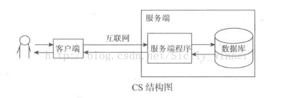

B/S结构，即Browser/Server（**浏览器/服务器**）结构，在这种结构下，用户界面完全通过WWW浏览器实现，一部分事务逻辑在前端实现，但是主要事务逻辑在服务器端实现，形成所谓三层架构（表现层、业务逻辑层、数据访问层）。web应用 可以实现跨平台，客户端零维护，但是个性化能力低，响应速度较慢。B/S架构适合简单的数据展示和交互，以及需要跨平台支持和较低维护成本的应用，如电子商务网站和企业内部管理系统。

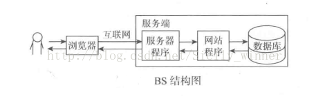

**区别：**

- **用户界面：**
  - B/S架构的用户界面通过Web浏览器实现，基于Web技术（HTML、CSS、JavaScript）。
  - C/S架构的用户界面通常是桌面应用程序的图形用户界面（GUI），需要在客户端安装专门的客户端软件。
- **部署和维护：**
  - B/S架构的应用程序无需在客户端安装，用户只需要一个标准的Web浏览器即可访问，部署和维护相对简单。
  - C/S架构的应用程序需要在客户端安装专门的客户端软件，部署和维护相对复杂，需要考虑不同平台的兼容性和更新问题。
- **跨平台性：**
  - B/S架构的应用程序具有良好的跨平台性，用户可以在任何设备上通过浏览器访问，无论是PC、平板还是手机。
  - C/S架构的应用程序受限于客户端操作系统和硬件环境，不同平台之间可能存在兼容性问题。
- **安全性：**
  - 由于C/S架构中的业务逻辑和数据处理大部分在客户端进行，相对于B/S架构来说，存在更多的安全风险。
  - B/S架构中的业务逻辑和数据处理主要在服务器端进行，可以通过服务器端的安全措施来保护数据和业务逻辑的安全性。
- **性能：**
  - 通常情况下，C/S架构的应用程序在响应速度和性能方面比B/S架构的应用程序更快，因为大部分业务逻辑在客户端执行。
  - B/S架构的应用程序由于需要通过网络与服务器交互，响应速度相对较慢，尤其是在网络条件较差的情况下。

| 对象 | 硬件环境                                           | 客户端要求                     | 软件安装                                         | 升级维护                                      | 安全性                                                       |
| ---- | -------------------------------------------------- | ------------------------------ | ------------------------------------------------ | --------------------------------------------- | ------------------------------------------------------------ |
| C/S  | 用户固定，并且处于相同区域，要求拥有相同的操作系统 | 客户端的计算机电脑配置要求较高 | 每一个客户端都必须安装和配置软件                 | C/S每一个客户端都要升级程序。可以采用自动升级 | 一般面向相对固定的用户群，程序更加注重流程，它可以对权限进行多层次校验，提供了更安全的存取模式，对信息安全的控制能力很强。一般高度机密的信息系统采用C/S结构适宜。 |
| B/S  | 要有操作系统和浏览器，与操作系统平台无关           | 客户端的计算机电脑配置要求较低 | 可以在任何地方进行操作而不用安装任何专门的软件。 | 不必安装及维护                                |                                                              |

## 11、HTTP1.0，HTTP1.1以及HTTP2.0协议的区别

**HTTP1.0：**

HTTP1.0是一种无状态，无连接的协议。浏览器的每次请求都需要与服务器建立一个TCP连接，服务器处理完成后立即断开TCP连接（无连接），服务器不跟踪每个客户端也不记录过去的请求（无状态）。HTTP/1.0协议使用`Connection: close`头部字段来指示服务器在发送完响应后关闭连接。

**HTTP1.1：**

- HTTP/1.1引入了持久连接（Keep-Alive），默认情况下保持TCP连接打开，允许多个请求和响应共享同一个连接，避免了频繁的连接建立和断开，提高了性能。
- 但服务器必须按照客户端请求的先后顺序依次回送相应的结果，以保证客户端能够区分出每次请求的响应内容。
- 通过Content-Length字段来判断当前请求的数据是否已经全部接收。
- 不允许同时存在两个并行的响应。必须等待上一个响应结束后才能发送下一个响应。这样避免了多个响应交错导致混乱的情况发生。

**HTTP2.0：**

HTTP2.0协议新增了二进制分帧，多路复用，头部压缩和服务器推送等功能，进一步提高了传输效率。

- 二进制分帧：HTTP/2.0将所有传输的信息分割为更小的帧，并对它们进行二进制编码，以提高传输效率和安全性。
- 多路复用：HTTP/2.0允许在单个连接上同时发送多个请求和响应，解决了HTTP/1.x中存在的头部阻塞问题，提高了性能。
- 头部压缩：HTTP/2.0使用HPACK算法对头部字段进行压缩，减少了传输的头部大小，降低了网络开销。
- 服务器推送：HTTP/2.0允许服务器在客户端请求之前主动推送相关资源，加速页面加载速度。

# 四、Linux & Git

## 1、Git指令相关

-   `git commit -m "."`: 将暂存区的更改提交到本地代码仓库，并附带一条提交消息。
-   `git add 文件或者文件目录`: 将文件或者文件目录添加到Git的暂存区，准备提交到本地代码仓库。
-   `git status`: 查看工作目录、暂存区和本地仓库的状态，显示出哪些文件被修改过，哪些文件处于暂存状态，哪些文件已经被提交。
-   `git push`: 将本地代码库的更改推送（上传）到远程代码库。
-   `git pull`: 从远程代码库拉取最新的更改到本地代码库。
-   `git clone ssh链接`: 从远程仓库克隆代码到本地，同时建立远程仓库的引用。
-   `git branch`: 显示本地仓库的所有分支，并指示当前所在的分支。
-   `git checkout -b 别名 origin/所要切换到的分支名`: 创建一个新的分支并切换到该分支，同时从远程跟踪分支创建。
-   `git stash`: 将当前的工作目录和暂存区的修改暂存起来，以便稍后再处理。
-   `git stash pop`: 将最近一次暂存的工作目录和暂存区的修改恢复，并从暂存堆栈中移除这次暂存。

## 2、Linux指令相关

**Vim指令：**

- **Vi**: 打开文件。
- **a/i/o**: 进入编辑模式，a是在光标后插入，i是在光标前插入，o是在当前行下方插入新行。
- **esc**: 退出编辑状态。
- **:wq/q/w/q!**: 保存并退出编辑，退出编辑，保存但不退出，强制退出不保存。
- **/+关键字**: 搜索关键字，光标会移动到第一个匹配的关键字处。
- **光标定位+dd**: 光标所在行删除。
- **/set nu**: 设置行号。

**工作中常见指令：**

- **grep 关键字 文件名**: 在文件中搜索指定关键字。
- **ps -ef | grep 进程名**: 查看进程并过滤出包含特定进程名的行。
- **kill -9 进程id**: 强制结束指定进程。
- **netstat -anp | grep 端口号**: 查看占用特定端口号的进程。
- **lsof -i :端口号**: 查看指定端口号对应的进程。
- **|**: 管道符，将前一个命令的输出作为后一个命令的输入。

## 3、常用指令以及用法汇总

### （1）文件管理命令

- **cat: 查看文件内容。**
- **chmod: 修改文件或目录的权限。**
  - 读r写w执行x，使用 `ls -l test.txt` 命令可以查看文件 `test.txt` 的详细权限信息，其中的权限信息会以符号形式显示，如 `-rw-r--r--`，分别表示文件所有者、所属组和其他用户的读、写、执行权限。
- chown: 修改文件或目录的所有者。
- **cp: 复制文件或目录。**
  - **`cp -r 目录1 目录2`: 拷贝目录1到目录2下。**
- **find: 在文件系统中搜索文件。**
- **head: 显示文件开头内容。**
  - **`head -n 10 test.log`: 显示文件开头的前10行。**
  - **`head -n -10 test.log`: 显示文件除了最后10行以外的所有内容。**
- less/more: 分屏显示文件内容。
- ln: 创建链接。
- locate: 快速定位文件。
- **mv: 移动文件或修改文件名。**
  - **`mv test.log test1.txt`: 将test.log重命名为test1.txt。**
- **rm: 删除文件或目录。**
  - **`rm -r`: 递归删除目录及其内容。**
  - **`rm -f`: 强制删除，不提示。**
- **tail: 显示文件末尾内容。**
  - **`tail -n 10 test.log`: 显示文件末尾最后10行。**
  - **`tail -n +10 test.log`: 从第10行开始显示文件内容。**
- **touch: 创建空文件。**
- **vi / vim: 是一个文本编辑器，可以用来创建并编辑文件。通过 `vi filename` 或 `vim filename` 命令可以打开一个新文件，然后在其中进行编辑。可以通过命令模式、插入模式和可视模式来进行编辑。编辑完成后，可以使用 `:wq` 命令保存并退出。**

### （2）文档编辑命令

- **grep**: 在文件中搜索指定内容。
- **wc: 统计文件的行数、单词数和字符数。**
  - **`wc -l filename `: 统计文件的行数。**
  - **`wc -w filename` : 统计文件的单词数。**
  - **`wc -c filename` : 统计文件的字符数。**

### （3）磁盘管理命令

- **cd**: 切换工作目录。
- df: 显示磁盘空间使用情况。
- du: 显示文件和目录的磁盘使用情况。
- **ls**: 列出目录内容。
- **mkdir: 创建文件夹。**
  - **`mkdir -p /tmp/test/t1/t`: 创建多层级文件夹。**
- pwd: 显示当前工作目录。
- **rmdir: 从一个目录中删除一个或多个子目录项，删除某目录时也必须具有对其父目录的写权限。**

### （4）网络通讯命令

- **ifconfig: 用于查看和配置 Linux 系统的网络接口。**
- **iptables: 网络包过滤与 NAT。**
  - **`iptables -l -n`：查看防火墙开放的端口号**
  - **`Isof -i:80`：查看专用端口80的进程**
- **netstat: 显示网络状态信息。**
  - **`netstat -anp`：根据进程id查询占用端口号**
  - **`netstat -lnp`：如何查看系统都开启了哪些端口**
  - **`netstat -tunpl\|grep`：查看被占用端口对应的进程**
- **ping**: 测试网络连通性。
- telnet: 远程登录服务。

### （5）系统管理命令

- date: 显示或设置系统时间。
- **free**: 显示系统内存使用情况。
- **kill**: 终止进程。
- ps: 显示进程状态。
- rpm: 包管理器。
- top: 实时显示系统中各个进程的资源占用情况。
- yum: 包管理器。

### （6）备份压缩命令

- gzip: 压缩文件。
- tar: 打包文件。

## 4、内存泄漏

内存泄漏是指程序动态申请的内存在使用完后没有被释放，导致这部分内存无法被操作系统回收再利用的情况。随着时间的推移，泄漏的内存逐渐累积，可用内存不断减少，可能导致系统性能下降，甚至引发系统崩溃。一般情况下，发生内存泄漏时，重启就可以回收泄漏的内存，但在Linux服务器环境下，内存泄漏问题尤为敏感，因为服务器程序通常需要长时间运行，不能随意重启。

为了避免内存泄漏，常见的做法包括：

- 编程规范：确保每次内存申请后都有相应的释放操作，保持申请和释放成对出现。基于这个特点，一种简单的方法就是在代码中统计申请和释放的次数，如果申请和释放的数量不同，就认为是内存泄漏了。
- 使用工具：利用内存检测工具如Valgrind等，在开发阶段及时发现并修复潜在的内存泄漏问题。

## 5、软链接和硬链接的区别

**软链接(symbolic link)** ： 等同于 Windows 系统下的快捷方式。仅仅包括所含链接文件的**路径名字**。因此能链接目录，也能跨文件系统链接。但是，当删除原始文件后，链接文件也将失效。

**硬链接**(hard link) ： 可以将它理解为一个 “指向原始文件 inode 的指针”，系统不为它分配独立的 inode 和 文件。所以，硬链接文件与原始文件其实是同一个文件，只是名字不同。我们每添加一个硬链接，该文件的 innode 连接数就会增加 1 ； 而且只有当该文件的 inode 连接数为 0 时，才算彻底被将它删除。因此即便删除原始文件，依然可以通过硬链接文件来访问。需要注意的是，我们不能跨分区对文件进行链接。

> 源文件 inode 是指在 Linux 或类 Unix 系统中，每个文件都与一个唯一的索引节点 (inode) 相关联。这个索引节点包含了关于文件的元数据信息，如文件的权限、所有者、大小、修改时间等。
>
> 每个文件系统都维护着一个 inode 表，这个表记录了文件系统中所有文件的 inode 信息。当我们创建一个新文件时，操作系统会为这个文件分配一个新的 inode，并在文件系统中的 inode 表中记录下来。然后，文件系统会把这个文件的数据块与分配给它的 inode 相关联。
>
> inode 提供了文件的基本元数据，包括文件的物理位置、大小和组织方式等。因此，我们可以将 inode 视为文件系统中的文件的唯一标识符。当我们使用硬链接创建一个文件时，新创建的硬链接实际上只是与源文件的 inode 关联，而不是创建一个新的文件和新的 inode。

# 五、数据结构

8种数据结构：数组、链表、堆、栈、队列、树、散列表（hash）、图

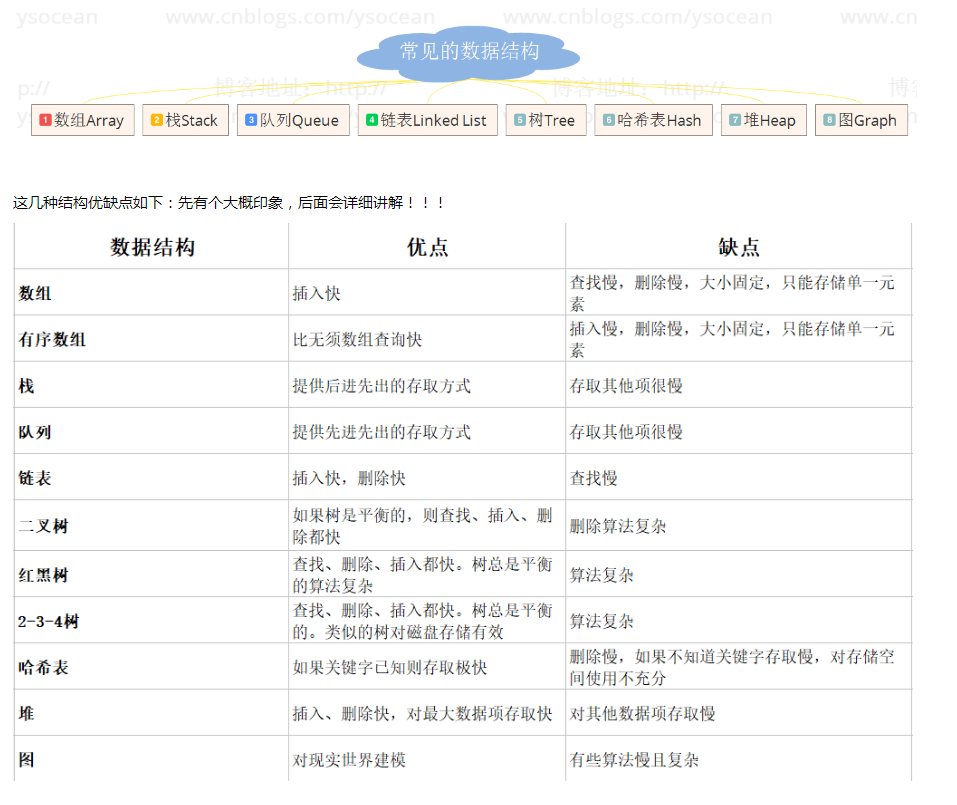

## 1、数组

**数组是固定大小的结构，可以容纳相同数据类型的项目。**

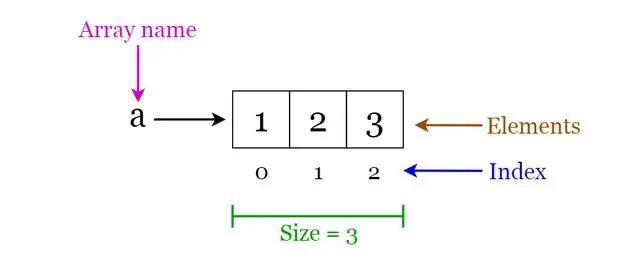

数组运算：·

遍历：遍历所有元素并进行打印。

插入：将一个或多个元素插入数组。

删除：从数组中删除元素

搜索：在数组中搜索元素。您可以按元素的值或索引搜索元素

更新：在给定索引处更新现有元素的值

**优点：**

-   按照索引查询元素的速度很快；
-   按照索引遍历数组也很方便。

**缺点：**

-   数组的大小在创建后就确定了，无法扩容；
-   数组只能存储一种类型的数据；

**添加、删除元素的操作很耗时间，因为要移动其他元素。**

## 2、链表(单链表，双向链表)

链表是一系列节点组成的链，每一个节点保存了数据以及指向下一个节点的指针。链表头指针指向第一个节点，如果链表为空，则头指针为空或者为 null。

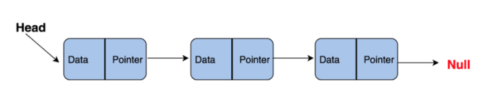


优点：

-   不需要初始化容量；
-   可以添加任意元素；
-   插入和删除的时候只需要更新指针。

缺点：

-   含有大量的指针，占用的内存空间大；
-   查找元素需要遍历整个链表，耗时。

## 3、数组和链表的区别

**数组（改查快）：** 数组是将元素在内存中连续存放，由于每个元素占用内存相同，可以通过**下标**迅速访问数组中任何元素。但是如果要在数组中增加一个元素，需要移动大量元素，在内存中空出一个元素的空间，然后将要增加的元素放在其中。同样的道理，如果想删除一个元素，同样需要移动大量元素去填掉被移动的元素。如果应用需要快速访问数据，很少或不插入和删除元素，就应该用数组。

**链表（增删快）：** 链表恰好相反，链表中的元素在内存**中不是顺序存储的**，而是通过存在元素中的**指针**联系到一起。比如：上一个元素有个指针指到下一个元素，以此类推，直到最后 一个元素。如果要访问链表中一个元素，需要从第一个元素开始，一直找到需要的元素位置。但是增加和删除一个元素对于链表数据结构就非常简单了，只要修改元素中的指针就可以了。如果应用需要经常插入和删除元素你就需要用链表数据结构了。 

## 4、堆、栈、队列

- **栈（Stack）**：
  - 栈是一种后进先出（LIFO，Last In First Out）的数据结构。
  - 它的操作包括压入（push）元素和弹出（pop）元素。
  - 栈通常用于需要临时存储数据并且希望最后处理的数据最先被访问的情况，比如函数调用栈、表达式求值等。
- **队列（Queue）**：
  - 队列是一种先进先出（FIFO，First In First Out）的数据结构。
  - 它的操作包括入队（enqueue）和出队（dequeue）。
  - 队列通常用于在数据处理中需要按照顺序处理元素的情况，比如任务调度、消息传递等。
- **堆（Heap）**：
  - 堆是一种基于树结构的数据结构，具体有最大堆和最小堆两种形式。
  - 堆通常用于实现优先级队列等场景，其中元素的访问顺序是根据元素的优先级确定的。
  - 在最大堆中，父节点的值大于等于其子节点的值；在最小堆中，父节点的值小于等于其子节点的值。

## 5、散列表（哈希表）

**哈希表（Hash Table）：**，也叫散列表，是一种可以通过键值对（key-value）直接访问的数据结构，它最大的特点就是**可以快速实现查找、插入和删除。**

数组的最大特点就是查找容易，插入和删除困难；而链表正好相反，查找困难，而插入和删除容易。哈希表很完美地结合了两者的优点， Java 的 HashMap 在此基础上还加入了树的优点（链表超过长度变成红黑树）。

**哈希函数（Hash Function）：**哈希函数在哈希表中起着⾮常关键的作⽤，它可以把任意长度的输入变换成固定长度的输出，该输出就是哈希值。哈希函数使得一个数据序列的访问过程变得更加迅速有效，通过哈希函数，数据元素能够被很快的进行定位。若关键字为 k，则其值存放在 hash(k) 的存储位置上。由此，不需要遍历就可以直接取得 k 对应的值。

对于任意两个不同的数据块，其哈希值相同的可能性极小，也就是说，对于一个给定的数据块，找到和它哈希值相同的数据块极为困难。再者，对于一个数据块，哪怕只改动它的一个比特位，其哈希值的改动也会非常的大。尽管可能性极小，但仍然会发生，**如果哈希冲突了，Java 的 HashMap 会在数组的同一个位置上增加链表，如果链表的长度大于 8且数组长度大于64时，将会转化成红黑树进行处理——这就是所谓的拉链法（数组+链表）。**

### （1）解决哈希冲突

- **开放定址法**：开放定址法通过在哈希表中寻找空闲位置来解决冲突。常见的方法包括线性探测再散列、二次探测再散列和伪随机探测再散列。**这些方法的缺点是容易产生聚集，即连续的冲突，影响查找效率。**

  > 开放寻址法又叫做开放定址法、开地址法，从发生冲突的那个单元起，按照一定的次序，从哈希表中找到一个空闲的单元。然后把发生冲突的元素存入到该单元的一种方法。开放定址法需要的表长度要大于等于所需要存放的元素。
  >
  > 开放定址法的缺点在于删除元素的时候不能真的删除，否则会引起查找错误，只能做一个特殊标记。只到有下个元素插入才能真正删除该元素。如果真的删除元素，当进行查找操作时，如果遇到了删除的位置，查找过程会错误地认为该位置是空闲的，从而提前结束查找。这样可能导致查找无法找到正确的位置。

- **再哈希法**：再哈希法同时构造多个不同的哈希函数，在发生冲突时，依次尝试不同的哈希函数，直到找到空闲位置。**这种方法不容易产生聚集，但增加了计算时间。**

- **拉链法**：拉链法是一种常见且高效的解决哈希冲突的方法，它将哈希表中冲突的元素存储在同一个位置上的链表中。当发生冲突时，新元素被添加到链表的末尾。这种方法适用于经常进行插入和删除操作的情况，**Java中的HashMap就是基于拉链法实现的**。

  > 如果哈希冲突了，Java 的 HashMap 会在数组的同一个位置上增加链表，如果链表的长度大于 8且数组长度大于64时，将会转化成红黑树进行处理——这就是所谓的拉链法（数组+链表）。

- **建立公共溢出区**：建立公共溢出区是将哈希表分为基本表和溢出表两部分，当发生冲突时，将冲突的元素存储在溢出表中。**这种方法可以有效地避免聚集，但增加了额外的空间开销。**

# 六、JAVA

## 1、面向对象的特征

- **封装（Encapsulation）**：隐藏类内部实现机制，增加了代码的可维护性，便于修改，增加了代码的复⽤性 。

- **继承（Inheritance）**：⼦类复⽤⽗类中的数据属性和⽅法。⽗类中private定义的变量和⽅法不会被继承，增加了代码的复⽤性 。

- **多态（Polymorphism）**：有继承，有重写、⽗类引⽤指向⼦类对象，增加了可移植性，健壮性，灵活性。

  > 具体来说，多态性通过方法的重写（Override）和方法的重载（Overload）来实现。**当子类重写父类的方法时，可以根据子类的具体实现来调用相应的方法，即使通过父类的引用调用，实际上执行的是子类的方法。这种行为称为运行时多态性。**
  >
  > 另外，方法的重载允许在同一个类中定义多个同名但参数列表不同的方法，**编译器根据方法的参数类型和数量来确定调用哪个方法，这种行为称为编译时多态性。**

## 2、接口和抽象类的区别

⼀个类如果**继承了某个抽象类**或者**实现了某个接口**都需要对其中的**抽象方法全部进行实现** 。

- 抽象类可以有抽象方法和具体方法                                           接口中全部为抽象⽅法。
- 抽象类的方法可以⽤protected、private、public修饰          接口中的方法只能是public。
- 抽象类中可以定义构造器                                                           接口中不能定义构造器
- ⼀个类只能继承⼀个抽象类，但可以实现多个接口
- 从Java 8开始，接口可以包含默认方法（default method）和静态方法（static method）

- 抽象类重点描述抽象概念（is），接口重点在描述特征（can）

  > **抽象类描述抽象概念（is）**：抽象类通常用于描述一种类的抽象概念，强调的是类与类之间的继承关系。通过抽象类，可以定义一组类的通用特性，并且可以为子类提供共享的代码实现。抽象类通常包含具体的方法实现，但也可以包含抽象方法，强制子类实现某些行为。
  >
  > **接口描述特征（can）**：接口主要用于描述类的行为特征，强调的是类所能做的事情。接口定义了一组抽象方法的规范，但不包含任何实现。通过实现接口，类可以表达出自己具有某种能力或行为特征，并且可以实现多重接口，从而表达出多个特征的组合。

## 3、equals与==的区别

**`==` 是运算符**：

- 对于基本数据类型，`==`比较的是它们的值是否相等。
- 对于引用类型，`==`比较的是对象的引用是否相同，即它们是否指向内存中的同一个对象。

**`equals()`是方法**：

- `equals()`方法是Object类的方法，在Java中所有类都继承自Object类，因此都可以使用`equals()`方法。
- 默认情况下，`equals()`方法比较的是对象的引用，即比较两个对象是否在内存中占据相同的地址。
- 但是，许多类（如String、Integer等）会覆盖`equals()`方法，改变其行为，使其比较对象的内容而不是引用。
- 如果没有重写`equals()`方法，它与`==`运算符效果相同，都是比较对象的引用。

## 4、HashMap和HashTable的区别

- **两者父类不同**

  HashMap继承自 **AbstractMap** 类，而 HashTable 继承自 **Dictionary** 类。都实现了 map、cloneable（可复制）、serializable（可序列化）这三个接口。

- **对外提供的接口不同**

    - HashTable 比 HashMap 多提供了 **elements（）和contains（）** 方法
        - `elements()`: 继承自 HashTable 的父类 Dictionary，用于返回此 HashTable 中的 value 的枚举
        - `contains()`: 判断该 HashTable 是否包含传入的 value

    - HashMap 没有 contains 方法，有 containsValue 和 containsKey 方法

- **对 null 的支持不同**

    - HashMap：**key 和 value 都允许为 null**。但这样的 key 只能有一个，因为必须保证 key 的唯一性，但可以有多个 key 值对应的 value 为 null
    - HashTable：**key 和 value 都不能为 null**，会抛出 NullPointerException 异常

- **安全性不同**

    - **HashMap**：线程不安全，效率高。只能用于单线程环境下，当需要多线程操作时可以使用 concurrent 并发包下的 ConcurrentHashMap。 

      > ConcurrentHashMap：同样用 synchronized 关键字，但是采用分段锁的原理，只把需要的数据段锁上，理论上效率提高分段个数的倍数。

    - **HashTable**：线程安全，效率低，每个方法都有 synchronized 关键字修饰，都是同步方法，所以是线程安全的

- **初始化方法、初始容量和扩容方案不同**

    两者的填充因子默认都是 0.75。

    - **HashMap**：第一次调用 put() 方法时初始化数组，初始容量 16，每次扩容时容量翻倍：**capacity * 2**

        **【可以用 LinkedList 代替数组，但效率为 O(n) 不如数组 O(1)】**

        **【不可以用 ArrayList 代替数组，因为 ArrayList 扩容机制是 1.5 幂不是 2 幂】**

    - **HashTable**：在构造方法中初始化，初始容量 11，每次扩容时容量翻倍加一：**capacity * 2 + 1**

## 5、为什么HashMap扩容总是2的次幂？

在 HashMap 中，用于确定一个元素存储位置的哈希函数将哈希码映射到数组索引上。而数组的索引通常是通过对哈希码取模运算得到的，即 `index = hashCode % array.length`。当数组的长度是2的次幂时，取模运算可以被优化为位运算，即 `index = hashCode & (array.length - 1)`。这样的优化可以大大提高定位元素的效率，因为位运算比取模运算要快得多。

## 6、HashMap底层数据结构

- 数组：数组是 HashMap 的基础结构，它提供了快速的随机访问能力，通过计算哈希值来确定应当存放在数组中的下标 index。数组的读写操作的时间复杂度为 O(1)，是 HashMap 实现快速存取的基础。
- 链表：为了解决哈希冲突带来的问题，相同哈希值的键值对会被串联成链表。链表通过头插法实现，即新元素插入链表的头部。链表的平均查找时间复杂度是 O(1)，但当链表过长时，会导致性能下降。
- 红黑树：当链表的长度超过一定阈值（通常为 8），并且数组长度超过一定阈值（通常为 64）时，链表就会被转换为红黑树。红黑树是一种自平衡的二叉查找树，它保证了在最坏情况下的时间复杂度为 O(log n)。红黑树的引入提高了查找效率，尤其是对于大规模数据。

## 7、HashMap的插入操作的流程

1. 判断数组是否为空，为空则进行初始化，通常在第一次插入元素时进行。
2. 计算键（key）的哈希值，并使用 `(n - 1) & hash` 计算应当存放在数组中的下标 index。
3. 检查 `table[index]` 是否已经存在数据，如果不存在数据，则创建一个新的节点存放在 `table[index]` 中。
4. 如果已经存在数据，说明发生了哈希冲突，需要继续判断键是否相等。如果键相等，则用新的值替换原有的数据（根据 `onlyIfAbsent` 参数的设置）。
5. 如果键不相等，则需要进一步处理哈希冲突。首先判断当前节点类型是否是树型节点。如果是树型节点，则将新节点插入到红黑树中。
6. 如果当前节点不是树型节点，将新节点创建为普通节点并加入到链表中。然后判断链表长度是否大于 8 并且数组长度大于 64，如果满足条件，则将链表转换为红黑树。
7. 插入完成后，检查当前节点数是否大于阈值。如果大于阈值，则开始扩容，将数组大小扩大为原数组的两倍，然后重新计算哈希值并重新插入元素。

## 8、HashMap1.8扩容机制（数组扩容）

1.  **生成新数组**： 当HashMap需要扩容时，会创建一个新的数组，其大小是原数组大小的两倍。
2.  **遍历旧数组**： 对于原数组中的每个位置，HashMap会检查是否存在链表或红黑树。
3.  **链表处理**： 如果某个位置存在链表，则会遍历该链表中的每个元素，并重新计算其在新数组中的位置，然后将元素添加到新数组的相应位置。
4.  **红黑树处理**： 如果某个位置存在红黑树，则会遍历红黑树中的每个元素，并**统计每个元素在新数组中的位置**。
    - 如果这个位置元素个数超过了阈值（一般为8），则会生成一个新的红黑树，并将根节点添加到新数组的相应位置。
    - 如果这个位置元素个数没有超过阈值，则会将元素形成链表，并将链表的头节点添加到新数组的相应位置。
5.  **完成元素转移**： 当所有元素都转移到新数组后，HashMap会将新数组复制给table属性，以便后续的操作可以基于新的数组进行。
## 9、 Java对象的equals方法和hashCode方法的关系

**必须同时复写hashCode方法和equals方法**

为了保证相等的对象必须具有相等的哈希码，也就是当两个对象通过equals() ⽐较的结果为true时，这两个对象调⽤hashCode()⽅法⽣成的哈希码必须相等。

**如何保证：**equals⽅法的判断根据和计算hashCode的依据相同。如String的equals⽅法是⽐较字符串每个字符，String的hashCode也是通过对该字符串每个字符的ASCI码简单的算术运算所得，这样就可以保证相同的字符串的hashCode相同且equals()为真。

## 10、重写和重载的区别

**重写（Override）**：

- 重写指的是在子类中重新实现（覆盖）父类中已有的方法，以改变方法的行为。
- 重写要求子类方法的名称、参数列表和返回类型与父类方法完全相同。
- 重写方法的访问修饰符可以更宽松，但不能更严格。
- 重写允许子类根据自身的需求对父类的方法进行定制，提供了多态的特性。
- 方法被定义为final不能被重写

**重载（Overload）**：

- 重载指的是在同一个类中，可以定义多个方法，它们具有相同的名称但是参数列表不同（类型、顺序、个数）的特性。
- 重载方法与返回类型无关，只要方法签名（方法名和参数列表）不同即可。
- 重载方法可以有不同的访问修饰符、返回类型、抛出异常等。

## 11、String、StringBuffer/StringBuilder区别和使用场景：

- **运行速度**：在运行速度方面，StringBuilder > StringBuffer > String。这是因为 String 是不可变的，每次操作都会创建新的对象，而 StringBuilder 和 StringBuffer 是可变的，可以在原地进行修改，因此更快。
- **可变性**：String为字符串常量，不是基本数据类型⽽是⼀个对象，底层是final修饰的字符数组，⼀经定义⽆法增删改，每次对String的操作都会⽣成新的 String对象。StringBuffer和StringBuilder他们两都继承了AbstractStringBuilder抽象类，均为字符串变量，底层使用可扩展的字符数组，可以修改内容。
- **线程安全性**：StringBuilder 是非线程安全的，而 StringBuffer 是线程安全的，因为 StringBuffer 的方法是同步的，采用了 synchronized 关键字，这意味着在多线程环境下，StringBuffer 是安全的但性能较低，而 StringBuilder 在单线程环境下更快。
- **版本引入**：StringBuffer 从 JDK 1.0 就开始，而 StringBuilder 是在 JDK 1.5 引入的。

## 12、Hashcode的作用

`hashCode()` 方法返回对象内存地址换算出的哈希码，用于确定对象在集合中的存储位置。当添加新元素时，先计算哈希码，然后根据哈希码找到存储位置。若位置为空，则直接存储；若位置已有元素，则调用 `equals()` 方法比较是否相等，减少调用次数提高查找效率。

> java的集合有两类，⼀类是List（有序可重复），⼀类是Set（⽆序不重复）将集合分为若⼲存储区域，每个对象可以计算出⼀个哈希码，可以将哈希码分组，每组分别对应某个存储区域，根据⼀个对象的哈希码就可以确定该对象应该存储的那个区域。

## 13、ArrayList和LinkList的区别

-   **ArrayList：**底层是能⾃动扩容的动态数组，toArray方法返回的是⼀个数组，搜索和读取数据的时间复杂度为O(1)，但是删除数据开销很⼤，需要把后⾯的数据前移。
-   **LinkList：**底层是⼀个双链表，asList⽅法返回⼀个链表，在添加和删除元素时性能较好，但在get和set方⾯弱于ArrayList。

## 14、List和Set的区别

-   **List：**有序，可重复，允许多个Null元素对象，可以使用Iterator取出所有元素，再逐一遍历，还可以使用get(int index)获取指定下标的元素。
-   **Set：**无序，不可重复，最多允许有一个Null元素对象，取元素时只能用Iterator接口取得所有元素，再逐一进行遍历。因为它没有带索引的方法。

## 15、为什么使用HashMap

ArrayList：适⽤于查询次数特别多，查询效率⽐较⾼同时插⼊和删除的次数⽐较少的情况

LinkList：适⽤于插⼊和删除次数⽐较多同时在查询次数不多的情况

HashMap：同时要求插入，删除，查询效率都很高，动态数组+链表+红⿊树

## 16、深拷贝和浅拷贝的区别？

- **浅拷贝（Shallow Copy）：**浅拷贝会创建一个新对象**，如果字段是基本数据类型，那么拷贝的就是基本数据类型的值。如果字段是引用类型，那么拷贝的就是引用，也就是说新对象和原始对象的引用指向了同一个对象。**在浅拷贝中，如果原始对象中的引用对象发生了改变，那么拷贝对象中的引用对象也会发生改变，因为它们指向同一个对象。
- **深拷贝（Deep Copy）：**深拷贝会创建一个新对象，并且**递归地将原始对象的所有字段都复制到新对象中，包括引用类型的字段所指向的对象。这意味着即使原始对象中的引用对象发生了改变，深拷贝后的对象中的引用对象也不会受到影响**，因为它们指向不同的对象。深拷贝需要考虑到对象图中的所有对象，并确保每个对象都被复制到新的内存位置。这可能涉及到递归复制对象的引用对象，以确保所有层次的对象都被复制。

## 17、Static用法

- **修饰变量、方法**：`static`关键字用于修饰类的成员变量和方法。**静态方法不依赖于类的实例，可以直接通过类名调用。静态方法中不能访问非静态变量和非静态方法，因为它们需要依赖于对象的实例。**
- **静态内部类**：静态内部类是定义在类内部的类，并且使用`static`关键字修饰。与非静态内部类不同，**静态内部类不需要依赖外部类的实例而可以实例化。静态内部类通常用于与外部类解耦合的场景，例如工具类。**
- **静态导包**：Java 5引入了静态导包的语法，通过`import static`语句可以导入某个类中的静态成员（字段或方法），使得在使用时无需指定类名。这样做可以简化代码，提高可读性。

## 18、final用法

1. 被final修饰的类不可以被继承

2. 被final修饰的⽅法不可以被重写

3. 被final修饰的变量不可以被改变

4. 被final修饰的方法，JVM会尝试将其内联以提高运行效率。这意味着方法的调用会被编译器优化为直接在调用处插入方法的代码，而不是真正的方法调用过程。

5. 被final修饰的常量在编译阶段会存入常量池中。这意味着在编译时会被确定，并且在运行时无法改变其值。

6. 如果修饰引⽤,那么表示引⽤不可变,引⽤指向的内容可变

   >  `final` 关键字仅确保引用本身不会被重新赋值，而不影响引用指向的对象的内容。
   >
   > ```java
   > final StringBuilder sb = new StringBuilder("Hello");
   > sb.append(" World"); // 可以修改StringBuilder对象的内容
   > ```
   >
   > 在这个例子中，`sb` 是一个引用，被声明为 `final`，意味着不能再指向其他 `StringBuilder` 对象，但是可以修改 `StringBuilder` 对象的内容。
   >
   > 另一方面，如果使用 `final` 修饰了整个对象，那么该对象的内容将不可变，例如：
   >
   > ```java
   > final String str = "Hello";
   > str = "World"; // 这将导致编译错误，因为尝试修改了不可变的引用
   > ```
   >
   > 在这个例子中，`str` 被声明为 `final`，因此不能重新分配给另一个对象。

## 19、Exception和Error包结构

- **被检查异常（Checked Exception）**：
  - Java编译器会在编译时强制检查这些异常，要求程序员进行显式处理。
  - 必须通过throws声明抛出或者通过try-catch捕获处理，否则代码无法通过编译。
  - 这些异常通常是可以被恢复的，例如文件未找到异常、IO异常等。
  - 例如：当通过clone()接⼝去克隆⼀个对象，⽽该对象对应的类没有实现Cloneable接⼝，就会抛出CloneNotSupportedException异常。
- **运行时异常（Runtime Exception及其子类）**：
  - 运行时异常及其子类在Java中不受编译器检查，也不要求必须通过throws声明抛出或者通过try-catch捕获处理。
  - 这些异常通常是由程序逻辑错误导致的，而不是外部条件引起的。
  - 例如：空指针异常，数组越界异常，除数为0 异常，并发修改异常，类转换异常，数据存储异常等
- **错误（Error类及其子类）**：
  - 错误表示严重的问题，通常是程序无法恢复的情况，而不是由程序错误引起的，而是由于系统环境出现问题。
  - 与异常不同，编译器不会检查错误，程序员也不需要显式地处理它们。
  - 例如：`OutOfMemoryError`、`StackOverflowError`等。

## 20、Java创建对象的方式有几种

- **使用new关键字**：最常见的创建对象的方式是使用 `new` 关键字来实例化一个类的对象。例如：`MyClass obj = new MyClass();`

-   **使用反射机制**：通过Java的反射机制，可以在运行时动态地加载类、调用类的方法、访问类的属性，并创建对象。使用反射机制创建对象的方式是通过 `Class` 类的 `newInstance()` 方法来实现的。

    ```java
    Class<?> clazz = MyClass.class;
    MyClass obj = (MyClass) clazz.newInstance();
    ```

    或者使用 `Constructor` 类的 `newInstance()` 方法：

    ```java
    Constructor<MyClass> constructor = MyClass.class.getConstructor();
    MyClass obj = constructor.newInstance();
    ```

-   **使用clone()方法**：对象的 `clone()` 方法用于创建并返回对象的一个副本。为了使用 `clone()` 方法，需要实现 `Cloneable` 接口并重写 `clone()` 方法。

    ```java
    MyClass obj1 = new MyClass();
    MyClass obj2 = obj1.clone();
    ```

-   **通过序列化机制**：将对象转换成字节流，然后再从字节流中重新构建对象。通常使用ObjectInputStream和ObjectOutputStream来实现。

    ```java
    ObjectInputStream in = new ObjectInputStream(new FileInputStream("data.txt"));
    MyClass obj = (MyClass) in.readObject();
    ```

-   使用对象工厂：通过对象工厂方法来创建对象。工厂方法是一种创建对象的设计模式，可以将对象的创建过程封装在一个方法中，并由方法返回创建好的对象。

    ```java
    public class MyClassFactory {
        public static MyClass createMyClass() {
            return new MyClass();
        }
    }
    
    MyClass obj = MyClassFactory.createMyClass();
    ```

## 21、CocurrentHashMap原理，jdk7和jdk8版本的区别

**ConcurrentHashMap 原理：**ConcurrentHashMap 使用分段锁（Segment）来实现并发控制，它将整个数据集分成多个段（Segment），每个段相当于一个小的 HashMap，每个段都拥有自己的锁。这样，在多线程情况下，不同的线程可以同时访问不同的段，从而提高了并发性能。

JDK 7 中的 ConcurrentHashMap：

- JDK 7 中的 ConcurrentHashMap 是基于分段锁实现的，并发控制采用了粗粒度的锁机制。也就是说，每个 Segment 都是一个可重入锁（ReentrantLock），当一个线程占据了某个 Segment 的锁时，其他线程无法访问同一个 Segment。
- JDK 7 中的 ConcurrentHashMap 在进行扩容时会引起连锁扩容问题，当一个 Segment 扩容时，其他的 Segment 也会受到影响，可能会导致性能下降。

**JDK 8 中的 ConcurrentHashMap：**

- **数据结构**：
  - 引入了 Node 数组和红黑树，当链表长度达到一定阈值时，会将链表转换为红黑树，以提高查询、插入和删除操作的性能。
  - Node 节点的 val 和 next 使用 volatile 修饰，以确保多线程间的可见性。
  - 查找、替换、赋值等操作都采用了 CAS（Compare and Swap）算法来保证线程安全。
- **锁**：锁的粒度更细化，只锁定链表的头节点，而不会影响其他元素的读写操作。这提高了并发性能，并减少了锁的竞争。
- **读操作无锁**：
  - Node 节点的 val 和 next 使用 volatile 修饰，以确保对读写线程可见性。
  - 数组使用 volatile 修饰，保证扩容时被读线程感知。
- **并发扩容**：
  - 在扩容时，ConcurrentHashMap 会阻塞所有的读写操作，以确保安全地进行扩容，并保持数据的一致性。

## 22、ThreadLocal

在threadLocal中，无论是他的put方法和他的get方法， 都是先从获得当前用户的线程，然后从线程中取出线程的成员变量map，只要线程不一样，map就不一样，所以可以通过这种方式来做到线程隔离

## 23、Tomcat的运行原理


当用户发起请求时，会访问我们像tomcat注册的端口，任何程序想要运行，都需要有一个线程对当前端口号进行监听，tomcat也不例外，当监听线程知道用户想要和tomcat连接连接时，那会由监听线程创建socket连接，socket都是成对出现的，用户通过socket像互相传递数据，当tomcat端的socket接受到数据后，此时监听线程会从tomcat的线程池中取出一个线程执行用户请求，在我们的服务部署到tomcat后，线程会找到用户想要访问的工程，然后用这个线程转发到工程中的controller，service，dao中，并且访问对应的DB，在用户执行完请求后，再统一返回，再找到tomcat端的socket，再将数据写回到用户端的socket，完成请求和响应

通过以上讲解，我们可以得知 每个用户其实对应都是去找tomcat线程池中的一个线程来完成工作的， 使用完成后再进行回收，既然每个请求都是独立的，所以在每个用户去访问我们的工程时，我们可以使用threadlocal来做到线程隔离，每个线程操作自己的一份数据

# 七、软件测试

### 1、测试方法有哪些

按**测试**分类：黑盒，白盒，灰盒

**是否执行**代码：静态测试，动态测试

按**开发过程的阶段**：单元测试，集成测试，确认测试，系统测试，验收测试，回归测试

------

**按测试分类：**

- 黑盒测试（Black Box Testing）：
  - 根据规格说明或功能需求，测试程序的输入与输出之间的关系，而不考虑程序内部的逻辑。
  - 主要关注系统功能是否符合预期，而不关心内部实现细节。
- 白盒测试（White Box Testing）：
  - 根据程序内部结构和逻辑进行测试，关注程序的内部状态、条件、逻辑和路径覆盖等。
  - 通常需要查看源代码和设计文档来编写测试用例。
- 灰盒测试（Gray Box Testing）：
  - 结合黑盒测试和白盒测试的特点，既关注功能测试，又关注内部逻辑和结构。

**是否执行代码：**

- 静态测试（Static Testing）：
  - 在不运行代码的情况下，通过检查代码、文档和其他软件制品来进行的测试。
  - 静态分析工具、代码审查和需求分析是静态测试的常见方法。
- 动态测试（Dynamic Testing）：
  - 通过执行程序来检查其行为和性能。
  - 单元测试、集成测试、系统测试等都属于动态测试的范畴。

**按开发过程的阶段：**

- 单元测试（Unit Testing）：
  - 针对软件中的最小可测试单元进行测试，通常是单个函数、方法或模块。
  - 目的是验证代码的行为是否符合预期，确保每个单元的功能正确。
- 集成测试（Integration Testing）：
  - 针对多个单元或模块的集成，测试它们在一起协同工作的能力。
  - 确保不同单元之间的接口和交互是正确的。
- 确认测试（Validation Testing）：
  - 确认产品是否满足了用户需求和期望。
  - 验证系统是否符合规格说明和客户的期望。
- 系统测试（System Testing）：
  - 针对整个系统的功能和性能进行测试，确保系统的整体行为符合预期。
  - 主要关注系统的功能、性能、安全等方面。
- 验收测试（Acceptance Testing）：
  - 在用户接受之前，由用户或客户执行的测试，以确认系统是否满足了他们的需求和期望。
  - 通常由最终用户或客户执行。
- 回归测试（Regression Testing）：
  - 在软件发生变化后，重新运行先前的测试，以确保新更改未导致原有功能的退化或故障。
  - 目的是防止由于更改引入的错误而影响到其他部分的功能。

### 2、黑盒白盒测试的区别以及各自优点

-   **黑盒测试：**

就相当于把软件当成一个黑色的盒子，我们不关心系统内部是怎么实现的，只关心我们的输入数据，和预期的结果是不是一样的。（通过手动输入不同的数据来验证输出是否符合预期。）比如，可以根据用户说明书或者需求文档，针对一些命令、信息进行输入，得到什么样的输出结果，我不关心是怎么实现的，只关心能不能获取我想要的信息。

**优点：**可以站在用户的立场上进行测试；比如用户是怎么使用的那就怎么测试，增加用户体验感。

**缺点：**不能去覆盖内部的每一条代码。

-   **白盒测试：**

和黑盒测试正相反，比如我们把软件看成一个透明的盒子，我们可以清楚的看到程序的内部是如何运行的，比如每一个if语句、switch语句、模块和模块直接是如何让进行联系的，他的结构是什么，我们主要针对里面的结构进行测试。（需要写测试代码来调用对应的函数，通过传入不同的参数，来测试函数返回值是否符合预期。）

**优缺点：**能够对程序的各种内部问题进行覆盖测试，比如尽量把测试覆盖到每一行的源码里，这是黑盒测试不具备的。

**缺点：**没有办法站在用户角度进行测试。有的时候内部测试没有问题，但用户使用时发现还是有问题。

### 3、设计测试用例的方法

**黑盒**：**等价类划分法，边界值分析法**，判定表，场景法，错误推测方法，正交实验设计法，随机测试。

**白盒**：逻辑覆盖，分支覆盖，条件覆盖，循环覆盖，基本路径覆盖。

------

**黑盒测试方法：**

- **等价类划分法（Equivalence Partitioning）**：将输入数据划分为若干个等价类，选择代表性的测试数据来代表每个等价类。
- **边界值分析法（Boundary Value Analysis）**：针对输入数据的边界值及其邻近的数值进行测试，以验证系统在边界处的行为是否正确。
- **判定表（Decision Table）**：根据系统的不同输入和条件，构建判定表，列出所有可能的组合情况，然后设计测试用例。
- **场景法（Scenario Testing）**：根据用户的使用场景和实际应用情况，设计具有代表性的测试场景和测试用例。
- **错误推测方法（Error Guessing）**：根据测试人员的经验和直觉，推测出可能存在的错误，并设计相应的测试用例进行验证。
- **正交实验设计法（Orthogonal Array Testing）**：利用正交数组设计测试用例，以尽可能少的测试用例覆盖多个因素的组合情况。
- **随机测试（Random Testing）**：随机选择测试数据进行测试，以发现系统在不同输入情况下的行为。

**白盒测试方法：**

- **逻辑覆盖（Statement Coverage）**：确保测试用例能够覆盖代码中的每一条语句，验证每一行代码是否被执行到。

- **分支覆盖（Branch Coverage）**：确保测试用例能够覆盖代码中的每一个分支，验证每个分支的条件是否都能被满足和不满足。

  > 如果有一个条件语句 `if (condition)`，分支覆盖要求至少有一组测试用例使得 `condition` 为真，另一组使得 `condition` 为假。

- **条件覆盖/判定覆盖（Decision Coverage）**：确保测试用例能够覆盖代码中的每一个条件，验证每个条件的取值都被覆盖到。

  > 条件覆盖强调对每个条件的覆盖，而不仅仅是分支的覆盖。例如，对于一个条件语句 `if (condition1 && condition2)`，条件覆盖要求至少有一组测试用例覆盖 `condition1` 和 `condition2` 各自为真和假的情况。

- **循环覆盖（Loop Coverage）**：确保测试用例能够覆盖代码中的循环结构，验证循环的执行次数和退出条件是否正确。

- **路径覆盖（Path Coverage）**：确保测试用例能够覆盖代码中的每一条可能的路径，验证代码中所有的执行路径是否都被覆盖到。

### 4、测试用例包括什么

- **测试目标**：描述测试用例的目的和要验证的功能、特性或行为。测试目标帮助测试人员明确测试的范围和目的，指导测试活动的方向。
- **测试环境**：描述测试执行所需的硬件、软件、网络配置等环境信息。测试环境的准确描述有助于测试人员设置合适的测试环境，并确保测试的可重复性和可验证性。
- **前置条件**：前置条件是执行测试用例之前需要满足的条件或假设。这些条件可能包括特定的系统状态、数据准备、环境设置等，确保测试的可重复性和准确性。
- **输入数据**：指定测试执行时所需的输入数据、参数或条件。输入数据可能包括用户输入、API调用、文件内容、数据库记录等，是触发系统行为的关键因素。
- **测试步骤**：详细描述测试用例的执行步骤，包括设置测试环境、准备输入数据、触发测试事件、执行测试操作等。测试步骤应该清晰明了，确保测试的可重复性和可验证性。
- **预期结果**：指定测试执行后预期的输出结果、状态或行为。预期结果应该与系统的预期行为一致，通常根据需求文档或设计规格确定。

### 5、主流技术和常见测试工具

- **功能测试**：功能测试主要验证程序的功能是否满足需求。

- **自动化测试**：使用代码或工具代替手工，对项目进行测试。

- **接口测试**：使用代码或工具对服务端提供的接口进行测试。

- **性能测试**：模拟多人使用软件，查找服务器缺陷。（比如20个人登录，查看服务器响应时间）

  

- 自动化测试工具：Selenium、Appium、Fiddler
- 接口测试工具：Jmeter、Postman
- 性能测试工具：LoadRunner、JMeter

- 负载测试工具：Load Ninja

------

- **接口测试工具：**
  - **JMeter：** JMeter 是一个功能强大的开源性能测试工具，主要用于测试 Web 应用程序的性能和负载。它可以模拟大量用户同时访问网站，评估系统的性能和稳定性。
  - **Postman：** Postman 是一个流行的 API 测试工具，可用于创建、调试和测试 HTTP 请求。它提供了直观的用户界面和丰富的功能，使开发人员和测试人员能够轻松地测试 API。

- **自动化测试工具：**
  - **Selenium：** Selenium 是一个用于自动化 Web 应用程序测试的工具，支持多种编程语言和多种浏览器。它可以模拟用户在浏览器中的操作，执行各种功能和场景的自动化测试。
  - **Appium：** Appium 是一个开源的移动应用程序自动化测试工具，用于测试 iOS 和 Android 应用程序。它支持多种编程语言和测试框架，并提供了丰富的 API 和功能。
  - **Fiddler：** Fiddler 是一个用于 HTTP 调试和网络抓包的工具，可用于监视、分析和调试 Web 浏览器和应用程序之间的通信。
- **性能测试工具：**
  - **LoadRunner：** LoadRunner 是一款流行的性能测试工具，用于测试 Web、移动、云和企业应用程序的性能。它可以模拟大量用户的并发访问，评估系统的性能指标和瓶颈。
  - **JMeter：** 除了用于接口测试，JMeter 也可以用作性能测试工具。它具有灵活的测试脚本和丰富的测试报告功能，适用于各种性能测试场景。
- **负载测试工具：**
  - **Load Ninja：** Load Ninja 是一个基于云的负载测试工具，可用于测试 Web 应用程序的性能和稳定性。它提供了易于使用的界面和强大的负载生成功能，支持实时监控和分析测试结果。

### 6、软件测试和目的

软件测试：使用技术手段验证软件是否满足使用需求。

软件测试目的：减少软件缺陷（bug），保障软件质量！

### 7、质量模型

**ISO/IEC 25010 质量模型：** ISO/IEC 25010 是 ISO 9126 的更新版本，它定义了软件质量的更广泛的特性和子特性。它包括以下主要特性：功能性，性能效率，兼容性，易用性，可靠性，信息安全性，可维护性，可移植性

### 8、测试流程

1. **需求分析阶段：**
   - 理解和分析用户需求和业务需求。
   - 确定测试范围和测试目标。
2. **测试计划阶段：**
   - 制定测试计划，确定测试的方法、策略和资源。
   - 确定测试的时间表和计划。
3. **测试设计阶段：**
   - 根据需求和规格说明书设计测试用例。
   - 确定测试数据和测试环境。
   - 编写测试脚本和测试程序（如果有自动化测试）。
4. **测试环境搭建阶段：**
   - 部署测试环境，包括硬件、软件和网络配置。
   - 准备测试数据和测试工具。
5. **测试执行阶段：**
   - 执行测试用例并记录测试结果。
   - 发现并报告软件中的缺陷和问题。
   - 进行回归测试，确认修复的问题并验证功能的稳定性。
6. **测试报告阶段：**
   - 汇总测试结果，编写测试报告。
   - 将测试报告提交给相关利益相关方，包括开发团队、项目管理和业务方面。
7. **缺陷跟踪和管理阶段：**
   - 跟踪和管理软件中发现的缺陷和问题。
   - 确保缺陷得到及时修复和关闭。

### 9、测试用例文档

用例编号                 用例标题              项目/模块  优先级         前置条件          测试步骤                 测试数据                 预期结果

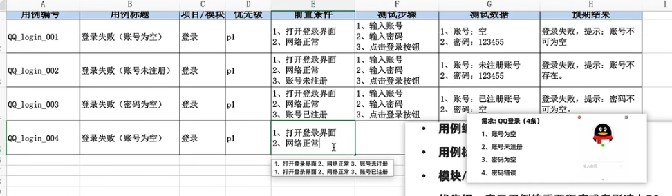

### 10、测试设计

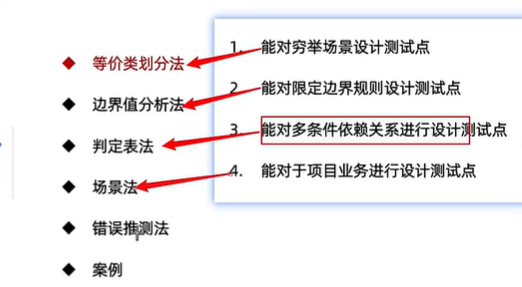

#### （1）等价类划分法

**常见输入框之类测试**

-   说明：在所有测试数据中，具有某种共同特征的数据集合进行划分。
-   分类：有效等价类（满足需求的数据集合），无效等价类（不满足需求的数据集合）
-   步骤：
    -   明确需求
    -   确定有效和无效等价类
    -   提取数据编写测试用例
    

> 举例说明，我们要测试一个用户名是否合法，用户名的定义为：8位数字组成的字符。 我们可以先划分子集：空用户名，1-7位数字，8位数字，9位或以上数字，非数字。 然后从每个子集选出若干个有代表性的值：
>
> 空用户名：“” （无效等价类实例，指对于软件规格说明而言，没有意义的、不合理的输入）
>
> 1-7位数字：”234” （无效等价类实例）实际上，对于1-7位数字的子集来说，选“234”和“11111”没有本质的区别。
>
> 8位数字：”00000000” （有效等价类实例，能检验程序是否实现了规格说明中所规定的功能和性能）
>
> 9位或以上数字：”1234567890” （无效等价类实例）
>
> 非数字：”abc&!!!” （无效等价类实例）
> 
>

#### （2）边界值分析

 **大小，尺寸，最大/小，重量，至多/少…**

-   说明：边界范围节点，选取正好等于、刚好大于、刚好小于边界的值作为测试数据（有关范围限制最多7条）

> 边界值分析方法的应用规则：
>
>  （1）如果需求规定了取值范围：[4，12]，边界值取：4，12，3，13，5；
>
>  （2）如果需求规定了取值的个数，比如4件商品5折，边界值取：3，4，5； 

#### （3）判定表

**多个条件有组合关系的，一般适合4个以内条件依赖关系**

-   说明：判定表是通过穷举条件获得结果，对结果再进行优化合并，会得到一个判断清晰的策略表。该方法适用于逻辑判断复杂的场景，是功能测试中最严密的测试方法，又称为策略表法。 
-   组成：
    -   条件桩：列出问题中的所有条件，列出条件的次序无关紧要。
    -   动作桩：列出问题中可能采取的操作，操作的排列顺序没有约束。
    -   条件项：列出条件对应的取值，所有可能情况下的真假值。
    -   动作项：列出条件项的、各种取值情况下应该采取的动作结果。

-   规则：判定表中贯穿条件项和动作项的一列就是一条规则。假设有n个条件，每个条件的取值有两个（0，1），全组合有2的n次方种规则。
-   步骤：
    -   确定条件桩和动作桩；
    -   设计和优化判定表；
    -   填写动作项；
    -   提取测试用例。


> 举例说明：对于功率大于50马力的机器，并且维修记录不全或已运行10年以上的机器，应给予优先的维修处理。
>
> 条件桩：
>
> C1：功率大于50马力吗？
>
> C2：维修记录不全吗？
>
> C3：运行超过10年吗？
>
> 动作桩：
>
> A1：进行优先处理
>
> A2：作其他处理
>
> 生成判断表：
>
> 
>
>
> 测试用例设计方法
>
> 简化判定表：
>
> 
>
> 1，2合并，5，7合并，6，8合并

#### **（4）场景法**

**测业务用例----》测试过程中，必须先测业务！！！！**

- 说明：此方法主要用于测试软件的业务流程和业务逻辑，我们需尽可能真实的模拟用户在使用软件时的各种情景。
- 组成：一般场景设计有三个流程：基本流、备选流和异常流。
  - 基本流是通过业务流程输入都为正确的，能够最后达到目标的流程；
  - 备选流是通过实现业务流程时，因错误操作或异常输入，导致流程存在反复，但最终能够完成期望业务的流程；
  - 异常流是通过实现业务流程时，因错误操作或异常输入导致业务没有正确完成。


根据之前所画的流程图进行业务测试

**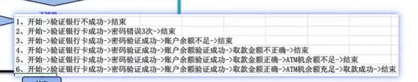**

#### （5）错误推断法

-   此方法是指测试人员根据直觉或经验，推测程序中可能存在的和容易发生错误的情况，从而有针对性地编写测试用例。
-   此方法没有固定的形式，具有高度主观性，对测试人员能力要求较高。其相比其他方法产生的测试集合，更容易发现缺陷。 

### 11、缺陷管理

定义：软件在使用过程中存在的任何问题都叫软件的缺陷，简称bug。

判定标准：

- 少功能：软件未实现需求（规格）说明书中明确要求的功能
- 功能错误：软件出现了需求（规格）说明书中指明不应该出现的错误
- 多功能：软件实现的功能超出需求（规格）说明书指明的范围
- 隐性功能错误：软件未实现需求（规格）说明书中明确指明但应该实现的功能
- 不易使用：软件难以理解，不易使用，运行缓慢，用户体验不好

# 八、Redis

## 1、什么是Redis?

即（Remote Dictionary Server）远程字典服务,C语言编写的，基于内存的可持久化的日志型，key-value数据库，提供多种语言的API。免费，开源，是当下最热门的NoSQL技术之一。称之为**结构化数据库**。

### 1、Redis能干嘛？

1.  内存存储、持久化，因为**内存中是断电即失**，所以说持久化很重要（RDB，AOF）。
2.  效率高，可以用于**高速缓存**。减轻mysql的查询压力，提升系统的性能。
3.  发布**订阅系统**。除了Redis自身的发布/订阅模式，也可以利用**List**实现一个队列机制，比如到货通知、邮件发送之类的。
4.  地图信息分析
5.  计时器，计数器（浏览量！！）。
6.  排行榜：利用Redis的SortSet(有序集合)实现。
7.  好友关系：利用集合的一些命令，比如并交差集合，可以方便解决一些共同爱好、共同好友之类的功能。

### 2、Redis特性

1.  多样的数据类型。
2.  数据持久化
3.  集群
4.  事务…

    Redis推荐都是在Linux服务器上搭建的，基于Linux学习。

    Redis-benchmark是一个压力测试工具，官方自带的性能测试工具！

    Redis-benchmark 命令参数即可。

## 2、五大数据类型

### 1、String(字符串)

int—数字时；raw –长字符串,长度\>39字节;embstr短字符串\<39字节

Raw和embstr都是由SDS动态字符串构成，唯一区别就是raw在分配内存时redisObject和SDS各分配一块，而embstr是redisObject和SDS在一块内存中。

基础命令：1）设置key: Set key value

2）获得值：Get key

3）判断一个key是否存在：Exists key

4）追加字符串，如果当前key不存在，就相当于 setkey : APPEND key

5）获取字符串长度：STRLEN key

6）自增：incr view [step]//也可以设置自增步长step,也可省略

7）自减：decr view

8）设置过期时间：Setex(set with expire)

9）不存在在设置：setex(set if not exists),在分布式锁中常常使用

场景：

value除了是字符串还可以是数字！

计数器；统计多单位的数量；粉丝数；对象缓存存储（比如设置过期时间）

### 2、List(列表)

在redis中，我们可以把list玩成栈，队列，阻塞队列。所有的list命令都是用l开头的。

基本命令：1）将一个或多个值插入到列表头部（左）：Lpush list value

2）将一个或多个值插入到列表尾部（右）：Rpush list value

3）获取列表中值：lrange list 0 -1

4）移除元素：lpop/rpop

5）通过下标获取值： lindex list index

6）列表长度：Llen

7）移除某个值：lrem

总结：

1.  它实际是一个链表，before Node after，left，right都可以插入值
2.  如果key不存在，创建新的链表
3.  如果key存在，新增内容。
4.  如果移除了所有值，空链表，也代表不存在。
5.  在两边插入或改动值，效率最高！中间元素，相对来说效率会低一点。

场景：**消息排队！**消息队列（LPUSH RPOP），栈（LPUSH LPOP）

### 3、Set(集合)

Set中的值是不能重复的。

基本命令：1）差集：SDIFF key1 key2

2）交集：SINTER key1 key2(共同好友就可以这样实现)

3）并集：SUNION key1 key2

场景：共同关注/爱好，二度好友，推荐好友！

### 4、Hash(哈希)

Map集合：key-map! value这个值是一个map集合。

Hash本质和String类型没有什么太大区别，还是一个简单的key-value键值对，只不过value是map集合。

使用场景：  
hash变更的数据user name age，尤其是用户信息之类的，经常变动的信息！hash更适合于**对象**的存储，String更加适合**字符串存储。**

### 5、Zset(有序集合)

在set基础上，增加了一个值 ，set k1 v1-\>zset k1  **score** v1。

Sorted Set有序表：跳跃表，压缩链表。

跳跃表：是**特殊的双向链表**，普通链表的next指针只能指向一个元素，而跳跃表的**next指向的是指针数组**，可以指向多个元素。形成了空间跳跃层，可以快速根据score找到element，因为它存储的每个节点都是由score（用来排序）和元素值组成。

案例思路：

set排序 存储班级成绩表，工资表排序！

**普通消息，1，重要消息1，带权重进行判断！排行榜应用实现，取TOP N 测试**。

## 3、三种特殊数据类型

### 1、Geospatial地理位置

朋友的定位，附近的人（获得所有附近的人的地址，定位！通过半径来查询），打车距离计算？

Redis的Geo在Redis3.2版本就推出了！

Geo底层的实现原理其实就是Zset!可以使用Zset命令来操作geo!

### 2、Hyperloglog基数统计—如果允许容错率

基数：不重复的元素，可以接收误差!

Redis Hyperloglog 基数统计算法！

优点：占用的内存是固定的，2\^64不同的元素的技术，只需要废12KB内存！

网页的**UV用户访问量**（一个人访问一个网站多次，但还是算作一个人！）

传统的方式，set保存用户的id，然后就可以统计set中的元素数量作为标准判断！

这个方式如果保存大量的用户id，就会比较麻烦！而我们的目的是为了计数，而不是为了保存用户id；--0.81%错误率！统计UV任务，可以忽略不计的！

### 3、Bitmap位图场景

位存储—

统计疫情感染人数：只用01存储（有感染，没感染）

统计用户信息：活跃/不活跃！登录/不登录！打卡/未打卡！

**只要是两个状态的都可以使用Bitmap!**

Bitmap位图，都是操作二进制位来进行记录，就只有0和1两个状态。

## 4、Redis基本事务

### 1、Redis事务本质：

**一组命令的集合！**一个事务中的所有命令都会被序列化，在事务执行过程中，会按照顺序执行！具有以下特性：一次性、顺序性、排他性！**启⽤事务以后，事务中的命令不会⽴即执⾏，⽽是放到队列中待成功提交事务以后统⼀批量执⾏**。注意不要在事务中做查询操作，不会⽴即反馈结果。

\----------队列 set set set 执行-----------

1.  Redis单条命令是保证原子性的，但是Redis事务不保证原子性。
2.  Redis事务中没有隔离级别的概念 !（队列原因）

所有的命令在事务中，并没有直接被执行！只有发起执行命令的时候才会执行！

### 2、Redis事务执行步骤

1.  开启事务（multi）如果取消事务，那么事务队列中的命令都不会被执行。
2.  命令入队（）
3.  执行事务（）
-   编译型异常（代码有问题，命令有错），事务中所有的命令都不会被执行！
-   运行时异常：如果事务队列中存在语法性错误，那么在执行命令的时候，其他命令是可以正常执行的，错误命令抛出异常！

### 3、Redis实现乐观锁—watch监视

1.  MySQL中的悲观锁，乐观锁：
-   悲观锁：很悲观，认为什么时候都会出问题，无论做什么都会加锁！
-   乐观锁：很乐观，认为什么时候都不会出问题，所以不会上锁！**更新数据的时候去判断一下，在此期间是否有人修改过这个数据**，mysql使用version版本号记录。=》获取version；更新的时候比较version
1.  Redis使用**watch**监视可以当作redis的乐观锁操作！  
     如果事务失败了，则先解锁；然后获取新的值，再次监视；select version

    最后比对监视的值是否发生了变化，如果没变化，那么可以执行成功，否则执行失败。Watch money

## 5、Jedis

要使用Java来操作Redis.

### 1、什么是Jedis?

Jedis是Redis官方推荐的Java连接开发工具！使用java操作Redis中间件！

1.  所有的API命令，就是上面的数据类型。

## 6、持久化操作

Redis是内存数据库，如果不将内存中的数据库状态保存到磁盘，那么一旦服务器进程退出，服务器中的数据库状态也会消失。所以Redis提供了持久化功能。

RDB 和AOF持久化。

### 1、RDB操作（Redis DataBase）-- 主从复制要用的

在指定的时间间隔内将**内存中的数据集**快照写入磁盘，也就是行话讲的Snapshot快照，它恢复时是将**快照文件直接读到内存里**。

Redis会单独创建（fork）一个子进程来进行持久化，会先将数据写入到一个临时文件中，待持久化过程都结束了，再用这个**临时文件替换上次持久化好的**文件。整个过程中，主进程是不进行任何I/O操作的。这就确保了极高的性能。如果需要进行大规模数据的恢复，且对于数据恢复的完整性不是非常敏感，那RDB方式要比AOF方式更加的高效。RDB的缺点是最后一次持久化后的数据可能丢失。我们默认是就是RDB，一般情况下不需要修改这个配置！

RDB保存的文件是dump.rdb 都是在配置文件中快照中进行配置的。

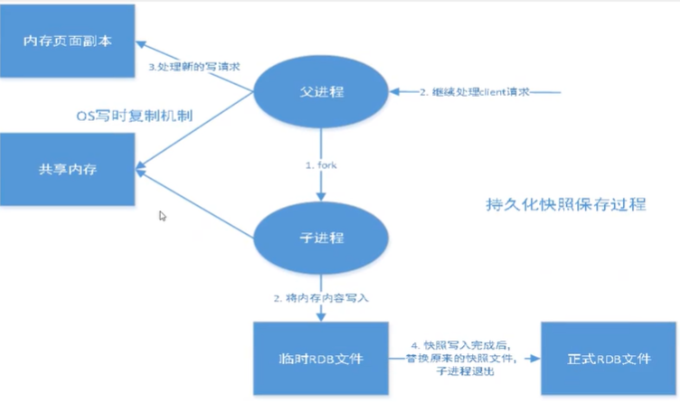

**触发机制：**

-   save的规则满足的情况下，会自动触发rdb规则。
-   执行flushall命令，也会出发rdb规则。
-   退出redis，也会产生rdb文件。

    备份会自动生成一个dump.rdb文件。

    **如何恢复rdb文件？**

-   只需要将rdb文件放在我们redis启动目录就可以，redis启动的时候会自动检查dump.rdb恢复其中的数据！
-   查看需要存在的位置（如果在这个目录不存在dump.rdb文件，启动就会自动恢复其中的数据）

    **优点：**

-   适合大规模的数据恢复！
-   对数据的完整性要求不高！

    **缺点：**

-   需要一定的时间间隔进程操作！如果redis意外宕机了，这个最后一次修改数据就没有了！
-   Fork进程的时候，会占用一定的内存空间！！

### 2、AOF操作(Append Only File)

将我们所有的命令都记录下来，相当于history，恢复的时候就把这个文件全部执行一遍！

以日志的形式来记录每个**写**操作，将Redis执行过的所有指令记录下来（读操作不记录），只许追加文件但不可以改写文件，redis启动之初会读取该文件重新构建数据，换言之，redis重启的话就根据日志文件的内容将写指令从前到后执行一次以完成数据的恢复工作。

\-------- AOF保存的是 appendonly.aof文件 ----------

默认是不开启的，要手动进行设置！只需将appendonly改为yes就开启了AOF！

重启，redis就可以生效了！

如果这个aof文件有错误，这时候redis是启动不起来的，我们需要使用redis提供的一个工具redis-check-aof—fix来修复这个aof文件即可。

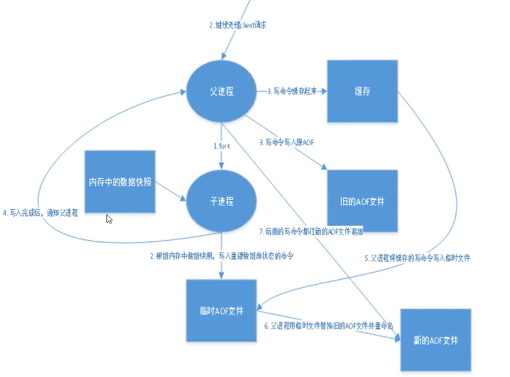

**优点：**

-   每一次修改都同步，文件的完整性会更好！
-   每秒同步一次，可能会丢失一秒的数据。
-   从不同步，效率最高的！

    **缺点：**

-   相对于数据文件来说，aof远远大于rdb，修复的速度也比rdb慢！
-   Aof运行效率也要比rdb慢，所以redis默认的配置是rdb持久化。

### 3、扩展

1.  **RDB持久化方式**能够在指定的时间间隔内对数据进行快照存储。
2.  AOF持久化方式记录每次对服务器**写的操作**，当服务器重启的时候会**重新执行这些命令来恢复原始的数据**，AOF命令以Redis协议追加保存每次写的操作到文件末尾，Redis还能对AOF文件进行后台重写，使得AOF文件的体积不至于过大。
3.  只能做缓存，如果你希望你的数据在服务器运行的时候存在，你也可以不适用任何持久化。
4.  **同时开启两种持久化方式**
-   在这种情况下，当redis重启的时候会优先载入AOF文件来恢复原始的数据，因为在通常情况下AOF文件保存的数据集要比RDB文件保存的数据集要完整。
-   RDB的数据不实时，同时使用两者时服务器重启也只会找AOF文件，但也不建议使用AOF，因为RDB更适合用于备份数据库（AOF在不断变化不好备份）,快速重启，而且不会有AOF可能潜在的Bug，留着作为一个万一的手段。

## 7、Redis订阅发布

Redis发布订阅（pub/sub）是一种**消息通信**模式：发送者（pub）发送消息，订阅者（sub）接收消息。微信、微博、关注系统！

Redis客户端可以订阅任意数量的频道。

订阅/发布消息图：

三个角色：1）消息发送者2）频道3）消息订阅者！

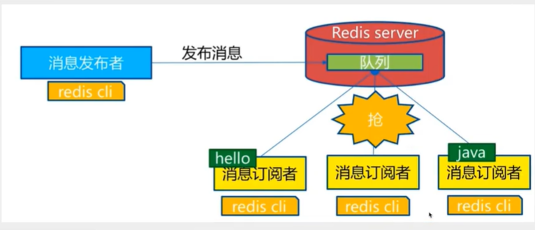

使用场景：

-   **实时消息系统**！
-   实时聊天（频道当作聊天室，将信息回显给所有人即可！）

## 8、主从复制

### **1、概念**

主从复制，是指将一台Redis服务器的数据，复制到其他的Redis服务器。前者称为主节点（master/leader），后者称为从节点（slave/follower）；数据的复制是**单向**的，只能由主节点到从节点。Master以写为主，Slave以读为主。

默认情况下，每台Redis服务器都是主节点；且一个主节点可以有多个从节点（或没有从节点），但一个从节点只能有一个主节点。

### 2、主从复制的作用

1.  **数据冗余**：主从复制实现了数据的热备份，是持久化之外的一种冗余方式 。
2.  **故障恢复**：当主节点出现问题时，可以由从节点提供服务，实现快速的故障恢复， 实 际上是一种服务的冗余 。
3.  **负载均衡**：在主从复制的基础上，配合读写分离，可以由主节点提供写服务，由从节点提**供读服务**（即写Redis数据时应用连接主节点，读Redis数据时应用连接从节点），分担服务器负载；尤其是在写少读多的场景下，通过多个从节点分担读负载，可以大大提高Redis服务器的并发量 。
4.  **高可用基石**：主从复制还是哨兵和集群能够实施的基础，因此说主从复制是Redis高可用的基础 。

### 3、场景架构

一般来说，要将Redis运用于工程项目中，只使用一台Redis是万万不能的（容易发生宕机），原因如下：

-   从结构上，单个Redis服务器会发生单点故障，并且一台服务器需要处理所有的请求负载，压力较大；
-   从容量上，单个Redis服务器内存容量有限，就算一台Redis服务器内存容量为256G，也不能将所有内存用作Redis存储内存，一般来说，单台Redis最大使用内存不应该超过20G。

    电商网站上的商品，一般都是一次上传，无数次浏览的，说专业点也就是‘多读少写’。

    对于这种场景，我们可以使用主一从三的架构。

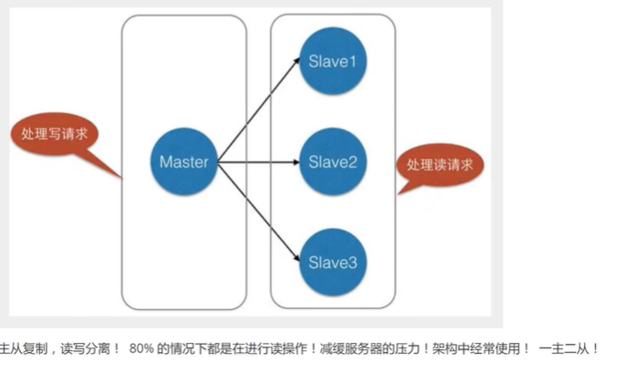

## 10、八股相关

### 1、Redis和mysql数据库有什么区别？

1）从类型上来说，mysql是关系型数据库，redis是缓存数据库。

2）mysql用于持久化的存储数据到硬盘，功能强大，但是速度较慢。redis用于存储使用较为频繁的数据到缓存中，读取速度快。

3）mysql和redis因为需求的不同，一般都是配合使用。

### 2、Redis和Mysql是如何保证数据一致性？

一般情况下，Redis是用来去实现应用和数据库直接读操作的一个缓存层，主要目的是减少数据库的操作，还可以提升数据的IO性能，（一般需要读取某个数据的时候，会先到Redis里面去加载，如果有该数据，就直接返回，否则才会去数据库中去查询，查询到数据之后，再把这个数据缓存到Redis中，）会出现一份数据同时保存在数据库和Redis中，当数据发生变化的时候，需要同时去更新Redis和Mysql，但是更新不同步，是由先后顺序的，并且Redis并不满足关系型数据库的ACID事务特性，所以就会出现数据一致性的问题。

以下几种解决方案：

1.  先更新数据库再更新缓存。

如果先更新数据库再更新缓存，那么如果缓存更新失败，就会导致数据库和Redis中的数据不一致。

1.  先删除缓存再更新数据库。

如果先删除缓存再更新数据库，理想情况下，应用下次访问Redis的时候，发现Redis里面的数据是空的，就从数据库里面加载，保存到Redis中，那么数据看起来是一致的。但是在**极端的情况下**，由于删除Redis和更新数据库，这两个操作并不是原子性的，所以这个过程中，如果有其它的进程来访问，还是会存在数据不一致的问题。

所以如果需要在极端情况下仍然保证redis和mysql的数据一致性，可以通过**读写锁**的方法保持一致。在数据更新的时候，其他任**何请求都无法访问缓存中的数据**，直到数据更新完毕，从而去保证这个数据的一致性，但是性能可能不会很好。

### 2、单线程的Redis为什么这么快？（Redis6.0引入了多线程）

1) 纯内存操作。把数据存在内存中，⽐硬盘数据库少了到磁盘中读取数据这⼀步。

2) 单线程操作，避免了线程的创建和频繁的上下⽂切换。

（这个对线程的上下⽂进⾏保存和恢复的过程就被称为上下⽂切换。）

3) 合理高效的数据结构

4) 采⽤非阻塞I/O多路复用机制

多路复⽤IO模型：

基本原理就是有个函数会不断地轮询所负责的所有socket，当某个socket有数据到达了，就通知⽤户进程。优势并不是对单个连接能处理得更快，⽽是在于能处理更多的连接。

I/O 多路复⽤程序负责监听多个套接字，通过分派器将产⽣了事件的套接字分派给不同的事件处理器。

Redis 的 I/O多路复⽤程序将所有产⽣事件的套接字都放到⼀个队列⾥⾯，然后通过这个队列，以有序、同步、每次⼀个套接字的⽅式向⽂件事件分派器传送套接字。）

**Redis6.0为什么引入多线程？**

因为Redis的瓶颈不在内存，而是在网络I/O模块带来的CPU的耗时，所以Redis6.0的多线程是用来处理网络I/O这部分，充分利用CPU资源，减少网络I/O阻塞带来的性能损耗。

### 3、主从复制过程

Redis有一个主服务器，有一个从服务器，把主服务器的数据传送到从服务器上，这就叫做主从同步。

发送三种数据：1）快照数据：主服务器同步之前存储的数据。

2）缓存区数据：同步的时候会建立一个缓存区，用来存储命令。

3）同步完成后的数据：同步完成后，主服务器存入的数据就一条一条发送到从服务器上，从服务器也相应的执行这些过程。

**步骤：**

1.  从服务器向主服务器发送一个同步的命令SYNC
2.  接收同步命令后，主服务器会开辟缓存区，记录bg_save命令，生成快照。并将快照文件发送到从服务器中。
3.  从服务器把旧数据丢掉，载入新的快照文件。
4.  主服务器发送缓存区和写命令，从服务器接收命令。
5.  每执行写命令，都会向从服务器发相同的写命令。
6.  从服务器执行主服务器发过来的缓存区的命令，接收每个主服务器发过来的命令。

### 4、Redis优点 ，缺点

1）读写性能好，读的速度可达110000次/s，写的速度可达81000次/s。

2）支持数据持久化：AOF和RDB两种持久化方式。

3）数据结构丰富：支持多种数据类型。

4）支持事务：Redis事务中所有的操作都是原子性的。

5）支持主从复制：主机可以自动将数据同步到从机，进行读写分离。

缺点：

1.  因为Redis是将数据存到内存中的，所以会受到内存大小的限制，不能用作海量数据的读写。
2.  Redis不具备**容错和恢复**功能，主机或从机宕机会导致前端部分读写请求失败，需要重启机器或者手动切换前端的IP才能切换。

### 5、缓存雪崩、缓存击穿、缓存穿透、缓存预热、缓存更新、缓存降级

**1）缓存雪崩（大面积的key同时失效）**

**在高并发情况下，大量缓存Key在同一时间失效，大量的请求落在了数据库上，对数据库和CPU造成了巨大的压力，造成数据库宕机。**

**解决⽅案:**

-   避免同时过期 ：设置过期时间时，附加⼀个随机数，避免⼤量的key同时过期
-   构建⾼可⽤的Redis ：部署多个Redis实例，个别节点宕机依然可以保持服务的整体可⽤。
-   构建多级缓存 ：增加本地缓存，在存储层前⾯多加⼀层屏障，降低请求直达存储层的⼏率
-   启⽤限流和降级措施 ：对存储层增加限流措施，当超出限制时，对其提供降级服务

2) 缓存击穿(某个热点数据突然失效)

**⼀份热点数据访问量⾮常⼤，在其缓存失效瞬间，⼤量请求直达存储层，导致服务器崩溃。**

**解决⽅案:**

-   **加互斥锁：对数据的访问加互斥锁，当⼀个线程访问该数据时，其他只能等待。 在这个线程访问过后，缓存**中的数据将被重建，届时其他线程就可以直接从缓存中取值。
-   永不过期 ：不设置过期时间

3) 缓存穿透 （redis中不存在这个缓存Key）

Redis缓存和数据库中没有这个数据，redis中没有这个数据那么就无法进行拦截，直接就会被穿透到数据库，但数据库也没有这个数据，做了两次无用的查询，如果这样的请求很多，那就会导致负载过大甚至宕机。

解决⽅案:

-   缓存空对象: 存储层未命中，仍将空值存⼊缓存(过期时间很短，最⻓不超过5min)，再次访问该数据时，缓存层会直接返回空值，⽽不会继续访问数据库
-   布隆过滤器(常⽤，Redis⾃带的过滤器): 布置在缓存前，将所有存在key提前存⼊布隆过滤器，在访问缓存层之前，先通过过滤器拦截，若请求的是不存在的 key，则直接返回空值，从⽽避免了对底层存储系统的查询压⼒。

4)缓存预热

系统上线后将相关的缓存直接加载到缓存系统。避免⽤户请求时，先查询数据库再将数据缓存的问题 .

解决⽅案:

-   写个缓存刷新⻚⾯，上线时⼿⼯操作⼀下
-   数据量不⼤可以在项⽬启动时⾃动加载
-   定时刷新缓存

5)缓存更新

除了缓存服务器⾃带的缓存失效策略外，常⻅的⾃定义缓存失效策略有两种

-   定期清理过期缓存 缺点:维护⼤量缓存的key很麻烦
-   有⽤户请求过来时，再判断该请求的缓存是否过期，过期就去底层数据库获得新数据并更新缓存。

每次⽤户请求都判断缓存失效逻辑复杂

6)缓存降级

⽬的是保证核⼼服务可⽤，即使是有损的。有些服务⽆法降级(⽐如加⼊购物⻋、结算等) 常⻅做法:Redis出现问题不去数据库查询，⽽是直接返回默认值给⽤户。

### 6、Redis的过期键的删除策略

Redis是key-value数据库，我们可以设置Redis中缓存的key的过期时间。Redis的过期策略就是指当Redis中缓存的Key过期了，Redis如何处理。

1.  **定期删除**(会漏掉⼀些过期key)

    每隔一定的时间，会扫描一定数量的数据库expires字典中一定数量的Key，并清除其中已经过期的key。该策略是一个折中方案。通过调整定时扫描的时间间隔和每次扫描的限定耗时，可以在不同情况下使CPU和内存资源达到最优的平衡结果。

    （expires字典中会保存所有设置了过期时间的key的过期时间数据，其中，key是指向键空间中的某个键的指针，value是该键的毫秒精度的时间戳表示过期时间。键空间是指该Redis集群中保存的所有键。）

2.  **惰性过期**

    **只有当访问一个key时，才会判断该key是否过期，过期则清除**。该策略可以最大化地节省CPU资源，却对内存非常不友好。**极端情况**下可能出现大量的过期key没有再次被访问，从而不会被清除，占用大量内存。因此衍生了**内存淘汰机制**。

内存淘汰

当Redis占⽤内存超出最⼤限制时，可采⽤内存淘汰策略让Redis淘汰⼀些数据、以腾出空间继续提供读写服务，⽐如选择最少使⽤(LRU算法)的key，选择剩余寿命最短的key，将其淘汰 。

### 8、什么时候不使⽤事务机制

多个系统set⼀个key时，不使⽤事务机制，因为⼀般都是redis集群环境，做了数据分⽚。⼀个事务中 涉及多个key时不保证这些key都在⼀个redis服务器上

-   如果这个key操作不要求顺序:分布式锁，⼤家抢锁，抢到就set
-   如果key操作要求顺序:分布式锁+时间戳 ，⽐如系统B抢到锁并且set操作key为valueB，然后系统

    A ⼜抢到锁，发现valueA的时间戳早于B，此时就没有set的必要了

-   利⽤队列

### 9、可以基于Redis实现分布式锁

1.  **什么时候使⽤分布式锁**

    修改时，经常需要先将数据读取到内存中，在分布式应⽤中，可能多个进程同时执⾏这样的操作，所以会产⽣冲突。增加分布式锁，可以解决这样的问题。

2.  **同步锁与分布式锁**

同步锁：**⼀个进程**，解决**多个线程**访问同⼀个数据的问题，在多个**线程**都能访问到的地⽅（如内存）做⼀个标记，标识该数据的访问权限

分布式锁：在**多个进程**都能访问到的地⽅做⼀个标记，标识该数据的访问权限。这样锁就不能放在内存中了，举个例⼦，把标识放⼤server1的内存中，server2访问不了server1的内存。 解决⽅案：可以把锁存到数据库表/ Redis/ zookeeper中

3）Redis实现分布式锁的原则

1.安全属性:独享。在任⼀时刻，只有⼀个客户端持有锁

2.活性A:⽆死锁。即便持有锁的客户端崩溃或者⽹络被分裂，锁仍然可以被获取

3.活性B:容错。只要⼤部分Redis节点都活着，客户端就可以获取和释放锁。

### 10、Redis什么时候需要序列化

把内存对象状态保存在Redis中需要序列化

⽤套接字在⽹络上传送对象时

实现RedisSerializer接⼝，设置Key和Value的序列化

## 9、哨兵模式

### 1、使用原因

主从切换技术的方法是：当主服务器宕机后，需要手动把一台服务器切换为主服务器，这就需要人工干预，费时费力，还会造成一段时间内服务不可用。这不是一种推荐方式，更多时候，我们优先考虑哨兵模式。Redis从2.8开始正式提供了Sentinel（哨兵）架构来解决这个问题。

### 2、介绍

哨兵模式是一种特殊的模式，首先Redis提供了哨兵的命令，哨兵是一个独立的进程，作为进程，它会独立运行。其原理是哨兵通过发送命令，等待Redis服务器响应，从而监控运行的多个Redis实例。基本模型如下：

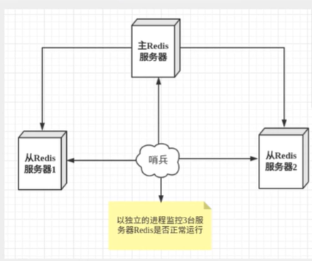

这里的哨兵有两个作用：

-   通过发送命令，让Redis服务器返回监控其运行状态，包括主服务器和从服务器。
-   当哨兵检测到master宕机，会自动将slave切换到master，然后通过**发布订阅模式**通知其他的从服务器，修改配置文件，让他们切换主机。

然而，一个哨兵进程对Redis服务器进行监控，可能会出现问题，为此，我们可以使用多个哨兵进行监控。各个哨兵之间还会进行监控，这样就形成了多哨兵模式。

# 九、Postman接口测试工具

## 1、Postman基础篇

接口测试工具原理：  
常用的接口测试工具有Postman、SoapUI、Swagger等

这些工具的原理都是通过模拟客户端请求，向彼测系统的接口发送请求，并获取返回结果进行验证。在测试过程中，可以设置请求参数、请求头、请求主体等，以及验证接口返回的状态码、响应时间、响应数据等，从而达到对接口的功能、性能、稳定性等方面的测试目的。具体来说，通过接口测试工具，我们可以:

(1)模拟不同的请求方式，包括GET

POST、PUT、DELETE等;

(2)设置请求参数、请求头、请求主体等，满足不同场景下的测试需要;

(3)对接口的返回结果进行断言验证，判断是否符合预期:

(4)执行脚本自动化测试，提高测试效率和准确性;

(5)生成测试报告，便于分析测试结果和问题排查。

### 1、接口测试灵魂拷问

#### 1、什么是接口？

软件中统称API，比如支付宝支付，微信提现和充值。（因为不是所有人都可以去调用接口，因此需要**鉴权码**：token、key、appkey）

接口包括：内部接口和外部接口。

内部接口：开发人员自己开发的对自身系统提供的接口。

外部接口：开发系统调用外部的，微信，支付宝，其他的接口。

**总结**：接口就是软件提供给外部的一种服务，用于做数据传输。

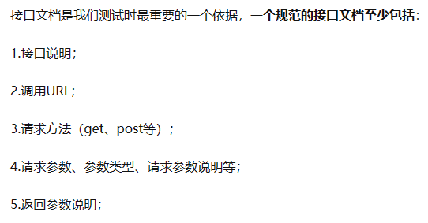

#### 2、软件为什么需要接口？

因为接口能够让内部的数据被外部进行修改。

#### 3、为什么要做接口测试？

1）现在很多的系统属于**前后端分离**，开发的进度是不一样的，针对这种情况，就需要把一开始开发出来的接口进行测试。

2）基于**安全考虑**，前端有验证很容易绕过，直接请求接口，不是很安全，比如：身份证信息，银行卡，金钱交易。

3）测试推崇的是**测试左移**，测试尽早的介入。

**接口测试的本质：就是测试接口能否正常的交互数据，权限控制以及异常场景。**

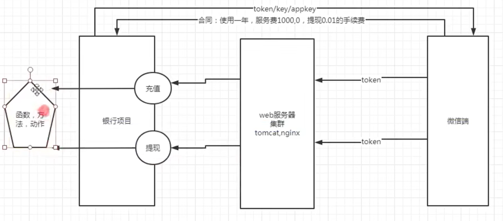

### 2、接口返回数据

#### 1、json格式(多)

三组数据：{error_code：0，msg：”提现成功”，data：[ ]}

error_code：错误码，0代表成功

msg：对错误码的中文说明

data：真正的返回数据

1.  json就是一种数据类型，整形，小数，字符串。
    1.  JSON由两组数据组成

        MAP对象：键值对，{key:value,key:value}

        数组：[value1,value2,value3]

#### 2、html格式

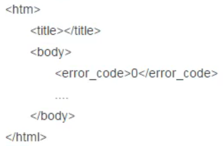

#### 3、xml格式

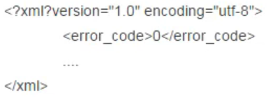

### 3、接口协议

#### 1、webservice协议

接口地址：<http://.................?wsdl>

变更restful规则：

Get获取数据，Post提交数据，Put修改数据，Delete修改数据

#### 2、dubbo协议（2015）

接口地址：dubbo://…………

适用于少量数据的传输，可以承载大并发，慢慢开始流行。

#### 3、http协议(主流)

接口地址：http(s)://........

### 4、接口测试的流程和方案

#### 1、流程

拿到接口api文档（通过抓包工具获取），熟悉接口业务，接口地址，鉴权方式，入参，出参，错误码。

#### 2、接口用例设计（思路）

1）正例：输入正常入参，接口能够成功返回数据。

2）反例：

1.  鉴权反例：鉴权码为空，鉴权码错误，鉴权码过期……
2.  参数反例：参数为空，参数类型异常，参数长度异常。
3.  错误码覆盖：根据业务而定。
4.  其他错误场景：接口黑名单，接口调用次数限制，分页场景。

3）设计完成后使用接口测试工具Postman执行接口测试。

4）Postman+Newman+Jenkins实现持续集成，并且输出测试报告。

### 5、接口测试工具以及Postman介绍

1、接口测试工具：Postman、Jmeter、apipost,fidder

2、Postman是一款功能强大的网页调试与发送HTTP请求的Chrome插件，专为接口而生。

## 2、如何使用postman做接口测试？

一般做法是对照接口文档去设置请求方法，设置URL，设置请求头，设置请求体，一般请求体的数据类型是根据公司的开发部门去规定的，像请求体的内容可以是json这种数据类型，也可以是form表单，这个是要根据公司的具体规定，然后去设置。

打开Postman-\>添加一个collection集合-\>在collection里添加请求-\>设置请求方法-\>设置URL-\>构造请求数据-\>发送请求-\>查看结果。

一般有的接口需要在登录后拿到token或者cookie，才能做后续的一些操作，那我们可以在页面登录后，用F12查看一下请求，看请求头中的cookie复制到postman中即可。

# 十、JMeter性能测试工具

JMeter主要用于**服务端系统**的性能测试。比如浏览web网站、API服务器的性能。

# 十一、Web自动化测试工具

## 1、Web自动化测试需求和挑战

-   属于E2E测试，是软件质量保证的最后一道防线。
-   点点点：低调，复杂的场合无法测试。
-   好的测试，不仅仅模拟用户行为，还要记录、调试网页的细节
-   优势：
-   提速增效
-   解放双手
-   技能提示
-   目前主流工具：Cypress、Playwright、**Selenium**

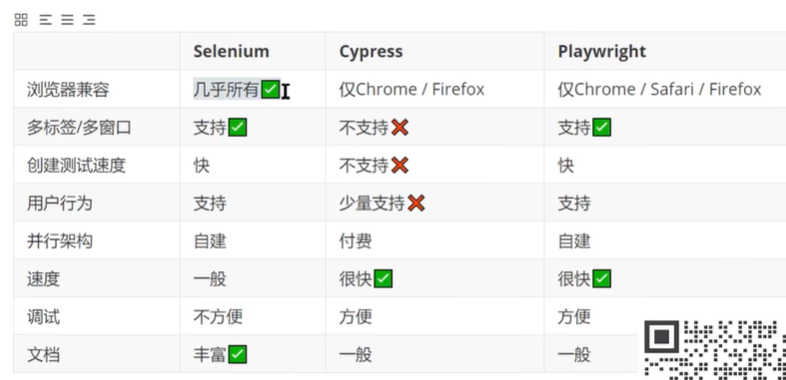

**Selenium优势：**浏览器支持最多，兼容最好；支持多种编程语言；生态成熟、文档最多；进行app自动化测试。

## 2、Selenium环境搭建

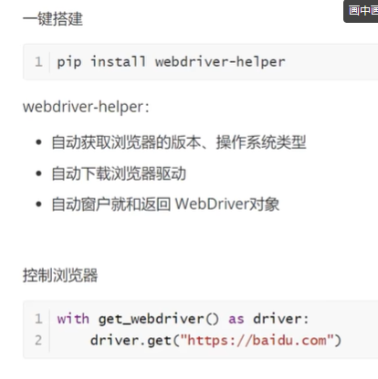

## 3、Selenium基础

### 1、Web自动化测试三板斧

定位元素、交互元素、进行断言。

### 2、八大定位策略

ID、name、css、xpath、classname、tag_name、linx_text

由selenium提供的定位策略，共有8个，可以分为**三组**。

使用定位策略：

-   Driver.find_element_by_id( ) \#被弃用
-   Driver.find_element(By.ID,” ”) \#推荐
-   如果要定位一组多个元素，elenment加s

#### 1、分组1

根据**文本**定位a标签：LINK_TEXT 精确定位、PARTIAL_LINK_TEXT 模糊定位

#### 2、分组2

根据**属性**定位任意元素ID、NAME、CLASS_NAME、TAG_NAME

#### 3、分组3

**通用**定位策略：CSS、XPath，可以定位到任意的元素

-   Css弊端：实际上分组二底层是通过css来完成定位的；css表达的语法不够直观；且**只能用于Web自动化测试**。
-   **XPath：**
-   XPath是一种查询语言
-   支持逻辑预算、函数
-   实现非常强大的功能
-   可以用于App自动化测试
1.  **XPath语法**：表示层级+属性
-   /（开头）表示根路径
-   // 表示任意层级（包括下级、下级的下级）
-   @ 表示属性
-   /（中间）表示下一级
-   . 表示本级
-   .. 表示上一级
1.  **XPath函数**

    常用的定位函数：

    text 获取元素内的文本、contains 任意位置包含、starts-with 以指定字符开头

### 3、Pytest

传统的selenium暴露的问题：

大量重复代码、sleep等待、每次执行用例需要重新登录

因此引入Pytest框架解决这个问题。

#### 1、安装Pytest

Pip install pytest

#### 2、使用Pytest

约定：测试用例相关的内容，以test开头来命名

#### 3、pytest的夹具

**夹具**：在测试用例前、或者后自动的执行一些代码。比如，如果测试用例需要已登录的状态，但是“登录“不是当前的用例测试步骤，那么可以将登录前置到夹具中。

如何使用夹具：

1）定义夹具

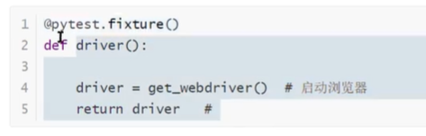

2）使用夹具

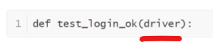

#### 4、Pytest重点

1）夹具的前置和后置

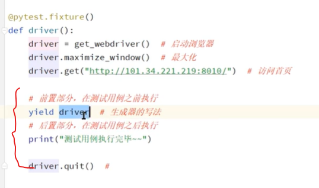

浏览器启动的次数 = 测试用例的个数，那如何避免，重复启动浏览器（每一次启动大概耗时3秒）

2）夹具fixture的范围

Pytest夹具有5种范围：

-   Function：默认，每个用例支持一次
-   Class：每个类执行一次
-   Module：每个文件执行一次
-   Package：每个包执行一次
-   Session：整个测试过程只执行一次

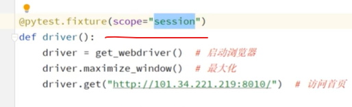

### 4、三种等待方式

#### 1、强制等待

-   即强制线程休眠一定时间，适合脚本调试时使用。
-   常用方法：Thread.sleep(long millis)
-   优点：适合脚本调试时使用。
-   缺点：不能准确把握需要等待的时间，如果用例中大量使用，会浪费不必要的等待时间，影响用例的执行效率。
-   操作未完成，等待结束，导致系统报错。
-   操作完成，时间未到，导致浪费时间。

#### 2、隐式等待

-   即设置一个最长等待时间，轮询查看页面是否加载完成（默认是0.5秒），如果超过最长等待时间页面未加载完成则抛出异常。
-   常用方法：driver.manage( ).timeouts( ).implicitlyWait(Duration duration)
-   优点：隐式等待对整个WebDriver生命周期都起作用，在开始时设置一次即可。
-   缺点：使用隐式等待，程序会一直等待页面加载完成，才会执行下一步操作（有时候页面想要的元素早已加载完成了，但是页面上个别元素还没有加载完成，仍要等待页面全部加载完成才能执行下一步，使用也不是很灵活）。

#### 3、显示等待

-   即定义等待条件，当条件发生时才执行后续代码。程序会轮询查看条件是否发生（默认0.5秒），如果条件成立则执行下一步，否则继续等待，直到超过设置的最长时间，程序抛出异常。
-   常用方法：FluentWait流畅等待、WebDriverWait
-   优点：等待判断准确，不会浪费多余的等待时间，在用例中使用，可以提高执行效率。
-   缺点：使用相对比较复杂；和强制等待类似，每一行等待只执行一次，如果要进行多个元素的等待，则需要多次写入。

#### 4、显示等待和隐式等待的区别

显示等待是单独针对某个元素，设置一个等待时间如5秒，每隔0.5秒检查一次是否出现，如果在5秒之前任何时候出现，则继续向下，超过5秒尚未出现则抛异常。显示等待与隐式等待相对，显示等待必须在每个需要等待的元素前面进行声明。相当于sleep()

使用场景：当打开一个新页面，执行第一个元素操作的时候；当某一步操作会引发页面的加载，并且加载的内容包含了下一步需要操作的元素。一句话，就是当某个元素有加载过程的时候，就需要加上显示等待。

隐式等待是全局的是针对所有元素，设置等待时间如10秒，如果10秒内出现，则继续向下，否则抛异常。可以理解为在10秒以内，不停刷新看元素是否加载出来。

使用场景：隐式等待只需要声明一次，一般在打开浏览器后进行声明。声明之后对整个drvier的生命周期都有效，后面不用重复声明。隐式等待存在一个问题，那就是程序会一直等待整个页面加载完成，也就是一般情况下你看到浏览器标签栏那个小圈不再转，才会执行下一步，但有时候页面想要的元素早就在加载完成了，但是因为个别js之类的东西特别慢，仍得等到页面全部完成才能执行下一步。

### 5、如果页面响应时间过长，应该如何处理

WebDriverWait(browser,20).until(EC.presence_of_element_located((By.ID,'errorTryAgain'))) WebDriverWait类是由WebDirver 提供的等待方法。在设置时间内，默认每隔一段时间检测一次当前页面元素是否存在，如果超过设置时间检测不到则抛出异常。

### 6、Iframe的切换是怎么实现的

首先采取id和name去定位iframe。

如果frame并无这两项属性，则可以用index和WebElement来定位：

1.index从0开始，传入整型参数即判定为用index定位，传入str参数则判定为用id/name定位

2.WebElement对象，即用find_element系列方法所取得的对象，我们可以用tag_name、css_selector、xpath等来定位frame对象

from selenium import webdriver

driver = webdriver.Chrome('D:\\chromedriver\\chromedriver.exe') \# 括号内是浏览器驱动地址

driver.switch_to.frame(0) \# 1.用frame的index来定位，第一个是0

driver.switch_to.frame("frame1") \# 2.用id来定位

driver.switch_to.frame("myframe") \# 3.用name来定位

driver.switch_to.frame(driver.find_element_by_tag_name("iframe")) \# 4.用WebElement对象来定位

### 7、如何选择下拉菜单的元素

答：下拉框的主要是调用Select类，下面是使用步骤：

1导包 Select类 --\> from selenium.webdriver.support.select import Select

2实例化Select类 select=Select(WebElemet)

(WebElement):driver.find_element_by_css_selector(’\#nr’)

3调用方法：select.select_by_index(index)

(index：为列表索引，从0开始)

关于select的方法有以下三种

select_by_index() --\> 根据option索引来定位，从0开始

select_by_value() --\> 根据option属性 value值来定位

select_by_visible_text() --\> 根据option显示文本来定位

例：

\#选择下拉框

select = driver.find_element_by_name("form:j_idt163")

\# 获取select里面的option标签，注意使用find_elements

options_list = select.find_elements_by_tag_name('option')

\# 遍历option

for option in options_list:

\#获取下拉框的value和text

print ("Value is:%s Text is:%s" %(option.get_attribute("value"),option.text))

# 十二、JVM

## 1、JVM内存模型（运⾏时数据区）

线程私有区（程序计数器、本地⽅法栈、栈） 线程共享区（栈、⽅法区）

1.  **程序计数器**：保存着当前线程执⾏的字节码位置,JVM⽀持多个线程同时运⾏，每个线程⼯作时都有独⽴的程序计数器,只为执⾏Java⽅法服务,执⾏ Native⽅法时,程序计数器为空. 是内存区域中唯⼀不会产⽣内存溢出的地⽅。
2.  **Java虚拟机栈：**Java中的⽅法被执⾏时会形成栈帧，放⼊到栈内存中，⽅法执⾏完，栈帧弹出栈内存。栈帧⼜细分为局部变量表、操作数栈、⽅法出⼝等内存虚拟
3.  **本地⽅法栈：**是执⾏Native⽅法时使⽤本地⽅法栈，与Java虚拟机栈类似，也是⽤来保存执⾏⽅法的信息。
4.  **⽅法区：** 存储了已被虚拟机加载的类信息、常量、静态变量。1.8以后是元数据区。
5.  **堆内存：**是内存管理⼤的⼀块，存放所有对象实例的地⽅，当堆没有可⽤空间时会抛出内存溢出（OOM）异常。根据对象的存活周期不同，JVM把对象进⾏分代管理，由垃圾回收器进⾏垃圾的回收管理，所以堆内存是垃圾回收的主要区域。

    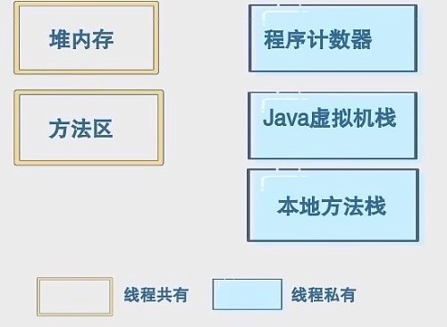

除此以外还有直接内存，直接内存不属于JVM的范畴，是堆外内存

## 2、JVM内存分配与回收策略


**new出来的对象都放在堆内存中，堆内存划分为⽼年代、年轻代 。**

1）⼤多数情况下对象优先在Eden区分配，如果Eden区没有⾜够的空间时，虚拟机执⾏⼀次Minor GC。

Minor GC/Young GC：指发⽣在新⽣代的垃圾收集动作，Minor GC⾮常频繁并且回收速度快

Full GC：⼀般回收⽼年代、年轻代、⽅法区的垃圾，回收速度⽐Minor GC慢⼗倍以上 2）⼤对象直接进⼊⽼年代（⼤对象是指需要⼤量连续内存空间的对象，⽐如字符串、数组）。这样做的⽬的是避免在 Eden区和两个Survivor区之间发⽣⼤量的内存拷⻉(新⽣代采⽤复制算法收集内存)。

1.  ⻓期存活的对象进⼊⽼年代。虚拟机为每个对象定义了⼀个年龄计数器，如果对象经过了1次 Minor GC那么对象会进⼊Survivor区，之后每经过⼀次Minor GC那么对象的年龄加1，知道达到阀值对象进⼊⽼年区。
2.  动态判断对象的年龄。如果Survivor区中相同年龄的所有对象⼤⼩的总和⼤于Survivor空间的⼀ 半，年龄⼤于或等于该年龄的对象可以直接进⼊⽼年代。（此规则是希望可能⻓期存活的对象，尽早进⼊⽼年代。对象动态年龄判断机制⼀般是在minor GC之后触发的。）
3.  空间分配担保。每次进⾏Minor GC时，JVM会计算Survivor区移⾄⽼年区的对象的平均⼤⼩，如 果这个值⼤于⽼年区的剩余值⼤⼩则进⾏⼀次Full GC，如果⼩于检查参数HandlePromotionFailure设置，如果true则只进⾏Monitor GC,如果false则进⾏Full GC。

    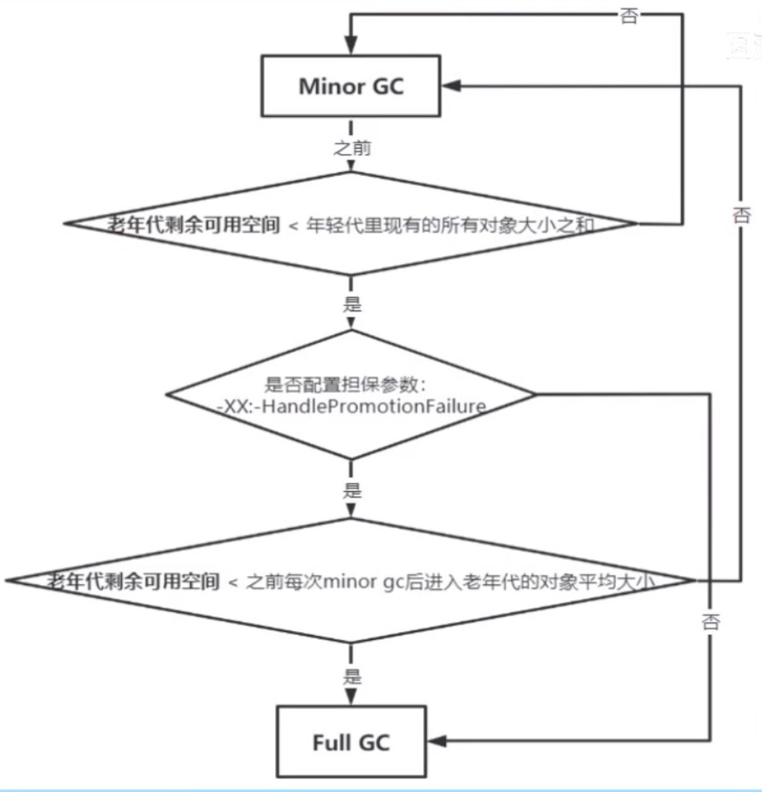

## 3、JVM如何判断对象可以被回收

1.  **引⽤计数法**每个对象有⼀个引⽤属性，即增加⼀个计数，新增⼀个引⽤时加⼀，引⽤释放时减⼀。垃圾回收时，只需要收集计数为0的对象。 缺点：⽆法处理循环引⽤的问题。A依赖B，B依赖A
2.  **根可达性分析法**以⼀系列可以作为GcRoot的对象为起始点，从这些节点开始向下搜索。搜索所⾛过的路经被称为引⽤链，当⼀个对象到GcRoot节点没有任何引⽤链相连时，则证明此对象是可以被回收的。

**GcRoot类型**：虚拟机栈引⽤对象、本地⽅法栈引⽤对象、静态属性引⽤对象、常量引⽤对象 **不同引⽤类型的回收机制是不⼀样的，四种对象引⽤类型：（强软弱虚）**

• 强引⽤：通过关键字new的对象就是强引⽤对象，不会被回收

• 软引⽤：通过SoftReference持有，JVM堆空间不⾜时才会被回收

• 弱引⽤：通过WeakReference持有，GC时，只要发现弱引⽤对象就会被回收

• 虚引⽤：随时可以被回收（⽤来跟踪对象，必须通过ReferenceQ引⽤）

对象怎样起死回⽣：当对象A被标记为不可达，⾸先进⾏筛选，看有没有覆盖finalize()⽅法，并且 finalize()⽅法没有被调⽤过，放到F-Queue中，JVM会启动进程进⾏重新标记。

## 4、为什么要垃圾回收？

内存空间是有限的，你创建的每个对象和变量都会占据内存，GC做的就是对象清除将内存释放出来。

## 5、四种垃圾回收算法

1.  标记-清除算法

⾸先标记出所有需要回收的对象，标记完成后统⼀回收，这种⽅式会产⽣⼤量不连续的内存碎⽚，当有

⼤对象需要分配连续的空间时，有可能会触发再次垃圾回收

1.  标记-整理算法

⾸先标记出所有需要回收的对象，标记完成后统⼀回收，回收后集中整理内存区域，避免产⽣⼤量内存碎⽚，但效率低。

1.  复制算法

将可⽤内存按容量划分为⼤⼩相等的两块，每次只使⽤其中的⼀块。当这⼀块的内存⽤完了，就将还存活着的对象复制到另外⼀块上⾯，然后再把已 使⽤过的内存空间⼀次清理掉。 优点：效率⾼，没碎⽚，适合短寿命的内存区域 缺点：内存利⽤率低，且不适合在对象存活率⾼的⽼年代使⽤

1.  分代回收算法（常⽤的垃圾回收器⼀般都采⽤分代收集算法） 把Java堆分为新⽣代和⽼年代，这样就可以根据各个年代的特点采⽤ 适当的收集算法。 新⽣代使⽤复制算法，将新⽣代内存空间分为8:1:1的三部分

⽼年代/元数据区使⽤标记-清除或者标记-整理算法

## 6、JVM垃圾回收器

回收算法是内存回收的⽅法论，垃圾收集器就是内存回收的具体实现

7种作⽤于不同分代的收集器，如果两个收集器之间存在连线，就说明可以搭配使⽤。

**1）Serial单线程收集器**

单线程意味着只使⽤⼀个CPU或⼀条线程完成垃圾回收⼯作，也意味着进⾏垃圾回收时必须暂停其他线程的所有⼯作（stop the word），直到收集结束为⽌。 新⽣代采⽤复制算法，⽼年代采⽤标记整理算法

优点：简单⾼效，没有线程交替的开销

**Serial Old收集器**

新⽣代采⽤复制算法，暂停所有⽤户进程；⽼年代采⽤标记整理算法，暂停所有⽤户线程。 ⽤途：（1）jdk1.5以前和parallel scavenge收集器搭配使⽤ （2）作为CMS收集器的后备⽅案

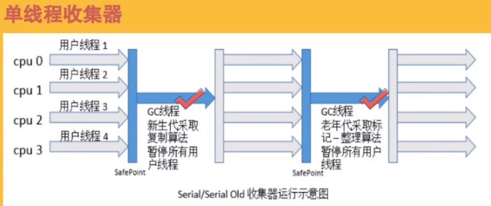

2）ParNew收集器

Serial收集器的多线程版本，除了使⽤多线程并⾏垃圾回收外，其余⾏为（控制参数、收集算法、回收策略）和Serial收集器完全⼀样，默认收集线程数和CPU核数相同，可以⽤参数指定（不推荐修改） 是运⾏在Server模式下的虚拟机的⾸要选择，除了Serial收集器，只有他能与CMS收集器配合⼯作。

Parallel Scavenge收集器

类似ParNew收集器，是Server模式下的默认收集器，

收集算法：新⽣代采⽤复制算法，⽼年代采⽤标记整理算法。 特点：吞吐量（⾼效率的运⽤CPU）

吞吐量=运⾏⽤户代码时间/CPU总消耗时间（ CPU总消耗时间=运⾏⽤户代码时间+垃圾回收时间） 提供了很多参数供⽤户找到 合适的停顿时间和 ⼤吞吐量

**3）CMS收集器（Concurrent Mark Sweep）**

以获取 短回收停顿时间为⽬标的收集器，是基于标记-清除算法实现的，是⼀种⽼年代收集器，通常与ParNew⼀起使⽤。是HotSpot虚拟机第⼀款真正意义上的并发收集器。

**CMS垃圾回收过程：**

• 初始标记：暂停所有其他线程并标记GCRoot能直接关联到的对象

-   **并发标记：**同时开启GC和⽤户线程，⽤⼀个闭包结构去记录可达对象，在这个阶段结束这个闭包结构不能保证包含当前所有可达对象，因为⽤户线程可能会不断更新引⽤域，所以GC线程不能保证可达性分析的实时性，所以算法中会跟踪记录发⽣引⽤更新的地⽅。
-   并发标记过程占⽤整个GC70%-80%的时间
-   **重新标记：**修正并发标记期间因⽤户程序继续运作⽽导致标记产⽣变动的那⼀部分对象的标记记录
-   **并发清除：**开启⽤户线程，同时GC线程开始对未标记的区域做清扫

**CMS收集器优缺点：优点：**并发收集，低停顿 **缺点：**1）对CPU资源敏感 2）⽆法处理浮动垃圾3）使⽤标记清除算法会导致⼤量空间碎⽚产⽣

4）执⾏过程中的不确定性，会存在上次垃圾回收还没执⾏完，然后⼜出发垃圾回收的情况。（特别是在并发标记和并发清理阶段）

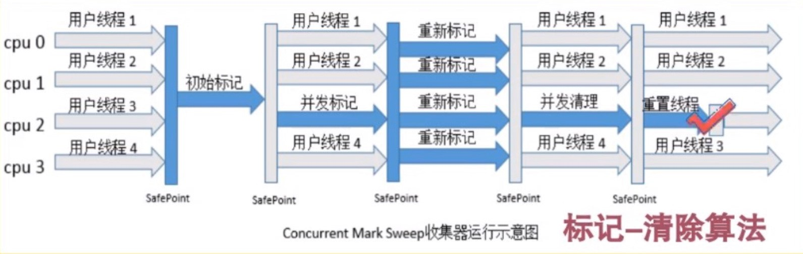

4）G1（Garbage-First）收集器

是⼀款⾯向服务器的垃圾收集器，主要针对配备多处理器以及⼤容量内存的机器 ，⾼概率满⾜GC停顿时间要求的同时，还具备⾼吞吐量性能特征 基本特性

-   G1将堆划分为若⼲⼤⼩相等的独⽴区域（JVM多可以有2048个区域，区域⼤⼩等于堆⼤⼩除以

    2048）

-   G1保留了年轻代和⽼年代的概念，但不再是物理隔阂了，它们都是区域（可以不连续）的集合
-   默认年轻代对堆内存占⽐是5%
-   Regin的区域功能可能会是动态变化的，⼀个区域可能之前是年轻代，垃圾回收之后变成⽼年代
-   G1有专⻔分配⼤对象的区域叫HUmongous区，在G1中超过了⼀个区域⼤⼩的50%的对象就判定为

    ⼀个⼤对象

    

**G1垃圾回收过程**

• **初始标记：**暂停所有其他线程并标记GCRoot能直接关联到的对象 • **并发标记：**⽤⼀个闭包结构记录可达对象；跟踪记录发⽣引⽤更新的地⽅ • **最终标记：**修正并发标记期间因程序继续运作⽽导致标记产⽣变动的那⼀部分对象的标记记录

• **筛选回收：**⾸先对各个区域的回收价值和成本进⾏排序，根据⽤户所期望的GC停顿时间来制定回收计划。

## 7、内存泄漏

指程序中已经动态分配的堆内存由于某种原因未释放或者⽆法释放，造成系统内存的浪费，导致程序运

⾏速度减慢甚⾄系统崩溃等后果。

## 8、内存溢出

系统会给每个APP分配内存，当APP所需要的内存⼤于系统分配的内存，就会造成溢出。
