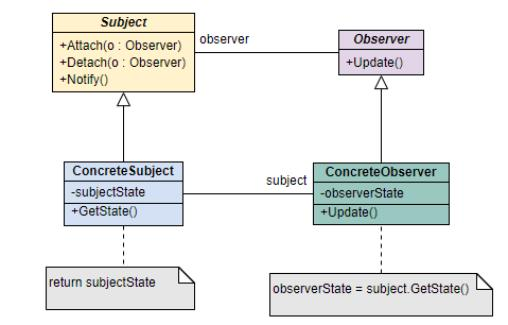

# 设计模式

## **软件设计原则有哪些？**

常用的面向对象设计原则包括7个，这些原则并不是孤立存在的，它们相互

依赖，相互补充。

 开闭原则（Open Closed Principle， OCP）

 单一职责原则（Single Responsibility Principle, SRP）

· 里氏替换原则（Liskov Substitution Principle， LSP）

 依赖倒置原则（Dependency Inversion Principle， DIP）

 接口隔离原则（Interface Segregation Principle， ISP）

 合成/聚合复用原则（Composite/Aggregate Reuse Principle， C/ARP）

 最少知识原则（Least Knowledge Principle， LKP）或者迪米特法则 （Law of Demeter， LOD）

| **设计原则名称**  | **简单定义**                                     |
|-------------------|--------------------------------------------------|
| 开闭原则          | 对扩展开放，对修改关闭                           |
| 单一职责原则      | 一个类只负责一个功能领域中的相应职责             |
| 里氏替换原则      | 所有引用基类的地方必须能透明地使用其子类的对象   |
| 依赖倒置原则      | 依赖于抽象，不能依赖于具体实现                   |
| 接口隔离原则      | 类之间的依赖关系应该建立在最小的接口上           |
| 合成/聚合复用原则 | 尽量使用合成/聚合，而不是通过继承达到复用的目的  |
| 迪米特法则        | 一个软件实体应当尽可能少的与其他实体发生相互作用 |

## **什么是设计模式？**

设计模式（Design pattern）代表了最佳的实践，通常被有经验的面向对象 的软件开发人员所采用。设计模式是软件开发人员在软件开发过程中面临 的一般问题的解决方案。这些解决方案是众多软件开发人员经过相当长的一段时间的试验和错误总结出来的。

设计模式是一套被反复使用的、多数人知晓的、经过分类编目的、代码设计经验的总结。使用设计模式是为了重用代码、让代码更容易被他人理解、保证代码可靠性。 毫无疑问，设计模式于己于他人于系统都是多赢 的，设计模式使代码编制真正工程化，设计模式是软件工程的基石，如同 大厦的一块块砖石一样。项目中合理地运用设计模式可以完美地解决很多问题，每种模式在现实中都有相应的原理来与之对应，每种模式都描述了一个在我们周围不断重复发生的问题，以及该问题的核心解决方案，这也是设计模式能被广泛应用的原因。

## **设计模式的分类了解吗?**

 **创建型：** 在创建对象的同时隐藏创建逻辑，不使用 new 直接实例化对 象，程序在判断需要创建哪些对象时更灵活。包括工厂/抽象工厂/单例/

建造者/原型模式。

 **结构型：** 通过类和接口间的继承和引用实现创建复杂结构的对象。包

括适配器/桥接模式/过滤器/组合/装饰器/外观/享元/代理模式。

 **行为型：** 通过类之间不同通信方式实现不同行为。包括责任链/命名/解

释器/迭代器/中介者/备忘录/观察者/状态/策略/模板/访问者模式。

## **你知道哪些设计模式？**

## **工厂模式**

**说一说简单工厂模式**

简单工厂模式指由—个工厂对象来创建实例，客户端不需要关注创建逻辑，只需提供传入工厂的参数。

UML 类图如下：

适用于工厂类负责创建对象较少的情况，缺点是如果要增加新产品，就需 要修改工厂类的判断逻辑，违背开闭原则，且产品多的话会使工厂类比较复杂。

Calendar 抽象类的 getInstance 方法，调用 createCalendar 方法根据不同的地区参数创建不同的日历对象。

Spring 中的 BeanFactory 使用简单工厂模式，根据传入—个唯—的标识来获得 Bean 对象。

**工厂方法模式了解吗？**

和简单工厂模式中工厂负责生产所有产品相比，工厂方法模式将生成具体产品的任务分发给具体的产品工厂。

UML 类图如下：

也就是定义—个抽象工厂，其定义了产品的生产接口，但不负责具体的产 品，将生产任务交给不同的派生类工厂。这样不用通过指定类型来创建对象了。

**抽象工厂模式了解吗？**

简单工厂模式和工厂方法模式不管工厂怎么拆分抽象，都只是针对—类产品，如果要生成另—种产品，就比较难办了！

抽象工厂模式通过在 AbstarctFactory 中增加创建产品的接口，并在具体子 工厂中实现新加产品的创建，当然前提是子工厂支持生产该产品。否则继承的这个接口可以什么也不干。

UML 类图如下：

从上面类图结构中可以清楚的看到如何在工厂方法模式中通过增加新产品接口来实现产品的增加的。

## **单例模式**

### **什么是单例模式？单例模式的特点是什么？**

单例模式属于创建型模式，一个单例类在任何情况下都只存在一个实例， 构造方法必须是私有的、由自己创建一个静态变量存储实例，对外提供一

个静态公有方法获取实例。

优点是内存中只有一个实例，减少了开销，尤其是频繁创建和销毁实例的 情况下并且可以避免对资源的多重占用。缺点是没有抽象层，难以扩展，

与单一职责原则冲突。

**单例模式的常见写法有哪些？**

**饿汉式，线程安全**

饿汉式单例模式，顾名思义，类一加载就创建对象，这种方式比较常用，

但容易产生垃圾对象，浪费内存空间。

优点：线程安全，没有加锁，执行效率较高

缺点：不是懒加载，类加载时就初始化，浪费内存空间

| 懒加载 （lazy loading）：使用的时候再创建对象 |
|-----------------------------------------------|

饿汉式单例是如何保证线程安全的呢？它是基于类加载机制避免了多线程

的同步问题，但是如果类被不同的类加载器加载就会创建不同的实例。

**懒汉式，线程不安全**

这种方式在单线程下使用没有问题，对于多线程是无法保证单例的，这里

列出来是为了和后面使用锁保证线程安全的单例做对比。

优点：懒加载

缺点：线程不安全

**懒汉式，线程安全**

懒汉式单例如何保证线程安全呢？通过 synchronized 关键字加锁保证线程 安全， synchronized 可以添加在方法上面，也可以添加在代码块上面，这 里演示添加在方法上面，存在的问题是 每⼀次调⽤ getInstance 获取实例时

都需要加锁和释放锁，这样是非常影响性能的。

优点：懒加载，线程安全

缺点：效率较低

代码实现如下：

**双重检查锁（DCL， 即 double-checked locking）**

实现代码如下：

优点：懒加载，线程安全，效率较高

缺点：实现较复杂

这里的双重检查是指两次非空判断，锁指的是 synchronized 加锁，为什么 要进行双重判断，其实很简单，第一重判断，如果实例已经存在，那么就 不再需要进行同步操作，而是直接返回这个实例，如果没有创建，才会进 入同步块，同步块的目的与之前相同，目的是为了防止有多个线程同时调 用时，导致生成多个实例，有了同步块，每次只能有一个线程调用访问同

步块内容，当第一个抢到锁的调用获取了实例之后，这个实例就会被创

建，之后的所有调用都不会进入同步块，直接在第一重判断就返回了单

例。

关于内部的第二重空判断的作用，当多个线程一起到达锁位置时，进行锁 竞争，其中一个线程获取锁，如果是第一次进入则为 null，会进行单例对 象的创建，完成后释放锁，其他线程获取锁后就会被空判断拦截，直接返

回已创建的单例对象。

其中最关键的一个点就是 volatile 关键字的使用，关于 volatile 的详细介 绍可以直接搜索 volatile 关键字即可，有很多写的非常好的文章，这里不做

详细介绍，简单说明一下，双重检查锁中使用 volatile 的两个重要特性：

**可见性、禁止指令重排序**

这里为什么要使用 volatile ？

这是因为 new 关键字创建对象不是原子操作，创建一个对象会经历下面

的步骤：

1\. 在堆内存开辟内存空间

2\. 调用构造方法，初始化对象

3\. 引用变量指向堆内存空间

对应字节码指令如下：

为了提高性能，编译器和处理器常常会对既定的代码执行顺序进行指令重

排序，从源码到最终执行指令会经历如下流程：

源码编译器优化重排序指令级并行重排序内存系统重排序最终执行指令序

列

所以经过指令重排序之后，创建对象的执行顺序可能为 1 2 3 或者 1 3

2 ，因此当某个线程在乱序运行 1 3 2 指令的时候，引用变量指向堆内存 空间，这个对象不为 null，但是没有初始化，其他线程有可能这个时候进 入了 getInstance 的第一个 if(instance == null) 判断不为 nulll ，导致错误使 用了没有初始化的非 null 实例，这样的话就会出现异常，这个就是著名的

DCL 失效问题。

当我们在引用变量上面添加 volatile 关键字以后，会通过在创建对象指令

的前后添加内存屏障来禁止指令重排序，就可以避免这个问题，而且对

volatile 修饰的变量的修改对其他任何线程都是可见的。

**静态内部类**

代码实现如下：

优点：懒加载，线程安全，效率较高，实现简单

静态内部类单例是如何实现懒加载的呢？首先，我们先了解下类的加载时

机。

虚拟机规范要求有且只有 5 种情况必须立即对类进行初始化（加载、验

证、准备需要在此之前开始）：

1\. **遇到  new 、 getstatic 、 putstatic 、 invokestatic  这 4 条字节码指令 时。生成这 4 条指令最常见的 Java 代码场景是：使用  new  关键字实**

**例化对象的时候、读取或设置一个类的静态字段（final 修饰除外，被**

**final 修饰的静态字段是常量，已在编译期把结果放入常量池）的时**

**候，以及调用一个类的静态方法的时候。**

2\. **使用  java.lang.reflect  包方法对类进行反射调用的时候。**

3\. **当初始化一个类的时候，如果发现其父类还没有进行过初始化，则需要**

**先触发其父类的初始化。**

4\. **当虚拟机启动时，用户需要指定一个要执行的主类（包含 main()的那 个类），虚拟机会先初始化这个主类。**

5\. **当使用 JDK 1.7 的动态语言支持时，如果一个**

**java.lang.invoke.MethodHandle 实例最后的解析结果是**

**REF_getStatic 、 REF_putStatic 、 REF_invokeStatic  的方法句柄，则需**

**要先触发这个方法句柄所对应的类的初始化。**

这 5 种情况被称为是类的主动引用，注意，这里《虚拟机规范》中使用的 限定词是 "**有且仅有**" ，那么，除此之外的所有引用类都不会对类进行初始

化，称为被动引用。静态内部类就属于被动引用的情况。

当 getInstance()方法被调用时， InnerClass 才在 Singleton 的运行时常量 池里，把符号引用替换为直接引用，这时静态对象 INSTANCE 也真正被创

建，然后再被 getInstance()方法返回出去，这点同饿汉模式。

那么 INSTANCE 在创建过程中又是如何保证线程安全的呢？在《深入理

解 JAVA 虚拟机》中，有这么一句话:

虚拟机会保证一个类的 \<clinit\>() 方法在多线程环境中被正确地加锁、同 步，如果多个线程同时去初始化一个类，那么只会有一个线程去执行这个

类的 \<clinit\>() 方法，其他线程都需要阻塞等待，直到活动线程执行

\<clinit\>() 方法完毕。如果在一个类的 \<clinit\>() 方法中有耗时很长的操

作，就可能造成多个进程阻塞(**需要注意的是，其他线程虽然会被阻塞，但 如果执行 \<clinit\>() 方法后，其他线程唤醒之后不会再次进入 \<clinit\>() ⽅ 法。同一个加载器下，一个类型只会初始化一次。** )，在实际应用中，这种

阻塞往往是很隐蔽的。

从上面的分析可以看出 INSTANCE 在创建过程中是线程安全的，所以说静 态内部类形式的单例可保证线程安全，也能保证单例的唯一性，同时也延

迟了单例的实例化。

**枚举单例**

代码实现如下：

优点：简单，高效，线程安全，可以避免通过反射破坏枚举单例

枚举在 java 中与普通类一样，都能拥有字段与方法，而且枚举实例创建是 线程安全的，在任何情况下，它都是一个单例，可以直接通过如下方式调

用获取实例：

使用下面的命令反编译枚举类

得到如下内容

从枚举的反编译结果可以看到， INSTANCE 被 static final 修饰，所以可以 通过类名直接调用， **并且创建对象的实例是在静态代码块中创建的**，因为 static 类型的属性会在类被加载之后被初始化，当一个 Java 类第一次被真 正使用到的时候静态资源被初始化、 Java 类的加载和初始化过程都是线程

安全的，所以创建一个 enum 类型是线程安全的。

通过反射破坏枚举，实现代码如下：

运行结果报如下错误：

查看反射创建实例的 newInstance() 方法，有如下判断：

所以无法通过反射创建枚举的实例。

大家可以在 [JavaGuide](https://javaguide.cn/) 上找到对应双重校验锁实现对象单例的解答。

## **适配器模式**

**适配器模式了解吗？**

在我们的应用程序中我们可能需要将两个不同接口的类来进行通信，在不 修改这两个的前提下我们可能会需要某个中间件来完成这个衔接的过程。 这个中间件就是适配器。所谓适配器模式就是将一个类的接口，转换成客

户期望的另一个接口。它可以让原本两个不兼容的接口能够无缝完成对

接。

作为中间件的适配器将目标类和适配者解耦，增加了类的透明性和可复用

性。

**类适配器**

**原理：** 通过类继承实现适配，继承 Target 的接口，继承 Adaptee 的实现

**对象适配器**

**原理：** 通过类对象组合实现适配

 **Target:** 定义 Client 真正需要使用的接口。

 **Adaptee:** 其中定义了一个已经存在的接口，也是我们需要进行适配的

接口。

 **Adapter:** 对 Adaptee 和 Target 的接口进行适配，保证对 target 中接口

的调用可以间接转换为对 Adaptee 中接口进行调用。

**适配器模式的优缺点**

**优点：**

1\. 提高了类的复用；

2\. 组合若干关联对象形成对外提供统一服务的接口；

3\. 扩展性、灵活性好。

**缺点：**

1\. 过多使用适配模式容易造成代码功能和逻辑意义的混淆。

2\. 部分语言对继承的限制，可能至多只能适配一个适配者类，而且目标类

必须是抽象类。

## **代理模式（proxy pattern）**

**什么是代理模式？**

代理模式的本质是一个中间件，主要目的是解耦合服务提供者和使用者。 使用者通过代理间接的访问服务提供者，便于后者的封装和控制。是一种

结构性模式。

下面是 GoF 介绍典型的代理模式 UML 类图

**Subject:** 定义 RealSubject 对外的接口，且这些接口必须被 Proxy 实现，

这样外部调用 proxy 的接口最终都被转化为对 realsubject 的调用。

**RealSubject:** 真正的目标对象。

**Proxy:** 目标对象的代理，负责控制和管理目标对象，并间接地传递外部对

目标对象的访问。

 Remote Proxy: 对本地的请求以及参数进行序列化，向远程对象发送请

求，并对响应结果进行反序列化，将最终结果反馈给调用者；

 Virtual Proxy: 当目标对象的创建开销比较大的时候，可以使用延迟或者

异步的方式创建目标对象；

. Protection Proxy: 细化对目标对象访问权限的控制；

**静态代理和动态代理的区别**

1\. **灵活性** ：动态代理更加灵活，不需要必须实现接口，可以直接代理实 现类，并且可以不需要针对每个目标类都创建一个代理类。另外，静态 代理中，接口一旦新增加方法，目标对象和代理对象都要进行修改，这

是非常麻烦的！

2\. **JVM 层面** ：静态代理在编译时就将接口、实现类、代理类这些都变成 了一个个实际的 class 文件。而动态代理是在运行时动态生成类字节

码，并加载到 JVM 中的。

大家可以在 [JavaGuide](https://javaguide.cn/) 上找到详细的解答。

## **观察者模式**

**说一说观察者模式**

观察者模式主要用于处理对象间的一对多的关系，是一种对象行为模式。 该模式的实际应用场景比较容易确认，当一个对象状态发生变化时，所有

该对象的关注者均能收到状态变化通知，以进行相应的处理。

下面是 GoF 介绍的典型的类观察者模式的 UML 类图：

**Subject:** 抽象被观察者，仅提供注册和删除观察者对象的接口声明。

**ConcreteSubject:** 具体被观察者对象，该对象中收集了所有需要被通知的 观察者，并可以动态的增删集合中的观察者。当其状态发生变化时会通知

所有观察者对象。

**Observer:** 抽象观察者，为所有观察者定义获得通知的统一接口；

**ConcreteObserver:** 观察者对象，其关注对象为 Subject，能接受 Subject

变化时发出的通知并更新自身状态。

**观察者模式的优缺点**

**优点：**

1\. 被观察者和观察者之间是抽象耦合的；

2\. 耦合度较低，两者之间的关联仅仅在于消息的通知；

3\. 被观察者无需关心他的观察者；

4\. 支持广播通信；

**缺点：**

1\. 观察者只知道被观察对象发生了变化，但不知变化的过程和缘由；

2\. 观察者同时也可能是被观察者，消息传递的链路可能会过长，完成所有

通知花费时间较多；

3\. 如果观察者和被观察者之间产生循环依赖，或者消息传递链路形成闭

环，会导致无限循环；

**你的项目是怎么用的观察者模式？**

在支付场景下，用户购买一件商品，当支付成功之后三方会回调自身，在 这个时候系统可能会有很多需要执行的逻辑（如：更新订单状态，发送邮 件通知，赠送礼品 … ），这些逻辑之间并没有强耦合，因此天然适合使用 观察者模式去实现这些功能，当有更多的操作时，只需要添加新的观察者

就能实现，完美实现了对修改关闭，对扩展开放的开闭原则。

## **装饰器模式**

**什么是装饰器模式？**

装饰器模式主要对现有的类对象进行包裹和封装，以期望在不改变类对象 及其类定义的情况下，为对象添加额外功能。是一种对象结构型模式。需 要注意的是，该过程是通过调用被包裹之后的对象完成功能添加的，而不

是直接修改现有对象的行为，相当于增加了中间层。

下面是 GoF 介绍的典型的装饰器模式的 UML 类图：

**Component:** 对象的接口类，定义装饰对象和被装饰对象的共同接口；

**ConcreteComponent:** 被装饰对象的类定义；

**Decorator:** 装饰对象的抽象类，持有一个具体的被修饰对象，并实现接口

类继承的公共接口；

**ConcreteDecorator:** 具体的装饰器，负责往被装饰对象添加额外的功

能；

**讲讲装饰器模式的应用场景**

如果你希望在无需修改代码的情况下即可使用对象， 且希望在运行时为对

象新增额外的行为， 可以使用装饰模式。

装饰能将业务逻辑组织为层次结构， 你可为各层创建一个装饰， 在运行时 将各种不同逻辑组合成对象。 由于这些对象都遵循通用接口， 客户端代码

能以相同的方式使用这些对象。

如果用继承来扩展对象行为的方案难以实现或者根本不可行， 你可以使用

该模式。

许多编程语言使用 final 最终关键字来限制对某个类的进一步扩展。 复用

最终类已有行为的唯一方法是使用装饰模式： 用封装器对其进行封装。

## **责任链模式**

**什么是责任链模式？**

一个请求沿着一条“链”传递，直到该“链”上的某个处理者处理它为止。

一个请求可以被多个处理者处理或处理者未明确指定时。

责任链模式非常简单异常好理解，相信我它比单例模式还简单易懂，其应 用也几乎无所不在，甚至可以这么说,从你敲代码的第一天起你就不知不觉

用过了它最原始的裸体结构： switch-case 语句。

**讲讲责任链模式的应用场景**

 当程序需要使用不同方式处理不同种类请求， 而且请求类型和顺序预 先未知时， 可以使用责任链模式。该模式能将多个处理者连接成一条 链。 接收到请求后， 它会 “询问” 每个处理者是否能够对其进行处理。

这样所有处理者都有机会来处理请求。

 当必须按顺序执行多个处理者时， 可以使用该模式。 无论你以何种顺 序将处理者连接成一条链， 所有请求都会严格按照顺序通过链上的处

理者。

## **策略模式**

**什么是策略模式？**

策略模式（Strategy Pattern）属于对象的行为模式。其用意是针对一组算 法，将每一个算法封装到具有共同接口的独立的类中，从而使得它们可以 相互替换。策略模式使得算法可以在不影响到客户端的情况下发生变化。 其主要目的是通过定义相似的算法，替换 if else 语句写法，并且可以随时

相互替换。

**策略模式有什么好处？**

定义了一系列封装了算法、行为的对象，他们可以相互替换。

举例： Java.util.List 就是定义了一个增（ add ）、删（ remove ）、改 （ set ）、查（ indexOf ）策略，至于实现这个策略的

ArrayList 、 LinkedList 等类，只是在具体实现时采用了不同的算法。但因

为它们策略一样，不考虑速度的情况下，使用时完全可以互相替换使用。

## **Spring 使用了哪些设计模式？**

Spring 框架中用到了哪些设计模式？

**工厂设计模式** : Spring 使用工厂模式通过

BeanFactory 、 ApplicationContext 创建 bean 对象。

**代理设计模式** : Spring AOP 功能的实现。

**单例设计模式** : Spring 中的 Bean 默认都是单例的。

**模板方法模式** : Spring 中 jdbcTemplate 、 hibernateTemplate 等以

Template 结尾的对数据库操作的类，它们就使用到了模板模式。

**包装器设计模式** : 我们的项目需要连接多个数据库，而且不同的客户在 每次访问中根据需要会去访问不同的数据库。这种模式让我们可以根据

客户的需求能够动态切换不同的数据源。

**观察者模式:** Spring 事件驱动模型就是观察者模式很经典的一个应用。 **适配器模式** :Spring AOP 的增强或通知(Advice)使用到了适配器模式、

spring MVC 中也是用到了适配器模式适配 Controller 。

......

大家可以在 [JavaGuide](https://javaguide.cn/) 上找到详细的解答。

## **JDK 使用了哪些设计模式？**

在软件工程中，设计模式（design pattern）是对软件设计中普遍存在（反 复出现）的各种问题，所提出的解决方案。以下是整理的几个在 JDK 库中

常用的几个设计模式。

**桥接模式**

这个模式将抽象和抽象操作的实现进行了解耦，这样使得抽象和实现可以

独立地变化。

GOF 在提出桥梁模式的时候指出，桥梁模式的用意是”将抽象化

(Abstraction)与实现化(Implementation)脱耦，使得二者可以独立地变化”。

这句话有三个关键词，也就是抽象化、实现化和脱耦。

在 Java 应用中，对于桥接模式有一个非常典型的例子，就是应用程序使用 JDBC 驱动程序进行开发的方式。所谓驱动程序，指的是按照预先约定好

的接口来操作计算机系统或者是外围设备的程序。

**适配器模式**

用来把一个接口转化成另一个接口。使得原本由于接口不兼容而不能一起

工作的那些类可以在一起工作。

**组合模式**

又叫做部分-整体模式，使得客户端看来单个对象和对象的组合是同等的。

换句话说，某个类型的方法同时也接受自身类型作为参数。

**装饰者模式**

动态的给一个对象附加额外的功能，这也是子类的一种替代方式。可以看 到，在创建一个类型的时候，同时也传入同一类型的对象。这在 JDK 里随

处可见，你会发现它无处不在，所以下面这个列表只是一小部分。

**享元模式**

使用缓存来加速大量小对象的访问时间。

**代理模式**

代理模式是用一个简单的对象来代替一个复杂的或者创建耗时的对象。

**抽象工厂模式**

抽象工厂模式提供了一个协议来生成一系列的相关或者独立的对象，而不 用指定具体对象的类型。它使得应用程序能够和使用的框架的具体实现进 行解耦。这在 JDK 或者许多框架比如 Spring 中都随处可见。它们也很容 易识别，一个创建新对象的方法，返回的却是接口或者抽象类的，就是抽

象工厂模式了。

**建造者模式**

定义了一个新的类来构建另一个类的实例，以简化复杂对象的创建。建造

模式通常也使用方法链接来实现。

**工厂方法**

就是一个返回具体对象的方法。

**原型模式**

使得类的实例能够生成自身的拷贝。如果创建一个对象的实例非常复杂且 耗时时，就可以使用这种模式，而不重新创建一个新的实例，你可以拷贝

一个对象并直接修改它。

**单例模式**

用来确保类只有一个实例。 Joshua Bloch 在 Effetive Java 中建议到，还有

一种方法就是使用枚举。

**责任链模式**

通过把请求从一个对象传递到链条中下一个对象的方式，直到请求被处理

完毕，以实现对象间的解耦。

**命令模式**

将操作封装到对象内，以便存储，传递和返回。

**解释器模式**

这个模式通常定义了一个语言的语法，然后解析相应语法的语句。

**迭代器模式**

提供一个一致的方法来顺序访问集合中的对象，这个方法与底层的集合的

具体实现无关。

**中介者模式**

通过使用一个中间对象来进行消息分发以及减少类之间的直接依赖。

**备忘录模式**

生成对象状态的一个快照，以便对象可以恢复原始状态而不用暴露自身的

内容。 Date 对象通过自身内部的一个 long 值来实现备忘录模式。

**空对象模式**

这个模式通过一个无意义的对象来代替没有对象这个状态。它使得你不用

额外对空对象进行处理。

**观察者模式**

它使得一个对象可以灵活的将消息发送给感兴趣的对象。

**状态模式**

通过改变对象内部的状态，使得你可以在运行时动态改变一个对象的行

为。

**策略模式**

使用这个模式来将一组算法封装成一系列对象。通过传递这些对象可以灵

活的改变程序的功能。

**模板方法模式**

让子类可以重写方法的一部分，而不是整个重写，你可以控制子类需要重

写那些操作。

**访问者模式**

提供一个方便的可维护的方式来操作一组对象。它使得你在不改变操作的

对象前提下，可以修改或者扩展对象的行为。
