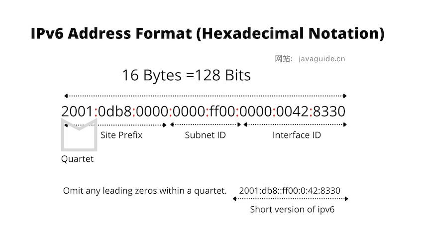
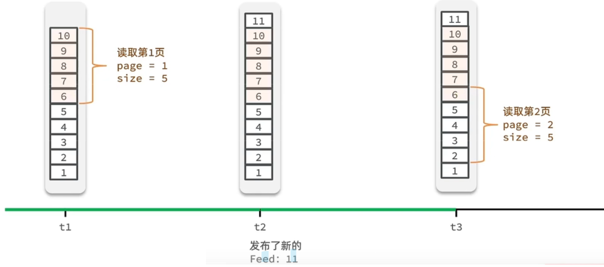

# 面试终结者

## 1.1、Java

### Java 中的几种基本数据类型了解么？

Java 中有 8 种基本数据类型，分别为：

- 6 种数字类型： 
  - 4 种整数型：`byte`、`short`、`int`、`long`
  - 2 种浮点型：`float`、`double`
- 1 种字符类型：`char`
- 1 种布尔型：`boolean`。

这 8 种基本数据类型的默认值以及所占空间的大小如下：

| 基本类型  | 位数 | 字节 | 默认值  | 取值范围                                                     |
| :-------- | :--- | :--- | :------ | ------------------------------------------------------------ |
| `byte`    | 8    | 1    | 0       | -128 ~ 127                                                   |
| `short`   | 16   | 2    | 0       | -32768（-2^15） ~ 32767（2^15 - 1）                          |
| `int`     | 32   | 4    | 0       | -2147483648 ~ 2147483647                                     |
| `long`    | 64   | 8    | 0L      | -9223372036854775808（-2^63） ~ 9223372036854775807（2^63 -1） |
| `char`    | 16   | 2    | 'u0000' | 0 ~ 65535（2^16 - 1）                                        |
| `float`   | 32   | 4    | 0f      | 1.4E-45 ~ 3.4028235E38                                       |
| `double`  | 64   | 8    | 0d      | 4.9E-324 ~ 1.7976931348623157E308                            |
| `boolean` | 1    |      | false   | true、false                                                  |

**注意：**

1. Java 里使用 `long` 类型的数据一定要在数值后面加上 **L**，否则将作为整型解析。
2. `char a = 'h'`char :单引号，`String a = "hello"` :双引号。

这八种基本类型都有对应的包装类分别为：`Byte`、`Short`、`Integer`、`Long`、`Float`、`Double`、`Character`、`Boolean` 。

### 基本类型和包装类型的区别？

- **用途**：除了定义一些常量和局部变量之外，我们在其他地方比如方法参数、对象属性中很少会使用基本类型来定义变量。并且，包装类型可用于泛型，而基本类型不可以。
- **存储方式**：基本数据类型的**局部变量**存放在 Java 虚拟机**栈**中的局部变量表中，基本数据类型的**成员变量**（未被 `static` 修饰 ）存放在 Java 虚拟机的**堆**中。包装类型属于对象类型，我们知道几乎所有对象实例都存在于**堆**中。
- **占用空间**：相比于包装类型（对象类型）， 基本数据类型占用的空间往往非常小。
- **默认值**：成员变量包装类型不赋值就是 `null` ，而基本类型有默认值且不是 `null`。
- **比较方式**：对于基本数据类型来说，`==` 比较的是值。对于包装数据类型来说，`==` 比较的是对象的内存地址。所有整型包装类对象之间值的比较，全部使用 `equals()` 方法。

> **为什么说是几乎所有对象实例都存在于堆中呢？** 这是因为 HotSpot 虚拟机引入了 JIT 优化之后，会对对象进行逃逸分析，如果发现某一个对象并没有逃逸到方法外部，那么就可能通过标量替换来实现栈上分配，而避免堆上分配内存

注意：**基本数据类型存放在栈中是一个常见的误区！** 基本数据类型的存储位置取决于它们的作用域和声明方式。如果它们是局部变量，那么它们会存放在栈中；如果它们是成员变量，那么它们会存放在堆中。

### 自动装箱与拆箱了解吗？原理是什么？

- **装箱**：将基本类型用它们对应的引用类型包装起来
- **拆箱**：将包装类型转换为基本数据类型

从字节码中，我们发现装箱其实就是调用了 包装类的`valueOf()`方法，拆箱其实就是调用了 `xxxValue()`方法。

### 包装类型的缓存机制了解么？

Java 基本数据类型的包装类型的大部分都用到了缓存机制来提升性能。

`Byte`,`Short`,`Integer`,`Long` 这 4 种包装类默认创建了数值 **[-128，127]** 的相应类型的缓存数据，`Character` 创建了数值在 **[0,127]** 范围的缓存数据，`Boolean` 直接返回 `True` or `False`。两种浮点数类型的包装类 `Float`,`Double` 并没有实现缓存机制。

如果超出对应范围仍然会去创建新的对象，缓存的范围区间的大小只是在性能和资源之间的权衡。


### 为什么浮点数运算的时候会有精度丢失的风险？

无限循环的小数存储在计算机时，只能被截断，所以就会导致小数精度发生损失的情况。这也就是解释了为什么浮点数没有办法用二进制精确表示。

`BigDecimal` 可以实现对浮点数的运算，不会造成精度丢失。通常情况下，大部分需要浮点数精确运算结果的业务场景（比如涉及到钱的场景）都是通过 `BigDecimal` 来做的。

在 Java 中，64 位 long 整型是最大的整数类型，`BigInteger` 内部使用 `int[]` 数组来存储任意大小的整形数据，相对于常规整数类型的运算来说，`BigInteger` 运算的效率会相对较低。

### 面向对象三大特征

#### 封装

封装是指把一个对象的状态信息（也就是属性）隐藏在对象内部，不允许外部对象直接访问对象的内部信息。但是可以提供一些可以被外界访问的方法来操作属性。这样可以保护数据的安全，并简化代码。

> 就好像我们看不到挂在墙上的空调的内部的零件信息（也就是属性），但是可以通过遥控器（方法）来控制空调。如果属性不想被外界访问，我们大可不必提供方法给外界访问。但是如果一个类没有提供给外界访问的方法，那么这个类也没有什么意义了。就好像如果没有空调遥控器，那么我们就无法操控空凋制冷，空调本身就没有意义了

#### 继承

继承是使用已存在的类的定义作为基础建立新类的技术，新类的定义可以增加新的数据或新的功能，也可以用父类的功能，但不能选择性地继承父类。通过使用继承，可以快速地创建新的类，可以提高代码的重用，程序的可维护性，节省大量创建新类的时间 ，提高我们的开发效率。

**关于继承如下 3 点请记住：**

1. 子类拥有父类对象所有的属性和方法（包括私有属性和私有方法），但是父类中的私有属性和方法子类是无法访问，**只是拥有**。
2. 子类可以拥有自己属性和方法，即子类可以对父类进行扩展。
3. 子类可以用自己的方式实现父类的方法。（以后介绍）。

#### 多态

多态，顾名思义，表示一个对象具有多种的状态，具体表现为**父类的引用指向子类的实例**。这增加了程序的灵活性和可扩展性。

**多态的特点:**

- 对象类型和引用类型之间具有继承（类）/实现（接口）的关系；
- 引用类型变量发出的方法调用的到底是哪个类中的方法，必须在程序运行期间才能确定；
- 多态不能调用“只在子类存在但在父类不存在”的方法；
- 如果子类重写了父类的方法，真正执行的是子类覆盖的方法，如果子类没有覆盖父类的方法，执行的是父类的方法。

### 接口和抽象类的区别

⼀个类如果**继承了某个抽象类**或者**实现了某个接口**都需要对其中的**抽象方法全部进行实现** 。

- ⼀个类只能继承⼀个抽象类，但可以实现多个接口
- 接口主要用于对类的行为进行约束，你实现了某个接口就具有了对应的行为。抽象类主要用于代码复用，强调的是所属关系。
- 接口中的成员变量只能是 `public static final` 类型的，不能被修改且必须有初始值，而抽象类的成员变量默认 default，可在子类中被重新定义，也可被重新赋值。
- 接口中全部为抽象方法，抽象类可以有抽象方法和具体方法 
- 接口中的方法只能是public修饰，抽象类的方法可以⽤protected、private、public修饰
- 接口中不能定义构造器，抽象类中可以定义构造器
- Java 8 可以用 `default` 关键字在接口中定义默认方法

### 深拷贝和浅拷贝区别了解吗？什么是引用拷贝？

- **浅拷贝**：浅拷贝会在堆上创建一个新的对象（区别于引用拷贝的一点），不过，如果原对象内部的属性是引用类型的话，浅拷贝会直接复制内部对象的引用地址，也就是说拷贝对象和原对象共用同一个内部对象。
- **深拷贝**：深拷贝会完全复制整个对象，包括这个对象所包含的内部对象。
- **那什么是引用拷贝呢？** 简单来说，引用拷贝就是两个不同的引用指向同一个对象。


### equals与==的区别

**`==` 是运算符**：

- 对于基本数据类型，`==`比较的是它们的值是否相等。
- 对于引用类型，`==`比较的是对象的引用是否相同，即它们是否指向内存中的同一个对象。

**`equals()`是方法**：

- `equals()`方法是Object类的方法，在Java中所有类都继承自Object类，因此都可以使用`equals()`方法。
- 默认情况下，`equals()`方法比较的是对象的引用，即比较两个对象是否在内存中占据相同的地址。
- 但是，许多类（如String、Integer等）会覆盖`equals()`方法，改变其行为，使其比较对象的内容而不是引用。
- 如果没有重写`equals()`方法，它与`==`运算符效果相同，都是比较对象的引用。

### 重写和重载的区别

**重写（Override）**：

- 重写指的是在子类中重新实现（覆盖）父类中已有的方法，以改变方法的行为。
- 重写要求子类方法的名称、参数列表和返回类型与父类方法完全相同。
- 重写方法的访问修饰符可以更宽松，但不能更严格。
- 重写允许子类根据自身的需求对父类的方法进行定制，提供了多态的特性。
- 方法被定义为final不能被重写

**重载（Overload）**：

- 重载指的是在同一个类中，可以定义多个方法，它们具有相同的名称但是参数列表不同（类型、顺序、个数）的特性。
- 重载方法与返回类型无关，只要方法签名（方法名和参数列表）不同即可。
- 重载方法可以有不同的访问修饰符、返回类型、抛出异常等。

### String、StringBuffer/StringBuilder区别和使用场景

- **运行速度**：在运行速度方面，StringBuilder > StringBuffer > String。这是因为 String 是不可变的，每次操作都会创建新的对象，而 StringBuilder 和 StringBuffer 是可变的，可以在原地进行修改，因此更快。
- **可变性**：String为字符串常量，不是基本数据类型⽽是⼀个对象，底层是final修饰的字符数组，⼀经定义⽆法增删改，每次对String的操作都会⽣成新的 String对象。StringBuffer和StringBuilder他们两都继承了AbstractStringBuilder抽象类，均为字符串变量，底层使用可扩展的字符数组，可以修改内容。
- **线程安全性**：StringBuilder 是非线程安全的，而 StringBuffer 是线程安全的，因为 StringBuffer 的方法是同步的，采用了 synchronized 关键字，这意味着在多线程环境下，StringBuffer 是安全的但性能较低，而 StringBuilder 在单线程环境下更快。
- **版本引入**：StringBuffer 从 JDK 1.0 就开始，而 StringBuilder 是在 JDK 1.5 引入的。

### String 为什么是不可变的?

`String` 类中使用 `final` 关键字修饰字符数组来保存字符串

- 保存字符串的数组被 `final` 修饰且为私有的，并且`String` 类没有提供/暴露修改这个字符串的方法。
- `String` 类被 `final` 修饰导致其不能被继承，进而避免了子类破坏 `String` 不可变。

### 字符串常量池的作用了解吗？

**字符串常量池** 是 JVM 为了提升性能和减少内存消耗针对字符串（String 类）专门开辟的一块区域，主要目的是为了避免字符串的重复创建。

- 只要是以`“”`方式写出的字符串对象，会在堆内存中的**字符串常量池**中存储，且相同内容的字符串只存储一份。**不包含变量+运算**生成的字符串对象会被编译优化直接变为字符串放进**字符串常量池**
- 但通过`new`方式创建字符串对象，每new一次都会产生一个新的对象放在堆内存中。通过**包含变量+运算**生成的字符串对象也会放在堆内存中

**JDK1.7 之前，字符串常量池存放在永久代。JDK1.7 字符串常量池和静态变量从永久代移动了 Java 堆中。**因为永久代（方法区实现）的 GC 回收效率太低，只有在整堆收集 (Full GC)的时候才会被执行 GC。Java 程序中通常会有大量的被创建的字符串等待回收，将字符串常量池放到堆中，能够更高效及时地回收字符串内存。


### Static用法

- **修饰变量、方法**：`static`关键字用于修饰类的成员变量和方法。
  - 被 static 修饰的成员属于类，不属于单个这个类的某个对象，被类中所有对象共享，可以并且建议通过类名调用。被 static 声明的成员变量属于静态成员变量，**静态变量 存放在 Java 内存区域的方法区（JDK1.7 之前，1.7之后移动到了 Java 堆中）。**
  - 静态方法不依赖于类的实例，可以直接通过类名调用。静态方法中不能访问非静态变量和非静态方法，因为它们需要依赖于对象的实例。

- **静态内部类**：静态内部类是定义在类内部的类，并且使用`static`关键字修饰。与非静态内部类不同，**静态内部类不需要依赖外部类的实例而可以实例化。静态内部类通常用于与外部类解耦合的场景，例如工具类。**
- **静态导包**：Java 5引入了静态导包的语法，通过`import static`语句可以导入某个类中的静态成员（字段或方法），使得在使用时无需指定类名。这样做可以简化代码，提高可读性。
- **静态代码块:** 静态代码块定义在类中方法外， 静态代码块在非静态代码块之前执行(静态代码块—>非静态代码块—>构造方法)。 该类不管创建多少对象，静态代码块只执行一次

### final用法

- final 修饰的类不能被继承，final 类中的所有成员方法都会被隐式的指定为 final 方法
- final 修饰的方法不能被重写
- final 修饰的变量是常量，如果是基本数据类型的变量，则其数值一旦在初始化之后便不能更改；如果是引用类型的变量，则在对其初始化之后便不能让其指向另一个对象。如果修饰引⽤，那么表示引⽤不可变，引⽤指向的内容可变

>  `final` 关键字仅确保引用本身不会被重新赋值，而不影响引用指向的对象的内容。
>
>  ```java
>  final StringBuilder sb = new StringBuilder("Hello");
>  sb.append(" World"); // 可以修改StringBuilder对象的内容
>  ```
>
>  在这个例子中，`sb` 是一个引用，被声明为 `final`，意味着不能再指向其他 `StringBuilder` 对象，但是可以修改 `StringBuilder` 对象的内容。
>
>  另一方面，如果使用 `final` 修饰了整个对象，那么该对象的内容将不可变，例如：
>
>  ```java
>  final String str = "Hello";
>  str = "World"; // 这将导致编译错误，因为尝试修改了不可变的引用
>  ```
>
>  在这个例子中，`str` 被声明为 `final`，因此不能重新分配给另一个对象。

### Exception和Error包结构

- **被检查异常（Checked Exception）**：
  - Java编译器会在编译时强制检查这些异常，要求程序员进行显式处理。
  - 必须通过throws声明抛出或者通过try-catch捕获处理，否则代码无法通过编译。
  - 这些异常通常是可以被恢复的，例如文件未找到异常、IO异常等。
  - 例如：当通过clone()接⼝去克隆⼀个对象，⽽该对象对应的类没有实现Cloneable接⼝，就会抛出CloneNotSupportedException异常。
- **运行时异常（Runtime Exception及其子类）**：
  - 运行时异常及其子类在Java中不受编译器检查，也不要求必须通过throws声明抛出或者通过try-catch捕获处理。
  - 这些异常通常是由程序逻辑错误导致的，而不是外部条件引起的。
  - 例如：空指针异常，数组越界异常，除数为0 异常，并发修改异常，类转换异常，数据存储异常等
- **错误（Error类及其子类）**：
  - 错误表示严重的问题，通常是程序无法恢复的情况，而不是由程序错误引起的，而是由于系统环境出现问题。
  - 与异常不同，编译器不会检查错误，程序员也不需要显式地处理它们。
  - 例如：`OutOfMemoryError`、`StackOverflowError`等。

### try-catch-finally 如何使用？

- `try`块：用于捕获异常。其后可接零个或多个 `catch` 块，如果没有 `catch` 块，则必须跟一个 `finally` 块。
- `catch`块：用于处理 try 捕获到的异常。
- `finally` 块：无论是否捕获或处理异常，`finally` 块里的语句都会被执行。当在 `try` 块或 `catch` 块中遇到 `return` 语句时，`finally` 语句块将在方法返回之前被执行。

**注意：不要在 finally 语句块中使用 return!** 当 try 语句和 finally 语句中都有 return 语句时，try 语句块中的 return 语句会被忽略。这是因为 try 语句中的 return 返回值会先被暂存在一个本地变量中，当执行到 finally 语句中的 return 之后，这个本地变量的值就变为了 finally 语句中的 return 返回值。

### finally 中的代码一定会执行吗？

不一定的！在某些情况下，finally 中的代码不会被执行。就比如说 finally 之前虚拟机被终止运行的话，finally 中的代码就不会被执行。

### JDK 动态代理和 CGLIB 动态代理对比

- JDK 动态代理只能代理实现了接口的类或者直接代理接口，而 CGLIB 可以代理未实现任何接口的类。 
- CGLIB 动态代理是通过生成一个被代理类的子类来拦截被代理类的方法调用，因此不能代理声明为 final 类型的类和方法。
- 就二者的效率来说，大部分情况都是 JDK 动态代理更优秀，随着 JDK 版本的升级，这个优势更加明显。

### Java中的引用和C++中的指针有什么区别

- **语义**：
  - 引用（Reference）在Java中是一种更高级别的语言结构，它提供了对对象的间接访问。引用在语言层面上被设计为指向对象，并提供了自动的内存管理机制。
  - 指针（Pointer）在C++中是一种底层的概念，它直接存储内存地址，允许直接对内存进行操作。指针的使用需要程序员显式地管理内存的分配和释放。
- **内存管理**：
  - 在Java中，引用是由垃圾回收器进行管理的，它负责在不再需要对象时自动释放对象占用的内存。程序员不需要手动释放内存。
  - 在C++中，指针需要程序员手动管理内存。程序员必须显式地分配内存（例如使用`new`关键字），并在不再需要时释放内存（例如使用`delete`关键字）。
- **空值**：
  - 在Java中，引用可以是null，表示它不引用任何对象。
  - 在C++中，指针可以是nullptr（C++11之后的标准）或NULL，表示它不指向任何内存地址。
- **类型安全性**：
  - Java是一种类型安全的语言，引用总是指向特定类型的数据。编译器在编译时会检查引用的类型，确保类型的一致性。
  - C++允许指针类型转换，这意味着指针可以被转换为不同类型的指针。这种灵活性虽然强大，但也增加了类型错误的可能。

### Java为什么是单继承

- **简化语言**：多重继承会增加语言的复杂性，导致代码更难理解和维护。Java的设计目标之一是简化语言，使得它更容易被初学者理解，并降低软件开发的复杂度。
- **避免菱形继承问题**：多重继承可能引发菱形继承问题，即一个类直接或间接继承了两个以上的父类，而这些父类又共同继承了同一个基类。这种情况下，派生类会继承两份相同的基类数据成员，可能会引发二义性和混乱。
- **提高类型安全性**：多重继承会增加类型转换的复杂性和不确定性。在有多个父类的情况下，编译器可能无法确定正确的类型转换路径，从而引发编译错误或运行时异常。
- **接口的引入**：Java引入了接口的概念，允许类通过实现接口来获得额外的行为，从而避免了多重继承的部分问题。接口提供了一种更加灵活的方式来组织类之间的关系，同时也提高了代码的可扩展性和可维护性。


### List、Set

#### 说一说Java提供的常见集合？

在java中提供了量大类的集合框架，主要分为两类：

第一个是Collection  属于单列集合，第二个是Map  属于双列集合

- 在Collection中有两个子接口List和Set。在我们平常开发的过程中用的比较多像list接口中的实现类ArrarList和LinkedList。  在Set接口中有实现类HashSet和TreeSet。
- 在map接口中有很多的实现类，平时比较常见的是HashMap、TreeMap，还有一个线程安全的map:ConcurrentHashMap

#### ArrayList 和 Array（数组）的区别？

`ArrayList` 内部基于动态数组实现，比 `Array`（静态数组） 使用起来更加灵活：

- `ArrayList`会根据实际存储的元素动态地扩容或缩容，而 `Array` 被创建之后就不能改变它的长度了。
- `ArrayList` 允许你使用泛型来确保类型安全，`Array` 则不可以。
- `ArrayList` 中只能存储对象。对于基本类型数据，需要使用其对应的包装类（如 Integer、Double 等）。`Array` 可以直接存储基本类型数据，也可以存储对象。
- `ArrayList` 支持插入、删除、遍历等常见操作，并且提供了丰富的 API 操作方法，比如 `add()`、`remove()`等。`Array` 只是一个固定长度的数组，只能按照下标访问其中的元素，不具备动态添加、删除元素的能力。
- `ArrayList`创建时不需要指定大小，而`Array`创建时必须指定大小。

#### ArrayList底层是如何实现的？

- 底层数据结构

ArrayList底层是用动态的数组实现的

- 初始容量

ArrayList初始容量为0，当第一次添加数据的时候才会初始化容量为**10**

- 扩容逻辑

ArrayList在进行扩容的时候是原来容量的**1.5**倍，每次扩容都需要拷贝数组

- 添加逻辑

  - 确保数组已使用长度（size）加1之后足够存下下一个数据 
  - 计算数组的容量，如果当前数组已使用长度+1后的大于当前的数组长度，则调用grow方法扩容（原来的1.5倍）

  - 确保新增的数据有地方存储之后，则将新元素添加到位于size的位置上。
  - 返回添加成功布尔值。

#### ArrayList list=new ArrayList(10)中的list扩容几次

是new了一个ArrarList并且给了一个构造参数10，对吧？(问题一定要问清楚再答)  是的

好的，在ArrayList的源码中提供了一个带参数的构造方法，这个参数就是指定的集合初始长度，所以给了一个10的参数，就是指定了集合的初始长度是10，这里面并没有扩容。

#### 如何实现数组和List之间的转换

数组转list，可以使用jdk自动的一个工具类Arrars，里面有一个asList方法可以转换为数组

List 转数组，可以直接调用list中的toArray方法，需要给一个参数，指定数组的类型，需要指定数组的长度。

#### 用Arrays.asList转List后，如果修改了数组内容，list受影响吗？

Arrays.asList转换list之后，如果修改了数组的内容，**list会受影响**，因为它的底层使用的Arrays类中的一个内部类ArrayList来构造的集合，在这个集合的构造器中，把我们传入的这个集合进行了包装而已，最终指向的都是同一个内存地址

#### List用toArray转数组后，如果修改了List内容，数组受影响吗

list用了toArray转数组后，如果修改了list内容，**数组不会影响**，当调用了toArray以后，在底层是它是进行了数组的拷贝，跟原来的元素就没啥关系了，所以即使list修改了以后，数组也不受影响

#### ArrayList 和 LinkedList 的区别是什么？

嗯，它们两个主要是底层使用的数据结构不一样，ArrayList 是**动态数组**，LinkedList 是**双向链表**，这也导致了它们很多不同的特点。

1、从操作数据效率来说

- ArrayList按照下标查询的时间复杂度O(1)【内存是连续的，根据寻址公式】， LinkedList不支持下标查询。
- 查找（未知索引）： ArrayList需要遍历，链表也需要遍历，时间复杂度都是O(n)

2、新增和删除

- ArrayList**尾部**插入和删除，时间复杂度是O(1)；其他部分增删需要挪动数组，时间复杂度是O(n)
- LinkedList**头尾**节点增删时间复杂度是O(1)，其他都需要遍历链表，时间复杂度是O(n)

3、从内存空间占用来说

- ArrayList底层是数组，内存连续，节省内存

- LinkedList 是双向链表需要存储数据和两个指针，更占用内存

4、从线程安全来说，ArrayList和LinkedList都不是线程安全的

#### 如何解决ArrayList 和 LinkedList 的线程安全问题？

嗯，是这样的，主要有两种解决方案：

第一：我们使用这个集合，优先在方法内使用，定义为局部变量（存在JVM的栈中），这样的话，就不会出现线程安全问题。

第二：如果非要在成员变量中使用的话，可以使用线程安全的集合来替代 

ArrayList可以通过Collections 的 synchronizedList 方法将 ArrayList 转换成线程安全的容器后再使用。

LinkedList 换成ConcurrentLinkedQueue来使用

#### ArrayList 和 Vector 的区别?（了解即可）

- `ArrayList` 是 `List` 的主要实现类，底层使用 `Object[]`存储，适用于频繁的查找工作，线程不安全 。
- `Vector` 是 `List` 的古老实现类，底层使用`Object[]` 存储，线程安全。

#### ArrayList 可以添加 null 值吗？

`ArrayList` 中可以存储任何类型的对象，包括 `null` 值。不过，不建议向`ArrayList` 中添加 `null` 值， `null` 值无意义，会让代码难以维护比如忘记做判空处理就会导致空指针异常。

#### HashSet 如何检查重复

当你把对象加入HashSet时，HashSet 会先计算对象的hashcode值来判断对象加入的位置，同时也会与其他加入的对象的 hashcode 值作比较，如果没有相符的 hashcode，HashSet 会假设对象没有重复出现。但是如果发现有相同 hashcode 值的对象，这时会调用equals()方法来检查 hashcode 相等的对象是否真的相同。如果两者相同，HashSet 就不会让加入操作成功。要想保证在HashSet集合中没有重复元素，我们需要重写元素类的hashCode和equals方法。

#### 比较 HashSet、LinkedHashSet 和 TreeSet 三者的异同

- `HashSet`、`LinkedHashSet` 和 `TreeSet` 都是 `Set` 接口的实现类，都能保证元素唯一，并且都不是线程安全的。
- `HashSet`、`LinkedHashSet` 和 `TreeSet` 的主要区别在于底层数据结构不同。`HashSet` 的底层数据结构是哈希表（基于 `HashMap` 实现）。`LinkedHashSet` 的底层数据结构是链表和哈希表，元素的插入和取出顺序满足 FIFO。`TreeSet` 底层数据结构是红黑树，元素是有序的，排序的方式有自然排序和定制排序。
- 底层数据结构不同又导致这三者的应用场景不同。`HashSet` 用于不需要保证元素插入和取出顺序的场景，`LinkedHashSet` 用于保证元素的插入和取出顺序满足 FIFO 的场景，`TreeSet` 用于支持对元素自定义排序规则的场景。

#### Comparable 和 Comparator 的区别

`Comparable` 接口和 `Comparator` 接口都是 Java 中用于排序的接口，它们在实现类对象之间比较大小、排序等方面发挥了重要作用：

- `Comparable` 接口实际上是出自`java.lang`包 它有一个 `compareTo(Object obj)`方法用来排序
- `Comparator`接口实际上是出自 `java.util` 包它有一个`compare(Object obj1， Object obj2)`方法用来排序

一般我们需要对一个集合使用自定义排序时，我们就要重写`compareTo()`方法或`compare()`方法。

- 第一种方法：让元素的类实现Comparable接口，重写compareTo方法
- 第二种方法：在创建TreeSet集合时，通过构造方法传递Compartor比较器对象

注意：如果类本身有实现Comparable接口（第一种方法），TreeSet集合也同时自带比较器（第二种方法），**默认使用集合自带的比较器排序（第二种方法）**。

```java
//1.重写compareTo方法
//按照年龄进行比较，只需要在方法中让this.age和o.age相减就可以。
//原理：在往TreeSet集合中添加元素时，add方法底层会调用compareTo方法，
//根据该方法的结果是正数、负数、还是零，决定元素放在后面、前面还是不存。

@Override
public int compareTo(Student o) {
    //this：表示将要添加进去的Student对象
    //o: 表示集合中已有的Student对象
    return this.age-o.age;
}

//2.创建TreeSet集合时，传递比较器对象排序
//原理：当调用add方法时，底层会先用比较器，
//根据Comparator的compare方是正数、负数、还是零，决定谁在后，谁在前，谁不存。

//下面代码中是按照学生的年龄升序排序
Set<Student> students = new TreeSet<>(new Comparator<Student>{
    @Override
    public int compare(Student o1, Student o2){
        //需求：按照学生的身高排序
        return Double.compare(o1, o2); 
    }
});
//Lambda表达式
Set<Student> students = new TreeSet<>((o1, o2) -> Double.compare(o1.getAge(), o2.getAge()));
```

### Map

#### 说一下HashMap的实现原理？

1，底层使用hash表数据结构，即数组+（链表 | 红黑树）

2，添加数据时，HashMap 通过 key 的 hashcode 经过扰动函数处理过后得到 hash 值，然后通过 **(n - 1) & hash** 判断当前元素存放的位置（这里的 n 指的是数组的长度）计算key的值确定元素在数组中的下标，key相同则替换，不同则存入链表或红黑树中。

3，获取数据通过key的hash计算数组下标获取元素

> 扰动函数指的就是 HashMap 的 `hash` 方法。使用 `hash` 方法也就是扰动函数是为了防止一些实现比较差的 `hashCode()` 方法 换句话说使用扰动函数之后可以减少碰撞。

#### HashMap的jdk1.7和jdk1.8有什么区别

- JDK1.8之前采用的拉链法，数组+链表，创建一个链表数组，数组中每一格就是一个链表。若遇到哈希冲突，则将冲突的值加到链表中即可。

- JDK1.8之后采用数组+链表+红黑树，**链表长度大于8且数组长度大于64**则会从链表转化为红黑树，扩容 resize( ) 时，红黑树拆分成的树的结点数小于等于临界值6个，则退化成链表

#### 你能说下HashMap的put方法的具体流程吗？

1. 判断键值对数组table是否为空或为null，否则执行resize()进行扩容（初始化）

2. 根据键值key计算hash值得到数组索引

3. 判断table[i]==null，条件成立，直接新建节点添加

4. 如果table[i]==null ，不成立

   - 4.1 判断table[i]的首个元素是否和key一样，如果相同直接覆盖value

   - 4.2 判断table[i] 是否为treeNode，即table[i] 是否是红黑树，如果是红黑树，则直接在树中插入键值对

   - 4.3 遍历table[i]，链表的尾部插入数据，然后判断链表长度是否大于8并且数组长度达到64时，把链表转换为红黑树，在红黑树中执行插入操 作，遍历过程中若发现key已经存在直接覆盖value

5. 插入成功后，判断实际存在的键值对数量size是否超多了最大容量threshold（数组长度*0.75），如果超过，进行扩容。

#### HashMap的扩容因子为什么是0.75？

- **泊松分布**：在理想情况下，哈希表的元素分布应该接近于泊松分布。当负载因子为0.75时，哈希表出现哈希冲突的概率相对较低，这意味着大多数桶（bucket）中只有一个元素，这有助于保持HashMap的查找效率。
- **经验法则**：在计算机科学中，很多默认值的选取都是基于历史经验。0.75作为一个常见的负载因子，已经在多种场景下被验证为一种有效的默认值。它既不会导致过多的内存浪费，也不会让HashMap的性能因为频繁的哈希冲突而显著下降。

#### 能讲一讲HashMap的扩容机制吗？

- 在添加元素或初始化的时候需要调用resize方法进行扩容，第一次添加数据初始化数组长度为**16**，以后每次每次扩容都是达到了扩容阈值（数组长度 * **0.75**）

- 每次扩容的时候，都是扩容之前容量的**2倍**； 

- 扩容之后，会新创建一个数组，需要把老数组中的数据挪动到新的数组中
 - 没有hash冲突的节点，则直接使用 e.hash & (newCap - 1) 计算新数组的索引位置
 - 如果是红黑树，走红黑树的添加
 - 如果是链表，则需要遍历链表，可能需要拆分链表，判断(e.hash & oldCap)是否为0，该元素的位置要么停留在原始位置，要么移动到原始位置+增加的数组大小这个位置上

#### 你了解hashMap的寻址算法吗？

这个哈希方法首先计算出key的hashCode值，然后通过这个hash值右移16位后的二进制进行按位**异或运算**得到最后的hash值。

在putValue的方法中，计算数组下标的时候使用hash值与数组长度取模得到存储数据下标的位置，hashmap为了性能更好，并没有直接采用取模的方式，而是使用了数组长度-1 得到一个值，用这个值按位**与运算**hash值，最终得到数组的位置。

#### 为何HashMap的数组长度一定是2的次幂？

嗯，好的。hashmap这么设计主要有两个原因：

- 计算索引时效率更高：如果是 2 的 n 次幂可以使用 位与运算 代替 取模

- 扩容时重新计算索引效率更高：在进行扩容是会进行判断 hash值按位与运算旧数组长度是否 == 0 。如果等于0，则把元素留在原来位置 ，否则新位置是等于旧位置的下标 + 旧数组长度


#### 你知道HashMap在1.7情况下的多线程死循环问题吗？

jdk7的的数据结构是：数组+链表

在数组进行扩容的时候，因为链表是**头插法**，在进行数据迁移的过程中，有可能导致死循环

比如说，现在有两个线程

线程一：**读取**到当前的hashmap数据，数据中一个链表，在准备扩容时，线程二介入

线程二也读取hashmap，直接进行扩容。因为是头插法，链表的顺序会进行颠倒过来。比如原来的顺序是AB，扩容后的顺序是BA，线程二执行结束。

当线程一再继续执行的时候就会出现死循环的问题。

线程一先将A移入新的链表，再将B插入到链头，由于另外一个线程的原因，B的next指向了A，所以B->A->B，形成循环。

当然，JDK 8 将扩容算法做了调整，不再将元素加入链表头（而是保持与扩容前一样的顺序），**尾插法**，就避免了jdk7中死循环的问题。

#### HashMap是线程安全的吗？

不是线程安全的，我们可以采用ConcurrentHashMap进行使用，它是一个线程安全的HashMap

#### 那你能聊一下ConcurrentHashMap的原理吗？

ConcurrentHashMap 是一种线程安全的高效Map集合，jdk1.7和1.8也做了很多调整。

- JDK1.7的底层采用是**分段的数组**+**链表** 实现
- JDK1.8 采用的数据结构跟HashMap1.8的结构一样，数组+链表/红黑二叉树。

在jdk1.7中 ConcurrentHashMap 里包含一个 Segment 数组。Segment 的结构和HashMap类似，是一 种数组和链表结构，一个 Segment 包含一个 HashEntry 数组，每个 HashEntry 是一个链表结构 的元素，每个 Segment 守护着一个HashEntry数组里的元素，当对 HashEntry 数组的数据进行修 改时，必须首先获得对应的 Segment的锁。

Segment 是一种可重入的锁 ReentrantLock，每个 Segment 守护一个HashEntry 数组里得元 素，当对 HashEntry 数组的数据进行修改时，必须首先获得对应的 Segment 锁。


在jdk1.8中的ConcurrentHashMap 做了较大的优化，性能提升了不少。首先是它的数据结构与jdk1.8的hashMap数据结构完全一致。其次是放弃了Segment臃肿的设计，取而代之的是采用Node + CAS + Synchronized来保 证并发安全进行实现，synchronized只锁定当前链表或红黑二叉树的首节点，这样只要hash不冲 突，就不会产生并发 ， 效率得到提升


#### ConcurrentHashMap 为什么 key 和 value 不能为 null？

`ConcurrentHashMap` 的 key 和 value 不能为 null 主要是为了避免二义性。null 是一个特殊的值，表示没有对象或没有引用。如果你用 null 作为键，那么你就无法区分这个键是否存在于 `ConcurrentHashMap` 中，还是根本没有这个键。同样，如果你用 null 作为值，那么你就无法区分这个值是否是真正存储在 `ConcurrentHashMap` 中的，还是因为找不到对应的键而返回的。

拿 get 方法取值来说，返回的结果为 null 存在两种情况：

- 值没有在集合中 ；
- 值本身就是 null。

这也就是二义性的由来。

多线程环境下，存在一个线程操作该 `ConcurrentHashMap` 时，其他的线程将该 `ConcurrentHashMap` 修改的情况，所以无法通过 `containsKey(key)` 来判断否存在这个键值对，也就没办法解决二义性问题了。

与此形成对比的是，`HashMap` 可以存储 null 的 key 和 value，但 null 作为键只能有一个，null 作为值可以有多个。如果传入 null 作为参数，就会返回 hash 值为 0 的位置的值。单线程环境下，不存在一个线程操作该 HashMap 时，其他的线程将该 `HashMap` 修改的情况，所以可以通过 `contains(key)`来做判断是否存在这个键值对，从而做相应的处理，也就不存在二义性问题。

#### ConcurrentHashMap 能保证复合操作的原子性吗？

`ConcurrentHashMap` 是线程安全的，意味着它可以保证多个线程同时对它进行读写操作时，不会出现数据不一致的情况，也不会导致 JDK1.7 及之前版本的 `HashMap` 多线程操作导致死循环问题。但是，这并不意味着它可以保证所有的复合操作都是原子性的，一定不要搞混了！

复合操作是指由多个基本操作(如`put`、`get`、`remove`、`containsKey`等)组成的操作，例如先判断某个键是否存在`containsKey(key)`，然后根据结果进行插入或更新`put(key， value)`。这种操作在执行过程中可能会被其他线程打断，导致结果不符合预期。

#### 那如何保证 ConcurrentHashMap 复合操作的原子性呢？

`ConcurrentHashMap` 提供了一些原子性的复合操作，如 `putIfAbsent`、`compute`、`computeIfAbsent` 、`computeIfPresent`、`merge`等。这些方法都可以接受一个函数作为参数，根据给定的 key 和 value 来计算一个新的 value，并且将其更新到 map 中。

#### HashMap与HashSet的区别

HashSet底层其实是用HashMap实现存储的，HashSet封装了一系列HashMap的方法。依靠HashMap来存储元素值（利用hashMap的key键进行存储），而**value值默认为Object对象**。所以HashSet也不允许出现重复值，判断标准和HashMap判断标准相同，两个元素的hashCode相等并且通过equals()方法返回true。

#### HashMap与HashTable的区别

- **线程是否安全：**hashtable是线程安全的，操作数据的时候加了锁synchronized，hashmap不是线程安全的，效率更高一些

  在实际开中不建议使用HashTable，在多线程环境下可以使用ConcurrentHashMap类。

- **对 Null key 和 Null value 的支持：** `HashMap` 可以存储 null 的 key 和 value，但 null 作为键只能有一个，null 作为值可以有多个；Hashtable 不允许有 null 键和 null 值，否则会抛出 `NullPointerException`。

- **初始容量大小和每次扩充容量大小的不同：** 

  - ① 创建时如果不指定容量初始值，`Hashtable` 默认的初始大小为 **11**，之后每次扩充，容量变为原来的 **2n+1**。`HashMap` 默认的初始化大小为 **16**。之后每次扩充，容量变为原来的 **2 倍**。

  - ② 创建时如果给定了容量初始值，那么 `Hashtable` 会直接使用你给定的大小，而 `HashMap` 会将其扩充为 2 的幂次方大小（`HashMap` 中的`tableSizeFor()`方法保证）。也就是说 `HashMap` 总是使用 2 的幂作为哈希表的大小。

- **底层数据结构：** JDK1.8 以后的 `HashMap` 在解决哈希冲突时有了较大的变化，当链表长度大于阈值（默认为 8）时，将链表转化为红黑树（将链表转换成红黑树前会判断，如果当前数组的长度小于 64，那么会选择先进行数组扩容，而不是转换为红黑树），以减少搜索时间（后文中我会结合源码对这一过程进行分析）。`Hashtable` 是数组+链表，没有这样的机制。

#### HashMap 和 TreeMap 区别

TreeMap 和HashMap 都继承自AbstractMap ，但是需要注意的是TreeMap它还实现了NavigableMap接口和SortedMap 接口。实现 NavigableMap 接口让 TreeMap 有了对集合内元素的搜索的能力。实现SortedMap接口让 TreeMap 有了对集合中的元素根据键排序的能力。默认是按 key 的升序排序，不过我们也可以指定排序的比较器。


### Queue

#### Queue 与 Deque 的区别

`Queue` 是单端队列，只能从一端插入元素，另一端删除元素，实现上一般遵循 **先进先出（FIFO）** 规则。

`Queue` 扩展了 `Collection` 的接口，根据 **因为容量问题而导致操作失败后处理方式的不同** 可以分为两类方法: 一种在操作失败后会抛出异常，另一种则会返回特殊值。

| `Queue` 接口 | 抛出异常  | 返回特殊值 |
| ------------ | --------- | ---------- |
| 插入队尾     | add(E e)  | offer(E e) |
| 删除队首     | remove()  | poll()     |
| 查询队首元素 | element() | peek()     |

`Deque` 是双端队列，在队列的两端均可以插入或删除元素。

`Deque` 扩展了 `Queue` 的接口， 增加了在队首和队尾进行插入和删除的方法，同样根据失败后处理方式的不同分为两类：

| `Deque` 接口 | 抛出异常      | 返回特殊值      |
| ------------ | ------------- | --------------- |
| 插入队首     | addFirst(E e) | offerFirst(E e) |
| 插入队尾     | addLast(E e)  | offerLast(E e)  |
| 删除队首     | removeFirst() | pollFirst()     |
| 删除队尾     | removeLast()  | pollLast()      |
| 查询队首元素 | getFirst()    | peekFirst()     |
| 查询队尾元素 | getLast()     | peekLast()      |

事实上，`Deque` 还提供有 `push()` 和 `pop()` 等其他方法，可用于模拟栈。

#### 说一说 PriorityQueue

`PriorityQueue` 是在 JDK1.5 中被引入的， 其与 `Queue` 的区别在于元素出队顺序是与优先级相关的，即总是优先级最高的元素先出队。

这里列举其相关的一些要点：

- `PriorityQueue` 利用了二叉堆的数据结构来实现的，底层使用可变长的数组来存储数据
- `PriorityQueue` 通过堆元素的上浮和下沉，实现了在 O(logn) 的时间复杂度内插入元素和删除堆顶元素。
- `PriorityQueue` 是非线程安全的，且不支持存储 `NULL` 和 `non-comparable` 的对象。
- `PriorityQueue` 默认是小顶堆，但可以接收一个 `Comparator` 作为构造参数，从而来自定义元素优先级的先后。

默认小顶堆，大顶堆这样写PriorityQueue< ListNode > pq = new PriorityQueue<>(length， (a， b)->(b.val - a.val)) 或 PriorityQueue< Integer > maxHeap = new PriorityQueue<>(Collections.reverseOrder());

#### 什么是 BlockingQueue？

`BlockingQueue` （阻塞队列）是一个接口，继承自 `Queue`。`BlockingQueue`阻塞的原因是其支持当队列没有元素时一直阻塞，直到有元素；还支持如果队列已满，一直等到队列可以放入新元素时再放入。

```java
public interface BlockingQueue<E> extends Queue<E> {
  // ...
}
```

#### BlockingQueue 的实现类有哪些？

1. **ArrayBlockingQueue**：使用数组实现的有界阻塞队列。在创建时需要指定容量大小，并支持公平和非公平两种方式的锁访问机制。
2. **LinkedBlockingQueue**：使用单向链表实现的可选有界阻塞队列。在创建时可以指定容量大小，如果不指定则默认为Integer.MAX_VALUE。和ArrayBlockingQueue不同的是， 它仅支持非公平的锁访问机制。
3. PriorityBlockingQueue：支持优先级排序的无界阻塞队列。元素必须实现Comparable接口或者在构造函数中传入Comparator对象，并且不能插入 null 元素。
4. SynchronousQueue：同步队列，是一种不存储元素的阻塞队列。每个插入操作都必须等待对应的删除操作，反之删除操作也必须等待插入操作。因此，SynchronousQueue通常用于线程之间的直接传递数据。
5. DelayQueue：延迟队列，其中的元素只有到了其指定的延迟时间，才能够从队列中出队。

#### ArrayBlockingQueue 和 LinkedBlockingQueue 有什么区别？

`ArrayBlockingQueue` 和 `LinkedBlockingQueue` 是 Java 并发包中常用的两种阻塞队列实现，它们都是线程安全的。不过，不过它们之间也存在下面这些区别：

- 底层实现：`ArrayBlockingQueue` 基于数组实现，而 `LinkedBlockingQueue` 基于链表实现。
- 是否有界：`ArrayBlockingQueue` 是有界队列，必须在创建时指定容量大小。`LinkedBlockingQueue` 创建时可以不指定容量大小，默认是`Integer.MAX_VALUE`，也就是无界的。但也可以指定队列大小，从而成为有界的。
- 锁是否分离： `ArrayBlockingQueue`中的锁是没有分离的，即生产和消费用的是同一个锁；`LinkedBlockingQueue`中的锁是分离的，即生产用的是`putLock`，消费是`takeLock`，这样可以防止生产者和消费者线程之间的锁争夺。
- 内存占用：`ArrayBlockingQueue` 需要提前分配数组内存，而 `LinkedBlockingQueue` 则是动态分配链表节点内存。这意味着，`ArrayBlockingQueue` 在创建时就会占用一定的内存空间，且往往申请的内存比实际所用的内存更大，而`LinkedBlockingQueue` 则是根据元素的增加而逐渐占用内存空间。


## 1.2、JVM 

### JVM组成

#### JVM由那些部分组成，运行流程是什么？


在JVM中共有四大部分，分别是ClassLoader（类加载器）、Runtime Data Area（运行时数据区，内存分区）、Execution Engine（执行引擎）、Native Method Library（本地库接口）

它们的运行流程是：

第一，类加载器（ClassLoader）把Java代码转换为字节码

第二，运行时数据区（Runtime Data Area）把字节码加载到内存中，而字节码文件只是JVM的一套指令集规范，并不能直接交给底层系统去执行，而是有执行引擎运行

第三，执行引擎（Execution Engine）将字节码翻译为底层系统指令，再交由CPU执行去执行，此时需要调用其他语言的本地库接口（Native Method Library）来实现整个程序的功能。

#### 你能详细说一下 JVM 运行时数据区吗？

运行时数据区包含了堆、方法区、栈、本地方法栈、程序计数器这几部分，每个功能作用不一样。

- 堆解决的是对象实例存储的问题，垃圾回收器管理的主要区域。
- 方法区可以认为是堆的一部分，用于存储已被虚拟机加载的信息，常量、静态变量、即时编译器编译后的代码。
- 栈解决的是程序运行的问题，栈里面存的是栈帧，栈帧里面存的是局部变量表、操作数栈、动态链接、方法出口等信息。
- 本地方法栈与栈功能相同，本地方法栈执行的是本地方法，一个Java调用非Java代码的接口。
- 程序计数器（PC寄存器）程序计数器中存放的是当前线程所执行的字节码的行数。JVM工作时就是通过改变这个计数器的值来选取下一个需要执行的字节码指令。


**运行时常量池、方法区、字符串常量池这些都是不随虚拟机实现而改变的逻辑概念，是公共且抽象的，Metaspace、Heap 是与具体某种虚拟机实现相关的物理概念，是私有且具体的。**

#### 你再详细介绍一下程序计数器的作用？

java虚拟机对于多线程是通过线程轮流切换并且分配线程执行时间。在任何的一个时间点上，一个处理器只会处理执行一个线程，如果当前被执行的这个线程它所分配的执行时间用完了【挂起】。处理器会切换到另外的一个线程上来进行执行。并且这个线程的执行时间用完了，接着处理器就会又来执行被挂起的这个线程。这时候程序计数器就起到了关键作用，

程序计数器在来回切换的线程中记录他上一次执行的字节码的行号，也就是正在执行的字节码指令的地址，然后接着继续向下执行。

#### 你能给我详细的介绍Java堆吗?

Java中的堆是线程共享的区域。主要用来保存**对象实例，数组**等，当堆中没有内存空间可分配给实例，也无法再扩展时，则抛出     OutOfMemoryError异常。 在JAVA8中堆内会存在年轻代、老年代

- Young区被划分为三部分，Eden区和两个大小严格相同的Survivor区，其中，Survivor区间中，某一时刻只有其中一个是被使用的，另外一个留做垃圾收集时复制对象用。在Eden区变满的时候， GC就会将存活的对象移到空闲的Survivor区间中，根据JVM的策略，在经过几次垃圾收集后，任然存活于Survivor的对象将被移动到Tenured区间。

- Tenured区主要保存生命周期长的对象，一般是一些老的对象，当一些对象在Young复制转移一定的次数以后，对象就会被转移到Tenured区。


#### 能不能解释一下本地方法栈？

与虚拟机栈类似。本地方法栈是为虚拟机**执行本地方法时提供服务的**。不需要进行GC。本地方法一般是由其他语言编写。

#### 你听过直接内存吗？

它又叫做堆外内存，线程共享的区域

#### 方法区和永久代以及元空间是什么关系呢？

> 方法区和永久代以及元空间的关系很像 Java 中接口和类的关系，类实现了接口，这里的类就可以看作是永久代和元空间，接口可以看作是方法区，也就是说永久代以及元空间是 HotSpot 虚拟机对虚拟机规范中方法区的两种实现方式。并且，永久代是 JDK 1.8 之前的方法区实现，JDK 1.8 及以后方法区的实现变成了元空间。

在 Java 8 之前有个**永久代**的概念，实际上指的是 HotSpot 虚拟机上的永久代，它用永久代实现了 JVM 规范定义的方法区功能，**主要存储类的信息，常量，静态变量**，即时编译器编译后代码等，这部分由于是在堆中实现的，受 GC 的管理，不过由于永久代有 -XX:MaxPermSize 的上限，所以如果大量动态生成类（将类信息放入永久代），很容易造成 OOM，有人说可以把永久代设置得足够大，但很难确定一个合适的大小，受类数量，常量数量的多少影响很大。所以在 Java 8 中就把方法区的实现移到了本地内存中的元空间中，这样方法区就不受 JVM 的控制了，也就不会进行 GC，也因此提升了性能。

#### 什么是虚拟机栈

虚拟机栈是描述的是方法执行时的内存模型，是线程私有的，生命周期与线程相同，每个方法被执行的同时会创建**栈桢**。保存执行方法时的**局部变量、动态连接信息、方法返回地址信息**等等。方法开始执行的时候会进栈，方法执行完会出栈【相当于清空了数据】，所以这块区域**不需要进行 GC**。

#### 能说一下堆栈的区别是什么吗？

第一，栈内存一般会用来存储**局部变量和方法调用**，但堆内存是用来存储Java**对象和数组**的。堆会GC垃圾回收，而栈不会。

第二、栈内存是线程私有的，而堆内存是线程共有的。

第三、两者异常错误不同，但如果栈内存或者堆内存不足都会抛出异常。

栈空间不足：java.lang.StackOverFlowError。

堆空间不足：java.lang.OutOfMemoryError。

#### 内存泄露和内存溢出的区别

**内存溢出（OOM，Out Of Memory）**是指JVM可用内存不足。JVM运行需要使用的内存超出最大可用值，会导致IM出现异常，常见的OOM有栈溢出、堆溢出、方法区溢出和本机直接内存溢出几种。

**内存泄漏（Memory Leak）**是指本来无用的对象却继续占用内存，没有再恰当的时机释放占用的内存。不使用的内存，却没有被释放，这个就叫做内存泄漏。比较典型的场景是：每一个请求进来，或者每一次操作处理，都分配了内存，却有一部分不能回收(或未释放)，那么随着处理的请求越来越多，内存泄漏也就越来越严重。

如果存在严重的内存泄漏问题，随着时间的推移，则必然会引起内存溢出。内存泄漏一般是资源管理问题和程序BUG，内存溢出则是内存空间不足和内存泄漏的最终结果。

### 类加载器

#### 什么是类加载器，类加载器有哪些?

JVM只会运行二进制文件，而类加载器（ClassLoader）的主要作用就是将**字节码文件加载到JVM中**，从而让Java程序能够启动起来。

常见的类加载器有4个

第一个是启动类加载器(BootStrap ClassLoader)：其是由C++编写实现。用于加载JAVA_HOME/jre/lib目录下的类库。

第二个是扩展类加载器(ExtClassLoader)：该类是ClassLoader的子类，主要加载JAVA_HOME/jre/lib/ext目录中的类库。

第三个是应用类加载器(AppClassLoader)：该类是ClassLoader的子类，主要用于加载classPath下的类，也就是加载开发者自己编写的Java类。

第四个是自定义类加载器：开发者自定义类继承ClassLoader，实现自定义类加载规则。

#### 说一下类装载的执行过程？


类从加载到虚拟机中开始，直到卸载为止，它的整个生命周期包括了：加载、验证、准备、解析、初始化、使用和卸载这7个阶段。其中，验证、准备和解析这三个部分统称为连接（linking）

1. 加载：查找和导入class文件
2. 验证：保证加载类的准确性
3. 准备：为类变量分配内存并设置类变量初始值
4. 解析：把类中的符号引用转换为直接引用
5. 初始化：对类的静态变量，静态代码块执行初始化操作

6. 使用：JVM 开始从入口方法开始执行用户的程序代码
7. 卸载：当用户程序代码执行完毕后，JVM 便开始销毁创建的 Class 对象，最后负责运行的 JVM 也退出内存

#### 什么是双亲委派模型？

如果一个类加载器收到了类加载的请求，它首先不会自己尝试加载这个类，而是把这请求委派给父类加载器去完成，每一个层次的类加载器都是如此，因此所有的加载请求最终都应该传递到顶层的启动类加载器中，只有当父类加载器返回自己无法完成这个加载请求（它的搜索返回中没有找到所需的类）时，子类加载器才会尝试自己去加载

#### JVM为什么采用双亲委派机制

主要有两个原因。

第一、通过双亲委派机制可以避免某一个类被重复加载，当父类已经加载后则无需重复加载，保证唯一性。

第二、为了安全，保证类库API不会被修改

> 如果没有使用双亲委派模型，而是每个类加载器加载自己的话就会出现一些问题，比如我们编写一个称为 `java.lang.Object` 类的话，那么程序运行的时候，系统就会出现两个不同的 `Object` 类。双亲委派模型可以保证加载的是 JRE 里的那个 `Object` 类，而不是你写的 `Object` 类。这是因为 `AppClassLoader` 在加载你的 `Object` 类时，会委托给 `ExtClassLoader` 去加载，而 `ExtClassLoader` 又会委托给 `BootstrapClassLoader`，`BootstrapClassLoader` 发现自己已经加载过了 `Object` 类，会直接返回，不会去加载你写的 `Object` 类。

### 垃圾回收

#### 简述Java垃圾回收机制？（GC是什么？为什么要GC）

为了让程序员更专注于代码的实现，而不用过多的考虑内存释放的问题，所以，在Java语言中，有了自动的垃圾回收机制，也就是我们熟悉的GC(Garbage Collection)。

有了垃圾回收机制后，程序员只需要关心内存的申请即可，内存的释放由系统自动识别完成。

在进行垃圾回收时，不同的对象引用类型，GC会采用不同的回收时机

#### 强引用、软引用、弱引用、虚引用的区别？

- **强引用**：最为普通的引用方式，表示一个对象处于**有用且必须**的状态，如果一个对象具有强引用，则GC并不会回收它。即便堆中内存不足了，宁可出现OOM，也不会对其进行回收

  > 绝大多数对象都是通过强引用来使用的，例如，所有的对象变量都是强引用。当你需要确保对象在程序中的生命周期内始终存在时，就应该使用强引用。

- **软引用**：表示一个对象处于**有用且非必须**状态，如果一个对象处于软引用，在内存空间足够的情况下，GC机制并不会回收它，而在内存空间不足时，则会在OOM异常出现之间对其进行回收。但值得注意的是，因为GC线程优先级较低，软引用并不会立即被回收。

  > 当你希望缓存对象，但在内存不足时允许这些对象被回收，以避免`OutOfMemoryError`异常，就应该使用软引用。

- **弱引用**：表示一个对象处于**可能有用且非必须**的状态。在GC线程扫描内存区域时，一旦发现弱引用，就会回收到弱引用相关联的对象。对于弱引用的回收，无关内存区域是否足够，一旦发现则会被回收。同样的，因为GC线程优先级较低，所以弱引用也并不是会被立刻回收。

  > 弱引用常用于实现不需要影响对象生命周期的场景，如WeakHashMap，它的键是弱引用，值是强引用。WeakHashMap是Java中的一种特殊类型的Map，它的主要特点是能够自动丢弃那些其键（key）除了WeakHashMap自身的引用外，不再有其他地方被引用的键值对。这种特性使得WeakHashMap特别适合用来实现缓存，因为当某个对象已经没有强引用指向它时，WeakHashMap会自动移除该对象，从而释放内存空间。

- **虚引用**：表示一个对象处于**无用**的状态。在任何时候都有可能被垃圾回收。虚引用的使用必须和引用队列Reference Queue联合使用

  > 当你需要在对象被垃圾回收之前执行某些清理操作时，就应该使用虚引用。例如，你可以使用虚引用来确保对象被回收后，其关联的资源（如文件句柄、网络连接等）也被正确释放。

#### 对象什么时候可以被垃圾器回收

如果一个或多个对象没有任何的引用指向它了，那么这个对象现在就是垃圾，如果定位了垃圾，则有可能会被垃圾回收器回收。

如果要定位什么是垃圾，有两种方式来确定，第一个是引用计数法，第二个是可达性分析算法

通常都使用可达性分析算法来确定是不是垃圾

#### 可达性分析算法

这个算法的基本思想就是通过一系列的称为 **“GC Roots”** 的对象作为起点，从这些节点开始向下搜索，节点所走过的路径称为引用链，当一个对象到 GC Roots 没有任何引用链相连的话，则证明此对象是不可用的，需要被回收。

**哪些对象可以作为 GC Roots 呢？**

- 虚拟机栈(栈帧中的局部变量表)中引用的对象
- 本地方法栈(Native 方法)中引用的对象
- 方法区中类静态属性引用的对象
- 方法区中常量引用的对象
- 所有被同步锁持有的对象
- JNI（Java Native Interface）引用的对象

####  JVM 垃圾回收算法有哪些？

我记得一共有四种，分别是标记清除算法、复制算法、标记整理算法、分代回收

####  你能详细聊一下分代回收吗？

关于分代回收是这样的

在java8时，堆被分为了两份：新生代和老年代，它们默认空间占用比例是1:2

对于新生代，内部又被分为了三个区域。Eden区，S0区，S1区默认空间占用比例是8:1:1

具体的工作机制是有些情况：

1. 当创建一个对象的时候，那么这个对象会被分配在新生代的Eden区。当Eden区要满了时候，触发YoungGC。
2. 当进行YoungGC后，此时在Eden区存活的对象被移动到S0区，并且**当前对象的年龄会加1**，清空Eden区。
3. 当再一次触发YoungGC的时候，会把Eden区中存活下来的对象和S0中的对象，移动到S1区中，这些对象的年龄会加1，清空Eden区和S0区。
4. 当再一次触发YoungGC的时候，会把Eden区中存活下来的对象和S1中的对象，移动到S0区中，这些对象的年龄会加1，清空Eden区和S1区。

5. 对象的年龄达到了某一个限定的值（**默认15岁**），那么这个对象就会进入到老年代中。

当然也有特殊情况，如果进入Eden区的是一个大对象，大对象就是需要大量连续内存空间的对象（比如：字符串、数组），在触发YoungGC的时候，会直接存放到老年代。

当老年代满了之后，**触发FullGC**。**FullGC同时回收新生代和老年代**，当前只会存在一个FullGC的线程进行执行，其他的线程全部会被挂起。  我们在程序中要尽量避免FullGC的出现。

#### 讲一下新生代、老年代、永久代的区别？

嗯！是这样的，简单说就是

**新生代**主要用来存放新生的对象。

**老年代**主要存放应用中生命周期长的内存对象。

**永久代**指的是永久保存区域。主要存放Class和Meta（元数据）的信息。在Java8中，永久代已经被移除，取而代之的是一个称之为“元数据区”（**元空间**）的区域。元空间和永久代类似，不过元空间与永久代之间最大的区别在于：元空间并不在虚拟机中，而是使用本地内存。因此，默认情况下，元空间的大小仅受本地内存的限制。

#### 说一下 JVM 有哪些垃圾回收器？

在JVM中，实现了多种垃圾收集器，包括：串行垃圾收集器、并行垃圾收集器（JDK8默认）、CMS（并发）垃圾收集器、G1垃圾收集器（JDK9默认）

#### 详细聊一下G1垃圾回收器

- 应用于新生代和老年代，**在JDK9之后默认使用G1**

- 划分成多个区域，每个区域都可以充当 eden，survivor，old， humongous，其中 humongous 专为大对象准备

- 采用复制算法

- 响应时间与吞吐量兼顾

- 分成三个阶段：新生代回收、并发标记、混合收集

- 如果并发失败（即回收速度赶不上创建新对象速度），会触发 Full GC

#### Minor GC、Major GC、Full GC是什么

嗯，其实它们指的是不同代之间的垃圾回收

Minor GC 发生在新生代的垃圾回收，暂停时间短

Major GC 老年代区域的垃圾回收，老年代空间不足时，会先尝试触发Minor GC。Minor GC之后空间还不足，则会触发Major GC，Major GC速度比较慢，暂停时间长

Full GC 新生代 + 老年代完整垃圾回收，暂停时间长，**应尽力避免**

### JVM调优

#### JVM 调优的参数可以在哪里设置参数值？

我们当时的项目是Springboot项目，可以在项目启动的时候，java -jar中加入参数就行了

#### 用的 JVM 调优的参数都有哪些？

嗯，这些参数是比较多的

我记得当时我们设置过堆的大小，像-Xms和-Xmx

还有就是可以设置年轻代中Eden区和两个Survivor区的大小比例

还有就是可以设置使用哪种垃圾回收器等等。具体的指令还真记不太清楚。

#### 调试 JVM都用了哪些工具呢？

嗯，我们一般都是使用jdk自带的一些工具，比如

jps：输出JVM中运行的进程状态信息

jstack：查看java进程内**线程的堆栈**信息。

jmap：用于生成堆转存快照

jstat：用于JVM统计监测工具

还有一些可视化工具，像jconsole和VisualVM等

#### 假如项目中产生了java内存泄露，你说一下你的排查思路？

嗯，这个我在之前项目排查过

第一呢可以通过jmap指定打印他的内存快照 dump文件，不过有的情况打印不了，我们会设置vm参数让程序自动生成dump文件

第二，可以通过工具去分析 dump文件，jdk自带的VisualVM就可以分析

第三，通过查看堆信息的情况，可以大概定位内存溢出是哪行代码出了问题

第四，找到对应的代码，通过阅读上下文的情况，进行修复即可

#### 服务器CPU持续飙高的排查方案与思路

第一可以使用使用top命令查看占用cpu的情况

第二通过top命令查看后，可以查看是哪一个进程占用cpu较高，记录这个进程id

第三可以通过ps 查看当前进程中的线程信息，看看哪个线程的cpu占用较高

第四可以jstack命令打印进行的id，找到这个线程，就可以进一步定位问题代码的行号

## 1.3、JUC

### Java多线程并发有哪些安全问题，怎么解决

- **数据不一致**：当多个线程同时读写共享数据时，可能会导致数据的不一致。
- **死锁**：多个线程因为相互持有对方需要的资源而相互等待，导致所有线程无法继续执行。
- **不可见性**：一个线程对共享变量的修改可能对其他线程不可见，因为修改的值尚未被刷新到主内存中。
- **线程安全性**：某个类或方法无法在多线程环境下正确地工作，可能导致数据错乱或者异常。

解决方案

- **加锁机制：** 使用synchronized关键字、ReentrantLock等机制来确保对共享资源的访问是同步的，避免竞态条件和数据竞争。
- **避免死锁：** 使用按顺序获取锁、超时等待、避免循环等方法来预防死锁的发生。
- **使用原子操作：** 使用原子类（AtomicInteger、AtomicLong等）来执行针对共享变量的原子操作，避免数据竞争。
- **使用volatile关键字：** 使用volatile关键字来确保共享变量的可见性，即线程对volatile变量的写操作对其他线程是立即可见的。
- **使用线程安全的集合类：** 使用java.util.concurrent包下的线程安全的集合类（如ConcurrentHashMap、CopyOnWriteArrayList等）来替代普通的集合类，避免在多线程环境下出现并发问题。


### 聊一下并行和并发有什么区别？

现在都是多核CPU，在多核CPU下

并发是同一时间应对多件事情的能力，多个线程轮流使用一个或多个CPU

并行是同一时间动手做多件事情的能力，4核CPU同时执行4个线程

### 说一下线程和进程的区别？

- 进程是正在运行程序的实例，进程中包含了线程，每个线程执行不同的任务
- 不同的进程使用不同的内存空间，在当前进程下的所有线程可以共享内存空间
- 线程更轻量，线程上下文切换成本一般上要比进程上下文切换低(上下文切换指的是从一个线程切换到另一个线程)

### 如果在java中创建线程有哪些方式？

在java中一共有四种常见的创建方式，分别是：继承Thread类、实现runnable接口、实现Callable接口、线程池创建线程。通常情况下，我们项目中都会采用线程池的方式创建线程。

### runnable 和 callable 两个接口创建线程有什么不同呢？

最主要的两个线程一个是有返回值，一个是没有返回值的。

Runnable 接口run方法无返回值；Callable接口call方法有返回值，是个泛型，和Future、FutureTask配合可以用来获取异步执行的结果

还有一个就是，他们异常处理也不一样。Runnable接口run方法只能抛出运行时异常，也无法捕获处理；Callable接口call方法允许抛出异常，可以获取异常信息

在实际开发中，如果需要拿到执行的结果，需要使用Callalbe接口创建线程，调用FutureTask.get()得到可以得到返回值，此方法会阻塞主进程的继续往下执行，如果不调用不会阻塞。

### 线程包括哪些状态，状态之间是如何变化的？

在JDK中的Thread类中的枚举State里面定义了6中线程的状态分别是：新建、可运行、终结、阻塞、等待和有时限等待六种。

关于线程的状态切换情况比较多。我分别介绍一下

当一个线程对象被创建，但还未调用 start 方法时处于**新建**状态，调用了 start 方法，就会由**新建**进入**可运行**状态。如果线程内代码已经执行完毕，由**可运行**进入**终结**状态。当然这些是一个线程正常执行情况。

如果线程获取锁失败后，由**可运行**进入 Monitor 的阻塞队列**阻塞**，只有当持锁线程释放锁时，会按照一定规则唤醒阻塞队列中的**阻塞**线程，唤醒后的线程进入**可运行**状态

如果线程获取锁成功后，但由于条件不满足，调用了 wait() 方法，此时从**可运行**状态释放锁到**等待**状态，当其它持锁线程调用 notify() 或 notifyAll() 方法，会恢复为**可运行**状态

还有一种情况是调用 sleep(long) 方法也会从**可运行**状态进入**有时限等待**状态，不会释放锁，不需要主动唤醒，超时时间到自然恢复为**可运行**状态


### 线程中的 wait 和 sleep方法有什么不同呢？

它们两个的相同点是都可以让当前线程暂时放弃 CPU 的使用权，进入阻塞状态。

不同点主要有三个方面：

第一：方法归属不同

sleep(long) 是 Thread 的静态方法。而 wait()，是 Object 的成员方法，每个对象都有

第二：线程醒来时机不同

线程执行 sleep(long) 会在等待相应毫秒后醒来，而 wait() 需要被 notify 唤醒，wait() 如果不唤醒就一直等下去

第三：锁特性不同

wait 方法的调用必须先获取 wait 对象的锁，而 sleep 则无此限制

wait 方法执行后会释放对象锁，允许其它线程获得该对象锁（相当于我放弃 cpu，但你们还可以用）

而 sleep 如果在 synchronized 代码块中执行，并不会释放对象锁（相当于我放弃 cpu，你们也用不了）

### 新建 T1、T2、T3 三个线程，如何保证它们按顺序执行？

可以这么做，在多线程中有多种方法让线程按特定顺序执行，可以用线程类的**join**()方法在一个线程中启动另一个线程，另外一个线程完成该线程继续执行。

比如说：使用join方法，T3调用T2，T2调用T1，这样就能确保T1就会先完成而T3最后完成

### Java两个线程交替输出数字

我们使用了一个共享的对象 `lock` 作为同步锁来确保两个线程交替输出数字。其中，奇数线程（OddThread）负责输出奇数，偶数线程（EvenThread）负责输出偶数。两个线程都在 `synchronized` 块中，当输出完当前数字后，调用 `lock.notify()` 唤醒另一个线程，然后调用 `lock.wait()` 让当前线程等待。这样就实现了两个线程的交替输出。

```java
public class AlternateNumbers {
    private static int count = 1;
    private static final Object lock = new Object();

    public static void main(String[] args) {
        Thread oddThread = new Thread(() -> {
            while (count <= 10) {
                synchronized (lock) {
                    if (count % 2 != 0) {
                        System.out.println(Thread.currentThread().getName() + ": " + count);
                        count++;
                        lock.notify(); // 唤醒等待的线程
                    } else {
                        try {
                            lock.wait(); // 等待偶数线程输出完毕
                        } catch (InterruptedException e) {
                            e.printStackTrace();
                        }
                    }
                }
            }
        }, "OddThread");

        Thread evenThread = new Thread(() -> {
            while (count <= 10) {
                synchronized (lock) {
                    if (count % 2 == 0) {
                        System.out.println(Thread.currentThread().getName() + ": " + count);
                        count++;
                        lock.notify(); // 唤醒等待的线程
                    } else {
                        try {
                            lock.wait(); // 等待奇数线程输出完毕
                        } catch (InterruptedException e) {
                            e.printStackTrace();
                        }
                    }
                }
            }
        }, "EvenThread");

        oddThread.start();
        evenThread.start();
    }
}
```


### 线程的 run()和 start()有什么区别？

start方法用来启动线程，通过该线程调用run方法执行run方法中所定义的逻辑代码。start方法只能被调用一次。run方法封装了要被线程执行的代码，可以被调用多次。可以被当成普通的方法执行。

### 那如何停止一个正在运行的线程呢？

有三种方式可以停止线程

第一：可以使用退出标志，使线程正常退出，也就是当run方法完成后线程终止，一般我们加一个标记

第二：可以使用线程的stop方法强行终止，不过一般不推荐，这个方法已作废

第三：可以使用线程的interrupt方法中断线程，内部其实也是使用中断标志来中断线程

我们项目中使用的话，建议使用第一种或第三种方式中断线程

### 讲一下synchronized关键字的底层原理？

synchronized 底层使用的JVM级别中的Monitor 来决定当前线程是否获得了锁，如果某一个线程获得了锁，在没有释放锁之前，其他线程是不能或得到锁的。synchronized 属于悲观锁。

synchronized 因为需要依赖于JVM级别的Monitor ，相对性能也比较低。

### 你能具体说下Monitor 吗？

monitor对象存在于每个Java对象的对象头中，synchronized 锁便是通过这种方式获取锁的，也是为什么Java中任意对象可以作为锁的原因


monitor内部维护了三个变量

- WaitSet：保存处于Waiting状态的线程，也就是调用了wait()方法的线程

- EntryList：保存处于Blocked状态的线程

- Owner：持有锁的线程

只有一个线程获取到的标志就是在monitor中设置成功了Owner，一个monitor中只能有一个Owner

在上锁的过程中，如果有其他线程也来抢锁，则进入EntryList 进行阻塞，当获得锁的线程执行完了，释放了锁，就会唤醒EntryList 中等待的线程竞争锁，竞争的时候是非公平的。

### 对象的内存结构

在HotSpot虚拟机中，对象在内存中存储的布局可分为3块区域：对象头（Header）、实例数据（Instance Data）和对齐填充


**MarkWord**


​																																						lock标识，占2位

- hashcode：25位的对象标识Hash码
- age：对象分代年龄占4位
- biased_lock：偏向锁标识，占1位 ，0表示没有开始偏向锁，1表示开启了偏向锁
- thread：持有偏向锁的线程ID，占23位
- epoch：偏向时间戳，占2位
- ptr_to_lock_record：轻量级锁状态下，指向栈中锁记录的指针，占30位
- ptr_to_heavyweight_monitor：重量级锁状态下，**指向对象监视器Monitor的指针**，占30位

### 关于synchronized 的锁升级的情况了解吗？

Java中的synchronized有偏向锁、轻量级锁、重量级锁三种形式，分别对应了锁只被一个线程持有、不同线程交替持有锁、多线程竞争锁三种情况。**一旦锁发生了竞争，都会升级为重量级锁**

#### 重量级锁

底层使用的Monitor实现，里面涉及到了用户态和内核态的切换、进程的上下文切换，成本较高，性能比较低。

每个 Java 对象都可以关联一个 Monitor 对象，如果使用 synchronized 给对象上锁（重量级）之后，该对象头的Mark Word 中就被设置指向 Monitor 对象的指针（Mark Word前30位指向Monitor，最后两位是10）


#### 轻量级锁

线程加锁的时间是错开的（也就是没有竞争），可以使用轻量级锁来优化。轻量级修改了对象头的锁标志，相对重量级锁性能提升很多。每次修改都是CAS操作，保证原子性


**加锁流程**

1. 在线程栈中创建一个Lock Record，将其obj字段指向锁对象。
2. 通过CAS指令将Lock Record的地址存储在对象头的mark word中，如果对象处于无锁状态则修改成功，代表该线程获得了轻量级锁。
3. 如果是当前线程已经持有该锁了，代表这是一次锁重入。设置Lock Record第一部分为null，起到了一个重入计数器的作用。
4. 如果CAS修改失败，说明发生了竞争，需要膨胀为重量级锁。

**解锁过程**

1. 遍历线程栈，找到所有obj字段等于当前锁对象的Lock Record。
2. 如果Lock Record的Mark Word为null，代表这是一次重入，将obj设置为null后continue。
3. 如果Lock Record的 Mark Word不为null，则利用CAS指令将对象头的mark word恢复成为无锁状态。如果失败则膨胀为重量级锁。

#### 偏向锁

一段很长的时间内都只被一个线程使用锁，可以使用了偏向锁，在第一次获得锁时，会有一个CAS操作，之后该线程再获取锁，只需要判断mark word中是否是自己的线程id即可，而不是开销相对较大的CAS命令


### synchronized在高并发量的情况下性能不高，在项目该如何控制使用锁呢？

嗯，其实，在高并发下，我们可以采用ReentrantLock来加锁。

### 说下ReentrantLock的使用方式和底层原理？

ReentrantLock是一个可重入锁，调用 lock 方法获取了锁之后，再次调用 lock，是不会再阻塞，内部直接增加重入次数 就行了，标识这个线程已经重复获取一把锁而不需要等待锁的释放。

ReentrantLock是属于juc包下的类，属于api层面的锁，跟synchronized一样，都是悲观锁。通过lock()用来获取锁，unlock()释放锁。

它的底层实现原理主要利用**CAS+AQS队列**来实现。它支持公平锁和非公平锁，两者的实现类似。构造方法接受一个可选的公平参数（**默认非公平锁**），当设置为true时，表示公平锁，否则为非公平锁。公平锁的效率往往没有非公平锁的效率高。


其中NonfairSync和FairSync这两个类父类都是Sync


而Sync的父类是AQS，所以可以得出ReentrantLock底层主要实现就是基于AQS来实现的

### ReentrantLock的工作流程


- 线程来抢锁后使用cas的方式修改state状态，修改状态成功为1，则让exclusiveOwnerThread属性指向当前线程，获取锁成功

- 假如修改状态失败，则会进入双向队列中等待，head指向双向队列头部，tail指向双向队列尾部

- 当exclusiveOwnerThread为null的时候，则会唤醒在双向队列中等待的线程

- 公平锁则体现在按照先后顺序获取锁，非公平体现在不在排队的线程也可以抢锁

### 介绍一下CAS

CAS的全称是： Compare And Swap (比较再交换)，它体现的一种乐观锁的思想，在无锁状态下保证线程操作数据的原子性。

- CAS使用到的地方很多：AQS框架、AtomicXXX类

- 在操作共享变量的时候使用的自旋锁，效率上更高一些

- CAS的底层是调用的Unsafe类中的方法，都是操作系统提供的，其他语言实现

### 什么是AQS

AQS 的全称为 `AbstractQueuedSynchronizer` ，翻译过来的意思就是抽象队列同步器。这个类在 `java.util.concurrent.locks` 包下面，是阻塞式锁和相关的同步器工具的框架。

AQS 核心思想是，如果被请求的共享资源空闲，则将当前请求资源的线程设置为有效的工作线程，并且将共享资源设置为锁定状态。如果被请求的共享资源被占用，那么就需要一套线程阻塞等待以及被唤醒时锁分配的机制。

内部有一个属性 state 属性来表示资源的状态，默认state等于0，表示没有获取锁，state等于1的时候才标明获取到了锁。通过 CAS 机制设置 state 状态。

在它的内部还提供了基于 FIFO 的等待队列，是一个双向列表，其中

- tail 指向队列最后一个元素

- head  指向队列中最久的一个元素


线程0来了以后，去尝试修改state属性，如果发现state属性是0，就修改state状态为1，表示线程0抢锁成功。线程1和线程2也会先尝试修改state属性，发现state的值已经是1了，有其他线程持有锁，它们都会到FIFO队列中进行等待，FIFO是一个双向队列，head属性表示头结点，tail表示尾结点

**如果多个线程共同去抢这个资源是如何保证原子性的呢**？


在去修改state状态的时候，使用的cas自旋锁来保证原子性，确保只能有一个线程修改成功，修改失败的线程将会进入FIFO队列中等待

**AQS是公平锁吗，还是非公平锁？**

- 新的线程与队列中的线程共同来抢资源，是非公平锁

- 新的线程到队列中等待，只让队列中的head线程获取锁，是公平锁

> 比较典型的AQS实现类ReentrantLock，它默认就是非公平锁，新的线程与队列中的线程共同来抢资源
>

### AQS与Synchronized的区别

|        **synchronized**        |                **AQS**                 |
| :----------------------------: | :------------------------------------: |
|      关键字，c++ 语言实现      |             java  语言实现             |
|       悲观锁，自动释放锁       |         悲观锁，手动开启和关闭         |
| 锁竞争激烈都是重量级锁，性能差 | 锁竞争激烈的情况下，提供了多种解决方案 |

### synchronized和Lock有什么区别 ? 	

嗯~~，好的，主要有三个方面不太一样

第一，语法层面

* synchronized 是关键字，源码在 JVM 中，用 c++ 语言实现，退出同步代码块锁会自动释放
* Lock 是接口，源码由 jdk 提供，用 java 语言实现，需要手动调用 unlock 方法释放锁

第二，功能层面

* 二者均属于悲观锁、都具备基本的互斥、同步、锁重入功能
* Lock 提供了许多 synchronized 不具备的功能，例如获取等待状态、公平锁、可打断、可超时、多条件变量，同时Lock 可以实现不同的场景，如 ReentrantLock， ReentrantReadWriteLock

第三，性能层面

* 在没有竞争时，synchronized 做了很多优化，如偏向锁、轻量级锁，性能不赖
* 在竞争激烈时，Lock 的实现通常会提供更好的性能

统合来看，需要根据不同的场景来选择不同的锁的使用。

### 谈谈 JMM（Java 内存模型） 

JMM（Java Memory Model）Java内存模型，是java虚拟机规范中所定义的一种内存模型。

Java内存模型（Java Memory Model）描述了Java程序中各种变量（线程共享变量）的访问规则，以及在JVM中将变量存储到内存和从内存中读取变量这样的底层细节。


- 所有的共享变量都存储于主内存（计算机的RAM）这里所说的变量指的是实例变量和类变量。不包含局部变量，因为局部变量是线程私有的，因此不存在竞争问题。

- 每一个线程还存在自己的工作内存，线程的工作内存，保留了被线程使用的变量的工作副本。
- 线程对变量的所有的操作（读，写）都必须在工作内存中完成，而不能直接读写主内存中的变量，不同线程之间也不能直接访问对方工作内存中的变量，线程间变量的值的传递需要通过主内存完成。

### 死锁产生的条件是什么？

嗯，是这样的，一个线程需要同时获取多把锁，这时就容易发生死锁，举个例子来说：

t1 线程获得A对象锁，接下来想获取B对象的锁

t2 线程获得B对象锁，接下来想获取A对象的锁 

这个时候t1线程和t2线程都在互相等待对方的锁，就产生了死锁

### 如何进行死锁诊断？

这个也很容易，我们只需要通过jdk自动的工具就能搞定

我们可以先通过jps来查看当前java程序运行的进程id

然后通过jstack来查看这个进程id，就能展示出来死锁的问题，并且，可以定位代码的具体行号范围，我们再去找到对应的代码进行排查就行了。

### 请谈谈你对 volatile 的理解

volatile 是一个关键字，可以修饰类的成员变量、类的静态成员变量，主要有两个功能

第一：保证了不同线程对这个变量进行操作时的可见性，即一个线程修改了某个变量的值，这新值对其他线程来说是立即可见的，volatile关键字会强制将修改的值立即写入主存。

第二： 禁止进行指令重排序，可以保证代码执行有序性。底层实现原理是，添加了一个**内存屏障**，通过插入内存屏障禁止在内存屏障**前后**的指令执行重排序优化

### 线程池的种类有哪些？

在jdk中默认提供了4中方式创建线程池

#### 可缓存线程池 newCachedThreadPool

newCachedThreadPool创建一个可缓存线程池，如果线程池长度超过处理需要，可灵活回 收空闲线程，若无可回收，则新建线程。 

- 核心线程数为0


- 最大线程数是Integer.MAX_VALUE


- 阻塞队列为SynchronousQueue:不存储元素的阻塞队列，每个插入操作都必须等待一个移出操作。


- 适用场景：适合任务数比较密集，但每个任务执行时间较短的情况

```java
public static ExecutorService newCachedThreadPool(){
    return new ThreadPoolExecutor(0,Integer.MAX_VALUE,
                                  60L,TimeUnit.SECONDS,
								  new SynchronousQueue<Runnable>());
}

//创建一个缓存的线程，没有核心线程数，最大线程数为Integer.MAX_VALUE
ExecutorService exec = Executors.newCachedThreadPool();
```

#### 定长线程池 newFixedThreadPool

newFixedThreadPool创建一个定长线程池，可控制线程最大并发数，超出的线程会在队列 中等待。 

- 核心线程数与最大线程数一样，没有救急线程
- 阻塞队列是LinkedBlockingQueue，最大容量为Integer.MAX_VALUE
- 适用场景：适用于任务量已知，相对耗时的任务

```java
public static ExecutorService newFixedThreadPool(int nThreads){
    return new ThreadPoolExecutor(nThreads.nThreads,
                        0L,TimeUnit.MILLISECONDS,
                        new LinkedBlockingQueue<Runnable>());
}

//创建一个固定大小的线程池，核心线程数和最大线程数都是3
ExecutorService executorService = Executors.newFixedThreadPool(3);
```

#### 定长线程池 newScheduledThreadPool

newScheduledThreadPool 创建一个定长线程池，支持定时及周期性任务执行。 

- 适用场景：有定时和延迟执行的任务


#### 单线程化线程池 newSingleThreadExecutor

newSingleThreadExecutor 创建一个单线程化的线程池，它只会用唯一的工作线程来执行任 务，保证所有任务按照指定顺序(FIFO， LIFO， 优先级)执行。

- 核心线程数和最大线程数都是1
- 阻塞队列是LinkedBlockingQueue，最大容量为Integer.MAX_VALUE

- 适用场景：适用于按照顺序执行的任务

```java
public static ExecutorService newSingleThreadExecutor(){
    return new FinalizableDelegatedExecutorService
        (new ThreadPoolExecutor(1,1,
                                0L,TimeUnit.MILLISECONDS,
                                new LinkedBlockingQueue<Runnable>()));
}

//单个线程池，核心线程数和最大线程数都是1
ExecutorService exec = Executors.newSingleThreadExecutor();
```

### 线程池的核心参数有哪些？

在线程池中一共有7个核心参数：


1. **corePoolSize 核心线程数目**：线程池中会保留的最多线程数
2. **maximumPoolSize 最大线程数目**：核心线程+救急线程的最大数目
3. **keepAliveTime 生存时间**：救急线程的生存时间，生存时间内没有新任务，此线程资源会释放
4. **unit 时间单位**：救急线程的生存时间单位，如秒、毫秒等
5. **workQueue**：当没有空闲核心线程时，新来任务会加入到此队列排队，队列满会创建救急线程执行任务
6. **threadFactory 线程工厂**：可以定制线程对象的创建，例如设置线程名字、是否是守护线程等
7. **handler 拒绝策略**：当所有线程都在繁忙，workQueue 也放满时，会触发拒绝策略。在拒绝策略中又有4中拒绝策略，当线程数过多以后，第一种是抛异常、第二种是由调用者主线程执行任务、第三是丢弃当前的任务，第四是丢弃最早排队任务。默认是直接抛异常。

### 如何确定核心线程池呢？

是这样的，我们公司当时有一些规范，为了减少线程上下文的切换，要根据当时部署的服务器的CPU核数来决定，我们规则是：CPU核数+1就是最终的核心线程数。

### 线程池的执行原理知道吗？

首先判断线程池里的核心线程是否都在执行任务，如果不是则创建一个新的工作线程来执行任务。如果核心线程都在执行任务，则线程池判断工作队列是否已满，如果工作队列没有满，则将新提交的任务存储在这个工作队 列里。如果工作队列满了，则判断线程池里的线程是否都处于工作状态，如果没有，则创建一个新的工作线程来执行任 务。如果已经满了，则交给拒绝策略来处理这个任务。

### 为什么不建议使用Executors创建线程池呢？

好的，其实这个事情在阿里提供的最新开发手册《Java开发手册-嵩山版》中也提到了

主要原因是如果使用Executors创建线程池的话，它允许的请求队列默认长度是Integer.MAX_VALUE，这样的话，有可能导致堆积大量的请求，从而导致OOM（内存溢出）。

所以，我们一般推荐使用ThreadPoolExecutor来创建线程池，这样可以明确规定线程池的参数，避免资源的耗尽。

### 谈谈你对ThreadLocal的理解

ThreadLocal 主要功能有两个，第一个是可以实现资源对象的线程隔离，让每个线程各用各的资源对象，避免争用引发的线程安全问题，第二个是实现了线程内的资源共享

### 那你知道ThreadLocal的底层原理实现吗？

在ThreadLocal内部维护了一个一个 ThreadLocalMap 类型的成员变量，用来存储资源对象

当我们调用 set 方法，就是以 ThreadLocal 自己作为 key，资源对象作为 value，放入当前线程的 ThreadLocalMap 集合中

当调用 get 方法，就是以 ThreadLocal 自己作为 key，到当前线程中查找关联的资源值

当调用 remove 方法，就是以 ThreadLocal 自己作为 key，移除当前线程关联的资源值

### 关于ThreadLocal会导致内存溢出了解吗？

是应为ThreadLocalMap 中的 key 被设计为弱引用，它是被动的被GC调用释放key，不过关键的是只有key可以得到内存释放，而value不会，因为value是一个强引用。

在使用ThreadLocal 时都把它作为静态变量（即强引用），因此无法被动依靠 GC 回收，建议主动的remove 释放 key，这样就能避免内存溢出。

## 2、设计模式


### 单例设计模式 

单例模式确保一个类只有一个实例，并提供一个全局访问点以获取该实例。这在需要限制某个类只能有一个实例的情况下非常有用，比如线程池、日志记录器等。

#### 应用场景

Spring 中的 Bean 默认都是单例的。

#### 饿汉式单例模式

饿汉式单例模式，顾名思义，类一加载就创建对象，这种方式比较常用，但容易产生垃圾对象，浪费内存空间。

优点：**线程安全**，没有加锁，执行效率较高

缺点：不是懒加载，类加载时就初始化，浪费内存空间

```java
public class Singleton {
     // 1、私有化构造⽅法
     private Singleton(){}
     // 2、定义⼀个静态变量指向⾃⼰类型
     private final static Singleton instance = new Singleton();
     // 3、对外提供⼀个公共的⽅法获取实例
     public static Singleton getInstance() {
     	return instance;
     }
}
```

**饿汉式单例是如何保证线程安全的呢**？

它是基于类加载机制避免了多线程的同步问题，但是如果类被不同的类加载器加载就会创建不同的实例。

#### 懒汉式单例模式

这种方式在单线程下使用没有问题，对于多线程是无法保证单例的，这里列出来是为了和后面使用锁保证线程安全的单例做对比。

优点：懒加载：使用的时候再创建对象

缺点：**线程不安全**

```java
public class Singleton {
     // 1、私有化构造⽅法
     private Singleton(){ }
     // 2、定义⼀个静态变量指向⾃⼰类型
     private static Singleton instance;
     // 3、对外提供⼀个公共的⽅法获取实例
     public static Singleton getInstance() {
         // 判断为 null 的时候再创建对象
         if (instance == null) {
            instance = new Singleton();
         }
         return instance;
     }
}
```

**懒汉式单例如何保证线程安全呢？**

通过 synchronized 关键字加锁保证线程安全， synchronized 可以添加在方法上面，也可以添加在代码块上面，存在的问题是每⼀次调⽤ getInstance 获取实例时都需要加锁和释放锁，这样是非常影响性能的。

优点：懒加载，**线程安全**

缺点：效率较低

```java
public class Singleton {
     // 1、私有化构造⽅法
     private Singleton(){ }
     // 2、定义⼀个静态变量指向⾃⼰类型
     private static Singleton instance;
     // 3、对外提供⼀个公共的⽅法获取实例
     public synchronized static Singleton getInstance() {
         if (instance == null) {
             instance = new Singleton();
         }
         return instance;
     }
}
```

### 工厂设计模式

工厂模式是一种创建型设计模式，它提供了一种将对象的创建与使用分离的方式。客户端无需知道对象的具体创建过程，只需通过工厂接口来获取对象实例。

#### 简单工厂模式

简单工厂模式指由—个工厂对象来创建实例，客户端不需要关注创建逻辑，只需提供传入工厂的参数。UML 类图如下：


适用于工厂类负责创建对象较少的情况，缺点是如果要增加新产品，就需要修改工厂类的判断逻辑，违背开闭原则，且产品多的话会使工厂类比较复杂。

**应用场景：**

- `Calendar` 类是一个抽象类，用于处理日期和时间。`getInstance()` 方法根据传入的参数（如时区和语言环境）返回具体的 `Calendar` 实例，这是一个简单工厂模式的应用。
- 在Android开发中，Context可以用来获取资源，但实际上资源的获取过程就可以看作是一个简单工厂模式的应用，通过传递不同的资源ID来获取不同类型的资源。

#### 工厂方法模式

和简单工厂模式中工厂负责生产所有产品相比，工厂方法模式将生成具体产品的任务分发给具体的产品工厂。UML 类图如下：


也就是定义—个抽象工厂，其定义了产品的生产接口，但不负责具体的产品，将生产任务交给不同的派生类工厂。这样不用通过指定类型来创建对象了。

**应用场景：**

- 在Spring框架中，Bean的创建就是一个典型的工厂方法模式应用，Spring容器提供了一个工厂方法来创建Bean实例，而具体的Bean是运行时通过配置文件或注解确定的。
- 在JDBC API中，`DriverManager.getConnection()` 方法用于获取数据库连接。这个方法根据传入的数据库URL、用户名和密码等参数，实例化适当的JDBC驱动程序，并返回一个 `Connection` 对象。
- `File` 类的构造函数接受一个路径字符串，根据平台的不同，会实例化不同的 `File` 子类对象。例如，在Windows上会实例化 `WindowsFile` 类，在Unix/Linux上会实例化 `UnixFile` 类。

#### 抽象工厂模式

简单工厂模式和工厂方法模式不管工厂怎么拆分抽象，都只是针对—类产品，如果要生成另—种产品，就比较难办了！

抽象工厂模式通过在 AbstarctFactory 中增加创建产品的接口，并在具体子工厂中实现新加产品的创建，当然前提是子工厂支持生产该产品。否则继承的这个接口可以什么也不干。UML 类图如下：


从上面类图结构中可以清楚的看到如何在工厂方法模式中通过增加新产品接口来实现产品的增加的。

**应用场景：**

- 在GUI编程中，各个平台的窗口、按钮等控件都有不同的实现，可以使用抽象工厂模式来创建特定平台的控件集合，确保程序的可移植性。

### 代理设计模式 

代理模式为其他对象提供了一种代理以控制对这个对象的访问。代理对象可以在访问真实对象之前或之后执行额外的操作，比如延迟加载、访问控制等。是一种结构性模式。下面是典型的代理模式 UML 类图：


- **Subject:** 定义 RealSubject 对外的接口，且这些接口必须被 Proxy 实现，这样外部调用 proxy 的接口最终都被转化为对 realsubject 的调用。
- **RealSubject:** 真正的目标对象。

- **Proxy:** 目标对象的代理，负责控制和管理目标对象，并间接地传递外部对目标对象的访问。


#### 应用场景

- **Spring框架中的AOP代理**： Spring框架的AOP（面向切面编程）功能大量使用代理模式。通过AOP，可以为Spring管理的bean添加额外的行为，如日志记录、事务管理、安全检查等，而无需修改这些bean的代码。Spring支持基于接口的JDK动态代理和基于类的CGLIB代理。
- **远程方法调用**： 在进行远程方法调用时，代理模式用于创建远程对象的本地代表。客户端通过本地代理对象调用远程方法，代理对象负责将请求发送到远程服务器，并等待远程方法执行后返回结果。
- **数据库连接池**： 在数据库编程中，代理模式可以用来封装数据库连接的细节。代理对象可以管理连接的创建、使用和释放，提供连接池功能，优化资源使用，并可能实现连接的负载均衡。
- **文件系统访问**： 在文件系统访问中，代理模式可以用来封装文件访问的细节。例如，可以创建一个代理对象来处理文件的读写操作，同时代理对象可以添加额外的功能，如缓存、权限检查或数据加密。
- **Web服务器的过滤器**： 在Web应用中，代理模式可以用于实现过滤器。这些过滤器作为请求和响应的代理，可以在请求到达目标资源之前或之后执行一些操作，如身份验证、日志记录、请求改写等。
- **内存中的代理对象**： 在内存中处理对象时，代理模式可以用来控制对某些对象的访问。例如，可以创建一个代理对象来监控对另一个对象的访问，或者在访问时添加额外的逻辑，如缓存、同步或验证。

### 模板方法模式

模板方法模式定义了一个算法的框架，将算法的具体步骤延迟到子类中实现。这样可以在不改变算法结构的情况下，允许子类重新定义算法的某些步骤。

#### 应用场景

- Spring 中 jdbcTemplate、hibernateTemplate 等以 Template 结尾的对数据库操作的类，它们就使用到了模板模式。
- **Java集合框架**： `java.util.AbstractList` 和 `java.util.AbstractSet` 类是模板方法模式的典型应用。它们定义了一系列与集合操作相关的方法框架，子类可以重写这些方法来提供具体的实现。例如，`ArrayList` 和 `LinkedList` 都是继承自 `AbstractList` 并实现了其模板方法的子类。

### 装饰器设计模式 

包装器模式是一种结构型设计模式，它允许你将对象封装在另一个对象中，从而添加一些额外的功能。这种模式通常用于需要动态地扩展对象的功能，而又不想修改现有代码的情况下。

我们的项目需要连接多个数据库，而且不同的客户在每次访问中根据需要会去访问不同的数据库。这种模式让我们可以根据客户的需求能够动态切换不同的数据源。

下面是 GoF 介绍的典型的装饰器模式的 UML 类图：


- **Component:** 对象的接口类，定义装饰对象和被装饰对象的共同接口
- **ConcreteComponent:** 被装饰对象的类定义
- **Decorator:** 装饰对象的抽象类，持有一个具体的被修饰对象，并实现接口类继承的公共接口
- **ConcreteDecorator:** 具体的装饰器，负责往被装饰对象添加额外的功能

#### 应用场景

- **Java I/O 流**： Java I/O 库中的装饰器模式应用非常广泛。通过使用装饰器类，可以为基本的输入输出流添加额外的功能，如缓冲、转换、过滤等。例如，`BufferedInputStream` 是对 `InputStream` 的装饰，提供了缓冲功能以提高读取效率。
- **Java 网络编程中的装饰器**： 在Java网络编程中，装饰器模式可以用来为网络连接添加SSL加密、压缩数据等功能。例如，`HttpsURLConnection` 是对 `HttpURLConnection` 的装饰，提供了SSL加密通信的能力。
- 如果用继承来扩展对象行为的方案难以实现或者根本不可行，你可以使用该模式。 
- 许多编程语言使用 final 最终关键字来限制对某个类的进一步扩展。复用最终类已有行为的唯一方法是使用装饰模式：用封装器对其进行封装。

#### 装饰器模式和代理模式的区别

- 代理是全权代理，目标根本不对外，全部由代理类来完成；装饰是增强，是辅助，目标仍然可以自行对外提供服务，装饰器只起增强作用。

- 装饰器模式强调的是：增强、新增行为；代理模式强调的是：对代理的对象施加控制，但不对对象本身的功能进行增强。
- 装饰器模式：生效的对象还是原本的对象；代理模式：生效的是新的对象（代理对象）


### 观察者模式

观察者模式定义了对象之间的一种一对多的依赖关系，当一个对象的状态发生变化时，所有依赖它的对象都会得到通知并自动更新。这种模式在构建分布式系统、事件驱动系统和模型-视图-控制器（MVC）架构中广泛应用。下面是 GoF 介绍的典型的类观察者模式的 UML 类图：


- **Subject:** 抽象被观察者，仅提供注册和删除观察者对象的接口声明。

- **ConcreteSubject:** 具体被观察者对象，该对象中收集了所有需要被通知的 观察者，并可以动态的增删集合中的观察者。当其状态发生变化时会通知所有观察者对象。
- **Observer:** 抽象观察者，为所有观察者定义获得通知的统一接口；
- **ConcreteObserver:** 观察者对象，其关注对象为 Subject，能接受 Subject变化时发出的通知并更新自身状态。

#### 应用场景

- **Java内置的事件监听机制**： Java提供了一套事件监听框架，广泛应用于GUI编程。在AWT和Swing中，可以通过`addMouseListener`、`addKeyListener`等方法为组件添加事件监听器。当事件发生时（如鼠标点击、按键），相应的监听器（实现了`MouseListener`、`KeyListener`接口的类）会被通知并执行相应的方法。
- Spring 事件驱动模型就是观察者模式很经典的一个应用。
- 在支付场景下，用户购买一件商品，当支付成功之后第三方会回调自身，在这个时候系统可能会有很多需要执行的逻辑（如：更新订单状态，发送邮件通知，赠送礼品…），这些逻辑之间并没有强耦合，因此天然适合使用观察者模式去实现这些功能，当有更多的操作时，只需要添加新的观察者就能实现，完美实现了对修改关闭，对扩展开放的开闭原则。


### 适配器模式

适配器模式允许你将一个类的接口转换成客户端期望的另一个接口。它通常用于解决两个不兼容接口之间的兼容性问题，使得原本不兼容的类可以协同工作。

Spring AOP 的增强或通知(Advice)使用到了适配器模式、Spring MVC 中也是用到了适配器模式适配Controller。


## 3.1、计算机网络

### OSI七层模型

- **物理层（Physical Layer）**:负责传输原始比特流，并定义了物理介质的规范。例如，使用以太网电缆连接到路由器或者通过Wi-Fi连接到无线网络。
- **数据链路层（Data Link Layer）**:负责通过物理介质传输数据帧，并提供了错误检测和纠正。比如，通过以太网连接到局域网，或者通过Wi-Fi连接到路由器。常见的数据链路层协议有Ethernet（IEEE 802.3）以太网协议、PPP（Point-to-Point Protocol）点到点协议。
- **网络层（Network Layer）**:负责在不同网络之间路由数据包，进行地址转换和流量控制。比如在刷短视频的时候，服务器会通过许多路由器连接到页面，其间通过IP地址进行路由转发。常见的网络层协议有IP，ICMP以及ARP等协议。
- **传输层（Transport Layer）**:提供端到端的数据传输服务，负责数据分段、传输控制、错误检测和恢复。举例来说，通过HTTP使用TCP协议下载网页，或者通过UDP协议进行视频流传输。常见的传输层协议有TCP和UDP等协议。
- **会话层（Session Layer）**：管理不同应用程序之间的会话连接。比如美团支付的时候可以使用微信支付，那会话层就需要建立美团和微信这两个APP的连接。
- **表示层（Presentation Layer）**:对数据进行编码，让计算机能够识别数据。比如BMP是图片的编码、MP3是声音的编码、AVI是视频的编码。除此之外，用户还可以自定义编码格式，只有自己人才知道解码方式，可以实现对数据加密。
- **应用层（Application Layer）**:为用户提供网络服务，如电子邮件、文件传输、网页浏览等。常见的应用层协议有HTTP和FTP等协议。 

### 常见网络协议

#### 应用层（Application Layer）

**HTTP（Hypertext Transfer Protocol）、FTP（File Transfer Protocol）**、SMTP（Simple Mail Transfer Protocol）、POP3（Post Office Protocol 3）、IMAP（Internet Message Access Protocol）、SSH（Secure Shell）、DNS（Domain Name System）等。

- **HTTP（Hypertext Transfer Protocol，超文本传输协议）**：基于 TCP 协议，是一种用于传输超文本和多媒体内容的协议，主要是为 Web 浏览器与 Web 服务器之间的通信而设计的。当我们使用浏览器浏览网页的时候，我们网页就是通过 HTTP 请求进行加载的。
- **FTP（File Transfer Protocol，文件传输协议）** : 基于 TCP 协议，是一种用于在计算机之间传输文件的协议，可以屏蔽操作系统和文件存储方式。注意 ：FTP 是一种不安全的协议，因为它在传输过程中不会对数据进行加密。建议在传输敏感数据时使用更安全的协议，如 SFTP。

#### 传输层（Transport Layer）

- **TCP（Transmission Control Protocol，传输控制协议 ）**：提供 **面向连接** 的，**可靠** 的数据传输服务。
- **UDP（User Datagram Protocol，用户数据协议）**：提供 **无连接** 的，**尽最大努力** 的数据传输服务（不保证数据传输的可靠性），简单高效。

#### 网络层（Network Layer）

**IP（Internet Protocol）、ICMP（Internet Control Message Protocol）、ARP（Address Resolution Protocol）**、OSPF（Open Shortest Path First）、BGP（Border Gateway Protocol）等。

- **IP（Internet Protocol，网际协议）**：TCP/IP 协议中最重要的协议之一，属于网络层的协议，主要作用是定义数据包的格式、对数据包进行路由和寻址，以便它们可以跨网络传播并到达正确的目的地。目前 IP 协议主要分为两种，一种是过去的 IPv4，另一种是较新的 IPv6，目前这两种协议都在使用，但后者已经被提议来取代前者。
- **ARP（Address Resolution Protocol，地址解析协议）**：ARP 协议解决的是网络层地址和链路层地址之间的转换问题。因为一个 IP 数据报在物理上传输的过程中，总是需要知道下一跳（物理上的下一个目的地）该去往何处，但 IP 地址属于逻辑地址，而 MAC 地址才是物理地址，ARP 协议解决了 IP 地址转 MAC 地址的一些问题。
- **ICMP（Internet Control Message Protocol，互联网控制报文协议）**：一种用于传输网络状态和错误消息的协议，常用于网络诊断和故障排除。例如，Ping 工具就使用了 ICMP 协议来测试网络连通性。
- **NAT（Network Address Translation，网络地址转换协议）**：NAT 协议的应用场景如同它的名称——网络地址转换，应用于内部网到外部网的地址转换过程中。具体地说，在一个小的子网（局域网，LAN）内，各主机使用的是同一个 LAN 下的 IP 地址，但在该 LAN 以外，在广域网（WAN）中，需要一个统一的 IP 地址来标识该 LAN 在整个 Internet 上的位置。
- **OSPF（Open Shortest Path First，开放式最短路径优先）** ）：一种内部网关协议（Interior Gateway Protocol，IGP），也是广泛使用的一种动态路由协议，基于链路状态算法，考虑了链路的带宽、延迟等因素来选择最佳路径。
- **RIP(Routing Information Protocol，路由信息协议）**：一种内部网关协议（Interior Gateway Protocol，IGP），也是一种动态路由协议，基于距离向量算法，使用固定的跳数作为度量标准，选择跳数最少的路径作为最佳路径。
- **BGP（Border Gateway Protocol，边界网关协议）**：一种用来在路由选择域之间交换网络层可达性信息（Network Layer Reachability Information，NLRI）的路由选择协议，具有高度的灵活性和可扩展性。

#### **数据链路层（Data Link Layer）**

**Ethernet（IEEE 802.3）、PPP（Point-to-Point Protocol）**、HDLC（High-Level Data Link Control）、MAC（Media Access Control）等。

### 交换机和路由器的区别是什么

- **工作层级**：交换机工作在数据链路层，而路由器工作在网络层。
- **转发方式**：交换机使用 MAC 地址进行转发，而路由器使用 IP 地址进行转发。
- **主要功能**：交换机用于局域网内部的数据交换，而路由器则连接不同的网络，并负责将数据从一个网络传输到另一个网络，包括连接到互联网的功能。
- **广播控制**：路由器可以分割广播域，因为它们在不同的网络之间传输数据，而交换机通常不能跨越不同的广播域。

- **配置复杂性**：路由器的配置通常比交换机复杂，因为它们涉及到更多的网络配置和路由协议的设置。
- **防火墙功能**：路由器可以提供基本的防火墙功能，通过过滤数据包来控制网络流量，但专业的防火墙通常是单独的设备或者软件。

### TCP和UDP、QUIC协议

#### TCP和UDP的区别

- **连接性**：TCP需要进行三次握手建立连接，而UDP是无连接的，可以直接发送数据。
- **确认机制**：TCP具有确认机制和重传机制，可以保证数据的可靠性；UDP不提供确认和重传机制，数据传输不可靠。
- **分片和重组**：可能会对大数据包进行分片和重组，而UDP不进行分片和重组操作。
- **报文头部大小**：TCP头部通常包含20个字节，而UDP头部只有8个字节。
- **传输效率**：由于使用 TCP 进行传输的时候多了连接、确认、重传等机制，所以 TCP 的传输效率要比 UDP 低很多。
- **传输形式**：TCP 是面向字节流的，UDP 是面向报文的。
- **是否提供广播或多播服务**：TCP 只支持点对点通信，UDP 支持一对一、一对多、多对一、多对多；

#### 两者的使用场景

**UDP:**

- **强调传输性能而不是传输的完整性时：** UDP适用于对实时性要求较高的应用，如音频和视频流传输。在这些情况下，即使丢失一些数据包也不会对整体体验造成太大影响。
- **数据传输时间很短，连接过程占主体的情况下：** 例如，DNS交换通常是短暂的，因此使用UDP可以减少连接的开销，提高效率。把 SNMP（Simple Network Management Protocol，简单网络管理协议）建立在UDP上的部分原因是设计者认为当发生网络阻塞时，UDP较低的开销使其有更好的机会去传送管理数据。

**TCP:** **信息安全性和完整性要求高的情况下：** TCP适用于对数据传输的完整性、可控制性和可靠性要求较高的应用场景。比如，文件传输、邮件传输中，确保邮件内容不被篡改或丢失是非常重要的。

#### TCP可以保证可靠传输的原因（TCP为什么比UDP可靠）

- **连接建立和断开：** TCP在传输数据之前需要建立连接，这是通过三次握手来实现的。连接建立后，数据传输完成后还要进行四次挥手来断开连接，这确保了双方都知道数据的传输状态，从而避免了数据丢失或者乱序。
- **序列号和确认机制：** TCP使用序列号对每个数据包进行标记，接收端收到数据包后会发送确认信息给发送端，确认收到哪些数据。如果发送端未收到确认信息，就会重新发送数据包，确保数据的可靠传输。
- **校验和** : TCP 将保持它首部和数据的检验和。这是一个端到端的检验和，目的是检测数据在传输过程中的任何变化。如果收到段的检验和有差错，TCP 将丢弃这个报文段和不确认收到此报文段。
- **重传机制：** 如果发送端未收到确认信息，或者收到的确认信息表明数据包未成功传输，TCP会触发重传机制，重新发送丢失或者错误的数据包，直到确认收到为止。
- **流量控制：** TCP通过滑动窗口机制来进行流量控制，控制发送端发送数据的速率，使得接收端可以及时处理接收到的数据，防止数据丢失或者溢出。
- **拥塞控制：** TCP还实现了拥塞控制机制，通过动态调整发送速率来适应网络的拥塞程度，防止网络拥塞导致数据丢失或者延迟增加。

#### TCP三次握手

**一次握手**:客户端发送带有 SYN（SEQ=x） 标志的数据包 -> 服务端，然后客户端进入 **SYN_SEND** 状态，等待服务器的确认；

**二次握手**:服务端发送带有 SYN+ACK(SEQ=y，ACK=x+1) 标志的数据包 –> 客户端，然后服务端进入 **SYN_RECV** 状态

**三次握手**:客户端发送带有 ACK(ACK=y+1) 标志的数据包 –> 服务端，然后客户端和服务器端都进入**ESTABLISHED** 状态，完成 TCP 三次握手。


#### 为什么是三次握手

**第一次握手**：Client 什么都不能确认；Server 确认了对方发送正常，自己接收正常

**第二次握手**：Client 确认了：自己发送、接收正常，对方发送、接收正常；Server 确认了：对方发送正常，自己接收正常

**第三次握手**：Client 确认了：自己发送、接收正常，对方发送、接收正常；Server 确认了：自己发送、接收正常，对方发送、接收正常


- **全双工通信需求：** TCP 是一种全双工通信协议，即客户端和服务器都能同时发送和接收数据。在建立连接之前，双方都需要确认彼此的接收能力和发送能力，因此需要进行双向的确认，这是三次握手的基础。

- **避免死锁问题：** 如果客户端不发送确认，服务器将不知道自己发送的确认是否已经被接收，这可能会导致死锁问题。通过三次握手，客户端和服务器都能够确认对方的状态，避免了这种潜在的死锁情况。

  

> 全双工通信是指在通信双方之间可以同时进行双向数据传输的通信协议或通信方式。简单来说，它允许通信双方同时发送和接收数据，而不会发生冲突。
>
> 在全双工通信中，每个通信参与者都可以独立地发送和接收数据，无需等待对方完成发送或接收。这种通信方式可以实现实时的双向数据传输，使得通信更加高效和灵活。
>
> 举例来说，电话通话就是一种全双工通信。当你在电话中与对方交谈时，你可以同时听到对方说话并回复，而不需要等待对方说完才能发言。这种同时进行发送和接收的能力使得电话通话具有双向交流的特性，称为全双工通信。
>
> 在计算机网络中，TCP/IP 协议是一种支持全双工通信的协议，它允许客户端和服务器之间同时进行双向的数据传输，以实现高效的通信。


> 半双工通信是指通信双方之间可以进行双向数据传输，但不能同时进行。换句话说，通信的两个参与者可以轮流发送和接收数据，但不能同时进行发送和接收操作。
>
> 在半双工通信中，每个通信参与者都具有发送和接收数据的能力，但需要遵循一定的规则来控制数据的发送和接收顺序，以避免数据冲突和混乱。
>
> 举例来说，对讲机就是一种常见的半双工通信设备。当一个人按下对讲机上的按钮并说话时，其他人必须等待他说完后才能发言。换句话说，每个参与者可以发送和接收数据，但不能同时进行这两个操作。
>
> 在计算机网络中，一些低带宽的通信介质或简单的通信协议可能采用半双工通信方式，例如以太网协议中的 CSMA/CD（Carrier Sense Multiple Access with Collision Detection）就是一种半双工通信方式，它允许设备在发送数据之前检测到信道上是否有其他设备在发送数据，以避免碰撞。

#### 第 2 次握手传回了 ACK，为什么还要传回 SYN？

服务端传回发送端所发送的 ACK 是为了告诉客户端：“我接收到的信息确实就是你所发送的信号了”，这表明从客户端到服务端的通信是正常的。回传 SYN 则是为了建立并确认从服务端到客户端的通信。

#### TCP三次握手时第三次的ack包丢失了会怎样？

- **Server 端**：第三次的ACK在网络中丢失，Server 端将保持在 SYN_RECV 状态，并且会根据 TCP的超时重传机制，会在一定的时间间隔内重发 SYN+ACK 包，以便Client重新发送ACK包。如果重发指定次数之后，仍然未收到 client 的ACK应答，那么一段时间后，Server自动关闭这个连接。
- **Client 端处理**：Client 端在接收到 Server 端的 SYN+ACK 包后，即认为连接已经建立，状态变为 established。如果 Client 端在发送 ACK 包后丢失了，而且在此期间向 Server 发送了数据，则 Server 端将以 RST （复位）包作为响应，表示连接出现错误。

#### TCP四次挥手

**第一次挥手**：客户端发送一个 FIN（SEQ=x） 标志的数据包->服务端，用来关闭客户端到服务器的数据传送。然后客户端进入 **FIN-WAIT-1** 状态。

**第二次挥手**：服务器收到这个 FIN（SEQ=X） 标志的数据包，它发送一个 ACK （ACK=x+1）标志的数据包->客户端 。然后服务端进入 **CLOSE-WAIT** 状态，客户端进入 **FIN-WAIT-2** 状态。

**第三次挥手**：服务端发送一个 FIN (SEQ=y)标志的数据包->客户端，请求关闭连接，然后服务端进入 **LAST-ACK** 状态。

**第四次挥手**：客户端发送 ACK (ACK=y+1)标志的数据包->服务端，然后客户端进入**TIME-WAIT**状态，服务端在收到 ACK (ACK=y+1)标志的数据包后进入 CLOSE 状态。此时如果客户端等待 **2MSL** 后依然没有收到回复，就证明服务端已正常关闭，随后客户端也可以关闭连接了。


#### 为什么要四次挥手

服务端响应断开连接的请求时，其ACK和FIN包并不是一起发送给客户端的，因为第一次由客户端发给服务端的FIN信号表示的是客户端想要断开连接。服务端先给出ACK确认信号，表示已经收到FIN请求，然后当自己也可以结束的时候，再次发送FIN信号，所以需要挥手交互需要四次。

由于 TCP 是全双工的，每一方向的关闭都需要单独的确认。因此，总共需要四次挥手才能完全关闭连接。

#### 为什么不能把服务器发送的 ACK 和 FIN 合并起来，变成三次挥手？

因为服务器收到客户端断开连接的请求时，可能还有一些数据没有发完，这时先回复 ACK，表示接收到了断开连接的请求。等到数据发完之后再发 FIN，断开服务器到客户端的数据传送。

#### 如果第二次挥手时服务器的 ACK 没有送达客户端，会怎样？

客户端没有收到 ACK 确认，会重新发送 FIN 请求。

#### 为什么要等待2MSL

第四次挥手时，客户端发送给服务器的 ACK 有可能丢失，如果服务端因为某些原因而没有收到 ACK 的话，服务端就会重发 FIN，如果客户端在 2*MSL 的时间内收到了 FIN，就会重新发送 ACK 并再次等待 2MSL，防止 Server 没有收到 ACK 而不断重发 FIN。

> **MSL(Maximum Segment Lifetime)** : 一个片段在网络中最大的存活时间，2MSL 就是一个发送和一个回复所需的最大时间。如果直到 2MSL，Client 都没有再次收到 FIN，那么 Client 推断 ACK 已经被成功接收，则结束 TCP 连接。

#### TCP的拥塞避免机制

TCP 的拥塞控制采用了四种算法，即 **慢开始**、 **拥塞避免**、**快重传** 和 **快恢复**。

- **慢开始：** 慢开始算法的思路是当主机开始发送数据时，如果立即把大量数据字节注入到网络，那么可能会引起网络阻塞，因为现在还不知道网络的符合情况。经验表明，较好的方法是先探测一下，即由小到大逐渐增大发送窗口，也就是由小到大逐渐增大拥塞窗口数值。cwnd 初始值为 1，每经过一个传播轮次，cwnd 加倍。
- **拥塞避免：** 拥塞避免算法的思路是让拥塞窗口 cwnd 缓慢增大，即每经过一个往返时间 RTT 就把发送方的 cwnd 加 1.
- **快重传：** 快重传要求接收方在收到一个失序的报文段后就立即发出重复确认（为的是使发送方及早知道有报文段没有到达对方而）不要等到自己发送数据时捎带确认。快重传算法规定，发送方只要一连收到三个重复确认就应当立即重传对方尚未收到的报文段，而不必继续等待设置的重传计时器时间到期。由于不需要等待设置的重传计时器到期，能尽早重传未被确认的报文段，能提高整个网络的吞吐量。
- **快恢复：** 当发送方连续收到三个重复确认时，就执行“乘法减小”算法，把 **ssthresh 门限减半**。但是接下去并不执行慢开始算法。考虑到如果网络出现拥塞的话就不会收到好几个重复的确认，所以发送方现在认为网络可能没有出现拥塞。所以此时不执行慢开始算法，而是**将cwnd 设置为 ssthresh 的大小，然后执行拥塞避免算法**。


①：慢开始算法cwnd 初始值为 1，每经过一个传播轮次，cwnd 加倍。为了防止 cwnd 增长过大引起网络拥塞，设置一个慢开始门限（ssthresh 状态变量），当 cnwd > ssthresh，使用拥塞避免算法。

②：无论是在慢开始阶段还是在拥塞避免阶段，只要发送方判断网络出现拥塞（其根据就是没有收到确认，虽然没有收到确认可能是其他原因的分组丢失，但是因为无法判定，所以都当做拥塞来处理），就把慢开始门限设置为出现拥塞时的发送窗口大小的一半。然后把拥塞窗口设置为1，执行慢开始算法。

③：同 ①

④-⑤：当发送方连续收到三个重复确认时，就执行“乘法减小”算法，把 **ssthresh 门限减半**。但是接下去并不执行慢开始算法。考虑到如果网络出现拥塞的话就不会收到好几个重复的确认，所以发送方现在认为网络可能没有出现拥塞。所以此时不执行慢开始算法，而是**将cwnd 设置为 ssthresh 的大小，然后执行拥塞避免算法**。

#### TCP的滑动窗口

TCP是双工的协议，会话的双方都可以同时接收和发送数据。TCP会话的双方都各自维护一个发送窗口和一个接收窗口。滑动窗口解决的是流量控制的问题，就是如果接收端和发送端对数据包的处理速度不同，如何让双方达成一致。接收端的缓存传输数据给应用层，但这个过程不一定是即时的，如果发送速度太快，会出现接收端数据overflow，流量控制解决的是这个问题。

所谓滑动窗口，可以理解成接收端所能提供的缓冲区大小。TCP利用一个滑动的窗口来告诉发送端对它所发送的数据能提供多大的缓 冲区。由于窗口由16位bit所定义，所以接收端TCP 能最大提供65535个字节的缓冲。由此，可以利用窗口大小和第一个数据的序列号计算出最大可接收的数据序列号。

**滑动窗口本质上是描述接受方的TCP数据报缓冲区大小的数据**，发送方根据这个数据来计算自己最多能发送多长的数据。如果发送方收到接受方的窗口大小为0的TCP数据报，那么发送方将停止发送数据，等到接受方发送窗口大小不为0的数据报的到来。

#### 使用 TCP 的协议有哪些?使用 UDP 的协议有哪些?

**运行于 TCP 协议之上的协议**：

- **HTTP 协议（HTTP/3.0 之前）**：超文本传输协议（HTTP，HyperText Transfer Protocol)、
- **HTTPS 协议**：更安全的超文本传输协议(HTTPS，Hypertext Transfer Protocol Secure)
- **FTP 协议**：文件传输协议 FTP（File Transfer Protocol）
- **SMTP 协议**：简单邮件传输协议（SMTP，Simple Mail Transfer Protocol）
- **POP3/IMAP 协议**：两者都是负责邮件接收的协议
- **Telnet 协议**：用于通过一个终端登陆到其他服务器。
- **SSH 协议** : SSH（ Secure Shell）是目前较可靠，专为远程登录会话和其他网络服务提供安全性的协议。

**运行于 UDP 协议之上的协议**：

- **HTTP 协议（HTTP/3.0 ）**： HTTP/3.0 弃用 TCP，改用基于 UDP 的 QUIC 协议 。
- **DHCP 协议**：动态主机配置协议，动态配置 IP 地址
- **DNS**：域名系统（DNS，Domain Name System）

#### TCP 协议有什么缺陷？

- **升级 TCP 的工作很困难**： TCP 协议是在内核中实现的，应用程序只能使用不能修改，如果要想升级 TCP 协议，那么只能升级内核。

- **TCP 建立连接的延迟**：基于 TCP 实现的应用协议，都是需要先建立三次握手才能进行数据传输，比如 HTTP 1.0/1.1、HTTP/2、HTTPS。现在大多数网站都是使用 HTTPS 的，这意味着在 TCP 三次握手之后，还需要经过 TLS 四次握手后，才能进行 HTTP 数据的传输，这在一定程序上增加了数据传输的延迟。

- **TCP 存在队头阻塞问题**：TCP 是字节流协议，**TCP 层必须保证收到的字节数据是完整且有序的**，如果序列号较低的 TCP 段在网络传输中丢失了，即使序列号较高的 TCP 段已经被接收了，应用层也无法从内核中读取到这部分数据。

  HTTP/2 多个请求是跑在一个 TCP 连接中的，那么当 TCP 丢包时，整个 TCP 都要等待重传，那么就会阻塞该 TCP 连接中的所有请求，所以 HTTP/2 队头阻塞问题就是因为 TCP 协议导致的。

- **网络迁移需要重新建立 TCP 连接**：基于 TCP 传输协议的 HTTP 协议，由于是通过四元组（源 IP、源端口、目的 IP、目的端口）确定一条 TCP 连接。那么当移动设备的网络从 4G 切换到 WIFI 时，意味着 IP 地址变化了，那么就必须要断开连接，然后重新建立 TCP 连接。而建立连接的过程包含 TCP 三次握手和 TLS 四次握手的时延，以及 TCP 慢启动的减速过程，给用户的感觉就是网络突然卡顿了一下，因此连接的迁移成本是很高的。

#### 什么是 TCP 队头阻塞问题？

TCP 队头阻塞的问题，其实就是**接收窗口的队头阻塞问题**。接收方收到的数据范围必须在接收窗口范围内，如果收到超过接收窗口范围的数据，就会丢弃该数据，比如下图接收窗口的范围是 32 ～ 51 字节，如果收到第 52 字节以上数据都会被丢弃。


当接收窗口收到有序数据时，接收窗口才能往前滑动，然后那些已经接收并且被确认的「有序」数据就可以被应用层读取。

但是，当接收窗口收到的数据不是有序的，比如收到第 33～40 字节的数据，由于第 32 字节数据没有收到， 接收窗口无法向前滑动，那么即使先收到第 33～40 字节的数据，这些数据也无法被应用层读取的。只有当发送方重传了第 32 字节数据并且被接收方收到后，接收窗口才会往前滑动，然后应用层才能从内核读取第 32～40 字节的数据。

导致接收窗口的队头阻塞问题，是因为 TCP 必须按序处理数据，也就是 TCP 层为了保证数据的有序性，只有在处理完有序的数据后，滑动窗口才能往前滑动，否则就停留，停留「接收窗口」会使得应用层无法读取新的数据。

#### 如何基于 UDP 协议实现可靠传输？

现在市面上已经有基于 UDP 协议实现的可靠传输协议的成熟方案了，那就是 **QUIC（Quick UDP Internet Connections）快速 UDP 互联网连接协议**，已经应用在了 HTTP/3。

#### QUIC协议的特点

- **低延迟**： QUIC协议的设计目标之一是减少网络延迟。它通过简化握手过程和优化数据传输机制来实现这一目标。例如，QUIC可以在1到2个数据包内完成连接的建立（包括TLS加密），这比TCP协议的三次握手要快得多。
- **可靠性和安全性**： QUIC协议整合了TCP协议的可靠性和UDP协议的速度和效率。它内置了TLS栈，实现了自己的传输加密层，而没有使用现有的TLS 1.2。此外，QUIC还包含了部分HTTP/2的实现，使得上层只需要一层用于和远程服务器交互的HTTP/2 API。
- **向前纠错（Forward Error Correction）**： QUIC协议具有独特的向前纠错特性，每个数据包除了它本身的内容之外，还包括了部分其他数据包的数据。这样，即使发生丢包，也可以通过其他包的冗余数据直接组装而无需重传，从而减少了因丢包导致的数据重传。
- **会话重启和并行下载**： QUIC协议不再需要TCP连接的四元组参数（来源IP、来源端口、目的IP和目的端口），而是使用连接UUID作为会话标记。这意味着当设备网络环境切换时，连接不会断开，无需重新进行握手，从而可以充分利用设备的不同网络接口进行资源的并行下载。
- **多路复用**： QUIC协议支持无队头阻塞的多路复用，即多个数据流可以在同一个连接上并行传输，而不会因为一个流的问题而阻塞其他流。这提高了数据传输的效率，尤其是在传输大量数据时。
- **连接迁移**： QUIC协议的另一个独特优势是连接迁移。当客户端切换网络时，逻辑上的连接并不会断开，仍然可以正常通信。这是通过使用64位的Connection ID实现的，而TCP协议则需要重新建立连接。

#### QUIC 报文的结构


##### QUIC Packet Header

Packet Header 首次建立连接时和日常传输数据时使用的 Header 是不同的。

Long Packet Header 用于首次建立连接，Short Packet Header 用于日常传输数据。


QUIC 也是需要三次握手来建立连接的，主要目的是为了协商连接 ID。协商出连接 ID 后，后续传输时，双方只需要固定住连接 ID，从而实现连接迁移功能。所以，你可以看到日常传输数据的 Short Packet Header 不需要在传输 Source Connection ID 字段了，只需要传输 Destination Connection ID。

Short Packet Header 中的 `Packet Number` 是每个报文独一无二的编号，它是**严格递增**的，也就是说就算 Packet N 丢失了，重传的 Packet N 的 Packet Number 已经不是 N，而是一个比 N 大的值。

**QUIC 使用的 Packet Number 单调递增的设计，可以让数据包不再像 TCP 那样必须有序确认，QUIC 支持乱序确认，当数据包Packet N 丢失后，只要有新的已接收数据包确认，当前窗口就会继续向右滑动。**

##### QUIC Frame Header

一个 Packet 报文中可以存放多个 QUIC Frame。


每一个 Frame 都有明确的类型，针对类型的不同，功能也不同，自然格式也不同。

我这里只举例 Stream 类型的 Frame 格式，Stream 可以认为就是一条 HTTP 请求，它长这样：


- Stream ID 作用：多个并发传输的 HTTP 消息，通过不同的 Stream ID 加以区别，类似于 HTTP2 的 Stream ID
- Offset 作用：类似于 TCP 协议中的 Seq 序号，**保证数据的顺序性和可靠性**
- Length 作用：指明了 Frame 数据的长度

#### QUIC 是如何实现可靠传输的？

Packet Number 是严格递增，即使重传报文的 Packet Number 也是递增的，既然重传数据包的 Packet N+M 与丢失数据包的 Packet N 编号并不一致，我们怎么确定这两个数据包的内容一样呢？

所以引入 Frame Header 这一层，**通过 Stream ID + Offset 字段信息实现数据的有序性**，通过比较两个数据包的 Stream ID 与 Stream Offset ，如果都是一致，就说明这两个数据包的内容一致。

举个例子，下图中，数据包 Packet N 丢失了，后面重传该数据包的编号为 Packet N+2，**丢失的数据包和重传的数据包 Stream ID 与 Offset 都一致，说明这两个数据包的内容一致**。这些数据包传输到接收端后，接收端能根据 Stream ID 与 Offset 字段信息将 Stream x 和 Stream x+y 按照顺序组织起来，然后交给应用程序处理。


QUIC 通过单向递增的 Packet Number，配合 Stream ID 与 Offset 字段信息，可以支持乱序确认而不影响数据包的正确组装，摆脱了TCP 必须按顺序确认应答 ACK 的限制，解决了 TCP 因某个数据包重传而阻塞后续所有待发送数据包的问题。

#### QUIC 是如何解决 TCP 队头阻塞问题的？

QUIC 也借鉴 HTTP/2 里的 Stream 的概念，在一条 QUIC 连接上可以并发发送多个 HTTP 请求 (Stream)。

但是 QUIC 给每一个 Stream 都分配了一个独立的滑动窗口，这样使得一个连接上的多个 Stream 之间没有依赖关系，都是相互独立的，各自控制的滑动窗口。

假如 Stream2 丢了一个 UDP 包，也只会影响 Stream2 的处理，不会影响其他 Stream，与 HTTP/2 不同，HTTP/2 只要某个流中的数据包丢失了，其他流也会因此受影响。


### HTTP和HTTPS协议

#### 常见的状态码

- **1xx（信息性状态码）**：服务器收到请求，需要请求者继续执行操作。

  - 100 Continue 继续: 服务器已经收到请求的头部，并且客户端应该继续发送请求的其余部分。
  - 101 Switching Protocols 切换协议: 请求者已要求服务器切换协议。

- **2xx（成功状态码）**：表示请求被成功接收、理解、接受。

  - **200 OK  请求成功**: 请求成功。
  - **201 Created 已创建**: 请求已经被实现，而且有一个新的资源已经依据请求的需要而建立。
  - **202 Accepted**：服务端已经接收到了请求，但是还未处理。
  - **204 No Content 无内容**: 服务器成功处理了请求，但没有返回任何内容。

- **3xx（重定向状态码）**：表示需要客户端采取进一步的操作才能完成请求。

  - **301 Moved Permanently 永久移动**: 被请求的资源已永久移动到新位置。

  - **302 Found 找到资源** : 请求的资源现在临时从不同的 URI响应请求。

  - **304 Not Modified 未修改**: 资源未修改，客户端可以使用缓存的版本。

    > 当客户端发送一个条件GET请求（通常是包含了一个`If-Modified-Since`头部），它告诉服务器：只有当资源在指定的时间之后发生了修改，才返回资源的内容。如果资源在这段时间内没有发生变化，服务器就会返回 304 Not Modified，而不返回资源内容。
    >
    > 这个状态码的含义是，虽然客户端请求了资源，但是服务器判断该资源自上次请求后并没有被修改过，因此无需重新传输整个资源。相反，客户端可以使用它已经缓存的版本，从而节省了网络带宽和加载时间。
    >
    > 

  - **307 Temporary Redirect 临时重定向** ： 表示请求的资源已经临时移动到了另一个位置，但客户端应该继续使用原始的请求URI来进行以后的请求。

    > 与302不同，307要求客户端在重定向时保持原始请求方法，即POST请求将保持POST，不会被转换为GET。307状态码保留了原始请求中的请求体（请求数据），而302不保留，可能会将POST请求转换为GET请求。

- **4xx（客户端错误状态码）**：表示客户端提交的请求有错误。

  - **400 Bad Request 错误请求**: 服务器无法理解请求的语法。

  - **401 Unauthorized 未授权**: 请求要求身份验证。

  - **403 Forbidden 禁止访问**: 服务器理解请求客户端的请求，但是拒绝执行此请求。通常原因是服务器上某些文件或目录设置了权限，客户端权限不够。

  - **404 Not Found 未找到**: 服务器找不到请求的资源。用户输入错误的链接，该链接指向的网页不存在。除此之外，也可以在服务器端拒绝请求且不想说明理由时使用。

  - **405 Method Not Allowed 方法不允许**：表明客户端所发送的请求中包含的HTTP方法（如GET、POST、PUT等）对于目标资源是不被允许的。

    > 在HTTP响应中，如果服务器返回了405状态码，那么根据标准，服务器还应该在响应头部包含一个"Allow"头信息，其中列出了目标资源所支持的HTTP请求方法的列表。这使得客户端可以知道对于该资源可以使用哪些请求方法。
    >
    > 另外PUT和DELETE方法对服务器上的资源进行写操作，大多数的网页服务器默认情况下可能不允许这些请求方法，因此对于这些请求会返回405错误。

  - **408 Request Timeout 请求超时**: 请求超时，当客户端向服务器发送请求后，如果在服务器等待请求的过程中超出了服务器设定的时间限制，服务器就会返回408状态码。

  - **410 Gone 已删除**：已删除，当服务器上的资源被永久删除，并且不会再恢复时，服务器会返回410状态码。

- **5xx（服务器错误状态码）**：表示服务器在处理请求的过程中有错误或异常。

  - **500 Internal Server Error 服务器内部错误**: 服务器内部错误，服务器遇到错误，无法完成请求。可能是由于服务器程序错误、配置问题、数据库连接问题、资源耗尽等原因导致的。这种错误通常不是由客户端造成的，而是服务器端自身的问题。
  - **501 Not Implemented 未实现**：服务器不支持客户端所请求的功能或者方法，因此无法完成请求。通常，这种情况发生在客户端发送了服务器不支持的方法（如未实现的HTTP方法）或者请求头部中包含了服务器不理解的参数时。
  - **502 Bad Gateway 错误的网关**：服务器作为网关或代理，从上游服务器收到无效响应。
  - **503 Service Unavailable 服务不可用**:服务器暂时无法处理请求，通常是由于服务器过载或者维护导致的。这种状态码通常是暂时性的，客户端可以在稍后再次尝试请求，或者通过其他方式获得服务。
  - **504 Gateway Timeout 网关超时**：服务器作为网关或代理，但是没有及时从上游服务器收到请求。
  - **505 HTTP Version Not Supported HTTP版本不支持**：服务器不支持客户端所使用的HTTP协议版本。

#### HTTP请求方法都有哪些

- **GET**：从服务器获取指定资源的数据。GET方法的请求是幂等的，意味着对同一资源的多次GET请求应该返回相同的结果。
- **POST**：向服务器提交数据，用于创建新资源或者提交数据给服务器处理。POST方法通常用于提交表单数据或者上传文件等操作。
- **PUT**：将请求的数据存储到指定的URL位置。PUT方法通常用于更新资源，但也可以用于创建新资源，如果指定的URL已经存在资源，则会被完全替换。
- **DELETE**：从服务器删除指定的资源。
- **HEAD**：类似于GET方法，但服务器只返回响应头部，不返回实际的资源内容。通常用于获取资源的元数据，如大小、类型等。
- **OPTIONS**：用于获取目标资源支持的通信选项，即服务器支持的HTTP方法。客户端可以使用OPTIONS方法来确定服务器对资源所支持的方法。
- **TRACE**：用于测试服务器的连接性，客户端发出TRACE请求后，服务器会将请求消息回显给客户端，用于诊断和调试。
- **CONNECT**：用于建立与目标服务器的代理连接，通常用于实现TLS/SSL隧道代理。

**NOTICE：**

**方法名称的区分大小写**：HTTP方法名称是区分大小写的，如果请求的资源不支持所使用的请求方法，服务器应该返回状态码405（Method Not Allowed），表明对于指定资源不支持该方法。而如果服务器不认识或者不支持所使用的请求方法，应该返回状态码501（Not Implemented）。

**HTTP服务器应该实现的方法**：HTTP服务器至少应该实现GET、HEAD和POST方法，这是HTTP协议的基本要求。其他方法都是可选的，服务器可以根据需要选择实现支持。此外，特定的HTTP服务器可以支持扩展自定义的方法，这些方法可以根据特定的业务需求来定义和实现。

#### GET 和POST请求的区别

- **语义（主要区别）**：GET 通常用于获取或查询资源，而 POST 通常用于创建或修改资源。
- **格式**：GET 请求的参数通常放在 URL 中，形成查询字符串（querystring），而 POST 请求的参数通常放在请求体（body）中，可以有多种编码格式，如 application/x-www-form-urlencoded、multipart/form-data、application/json 等。GET 请求的 URL 长度受到浏览器和服务器的限制，而 POST 请求的 body 大小则没有明确的限制。
- **缓存机制**：GET 请求通常被浏览器缓存，POST 请求默认不缓存。
- **安全性**：GET 请求相比 POST 请求更容易泄露敏感数据，因为 GET 请求的参数通常放在 URL 中。POST 请求相对较安全，因为数据作为请求的一部分发送，不会暴露在 URL 中，也不会被保存在历史记录中。
- **幂等性**：GET 请求是幂等的，即无论调用多少次都不会对资源状态产生影响。POST 请求不是幂等的，因为每次调用都可能对资源状态产生变化，比如向数据库插入新记录。
- 用户行为影响：GET 请求可以直接回退和刷新，不会对用户和进程产生影响。POST 请求在回退和刷新时可能会重复提交数据。
- TCP数据包：产生一个TCP数据包，请求头和请求体一并发送。产生两个TCP数据包，先发送请求头，再发送请求体。

#### HTTP和HTTPS的区别

- **数据传输安全性**：

  - HTTP是超文本传输协议，数据传输是明文的，容易被窃听和篡改。
  - HTTPS是基于SSL/TLS加密的HTTP协议，数据在传输过程中经过加密处理，提供更高的安全性，可以防止窃听和篡改。

- **证书和身份认证**：

  - HTTP不需要证书，信息的发送和接收都不受保护。
  - HTTPS需要服务器端和客户端都拥有数字证书，用于验证通信双方的身份，确保通信安全可靠。

- **端口**：

  - HTTP默认使用端口80进行通信。
  - HTTPS默认使用端口443进行通信。

- 连接方式：

  - HTTP是无状态的连接，每次请求都是独立的，不保留连接状态。
  - HTTPS基于SSL/TLS协议构建，可以建立安全的连接并保持状态，可以进行加密传输、身份认证等操作。

- SEO（搜索引擎优化）：

  搜索引擎通常会更青睐使用 HTTPS 协议的网站，因为 HTTPS 能够提供更高的安全性和用户隐私保护。使用 HTTPS 协议的网站在搜索结果中可能会被优先显示，从而对 SEO 产生影响。

#### HTTPS相比HTTP的缺点

- **传输速度慢**：由于HTTPS在传输数据时需要进行加密和解密过程，这增加了数据传输的复杂性，因此相对于HTTP，HTTPS的传输速度会较慢。
- **部署和维护成本高**：使用HTTPS需要购买和配置SSL证书，这增加了额外的成本。此外，为了保持通信的安全性，HTTPS协议需要定期进行证书更新和服务器维护，这也增加了维护成本。
- **页面加载时间延长**：由于HTTPS的加密和解密过程，网页的加载时间可能会比使用HTTP时延长，这可能会影响到用户体验。
- **CPU资源占用高**：HTTPS协议中的加密和解密操作需要消耗一定的CPU资源，对于服务器来说，这可能会增加其负载。
- **浏览器兼容性**：虽然现代浏览器都支持 HTTPS，但在某些老旧的浏览器或设备上，HTTPS 的支持可能不完全。


#### 请你说一下HTTP的报文段是什么样的？

**请求的HTTP报文段：请求行，请求头，空一行，请求体（行、头、空、体）**


- 请求行：包括 方法+URL+版本

- Header：包括请求的属性，是由冒号分割的键值对，每组属性用\n分割，遇到 空行 说明Header结束
  - Host：接受请求的服务器地址，可以是IP或者是域名
  - User-Agent：发送请求的应用名称
  - Connection：指定与连接相关的属性，例如（Keep_Alive，长连接）
  - Accept-Charset：通知服务器端可以发送的编码格式
  - Accept-Encoding：通知服务器端可以发送的数据压缩格式
  - Accept-Language：通知服务器端可以发送的语言

- Body：空行之后都是Body的内容，Body允许是空字符串，如果不为空，那么在Header中会有一个Content Length属性说明Body的长度

**响应的HTTP报文段是：状态行、响应头、空行，响应体**


- 响应状态行：包括 版本号+状态码+状态码解释、

- Header：包括请求的属性，是由冒号分割的键值对，每组属性用\n分割，遇到 空行 说明Header结束
- Body：空行之后都是Body的内容，Body允许是空字符串，如果不为空，那么在Header中会有一个Content Length属性说明Body的长度，如果服务器返回了一个HTML页面，那么HTML页面内容就在Body中
  - Server：服务器应用软件的名称和版本
  - Content-Type：响应正文的类型
  - Content-Length：响应正文的长度
  - Content-Charset：响应正文所使用的编码
  - Content-Encoding：响应正文使用的数据压缩格式
  - Content-Language：响应正文使用的语言

#### HTTP协议post请求头Content-type有哪些

- **application/x-www-form-urlencoded**：
  - 最常见的 POST 提交数据的方式，浏览器的原生 form 表单，如果不设置 enctype 属性，那么最终就会以这种方式提交数据。
- **multipart/form-data**：
  - 在表单的enctype属性设为multipart/form-data时，表单数据会被编码为一条消息，以标签为单元，用分隔符分开。文件上传时一般会使用这种方式。
- **application/json**：
  - 当我们使用 JSON 格式提交数据时，可以设置 Content-Type 为 application/json。
- **text/xml**：
  - 当提交 XML 格式的数据时，可以设置 Content-Type 为 text/xml。
- application/octet-stream：
  - 二进制流数据，通常用于文件上传等场景。

#### HTTP 是不保存状态的协议， 如何保存用户状态?

HTTP 是一种不保存状态，即无状态（stateless）协议。也就是说 HTTP 协议自身不对请求和响应之间的通信状态进行保存。那么我们如何保存用户状态呢？Session 机制的存在就是为了解决这个问题，Session 的主要作用就是通过服务端记录用户的状态。典型的场景是购物车，当你要添加商品到购物车的时候，系统不知道是哪个用户操作的，因为 HTTP 协议是无状态的。服务端给特定的用户创建特定的 Session 之后就可以标识这个用户并且跟踪这个用户了（一般情况下，服务器会在一定时间内（默认30分钟）保存这个 Session，过了时间限制，就会销毁这个 Session）。

在服务端保存 Session 的方法很多，最常用的就是内存和数据库(比如是使用内存数据库 Redis 保存)。既然 Session 存放在服务器端，那么我们如何实现 Session 跟踪呢？大部分情况下，我们都是通过在 Cookie 中附加一个 Session ID 来方式来跟踪。

**Cookie 被禁用怎么办?**

最常用的就是利用 URL 重写把 Session ID 直接附加在 URL 路径的后面。

#### HTTP 基于 TCP 还是 UDP？

HTTP/3.0 之前是基于 TCP 协议的，而 HTTP/3.0 将弃用 TCP，改用 **基于 UDP 的 QUIC 协议** 。

#### HTTP1.0、HTTP1.1、HTTP2.0、HTTP3.0协议的区别

##### **HTTP1.0**

HTTP1.0是一种无状态，无连接的协议。浏览器的每次请求都需要与服务器建立一个TCP连接，服务器处理完成后立即断开TCP连接（无连接），服务器不跟踪每个客户端也不记录过去的请求（无状态）。HTTP/1.0协议使用`Connection: close`头部字段来指示服务器在发送完响应后关闭连接。

##### **HTTP1.1**

- **连接方式** : HTTP/1.1引入了持久连接（Keep-Alive），默认情况下保持TCP连接打开，允许多个请求和响应共享同一个连接，避免了频繁的连接建立和断开，提高了性能。但服务器必须按照客户端请求的先后顺序依次回送相应的结果，以保证客户端能够区分出每次请求的响应内容。通过Content-Length字段来判断当前请求的数据是否已经全部接收。

  不允许同时存在两个并行的响应。必须等待上一个响应结束后才能发送下一个响应。这样避免了多个响应交错导致混乱的情况发生。

- **状态响应码** : HTTP/1.1 中新加入了大量的状态码，光是错误响应状态码就新增了 24 种。比如说，`100 (Continue)`——在请求大资源前的预热请求，`206 (Partial Content)`——范围请求的标识码，`409 (Conflict)`——请求与当前资源的规定冲突，`410 (Gone)`——资源已被永久转移，而且没有任何已知的转发地址。

- **缓存机制** : 在 HTTP/1.0 中主要使用 Header 里的 If-Modified-Since，Expires 来做为缓存判断的标准，HTTP/1.1 则引入了更多的缓存控制策略例如 Entity tag，If-Unmodified-Since， If-Match， If-None-Match 等更多可供选择的缓存头来控制缓存策略。

- **带宽**：HTTP/1.0 中，存在一些浪费带宽的现象，例如客户端只是需要某个对象的一部分，而服务器却将整个对象送过来了，并且不支持断点续传功能，HTTP/1.1 则在请求头引入了 range 头域，它允许只请求资源的某个部分，即返回码是 206（Partial Content），这样就方便了开发者自由的选择以便于充分利用带宽和连接。

- **Host 头（Host Header）处理** :HTTP/1.1 引入了 Host 头字段，允许在同一 IP 地址上托管多个域名，从而支持虚拟主机的功能。而 HTTP/1.0 没有 Host 头字段，无法实现虚拟主机。

##### **HTTP2.0**

HTTP2.0协议新增了二进制分帧，多路复用，头部压缩和服务器推送等功能，进一步提高了传输效率。

- **二进制分帧**：HTTP/2.0将所有传输的信息分割为更小的帧，并对它们进行二进制编码，以提高传输效率和安全性。
- **多路复用**：HTTP/2.0允许在单个连接上同时发送多个请求和响应，解决了HTTP/1.x中存在的头部阻塞问题，提高了性能。
- **头部压缩**：HTTP/2.0使用HPACK算法对头部字段进行压缩，减少了传输的头部大小，降低了网络开销。
- **服务器推送**：HTTP/2.0允许服务器在客户端请求之前主动推送相关资源，加速页面加载速度。

##### **HTTP3.0**

- **传输协议**：HTTP/2.0 是基于 TCP 协议实现的，HTTP/3.0 新增了 QUIC（Quick UDP Internet Connections） 快速 UDP 互联网连接 协议来实现可靠的传输，提供与 TLS/SSL 相当的安全性，具有较低的连接和传输延迟。你可以将 QUIC 看作是 UDP 的升级版本，在其基础上新增了很多功能比如加密、重传等等。HTTP/3.0 之前名为 HTTP-over-QUIC，从这个名字中我们也可以发现，HTTP/3 最大的改造就是使用了 QUIC。

- **连接建立**：HTTP/2.0 需要经过经典的 TCP 三次握手过程（由于安全的 HTTPS 连接建立还需要 TLS 握手，共需要大约 3 个 RTT）。由于 QUIC 协议的特性（TLS 1.3，TLS 1.3 除了支持 1 个 RTT 的握手，还支持 0 个 RTT 的握手）连接建立仅需 0-RTT 或者 1-RTT。这意味着 QUIC 在最佳情况下不需要任何的额外往返时间就可以建立新连接。

- **队头阻塞**：HTTP/2.0 多请求复用一个 TCP 连接，一旦发生丢包，就会阻塞住所有的 HTTP 请求。由于 QUIC 协议的特性，HTTP/3.0 在一定程度上解决了队头阻塞（Head-of-Line blocking， 简写：HOL blocking）问题，一个连接建立多个不同的数据流，这些数据流之间独立互不影响，某个数据流发生丢包了，其数据流不受影响（本质上是多路复用+轮询）。

- **错误恢复**：HTTP/3.0 具有更好的错误恢复机制，当出现丢包、延迟等网络问题时，可以更快地进行恢复和重传。而 HTTP/2.0 则需要依赖于 TCP 的错误恢复机制。

- **安全性**：HTTP/2.0 和 HTTP/3.0 在安全性上都有较高的要求，支持加密通信，但在实现上有所不同。HTTP/2.0 使用 TLS 协议进行加密，而 HTTP/3.0 基于 QUIC 协议，包含了内置的加密和身份验证机制，可以提供更强的安全性。

- 拿 HTTP/3 举例子，在 UDP 报文头部与 HTTP 消息之间，共有 3 层头部：

  

HTTP/1.0、HTTP/2.0 和 HTTP/3.0 的协议栈比较：


### SSL/TLS协议

SSL（Secure Sockets Layer 安全 套接字 层）和TLS（Transport Layer Security 传输层安全）是用于加密网络通信的安全协议。

- **加密通信防窃听**：SSL/TLS协议通过加密技术，将**数据在传输过程中进行加密**，使得即使被截获，也无法直接读取数据内容。这保护了通信的隐私性，防止敏感信息在传输过程中被窃取。
- **数据完整性保护**：**具有校验机制，数据被篡改即刻发现**，SSL/TLS协议使用消息认证码（MAC）或哈希函数来验证数据的完整性。这确保了数据在传输过程中没有被篡改、损坏或伪造，保护了通信的完整性。
- **身份认证**：**配备身份证书，防止被冒充**，SSL/TLS协议使用数字证书对通信双方的身份进行认证。服务器会提供数字证书，客户端可以验证该证书的合法性，并确保正在通信的是预期的服务器。这防止了中间人攻击和伪造服务端的情况发生。
- 安全协商：SSL/TLS协议允许客户端和服务器协商加密算法、密钥长度和其他安全参数。这样，通信双方可以在连接建立阶段确定最合适的安全机制，以确保通信的安全性。
- 防止重放攻击：SSL/TLS协议采用随机数和时间戳等机制，防止通信中的数据被重复使用。这有助于防止攻击者利用重放攻击重新发送已经捕获的数据。


#### SSL/TLS协议的运行机制（RSA算法，四次握手）

   ---------------------------------------------------------------------------非对称加密阶段----------------------------------------------------------------------------------------

- **客户端向服务端发送请求**：客户端发起请求连接到服务器叫做**ClientHello**请求。在这一步，客户端主要向服务器提供以下信息：

  + 支持的协议版本，比如TLS 1.0版
  + 一个客户端生成的随机数，稍后用于生成"对话密钥"
  + 支持的加密方法，比如RSA公钥加密

- **服务端向客户端发送数字证书，证书包含公钥**：服务器收到客户端请求后，向客户端发出回应，这叫做**SeverHello**。服务器的回应包含以下内容。

  + 确认使用的加密通信协议版本，比如TLS 1.0版本。
  + 一个服务器生成的随机数，稍后用于生成"对话密钥"。
  + 确认使用的加密方法，比如RSA公钥加密。
  + 数字证书，证书包含了服务器的公钥以及其他相关信息，证书是由权威的证书颁发机构（CA）签发的，用于证明服务器的身份。（**Certificate报文**）
  + 服务器发送**Server Hello Done报文**通知客户端，最初阶段的SSL握手协商部分结束。

  除了上面这些信息，如果服务器需要确认客户端的身份，就会再包含一项请求，要求客户端提供"客户端证书"。比如，金融机构往往只允许认证客户连入自己的网络，就会向正式客户提供USB密钥，里面就包含了一张客户端证书。

- **客户端校验证书**：客户端会对服务器发送的证书进行验证，确保证书的合法性和可信度。这包括检查证书是否过期、是否由信任的CA签发等。如果验证通过，客户端信任该证书。如果证书没有问题，客户端就会从证书中取出服务器的公钥。然后，向服务器发送下面三项信息。

  + **一个随机数，该随机数用服务器公钥加密**，防止被窃听。该随机数是整个握手阶段出现的第三个随机数，又称"**pre-master key**"。有了它以后，客户端和服务器就同时有了三个随机数，接着双方就用事先商定的加密方法，各自生成本次会话所用的同一把"会话密钥"。（**Client Key Exchange报文**）
  + 编码改变通知，表示随后的信息都将用双方商定的加密方法和密钥发送。（**Change Cipher Spec报文**）
  + 客户端握手结束通知，表示客户端的握手阶段已经结束。这一项同时也是前面发送的所有内容的hash值，用来供服务器校验。（**Finished报文**）

  -----------------------------------------------------------------------------对称加密阶段-------------------------------------------------------------------------------------

- **建立对称加密通道**：服务器收到客户端发送的加密后的**第三个随机数pre-master key**，使用自己的**私钥**进行解密，接下来，客户端和服务器使用pre-master key和前两个随机数作为种子，通过协商过程生成**对称加密**算法和密钥。然后，向客户端最后发送下面信息。

  + 编码改变通知，表示随后的信息都将用双方商定的加密方法和密钥发送。（**Change Cipher Spec报文**）
  + 服务器握手结束通知，表示服务器的握手阶段已经结束。这一项同时也是前面发送的所有内容的hash值，用来供客户端校验。（**Finished报文**）

  至此，整个握手阶段全部结束。接下来，客户端与服务器进入加密通信，就完全是使用普通的HTTP协议，只不过用"会话密钥"加密内容。
  
  


#### 为什么一定要用三个随机数来生成会话密钥

不管是客户端还是服务器，都需要随机数，这样生成的密钥才不会每次都一样。由于SSL协议中证书是静态的，因此十分有必要引入一种随机因素来保证协商出来的密钥的随机性。

对于RSA密钥交换算法来说，pre-master secret本身就是一个随机数，再加上hello消息中的随机，三个随机数通过一个密钥导出器最终导出一个对称密钥。

pre-master secret的存在在于SSL协议不信任每个主机都能产生完全随机的随机数，如果随机数不随机，那么pre-mastersecret就有可能被猜出来，那么**仅适用pre-master secret作为密钥就不合适了**，因此必须引入新的随机因素，那么客户端和服务器加上pre-master secret三个随机数一同生成的密钥就不容易被猜出了，一个伪随机可能完全不随机，可是是三个伪随机就十分接近随机了，每增加一个自由度，随机性增加的可不是一。

#### **为什么最后客户端和服务端都要发送一个Finish报文？**

上面已经提及，Finish报文是对至今全部报文的整体校验值（也就是HASH值）。当客户端把这个值通过得到的公钥进行加密的时候，服务器得到之后对其进行解密，然后再对全部报文进行一个HASH求值。如果这个值跟解密得到的值相等的话，那么说明客户端是可信赖的。同样的，服务器发送这样的一个整体校验值，用来客户端验证服务器是否是真正要进行通信的那一个。

综上，这个Finish报文就是用来校验双方的身份的。

### WebSocket协议

#### 什么是 WebSocket?

WebSocket 是一种基于 TCP 连接的全双工通信协议，即客户端和服务器可以同时发送和接收数据。

WebSocket 协议在 2008 年诞生，2011 年成为国际标准，几乎所有主流较新版本的浏览器都支持该协议。不过，WebSocket 不只能在基于浏览器的应用程序中使用，很多编程语言、框架和服务器都提供了 WebSocket 支持。 

WebSocket 协议本质上是应用层的协议，用于弥补 HTTP 协议在持久通信能力上的不足。客户端和服务器仅需**一次握手**，两者之间就直接可以创建持久性的连接，并进行双向数据传输。

#### WebSocket 和 HTTP 有什么区别？

WebSocket 和 HTTP 两者都是基于 TCP 的应用层协议，都可以在网络中传输数据。

下面是二者的主要区别：

- WebSocket 是一种双向实时通信协议，而 HTTP 是一种单向通信协议。并且，HTTP 协议下的通信只能由客户端发起，服务器无法主动通知客户端。
- WebSocket 使用 ws:// 或 wss://（使用 SSL/TLS 加密后的协议，类似于 HTTP 和 HTTPS 的关系） 作为协议前缀，HTTP 使用 http:// 或 https:// 作为协议前缀。
- WebSocket 可以支持扩展，用户可以扩展协议，实现部分自定义的子协议，如支持压缩、加密等。
- WebSocket 通信数据格式比较轻量，用于协议控制的数据包头部相对较小，网络开销小，而 HTTP 通信每次都要携带完整的头部，网络开销较大（HTTP/2.0 使用二进制帧进行数据传输，还支持头部压缩，减少了网络开销）。

#### 既然有 HTTP 协议，为什么还要有 WebSocket？

- TCP 协议本身是**全双工**的，但我们最常用的 HTTP/1.1，虽然是基于 TCP 的协议，但它是**半双工**的，对于大部分需要服务器主动推送数据到客户端的场景，都不太友好，因此我们需要使用支持全双工的 WebSocket 协议。
- 在 HTTP/1.1 里，只要客户端不问，服务端就不答。基于这样的特点，对于登录页面这样的简单场景，可以使用**定时轮询或者长轮询**的方式实现**服务器推送**(comet)的效果。
- 对于客户端和服务端之间需要频繁交互的复杂场景，比如网页游戏，都可以考虑使用 WebSocket 协议。
- WebSocket 和 socket 几乎没有任何关系，只是叫法相似。
- 正因为各个浏览器都支持 HTTP协 议，所以 WebSocket 会先利用HTTP协议加上一些特殊的 header 头进行握手升级操作，升级成功后就跟 HTTP 没有任何关系了，之后就用 WebSocket 的数据格式进行收发数据。

#### WebSocket 的工作过程是什么样的？

WebSocket 的工作过程可以分为以下几个步骤：

1. 客户端向服务器发送一个 HTTP 请求，请求头中包含 `Upgrade: websocket` 和 `Sec-WebSocket-Key` 等字段，表示要求升级协议为 WebSocket；
2. 服务器收到这个请求后，会进行升级协议的操作，如果支持 WebSocket，它将回复一个 HTTP 101 状态码，响应头中包含 ，`Connection: Upgrade`和 `Sec-WebSocket-Accept: xxx` 等字段、表示成功升级到 WebSocket 协议。
3. 客户端和服务器之间建立了一个 WebSocket 连接，可以进行双向的数据传输。数据以帧（frames）的形式进行传送，WebSocket 的每条消息可能会被切分成多个数据帧（最小单位）。发送端会将消息切割成多个帧发送给接收端，接收端接收消息帧，并将关联的帧重新组装成完整的消息。
4. 客户端或服务器可以主动发送一个关闭帧，表示要断开连接。另一方收到后，也会回复一个关闭帧，然后双方关闭 TCP 连接。

另外，建立 WebSocket 连接之后，通过心跳机制来保持 WebSocket 连接的稳定性和活跃性。

#### WebSocket的使用场景

WebSocket完美继承了 TCP 协议的**全双工**能力，并且还贴心的提供了解决粘包的方案。

它适用于**需要服务器和客户端（浏览器）频繁交互**的大部分场景，比如网页/小程序游戏，网页聊天室，以及一些类似飞书这样的网页协同办公软件。

在使用 WebSocket 协议的网页游戏里，怪物移动以及攻击玩家的行为是**服务器逻辑**产生的，对玩家产生的伤害等数据，都需要由**服务器主动发送给客户端**，客户端获得数据后展示对应的效果。

### RPC远程过程调用

#### 什么是RPC

RPC（Remote Procedure Call），又叫做远程过程调用。它本身并不是一个具体的协议，而是一种调用方式。而像 gRPC 和 Thrift 这样的具体实现，才是协议，它们是实现了 RPC 调用的协议。目的是希望程序员能像调用本地方法那样去调用远端的服务方法。同时 RPC 有很多种实现方式，不一定非得基于 TCP 协议。

#### 为什么要 RPC ？ 

因为，两个不同的服务器上的服务提供的方法不在一个内存空间，所以，需要通过网络编程才能传递方法调用所需要的参数。并且，方法调用的结果也需要通过网络编程来接收。但是，如果我们自己手动网络编程来实现这个调用过程的话工作量是非常大的，因为，我们需要考虑底层传输方式（TCP 还是 UDP）、序列化方式等等方面。

#### RPC 能帮助我们做什么呢？ 

简单来说，通过 RPC 可以帮助我们调用远程计算机上某个服务的方法，这个过程就像调用本地方法一样简单。并且！我们不需要了解底层网络编程的具体细节。

举个例子：两个不同的服务 A、B 部署在两台不同的机器上，服务 A 如果想要调用服务 B 中的某个方法的话就可以通过 RPC 来做。

一言蔽之：**RPC 的出现就是为了让你调用远程方法像调用本地方法一样简单。**

#### 既然有 RPC 了，为什么还要有 HTTP 呢？

> 其实，TCP 是70年代出来的协议，而 HTTP 是 90 年代才开始流行的。而直接使用裸 TCP 会有问题，可想而知，这中间这么多年有多少自定义的协议，而这里面就有80年代出来的 RPC。所以我们该问的不是既然有 HTTP 协议为什么要有 RPC，而是为什么有 RPC 还要有 HTTP 协议。

现在电脑上装的各种联网软件，比如 xx管家，xx卫士，它们都作为客户端（Client）需要跟服务端（Server）建立连接收发消息，此时都会用到应用层协议，在这种 Client/Server (C/S) 架构下，它们可以使用自家造的 RPC 协议，因为它只管连自己公司的服务器就 ok 了。

但有个软件不同，**浏览器（Browser），不管是 Chrome 还是 IE，它们不仅要能访问自家公司的服务器（Server），还需要访问其他公司的网站服务器，因此它们需要有个统一的标准，不然大家没法交流。于是，HTTP 就是那个时代用于统一 Browser/Server (B/S) 的协议。**

也就是说在多年以前，HTTP 主要用于 B/S 架构，而 RPC 更多用于 C/S 架构。但现在其实已经没分那么清了，B/S 和 C/S 在慢慢融合。很多软件同时支持多端，比如某度云盘，既要支持网页版，还要支持手机端和 PC 端，如果通信协议都用 HTTP 的话，那服务器只用同一套就够了。**而 RPC 就开始退居幕后，一般用于公司内部集群里，各个微服务之间的通讯。**

#### 既然有 HTTP 协议，为什么还要有 RPC？

基于 TCP 传输的消息说到底无非都是消息头 Header 和消息体 Body。Header是用于标记一些特殊信息，其中最重要的是消息体长度。

对于主流的 HTTP/1.1，虽然它现在叫超文本协议，支持音频视频，但 HTTP 设计初是用于做网页文本展示的，所以它传的内容以字符串为主。Header 和 Body 都是如此。在 Body 这块，它使用 Json 来序列化结构体数据。像 `Header` 里的那些信息，其实如果我们约定好头部的第几位是 Content-Type，就不需要每次都真的把"Content-Type"这个字段都传过来，类似的情况其实在 `body` 的 Json 结构里也特别明显。

而 RPC，因为它**定制化程度更高，可以采用体积更小的 Protobuf 或其他序列化协议去保存结构体数据，同时也不需要像 HTTP 那样考虑各种浏览器行为，比如 302 重定向跳转啥的。因此性能也会更好一些**，这也是在公司内部微服务中抛弃 HTTP，选择使用 RPC 的最主要原因。

> 当然上面说的 HTTP，其实特指的是现在主流使用的 HTTP/1.1，`HTTP/2` 在前者的基础上做了很多改进，所以性能可能比很多 RPC 协议还要好，甚至连 `gRPC` 底层都直接用的 `HTTP/2`。
>
> 那么问题又来了，为什么既然有了 HTTP/2，还要有 RPC 协议？
>
> 这个是由于 HTTP/2 是 2015 年出来的。那时候很多公司内部的 RPC 协议都已经跑了好些年了，基于历史原因，一般也没必要去换了。

### IP 协议的作用是什么？

**IP（Internet Protocol，网际协议）** 是 TCP/IP 协议中最重要的协议之一，属于网络层的协议，主要作用是定义数据包的格式、对数据包进行路由和寻址，以便它们可以跨网络传播并到达正确的目的地。

### IPv4 和 IPv6 有什么区别？

**IPv4（Internet Protocol version 4）** 是目前广泛使用的 IP 地址版本，其格式是四组由点分隔的数字，例如：123.89.46.72。IPv4 使用 32 位地址作为其 Internet 地址，这意味着共有约 42 亿（ 2^32）个可用 IP 地址。


为了解决 IP 地址耗尽的问题，最根本的办法是采用具有更大地址空间的新版本 IP 协议 - **IPv6（Internet Protocol version 6）**。IPv6 地址使用更复杂的格式，该格式使用由单或双冒号分隔的一组数字和字母，例如：2001:0db8:85a3:0000:0000:8a2e:0370:7334 。IPv6 使用 128 位互联网地址，这意味着越有 2^128（3 开头的 39 位数字，恐怖如斯） 个可用 IP 地址。



除了更大的地址空间之外，IPv6 的优势还包括：

- **无状态地址自动配置（Stateless Address Autoconfiguration，简称 SLAAC）**：主机可以直接通过根据接口标识和网络前缀生成全局唯一的 IPv6 地址，而无需依赖 DHCP（Dynamic Host Configuration Protocol）服务器，简化了网络配置和管理。
- **NAT（Network Address Translation，网络地址转换） 成为可选项**：IPv6 地址资源充足，可以给全球每个设备一个独立的地址。
- **对标头结构进行了改进**：IPv6 标头结构相较于 IPv4 更加简化和高效，减少了处理开销，提高了网络性能。
- **可选的扩展头**：允许在 IPv6 标头中添加不同的扩展头（Extension Headers），用于实现不同类型的功能和选项。
- **ICMPv6（Internet Control Message Protocol for IPv6）**：IPv6 中的 ICMPv6 相较于 IPv4 中的 ICMP 有了一些改进，如邻居发现、路径 MTU 发现等功能的改进，从而提升了网络的可靠性和性能。

### Cookie和Session的区别

- **Cookie**：是客户端浏览器用来保存服务端数据的一种机制。当我们通过浏览器去进行网页访问的时候，服务器可以把某些状态数据以键值对的形式写入到cookie里面，存储到客户端浏览器。然后客户端下一次再访问服务器的时候，我们可以携带这些状态数据发送到服务器端，服务器端可以根据cookie里面携带的内容去识别使用者。
- **Session**：是服务器端的一个容器对象，用于存储与当前会话相关的状态数据。HTTP协议本身是无状态的，所以服务器使用Session来跟踪用户在同一会话中的多次请求。服务器为每个会话创建一个唯一的标识符（Session ID），将其存储在客户端（通常是通过Cookie），同时将会话数据存储在服务器上。

### 如何使用 Session-Cookie 方案进行身份验证？

简单来说，服务器端可以利用Session来存储客户端在同一个会话里面产生的多次请求的一个记录，那么**基于服务器端的Session的存储机制+基于客户端的Cookie机制**，就可以去实现一个有状态的Http协议。工作原理如下：

1. 客户端第一次访问服务器时，服务器创建一个会话并分配一个唯一的Session ID。服务器将Session ID 存储在客户端的Cookie中，然后将会话数据存储在服务器上。
2. 客户端的每个后续请求都会携带这个Session ID。服务器从Cookie中取出Session ID 来识别会话并检索相关的会话数据。

如果Cookie被禁用，Session ID 可以通过其他方式传递，例如将其作为URL的一部分。这样，即使在无状态的HTTP协议下，我们也可以实现有状态的会话管理。

### Cookie、session和token有什么区别？

Cookie是存储在浏览器端的一小段文本。session是存储在服务器端的一组数据。token通常代表一小段字符串，可以存储到cookie里，随请求一起发过去，也可以存在服务器中。

- **Cookie+session：**类似于服务器和客户端之间的“握手”，客户端和服务器各自持有一个“握手信物”（Session ID），用于建立和维持会话。客户端在首次请求时，服务器生成一个唯一的Session ID，并将其存储在客户端的Cookie中，同时在服务器端创建对应的Session对象用于存储会话数据。

  在这种情况下，服务器为每个会话创建一个唯一的Session ID，并在服务器端维护与之相关联的会话数据。**这意味着服务器需要在内存中维护大量的会话数据，占用了服务器的空间**，但是通过这种方式可以快速地检索和管理会话状态，从而节省了时间。因此，这种方式被称为**空间换时间**，即通过占用更多的空间来换取更快的操作速度和响应时间。

- **Token：**类似于使用一个“暗号和密钥”进行身份验证，无需在服务器端保存会话状态。在用户认证成功后，服务器生成一个Token并发送给客户端，客户端将Token保存起来，并在后续请求中携带Token。服务器使用密钥验证Token的有效性，从而完成身份验证和授权。

  Token是一种无状态的身份验证机制，服务器不需要维护会话状态。在使用Token进行身份验证时，服务器只需要验证Token的有效性，而不需要在服务器端存储会话数据。这样可以节省服务器端的空间资源，**但在验证Token时需要进行额外的计算和验证，这会增加时间成本。**因此，这种方式被称为**时间换空间**，即通过增加计算和验证的时间来节省空间资源。

### 从输入网址到获得页面的过程（输入URL之后的过程）

- **URL输入：**在客户端浏览器中输入网址URL。

- **DNS解析**：发送到DNS(域名服务器)获得域名对应的WEB服务器的IP地址。

- **建立TCP连接**：客户端浏览器与WEB服务器建立TCP(传输控制协议)连接。

- **发送HTTP/HTTPS请求**：客户端浏览器向对应IP地址的WEB服务器发送相应的HTTP或HTTPS请求。

- **服务器响应请求**：WEB服务器响应请求，返回指定的URL数据或错误信息；如果设定重定向，则重定向到新的URL地址。

- **浏览器解析渲染页面**：浏览器接收到服务器响应后，开始解析HTML源文件，构建页面结构，并进行排版和渲染。

- **HTTP请求结束，断开TCP连接**。

### URI 和 URL 的区别是什么?

- URI(Uniform Resource Identifier) 是统一资源标志符，可以唯一标识一个资源。
- URL(Uniform Resource Locator) 是统一资源定位符，可以提供该资源的路径。它是一种具体的 URI，即 URL 可以用来标识一个资源，而且还指明了如何 locate 这个资源。

URI 的作用像身份证号一样，URL 的作用更像家庭住址一样。URL 是一种具体的 URI，它不仅唯一标识资源，而且还提供了定位该资源的信息。

### 什么是DNS

**DNS（Domain Name System，域名系统）**：DNS是一个用来把**域名**转换成**IP地址**的系统。DNS是一个分布式系统，它分布在全球范围内的许多服务器上。这种分布式结构保证了系统的稳定性和可靠性。

DNS采用分层结构，包括根域名服务器、顶级域名服务器、权威域名服务器和本地域名服务器等层级。

DNS 是应用层协议，它可以在 UDP 或 TCP 协议之上运行，端口为 53 。

#### DNS 服务器有哪些？根服务器有多少个？

DNS 服务器自底向上可以依次分为以下几个层级(所有 DNS 服务器都属于以下四个类别之一):

- 根 DNS 服务器。根 DNS 服务器提供 TLD 服务器的 IP 地址。目前世界上只有 13 组根服务器，我国境内目前仍没有根服务器。
- 顶级域 DNS 服务器（TLD 服务器）。顶级域是指域名的后缀，如`com`、`org`、`net`和`edu`等。国家也有自己的顶级域，如`uk`、`fr`和`ca`。TLD 服务器提供了权威 DNS 服务器的 IP 地址。
- 权威 DNS 服务器。在因特网上具有公共可访问主机的每个组织机构必须提供公共可访问的 DNS 记录，这些记录将这些主机的名字映射为 IP 地址。
- 本地 DNS 服务器。每个 ISP（互联网服务提供商）都有一个自己的本地 DNS 服务器。当主机发出 DNS 请求时，该请求被发往本地 DNS 服务器，它起着代理的作用，并将该请求转发到 DNS 层次结构中。严格说来，不属于 DNS 层级结构

> 世界上并不是只有 13 台根服务器，这是很多人普遍的误解，网上很多文章也是这么写的。实际上，现在根服务器数量远远超过这个数量。最初确实是为 DNS 根服务器分配了 13 个 IP 地址，每个 IP 地址对应一个不同的根 DNS 服务器。然而，由于互联网的快速发展和增长，这个原始的架构变得不太适应当前的需求。为了提高 DNS 的可靠性、安全性和性能，目前这 13 个 IP 地址中的每一个都有多个服务器，截止到 2023 年底，所有根服务器之和达到了 600 多台，未来还会继续增加。

#### DNS 工作流程

迭代：


现在，主机`cis.poly.edu`想知道`gaia.cs.umass.edu`的 IP 地址。假设主机`cis.poly.edu`的本地 DNS 服务器为`dns.poly.edu`，并且`gaia.cs.umass.edu`的权威 DNS 服务器为`dns.cs.umass.edu`。

1. 首先，主机`cis.poly.edu`向本地 DNS 服务器`dns.poly.edu`发送一个 DNS 请求，该查询报文包含被转换的域名`gaia.cs.umass.edu`。
2. 本地 DNS 服务器`dns.poly.edu`检查本机缓存，发现并无记录，也不知道`gaia.cs.umass.edu`的 IP 地址该在何处，不得不向根服务器发送请求。
3. 根服务器注意到请求报文中含有`edu`顶级域，因此告诉本地 DNS，你可以向`edu`的 TLD DNS 发送请求，因为目标域名的 IP 地址很可能在那里。
4. 本地 DNS 获取到了`edu`的 TLD DNS 服务器地址，向其发送请求，询问`gaia.cs.umass.edu`的 IP 地址。
5. `edu`的 TLD DNS 服务器仍不清楚请求域名的 IP 地址，但是它注意到该域名有`umass.edu`前缀，因此返回告知本地 DNS，`umass.edu`的权威服务器可能记录了目标域名的 IP 地址。
6. 这一次，本地 DNS 将请求发送给权威 DNS 服务器`dns.cs.umass.edu`。
7. 终于，由于`gaia.cs.umass.edu`向权威 DNS 服务器备案过，在这里有它的 IP 地址记录，权威 DNS 成功地将 IP 地址返回给本地 DNS。
8. 最后，本地 DNS 获取到了目标域名的 IP 地址，将其返回给请求主机。

递归：


另外，DNS 的缓存位于本地 DNS 服务器。由于全世界的根服务器甚少，只有 600 多台，分为 13 组，且顶级域的数量也在一个可数的范围内，因此本地 DNS 通常已经缓存了很多 TLD DNS 服务器，所以在实际查找过程中，无需访问根服务器。根服务器通常是被跳过的，不请求的。这样可以提高 DNS 查询的效率和速度，减少对根服务器和 TLD 服务器的负担

### NAT 的作用是什么？

**NAT（Network Address Translation，网络地址转换）** 主要用于在不同网络之间转换 IP 地址。它允许将私有 IP 地址（如在局域网中使用的 IP 地址）映射为公有 IP 地址（在互联网中使用的 IP 地址）或者反向映射，从而实现局域网内的多个设备通过单一公有 IP 地址访问互联网。

NAT 不光可以缓解 IPv4 地址资源短缺的问题，还可以隐藏内部网络的实际拓扑结构，使得外部网络无法直接访问内部网络中的设备，从而提高了内部网络的安全性。

### DDoS 攻击是什么？

DDos 全名 Distributed Denial of Service，翻译成中文就是**分布式拒绝服务**。指的是处于不同位置的多个攻击者同时向一个或数个目标发动攻击，是一种分布的、协同的大规模攻击方式。单一的 DoS 攻击一般是采用一对一方式的，它利用网络协议和操作系统的一些缺陷，采用**欺骗和伪装**的策略来进行网络攻击，使网站服务器充斥大量要求回复的信息，消耗网络带宽或系统资源，导致网络或系统不胜负荷以至于瘫痪而停止提供正常的网络服务。

一般来说是指攻击者利用“肉鸡”对目标网站在较短的时间内发起大量请求，大规模消耗目标网站的主机资源，让它无法正常服务。在线游戏、互联网金融等领域是 DDoS 攻击的高发行业。

攻击方式很多，比如 **ICMP Flood**、**UDP Flood**、**NTP Flood**、**SYN Flood**、**CC 攻击**、**DNS Query Flood**等等。

举个例子，我开了一家有五十个座位的重庆火锅店，由于用料上等，童叟无欺。平时门庭若市，生意特别红火，而对面二狗家的火锅店却无人问津。二狗为了对付我，想了一个办法，叫了五十个人来我的火锅店坐着却不点菜，让别的客人无法吃饭。

### 如何应对 DDoS 攻击？

- **高防服务器**：高防服务器主要是指能独立硬防御 50Gbps 以上的服务器，能够帮助网站拒绝服务攻击，定期扫描网络主节点等，这东西是不错，就是贵

  > 还是拿开的重庆火锅店举例，高防服务器就是我给重庆火锅店增加了两名保安，这两名保安可以让保护店铺不受流氓骚扰，并且还会定期在店铺周围巡逻防止流氓骚扰。

- **黑名单**：此方法秉承的就是“错杀一千，也不放一百”的原则，会封锁正常流量，影响到正常业务。

  > 面对火锅店里面的流氓，我一怒之下将他们拍照入档，并禁止他们踏入店铺，但是有的时候遇到长得像的人也会禁止他进入店铺。这个就是设置黑名单，

- **DDoS 清洗**：DDoS 清洗会对用户请求数据进行实时监控，及时发现 DOS 攻击等异常流量，在不影响正常业务开展的情况下清洗掉这些异常流量。

  > DDos 清洗，就是我发现客人进店几分钟以后，但是一直不点餐，我就把他踢出店里。

- **CDN 加速**：CDN 服务将网站访问流量分配到了各个节点中，这样一方面隐藏网站的真实 IP，另一方面即使遭遇 **DDoS** 攻击，也可以将流量分散到各个节点中，防止源站崩溃。

  > 为了减少流氓骚扰，我干脆将火锅店开到了线上，承接外卖服务，这样流氓找不到店在哪里，也耍不来流氓了。


### 对称加密和非对称加密

**对称加密**：就是数据发送方将原始数据和加密密钥一起经过加密算法处理后，使其变成复杂的加密密文发送出去，收件方收到密文后，需要使用相同的密钥及相同的算法对密文进行解码，才能恢复可读性。（**加密和解密的密钥是同一个**）

**特点：**加密方式简单但是不够安全，只要双方有一个密钥泄露了，或者在双方确定密钥途中被其他人窃取，信息就变得不再安全。

**非对称加密：**与对称加密不同，非对称加密算法需要两个密钥：**公开密钥和私有密钥。**相对于对称加密来说，私钥只要保留在自己手中，不需要告诉任何人，减少了密钥泄露的可能性，同时避免了在同步密钥中途遭其他人窃取的可能性，增加了安全性。（常用在数据签名上）

学霸和学渣是一对好朋友，在考试来临之际，学霸为了帮助学渣顺利通过考试，就将答案写在小纸条上传给他，但他两坐的比较远，因此需要一个中间人来传递。为了让中间人看不懂纸条的内容，学霸使用了**密钥**将答案进行**加密**，中间人拿到之后，就会是一堆乱七八糟的字符，学渣只要使用**相同的密钥**对答案进行解密，就可以看到答案了。然而事情并没有那么简单，由于中间人听到了关于密钥的消息，他便自己通过密钥解码获取了答案。学渣挂科。

学渣为了不挂科，潜心研究，发现了非对称加密，首先学渣计算出一个**公钥**和一个**私钥**，他将公钥交给学霸，让学霸将答案通过公钥进行加密，即使中间人获得了公钥也不能对答案进行解码，因为公钥加密的文件只有拥有私钥的人才能解密。

### C/S和B/S的区别

C/S结构，即Client/Server(**客户端/服务器**)结构，是大家熟知的软件系统体系结构，通过将任务合理分配到Client端和Server端，降低了系统的通讯开销，可以充分利用两端硬件环境的优势。桌面级应用响应速度快，安全性强，个性化能力强，响应数据较快。C/S架构适合对性能和个性化要求较高的应用，如专业软件和游戏。

B/S结构，即Browser/Server（**浏览器/服务器**）结构，在这种结构下，用户界面完全通过WWW浏览器实现，一部分事务逻辑在前端实现，但是主要事务逻辑在服务器端实现，形成所谓三层架构（表现层、业务逻辑层、数据访问层）。web应用 可以实现跨平台，客户端零维护，但是个性化能力低，响应速度较慢。B/S架构适合简单的数据展示和交互，以及需要跨平台支持和较低维护成本的应用，如电子商务网站和企业内部管理系统。


## 3.2、操作系统

### 操作系统主要有哪些功能？

1. **进程管理**：进程的创建、撤销、阻塞、唤醒，进程间的通信等。
2. **存储管理**：内存的分配和管理、外存（磁盘等）的分配和管理等。
3. **文件管理**：文件的读、写、创建及删除等。
4. **设备管理**：完成设备（输入输出设备和外部存储设备等）的请求或释放，以及设备启动等功能。
5. **网络管理**：操作系统负责管理计算机网络的使用。网络是计算机系统中连接不同计算机的方式，操作系统需要管理计算机网络的配置、连接、通信和安全等，以提供高效可靠的网络服务。
6. **安全管理**：用户的身份认证、访问控制、文件加密等，以防止非法用户对系统资源的访问和操作。

### 什么是用户态和内核态？

- **用户态(User Mode)** : 用户态运行的进程可以直接读取用户程序的数据，拥有较低的权限。当应用程序需要执行某些需要特殊权限的操作，例如读写磁盘、网络通信等，就需要向操作系统发起系统调用请求，进入内核态。
- **内核态(Kernel Mode)**：内核态运行的进程几乎可以访问计算机的任何资源包括系统的内存空间、设备、驱动程序等，不受限制，拥有非常高的权限。当操作系统接收到进程的系统调用请求时，就会从用户态切换到内核态，执行相应的系统调用，并将结果返回给进程，最后再从内核态切换回用户态。

内核态相比用户态拥有更高的特权级别，因此能够执行更底层、更敏感的操作。不过，由于进入内核态需要付出较高的开销（需要进行一系列的上下文切换和权限检查），应该尽量减少进入内核态的次数，以提高系统的性能和稳定性。

#### 为什么要有用户态和内核态？只有一个内核态不行么？

- 在 CPU 的所有指令中，有一些指令是比较危险的比如内存分配、设置时钟、IO 处理等，如果所有的程序都能使用这些指令的话，会对系统的正常运行造成灾难性地影响。因此，我们需要限制这些危险指令只能内核态运行。这些只能由操作系统内核态执行的指令也被叫做 **特权指令** 。
- 如果计算机系统中只有一个内核态，那么所有程序或进程都必须共享系统资源，例如内存、CPU、硬盘等，这将导致系统资源的竞争和冲突，从而影响系统性能和效率。并且，这样也会让系统的安全性降低，毕竟所有程序或进程都具有相同的特权级别和访问权限。

因此，同时具有用户态和内核态主要是为了保证计算机系统的安全性、稳定性和性能。

#### 用户态和内核态是如何切换的？

- **系统调用（Trap）**：用户态进程 **主动** 要求切换到内核态的一种方式，主要是为了使用内核态才能做的事情比如读取磁盘资源。系统调用的机制其核心还是使用了操作系统为用户特别开放的一个中断来实现。
- **中断（Interrupt）**：当外围设备完成用户请求的操作后，会向 CPU 发出相应的中断信号，这时 CPU 会暂停执行下一条即将要执行的指令转而去执行与中断信号对应的处理程序，如果先前执行的指令是用户态下的程序，那么这个转换的过程自然也就发生了由用户态到内核态的切换。比如硬盘读写操作完成，系统会切换到硬盘读写的中断处理程序中执行后续操作等。
- **异常（Exception）**：当 CPU 在执行运行在用户态下的程序时，发生了某些事先不可知的异常，这时会触发由当前运行进程切换到处理此异常的内核相关程序中，也就转到了内核态，比如缺页异常。

#### 什么是系统调用？

系统调用是应用程序与操作系统之间进行交互的一种方式，通过系统调用，应用程序可以访问操作系统底层资源例如文件、设备、网络等。系统调用和普通库函数调用非常相似，只是系统调用由操作系统内核提供，运行于内核态，而普通的库函数调用由函数库或用户自己提供，运行于用户态。

#### 系统调用的过程了解吗？

1. 用户态的程序发起系统调用，因为系统调用中涉及一些特权指令（只能由操作系统内核态执行的指令），用户态程序权限不足，因此会中断执行，也就是 Trap（Trap 是一种中断）。
2. 发生中断后，当前 CPU 执行的程序会中断，跳转到中断处理程序。内核程序开始执行，也就是开始处理系统调用。
3. 内核处理完成后，主动触发 Trap，这样会再次发生中断，切换回用户态工作。


### 进程和线程的区别

- 进程是独立的执行实体，而线程是在进程内部执行的实体，一个进程可以包含多个线程。
- 进程是操作系统分配资源的基本单位，而线程是操作系统进行调度的基本单位。
- 多个线程可以共享同一个进程的资源，而进程之间的资源通常是独立的，不共享。
- 操作系统负责进程的管理和调度，而线程的创建、调度和销毁由编程人员控制。

- 一个进程中可以有多个线程，多个线程共享进程的**堆和方法区 (JDK1.8 之后的元空间)资源**，但是每个线程有自己的**程序计数器、虚拟机栈 和 本地方法栈。**


### 进程之间的通信方式

- **管道（Pipe）**：管道是一种半双工通信机制，用于具有亲缘关系的进程间通信，通常在父子进程或者兄弟进程之间使用。管道是通过`pipe()`系统调用创建的，数据在管道中单向流动。

  > 管道的实质是一个内核缓冲区，进程以先进先出的方式从缓冲区存取数据：管道一端的进程顺序地将进程数据写入缓冲区，另一端的进程则顺序地读取数据，该缓冲区可以看做一个循环队列，读和写的位置都是自动增加的，一个数据只能被读一次，读出以后再缓冲区都不复存在了。当缓冲区读空或者写满时，有一定的规则控制相应的读进程或写进程是否进入等待队列，当空的缓冲区有新数据写入或慢的缓冲区有数据读出时，就唤醒等待队列中的进程继续读写。

- **命名管道（Named Pipes 或 FIFO）**：匿名管道由于没有名字，只能用于亲缘关系的进程间通信。为了克服这个缺点，提出了有名管道。有名管道严格遵循 **先进先出(First In First Out)** 。有名管道以磁盘文件的方式存在，可以实现本机任意两个进程通信。

- **消息队列（Message Queues）**：消息队列是消息的链表，具有特定的格式，存放在内存中并由消息队列标识符标识。管道和消息队列的通信数据都是先进先出的原则。与管道（无名管道：只存在于内存中的文件；命名管道：存在于实际的磁盘介质或者文件系统）不同的是**消息队列存放在内核**中，只有在内核重启（即操作系统重启）或者显式地删除一个消息队列时，该消息队列才会被真正的删除。消息队列可以实现消息的随机查询，消息不一定要以先进先出的次序读取，也可以按消息的类型读取。比 FIFO 更有优势。


- **共享内存（Shared Memory）**：使得多个进程可以访问同一块内存空间，不同进程可以及时看到对方进程中对共享内存中数据的更新。这种方式需要依靠某种同步操作，如互斥锁和信号量等。可以说这是最有用的进程间通信方式。

- **信号量（Semaphores）**：信号量是一种计数器，用于控制对共享资源的访问。它可以防止多个进程同时访问共享资源，也可以用于进程之间的同步。

  > 信号量用于进程间同步，若要在进程间传递数据需要结合共享内存。信号量基于操作系统的 PV 操作，程序对信号量的操作都是原子操作。每次对信号量的 PV 操作不仅限于对信号量值加 1 或减 1，而且可以加减任意正整数。支持信号量组。

- **套接字（Sockets）**：套接字是一种网络通信机制，也可以用于进程间通信。在本地机器上，套接字可以用于不同进程之间的通信，例如 UNIX 套接字（Unix Domain Socket）。

### 线程之间的通信方式

- **wait()、notify() 、notifyAll() - 等待通知机制**：这些方法属于java.lang.Object类的方法，只能在同步方法或者代码块中使用
- **volatile 共享内存**：`Volatile` 修饰内存可见性。
- **CountDownLatch 并发工具**：`CountDownLatch`可以代替`wait/notify`的使用, 并去掉`synchronized。` CountDownLatch 可以实现 join 相同的功能，但是更加的灵活。CountDownLatch 也是基于 AQS(AbstractQueuedSynchronizer) 实现的
- **CyclicBarrier 并发工具**：CyclicBarrier 中文名叫做屏障或者是栅栏，也可以用于线程间通信。它可以等待 N 个线程都达到某个状态后继续运行的效果。
  - 首先初始化线程参与者。
  - 调用 `await()` 将会在所有参与者线程都调用之前等待。
  - 直到所有参与者都调用了 `await()` 后，所有线程从 `await()` 返回继续后续逻辑。

### PCB 是什么？包含哪些信息？

**PCB（Process Control Block）** 即进程控制块，是操作系统中用来管理和跟踪进程的数据结构，每个进程都对应着一个独立的 PCB。当操作系统创建一个新进程时，会为该进程分配一个唯一的进程 ID，并且为该进程创建一个对应的进程控制块。当进程执行时，PCB 中的信息会不断变化，操作系统会根据这些信息来管理和调度进程。

PCB 主要包含下面几部分的内容：

- 进程的描述信息，包括进程的名称、标识符等等；
- 进程的调度信息，包括进程阻塞原因、进程状态（就绪、运行、阻塞等）、进程优先级（标识进程的重要程度）等等；
- 进程对资源的需求情况，包括 CPU 时间、内存空间、I/O 设备等等。
- 进程打开的文件信息，包括文件描述符、文件类型、打开模式等等。
- 处理机的状态信息（由处理机的各种寄存器中的内容组成的），包括通用寄存器、指令计数器、程序状态字 PSW、用户栈指针。

### 进程的常见状态，以及各状态之间的转换

- 新建状态（New）：进程刚被创建，但是操作系统尚未分配资源给它。
- **就绪状态（Ready）**：进程已经准备好运行，但是尚未获取到CPU资源。
- **运行状态（Running）**：进程正在执行，它已经获取了CPU资源并且正在执行指令。
- **阻塞状态（Blocked）**：进程暂时无法执行，因为它在等待某些事件的发生，比如等待I/O操作完成、等待信号量的值变为非零等。
- 终止状态（Terminated）：进程已经完成了它的任务，或者由于某种原因被终止。一旦进程终止，它会释放所占用的资源，并且其在操作系统的进程表中被标记为已终止。


### 线程同步的方式

- **互斥锁(Mutex)**：采用互斥对象机制，只有拥有互斥对象的线程才有访问公共资源的权限。因为互斥对象只有一个，所以可以保证公共资源不会被多个线程同时访问。比如 Java 中的 `synchronized` 关键词和各种 `Lock` 都是这种机制。
- **读写锁（Read-Write Lock）**：允许多个线程同时读取共享资源，但只有一个线程可以对共享资源进行写操作。
- **信号量(Semaphore)**：它允许同一时刻多个线程访问同一资源，但是需要控制同一时刻访问此资源的最大线程数量。
- 屏障（Barrier）：屏障是一种同步原语，用于等待多个线程到达某个点再一起继续执行。当一个线程到达屏障时，它会停止执行并等待其他线程到达屏障，直到所有线程都到达屏障后，它们才会一起继续执行。比如 Java 中的 `CyclicBarrier` 是这种机制。
- 事件(Event) :Wait/Notify：通过通知操作的方式来保持多线程同步，还可以方便的实现多线程优先级的比较操作。

### 什么是僵尸进程和孤儿进程？

在 Unix/Linux 系统中，子进程通常是通过 fork()系统调用创建的，该调用会创建一个新的进程，该进程是原有进程的一个副本。子进程和父进程的运行是相互独立的，它们各自拥有自己的 PCB，即使父进程结束了，子进程仍然可以继续运行。

当一个进程调用 exit()系统调用结束自己的生命时，内核会释放该进程的所有资源，包括打开的文件、占用的内存等，但是该进程对应的 PCB 依然存在于系统中。这些信息只有在父进程调用 wait()或 waitpid()系统调用时才会被释放，以便让父进程得到子进程的状态信息。

这样的设计可以让父进程在子进程结束时得到子进程的状态信息，并且可以防止出现“僵尸进程”（即子进程结束后 PCB 仍然存在但父进程无法得到状态信息的情况）。

**僵尸进程**：子进程已经终止，但是其父进程仍在运行，且父进程没有调用 wait()或 waitpid()等系统调用来获取子进程的状态信息，释放子进程占用的资源，导致子进程的 PCB 依然存在于系统中，但无法被进一步使用。这种情况下，子进程被称为“僵尸进程”。避免僵尸进程的产生，父进程需要及时调用 wait()或 waitpid()系统调用来回收子进程。

**孤儿进程**：一个进程的父进程已经终止或者不存在，但是该进程仍在运行。这种情况下，该进程就是孤儿进程。孤儿进程通常是由于父进程意外终止或未及时调用 wait()或 waitpid()等系统调用来回收子进程导致的。为了避免孤儿进程占用系统资源，操作系统会将孤儿进程的父进程设置为 init 进程（进程号为 1），由 init 进程来回收孤儿进程的资源。

### 如何查看是否有僵尸进程？

Linux 下可以使用 Top 命令查找，`zombie` 值表示僵尸进程的数量，为 0 则代表没有僵尸进程。


### 进程的调度算法有哪些?

- **先到先服务调度算法(FCFS，First Come， First Served)** : 从就绪队列中选择一个最先进入该队列的进程为之分配资源，使它立即执行并一直执行到完成或发生某事件而被阻塞放弃占用 CPU 时再重新调度。
- **短作业优先的调度算法(SJF，Shortest Job First)** : 从就绪队列中选出一个估计运行时间最短的进程为之分配资源，使它立即执行并一直执行到完成或发生某事件而被阻塞放弃占用 CPU 时再重新调度。
- **时间片轮转调度算法（RR，Round-Robin）** : 时间片轮转调度是一种最古老，最简单，最公平且使用最广的算法。每个进程被分配一个时间段，称作它的时间片，即该进程允许运行的时间。
- **多级反馈队列调度算法（MFQ，Multi-level Feedback Queue）**：前面介绍的几种进程调度的算法都有一定的局限性。如**短进程优先的调度算法，仅照顾了短进程而忽略了长进程** 。多级反馈队列调度算法既能使高优先级的作业得到响应又能使短作业（进程）迅速完成。，因而它是目前**被公认的一种较好的进程调度算法**，UNIX 操作系统采取的便是这种调度算法。
- **优先级调度算法（Priority）**：为每个流程分配优先级，首先执行具有最高优先级的进程，依此类推。具有相同优先级的进程以 FCFS 方式执行。可以根据内存要求，时间要求或任何其他资源要求来确定优先级。

### 多线程和单线程的区别

多线程是指在一个进程中，并发执行了多个线程，每个线程都实现了不同的功能。

在单核CPU中，将CPU分为很小的时间片，在每一时刻只能有一个线程在执行，是一种微观上轮流占用CPU的机制。由于CPU轮询的速度非常快，所以看起来像是“同时”在执行一样。

多线程会存在线程上下文切换，会导致程序执行速度变慢。

多线程不会提高程序的执行速度，反而会降低速度。但是对于用户来说，可以减少用户的等待响应时间，提高了资源的利用效率。

### 并行与并发

**并发（concurrency）：** 指宏观上看起来两个程序在同时运行，比如说在单核CPU上的多任务。但是从微观上看两个程序的指令是交织着运行的，你的指令之间穿插着我的指令，我的指令之间穿插着你的，在单个周期内只运行了一个指令。这种并发并不能提高计算机的性能，只能提高效率。

**并行（parallelism）**： 指严格物理意义上的同时运行，比如多核cpu，两个程序分别运行在两个核上，两者之间互不影响，单个周期内每个程序都运行了自己的指令，也就是运行了两条指令。这样说来并行的确提高了计算机的效率和性能。所以现在的cpu都是往多核方面发展。

### 什么是死锁

是一组互相竞争资源的进程因互相等待而导致的永久阻塞的现象。

### 死锁的四个必要条件

- **互斥条件(Mutual exclusion)：**资源不能被共享，只能由一个进程使用。
- **请求与保持条件(Hold and wait)：**一个进程或线程在持有至少一个资源的同时，又提出了新的资源请求，并且由于其他进程或线程正在持有这些资源而被阻塞。
- **非剥夺条件(No pre-emption)：**已经分配给一个进程或线程的资源无法被强制性地收回，只能由持有它的进程或线程主动释放。
- **循环等待条件(Circular wait)：**多个进程互相等待对方释放资源。

### 死锁应该是如何避免

我们将系统的状态分为 **安全状态** 和 **不安全状态** ，每当在未申请者分配资源前先测试系统状态，若把系统资源分配给申请者会产生死锁，则拒绝分配，否则接受申请，并为它分配资源。

> 如果操作系统能够保证所有的进程在有限的时间内得到需要的全部资源，则称系统处于安全状态，否则说系统是不安全的。很显然，系统处于安全状态则不会发生死锁，系统若处于不安全状态则可能发生死锁。

那么如何保证系统保持在安全状态呢？通过算法，其中最具有代表性的 **避免死锁算法** 就是 Dijkstra 的银行家算法，银行家算法用一句话表达就是：当一个进程申请使用资源的时候，**银行家算法** 通过先 **试探** 分配给该进程资源，然后通过 **安全性算法** 判断分配后系统是否处于安全状态，若不安全则试探分配作废，让该进程继续等待，若能够进入到安全的状态，则就 **真的分配资源给该进程**。

- **银行家算法**：银行家算法通过动态地分配资源，可以破坏**"请求与保持条件"和"循环等待条件"**。它在分配资源时，会检查系统状态，确保分配资源不会导致系统陷入死锁状态。
- **资源分级**：通过资源分级，可以规定资源的优先级和获取顺序，从而破坏**"请求与保持条件"和"循环等待条件"**。高优先级的资源可能无法被低优先级的进程抢占，从而降低了发生死锁的概率。
- **资源有序分配**：指定获取锁的顺序可以破坏**"循环等待条件"**。通过规定资源申请的顺序，避免了进程之间形成循环等待的情况，从而降低了死锁的发生概率。
- **超时机制**：引入超时机制可以破坏**"请求与保持条件"和"循环等待条件"**。如果一个进程在等待资源的时间超过一定的阈值，就放弃等待并释放已经占有的资源，从而打破了死锁的循环等待状态。
- **避免嵌套锁**：避免嵌套锁可以破坏**"请求与保持条件"**。因为如果一个进程已经持有一个锁，再去请求另一个锁可能会导致死锁的发生，因此避免了嵌套锁可以降低死锁的风险。

### 什么是内存碎片？

- **内部内存碎片(Internal Memory Fragmentation，简称为内存碎片)**：已经分配给进程使用但未被使用的内存。导致内部内存碎片的主要原因是，当采用固定比例比如 2 的幂次方进行内存分配时，进程所分配的内存可能会比其实际所需要的大。举个例子，一个进程只需要 65 字节的内存，但为其分配了 128（2^7） 大小的内存，那 63 字节的内存就成为了内部内存碎片。
- **外部内存碎片(External Memory Fragmentation，简称为外部碎片)**：由于未分配的连续内存区域太小，以至于不能满足任意进程所需要的内存分配请求，这些小片段且不连续的内存空间被称为外部碎片。也就是说，外部内存碎片指的是那些并未分配给进程但又不能使用的内存。我们后面介绍的分段机制就会导致外部内存碎片。


### 什么是虚拟内存?

**虚拟内存(Virtual Memory)** 是计算机系统内存管理非常重要的一个技术，本质上来说它只是逻辑存在的，是一个假想出来的内存空间，主要作用是作为进程访问主存（物理内存）的桥梁并简化内存管理。


总结来说，虚拟内存主要提供了下面这些能力：

- **隔离进程**：物理内存通过虚拟地址空间访问，虚拟地址空间与进程一一对应。每个进程都认为自己拥有了整个物理内存，进程之间彼此隔离，一个进程中的代码无法更改正在由另一进程或操作系统使用的物理内存。
- **提升物理内存利用率**：有了虚拟地址空间后，操作系统只需要将进程当前正在使用的部分数据或指令加载入物理内存。
- **简化内存管理**：进程都有一个一致且私有的虚拟地址空间，程序员不用和真正的物理内存打交道，而是借助虚拟地址空间访问物理内存，从而简化了内存管理。
- **多个进程共享物理内存**：进程在运行过程中，会加载许多操作系统的动态库。这些库对于每个进程而言都是公用的，它们在内存中实际只会加载一份，这部分称为共享内存。
- **提高内存使用安全性**：控制进程对物理内存的访问，隔离不同进程的访问权限，提高系统的安全性。
- **提供更大的可使用内存空间**：可以让程序拥有超过系统物理内存大小的可用内存空间。这是因为当物理内存不够用时，可以利用磁盘充当，将物理内存页（通常大小为 4 KB）保存到磁盘文件（会影响读写速度），数据或代码页会根据需要在物理内存与磁盘之间移动。

### 什么是虚拟地址和物理地址？

**物理地址（Physical Address）** 是真正的物理内存中地址，更具体点来说是内存地址寄存器中的地址。程序中访问的内存地址不是物理地址，而是 **虚拟地址（Virtual Address）** 。

操作系统一般通过 **CPU 芯片中**的一个重要组件 **MMU(Memory Management Unit，内存管理单元)** 将虚拟地址转换为物理地址，这个过程被称为 **地址翻译/地址转换（Address Translation）** 。


通过 MMU 将虚拟地址转换为物理地址后，再通过总线传到物理内存设备，进而完成相应的物理内存读写请求。MMU 将虚拟地址翻译为物理地址的主要机制有两种: **分段机制** 和 **分页机制**和**段页机制** 。

### 分段机制

分段机制（Segmentation） 以段(—段 连续 的物理内存)的形式管理/分配物理内存。应用程序的虚拟地址空间被分为**大小不等的段**，段是有实际意义的，每个段定义了一组逻辑信息，例如有主程序段 MAIN、子程序段 X、数据段 D 及栈段 S 等。

分段管理通过 段表（Segment Table） 映射虚拟地址和物理地址。分段机制下的虚拟地址由两部分组成：

- **段号**：标识着该虚拟地址属于整个虚拟地址空间中的哪一个段。
- **段内偏移量**：相对于该段起始地址的偏移量。

具体的地址翻译过程如下：

1. MMU 首先解析得到虚拟地址中的段号；
2. 通过段号去该应用程序的段表中取出对应的段信息（找到对应的段表项）；
3. 从段信息中取出该段的起始地址（物理地址）加上虚拟地址中的段内偏移量得到最终的物理地址。


#### 通过段号一定要找到对应的段表项吗？

不一定。段表项可能并不存在：

- **段表项被删除**：软件错误、软件恶意行为等情况可能会导致段表项被删除。
- **段表项还未创建**：如果系统内存不足或者无法分配到连续的物理内存块就会导致段表项无法被创建。

#### 分段机制为什么会导致内存外部碎片？

分段机制容易出现外部内存碎片，即在段与段之间留下碎片空间(不足以映射给虚拟地址空间中的段)。从而造成物理内存资源利用率的降低。

举个例子：假设可用物理内存为 5G 的系统使用分段机制分配内存。现在有 4 个进程，每个进程的内存占用情况如下：

- 进程 1：0~1G（第 1 段）
- 进程 2：1~3G（第 2 段）
- 进程 3：3~4.5G（第 3 段）
- 进程 4：4.5~5G（第 4 段）

此时，我们关闭了进程 1 和进程 4，则第 1 段和第 4 段的内存会被释放，空闲物理内存还有 1.5G。由于这 1.5G 物理内存并不是连续的，导致没办法将空闲的物理内存分配给一个需要 1.5G 物理内存的进程。


### 分页机制

**分页机制（Paging）** 把主存（物理内存）分为**连续等长**的物理页，应用程序的虚拟地址空间划也被分为连续等长的虚拟页。现代操作系统广泛采用分页机制。

**注意：这里的页是连续等长的，不同于分段机制下不同长度的段。**

在分页机制下，应用程序虚拟地址空间中的任意虚拟页可以被映射到物理内存中的任意物理页上，因此可以实现物理内存资源的离散分配。分页机制按照固定页大小分配物理内存，使得物理内存资源易于管理，可有效避免分段机制中外部内存碎片的问题。

#### 页表有什么用？地址翻译过程是

分页管理通过 **页表（Page Table）** 映射虚拟地址和物理地址。在分页机制下，每个应用程序都会有一个对应的页表。分页机制下的虚拟地址由两部分组成：

- **页号**：通过虚拟页号可以从页表中取出对应的物理页号；
- **页内偏移量**：物理页起始地址+页内偏移量=物理内存地址。

具体的地址翻译过程如下：

1. MMU 首先解析得到虚拟地址中的虚拟页号；
2. 通过虚拟页号去该应用程序的页表中取出对应的物理页号（找到对应的页表项）；
3. 用该物理页号对应的物理页起始地址（物理地址）加上虚拟地址中的页内偏移量得到最终的物理地址。


#### 通过虚拟页号一定要找到对应的物理页号吗？

不一定！可能会存在 **页缺失** 。也就是说，物理内存中没有对应的物理页或者物理内存中有对应的物理页但虚拟页还未和物理页建立映射（对应的页表项不存在）。

#### 为什么需要多级页表？

以 32 位的环境为例，虚拟地址空间范围共有 2^32（4G）。假设 一个页的大小是 2^12（4KB），那页表项共有 4G / 4K = 2^20 个。每个页表项为一个地址，占用 4 字节，`2^20 * 2^2 / 1024 * 1024= 4MB`。也就是说一个程序啥都不干，页表大小就得占用 4M。

系统运行的应用程序多起来的话，页表的开销还是非常大的。而且，绝大部分应用程序可能只能用到页表中的几项，其他的白白浪费了。

为了解决这个问题，操作系统引入了 **多级页表** ，多级页表对应多个页表，每个页表也前一个页表相关联。32 位系统一般为二级页表，64 位系统一般为四级页表。

这里以二级页表为例进行介绍：二级列表分为一级页表和二级页表。一级页表共有 1024 个页表项，一级页表又关联二级页表，二级页表同样共有 1024 个页表项。二级页表中的一级页表项是一对多的关系，二级页表按需加载（只会用到很少一部分二级页表），进而节省空间占用。

假设只需要 2 个二级页表，那两级页表的内存占用情况为: 4KB（一级页表占用） + 4KB * 2（二级页表占用） = 12 KB。

多级页表属于时间换空间的典型场景，利用增加页表查询的次数减少页表占用的空间。


#### TLB快表

为了提高虚拟地址到物理地址的转换速度，操作系统在 **页表方案** 基础之上引入了 **转址旁路缓存(Translation Lookaside Buffer，TLB，也被称为快表)** 。


在主流的 AArch64 和 x86-64 体系结构下，**TLB 属于 (Memory Management Unit，内存管理单元) 内部的单元，本质上就是一块高速缓存（Cache）**，缓存了虚拟页号到物理页号的映射关系，你可以将其简单看作是存储着键（虚拟页号）值（物理页号）对的哈希表。

使用 TLB 之后的地址翻译流程是这样的：

1. 用虚拟地址中的虚拟页号作为 key 去 TLB 中查询；
2. 如果能查到对应的物理页的话，就不用再查询页表了，这种情况称为 TLB 命中（TLB hit)。
3. 如果不能查到对应的物理页的话，还是需要去查询主存中的页表，同时将页表中的该映射表项添加到 TLB 中，这种情况称为 TLB 未命中（TLB miss)。
4. 当 TLB 填满后，又要登记新页时，就按照一定的淘汰策略淘汰掉快表中的一个页。

由于页表也在主存中，因此在没有 TLB 之前，每次读写内存数据时 CPU 要访问两次主存。有了 TLB 之后，对于存在于 TLB 中的页表数据只需要访问一次主存即可。

#### 换页机制有什么用？

换页机制的思想是当物理内存不够用的时候，操作系统选择将一些物理页的内容放到磁盘上去，等要用到的时候再将它们读取到物理内存中。也就是说，换页机制利用磁盘这种较低廉的存储设备扩展的物理内存。

这也就解释了一个日常使用电脑常见的问题：为什么操作系统中所有进程运行所需的物理内存即使比真实的物理内存要大一些，这些进程也是可以正常运行的，只是运行速度会变慢。

这同样是一种时间换空间的策略，你用 CPU 的计算时间，页的调入调出花费的时间，换来了一个虚拟的更大的物理内存空间来支持程序的运行。

#### 什么是页缺失？

常见的页缺失有下面这两种：

- **硬性页缺失（Hard Page Fault）**：物理内存中没有对应的物理页。于是，Page Fault Handler 会指示 CPU 从已经打开的磁盘文件中读取相应的内容到物理内存，而后交由 MMU 建立相应的虚拟页和物理页的映射关系。
- **软性页缺失（Soft Page Fault）**：物理内存中有对应的物理页，但虚拟页还未和物理页建立映射。于是，Page Fault Handler 会指示 MMU 建立相应的虚拟页和物理页的映射关系。

发生上面这两种缺页错误的时候，应用程序访问的是有效的物理内存，只是出现了物理页缺失或者虚拟页和物理页的映射关系未建立的问题。如果应用程序访问的是无效的物理内存的话，还会出现 **无效缺页错误（Invalid Page Fault）** 。

#### 常见的页面置换算法有哪些?

当发生**硬性页缺失**时，如果物理内存中没有空闲的物理页面可用的话。操作系统就必须将物理内存中的一个物理页淘汰出去，这样就可以腾出空间来加载新的页面了。

用来选择淘汰哪一个物理页的规则叫做 **页面置换算法** 。页缺失太频繁的发生会非常影响性能，一个好的页面置换算法应该是可以减少页缺失出现的次数。

- 最佳页面置换算法（OPT，Optimal）：优先选择淘汰的页面是以后永不使用的，或者是在最长时间内不再被访问的页面，这样可以保证获得最低的缺页率。但由于人们目前无法预知进程在内存下的若干页面中哪个是未来最长时间内不再被访问的，因而该算法无法实现，只是理论最优的页面置换算法，可以作为衡量其他置换算法优劣的标准。
- 先进先出页面置换算法（FIFO，First In First Out） : 最简单的一种页面置换算法，总是淘汰最先进入内存的页面，即选择在内存中驻留时间最久的页面进行淘汰。该算法易于实现和理解，一般只需要通过一个 FIFO 队列即可需求。不过，它的性能并不是很好。
- **最近最久未使用页面置换算法（LRU ，Least Recently Used）**：LRU 算法赋予每个页面一个访问字段，用来记录一个页面自上次被访问以来所经历的时间 T，当须淘汰一个页面时，选择现有页面中其 T 值最大的，即最近最久未使用的页面予以淘汰。LRU 算法是根据各页之前的访问情况来实现，因此是易于实现的。OPT 算法是根据各页未来的访问情况来实现，因此是不可实现的。
- **最少使用页面置换算法（LFU，Least Frequently Used）** : 和 LRU 算法比较像，不过该置换算法选择的是之前一段时间内使用最少的页面作为淘汰页。
- 时钟页面置换算法（Clock）：可以认为是一种最近未使用算法，即逐出的页面都是最近没有使用的那个。

**LRU 算法是实际使用中应用的比较多，也被认为是最接近 OPT 的页面置换算法。**不过，需要注意的是，实际应用中这些算法会被做一些改进，就比如 InnoDB Buffer Pool（ InnoDB 缓冲池，MySQL 数据库中用于管理缓存页面的机制）就改进了传统的 LRU 算法，使用了一种称为"Adaptive LRU"的算法（同时结合了 LRU 和 LFU 算法的思想）。

#### FIFO 页面置换算法性能为何不好？

主要原因主要有二：

1. **经常访问或者需要长期存在的页面会被频繁调入调出**：较早调入的页往往是经常被访问或者需要长期存在的页，这些页会被反复调入和调出。
2. **存在 Belady 现象**：被置换的页面并不是进程不会访问的，有时就会出现分配的页面数增多但缺页率反而提高的异常现象。出现该异常的原因是因为 FIFO 算法只考虑了页面进入内存的顺序，而没有考虑页面访问的频率和紧迫性。

### 分页机制和分段机制的共同点和区别？

**共同点**：

- 都是非连续内存管理的方式。
- 都采用了地址映射的方法，将虚拟地址映射到物理地址，以实现对内存的管理和保护。

**区别**：

- 分页机制以页面为单位进行内存管理，而分段机制以段为单位进行内存管理。页的大小是固定的，由操作系统决定，通常为 2 的幂次方。而段的大小不固定，取决于我们当前运行的程序。
- 页是物理单位，即操作系统将物理内存划分成固定大小的页面，每个页面的大小通常是 2 的幂次方，例如 4KB、8KB 等等。而段则是逻辑单位，是为了满足程序对内存空间的逻辑需求而设计的，通常根据程序中数据和代码的逻辑结构来划分。
- 分段机制容易出现外部内存碎片，即在段与段之间留下碎片空间(不足以映射给虚拟地址空间中的段)。分页机制解决了外部内存碎片的问题，但仍然可能会出现内部内存碎片。
- 分页机制采用了页表来完成虚拟地址到物理地址的映射，页表通过一级页表和二级页表来实现多级映射；而分段机制则采用了段表来完成虚拟地址到物理地址的映射，每个段表项中记录了该段的起始地址和长度信息。
- 分页机制对程序没有任何要求，程序只需要按照虚拟地址进行访问即可；而分段机制需要程序员将程序分为多个段，并且显式地使用段寄存器来访问不同的段。


## 3.3、数据结构与算法

### 红黑树

**红黑树（Red Black Tree）**：也是一种自平衡的二叉搜索树(BST)，之前叫做平衡二叉B树（Symmetric Binary B-Tree）


**红黑树的特质**

- 节点要么是**红色**，要么是**黑色**

- 根节点是**黑色**

- 叶子节点都是黑色的空节点

- 红黑树中红色节点的子节点都是黑色

- 从任一节点到叶子节点的所有路径都包含相同数目的黑色节点


**在添加或删除节点的时候，如果不符合这些性质会发生旋转，以达到所有的性质，保证红黑树的平衡**

**红黑树的复杂度**

- 查找：
  - 红黑树也是一棵BST（二叉搜索树）树，查找操作的时间复杂度为：O(log n)

- 添加：
  - 添加先要从根节点开始找到元素添加的位置，时间复杂度O(log n)
  - 添加完成后涉及到复杂度为O(1)的旋转调整操作
  - 故整体复杂度为：O(log n)

- 删除：
  - 首先从根节点开始找到被删除元素的位置，时间复杂度O(log n)
  - 删除完成后涉及到复杂度为O(1)的旋转调整操作
  - 故整体复杂度为：O(log n)

### DFS和BFS

- **搜索方式**：
  - **DFS**：深度优先搜索会尽可能深地搜索图的分支。它从起点开始，探索尽可能远的路径，直到达到一个没有未访问过相邻节点的节点，然后回溯并通过之前的节点探索其他路径。
  - **BFS**：广度优先搜索则先访问起点的所有直接邻居，然后再对这些邻居进行同样的操作。它按照层次顺序访问节点，确保所有距离起点相同的节点在访问更远的节点之前被访问。
- **数据结构**：
  - **DFS**：通常使用递归实现，隐式地使用系统栈，或者显式地使用自定义**栈**来跟踪访问过的节点和下一个要访问的节点。
  - **BFS**：通常使用**队列**来实现，队列用来存储待访问的节点，确保按照添加顺序访问节点。
- **搜索顺序**：
  - **DFS**：搜索顺序更深入，可能会更快速地找到远离起点的目标节点，但**路径可能不是最短路径**。
  - **BFS**：搜索顺序更广泛，可以**确保找到从起点到目标节点的最短路径**。
- **空间复杂度**：
  - **DFS**：空间复杂度通常较小，因为它在任何时刻只需存储从根节点到当前节点的路径。
  - **BFS**：空间复杂度通常较高，特别是在搜索空间较宽时，因为它需要存储整个广度的节点。
- **应用场景**：
  - **DFS**：适用于搜索树的深度或者寻找解的路径，也常用于拓扑排序和求解连通性问题。
  - **BFS**：适用于寻找最短路径问题，以及在图形中层的宽度较小的情况下进行搜索。
- **路径的性质**：
  - **DFS**：不保证找到的是最短路径。
  - **BFS**：从起点到任一节点的最短路径。

### 排序算法

#### 各种排序算法的比较

- 每趟可以确定一个值的排序算法：冒泡排序，选择排序，快速排序
- 空间复杂度较高的排序算法：快速排序O(log n)，归并排序O(n)，基数排序O(n + k)

| 排序算法     | 平均时间复杂度 | 最好情况时间复杂度 | 最坏情况时间复杂度 | 空间复杂度   | 稳定性     |
| ------------ | :------------- | ------------------ | ------------------ | ------------ | ---------- |
| 冒泡排序     | O(n^2)         | O(n)               | O(n^2)             | O(1)         | 稳定       |
| 选择排序     | O(n^2)         | O(n^2)             | O(n^2)             | O(1)         | 不稳定     |
| 插入排序     | O(n^2)         | O(n)               | O(n^2)             | O(1)         | 稳定       |
| **希尔排序** | **O(n log n)** | **O(n log n)**     | **O(n^2)**         | **O(1)**     | **不稳定** |
| **归并排序** | **O(n log n)** | **O(n log n)**     | **O(n log n)**     | **O(n)**     | **稳定**   |
| **快速排序** | **O(n log n)** | **O(n log n)**     | **O(n^2)**         | **O(log n)** | **不稳定** |
| **堆排序**   | **O(n log n)** | **O(n log n)**     | **O(n log n)**     | **O(1)**     | **不稳定** |
| 计数排序     | O(n + k)       | O(n + k)           | O(n + k)           | O(n + k)     | 稳定       |
| 桶排序       | O(n + k)       | O(n)               | O(n^2)             | O(n + k)     | 稳定       |
| 基数排序     | O(d * (n + k)) | O(d * (n + k))     | O(d * (n + k))     | O(n + k)     | 稳定       |

#### 快速排序

快速排序是一种高效的排序算法，它基于分治法（Divide and Conquer）的思想。其主要思想是选择一个基准元素（pivot），将数组分成两部分，一部分的元素都小于基准元素，另一部分的元素都大于等于基准元素。然后递归地对这两部分进行排序，直到整个数组有序。

以下是快速排序的基本步骤：

1. **选择基准元素（Pivot）：** 从数组中选择一个元素作为基准元素。通常情况下选择第一个元素、最后一个元素、中间元素或随机元素作为基准元素。
2. **划分（Partitioning）：** 将数组中小于基准元素的元素放在基准元素的左边，大于等于基准元素的元素放在基准元素的右边，基准元素本身放在其最终的位置上。这一步操作完成后，基准元素处于它最终的位置，它不再改变位置。
3. **递归排序：** 递归地对基准元素左右两边的子数组进行排序。对左右子数组重复步骤1和步骤2，直到整个数组有序。

快速排序的特点包括：

- **时间复杂度：** 平均情况下，快速排序的时间复杂度为**O(nlogn)**，其中n是数组的大小。

  在最好的情况下，每次选择的基准元素刚好能将数组分成大小大致相等的两部分。这种情况下，快速排序的时间复杂度是最优的，为**O(nlogn)**。

  最坏情况通常发生在**数组已经基本有序的情况下**，而选择的基准元素恰好是数组中的最小或最大元素，导致划分非常不平衡，其中一个子数组为空，另一个子数组包含了所有的元素。这种情况下，快速排序的时间复杂度达到了最差情况，为**O(n^2)**。

- **空间复杂度：** 快速排序的空间复杂度通常为 **O(logn)**，其中 n 是数组的大小。

- **稳定性：** 快速排序是一种**不稳定**的排序算法，相同元素的相对位置在排序之后可能会改变。

#### 归并排序

归并排序是一种基于分治思想的排序算法，它的原理和特点如下：

**原理：**

- **分治思想**：归并排序将待排序数组分成两个子数组，分别排序，然后合并已排序的子数组，从而完成整个数组的排序过程。
- **递归实现**：归并排序通过递归地将数组划分为更小的子数组，直到子数组的长度为1，然后再通过合并操作将子数组归并成更大的有序数组，直到最终完成整个数组的排序。
- **合并操作**：合并操作是归并排序的核心步骤，它将两个已排序的子数组合并成一个有序数组。合并操作通过比较两个子数组的元素，依次选择较小的元素放入新数组中，直到两个子数组均被遍历完成。

**特点：**

- **稳定性**：归并排序是一种**稳定**的排序算法，相同元素的相对位置在排序后不会改变。
- **时间复杂度**：归并排序的时间复杂度为**O(nlogn)**，其中n为待排序数组的长度，因此归并排序适用于大规模数据的排序。
- **空间复杂度**：归并排序需要额外的空间来存储合并操作中的临时数组，其空间复杂度为**O(n)**。
- **适用性**：由于归并排序的稳定性和时间复杂度优势，它通常用于对大规模数据进行排序，尤其是外部排序。

#### 堆排序

堆排序是一种基于完全二叉树（堆）的排序算法，它利用了堆的性质来进行排序。

**堆排序的基本思想是：**

1. 构建初始堆：将待排序的数组构建成一个大顶堆（或小顶堆）。
2. 交换堆顶元素和末尾元素：将堆顶元素（最大值或最小值）与末尾元素进行交换，然后对剩余元素重新构建堆，以获取剩余元素的最大值（或最小值）。
3. 重复进行第2步，直到整个数组排序完成。

**堆排序的特点包括：**

- 堆排序是一种不稳定的排序算法，因为在构建堆和交换元素的过程中，可能会改变相同元素之间的相对顺序。
- 堆排序的平均时间复杂度为 O(nlogn)，其中 n 是数组的长度。
- 堆排序不需要额外的空间来存储排序结果，因此是原地排序算法。
- 堆排序是一种选择排序，每次选取堆顶元素，因此不像快速排序那样可以利用局部性原理。

#### 希尔排序

希尔排序是插入排序的一种改进版本，也称为缩小增量排序。它是由Donald Shell于1959年提出的。

希尔排序的基本思想是将待排序的数组元素按照一定的间隔（称为增量）分组，然后对每组进行插入排序。随着增量逐渐减少，每组包含的元素越来越多，增量最终为1，此时整个数组被分成一组，完成最后一次插入排序。

**希尔排序的特点包括：**

- **改进了插入排序的性能**：希尔排序通过对插入排序的改进，在性能上有了显著提升，尤其是对于大型数组和随机顺序的数组。
- **时间复杂度**：希尔排序的时间复杂度取决于增量序列的选择，但通常在**最好情况下为O(n log n)，最坏情况下为O(n^2)**。
- **不稳定性**：希尔排序是**不稳定**的排序算法，即在排序过程中，相等元素的相对顺序可能会发生变化。


## 4、Spring、SpringMVC、SpringBoot、MyBatis

### 什么是 Spring 框架?

Spring 是一款开源的轻量级 Java 开发框架，旨在提高开发人员的开发效率以及系统的可维护性。

我们一般说 Spring 框架指的都是 Spring Framework，它是很多模块的集合，使用这些模块可以很方便地协助我们进行开发，比如说 Spring 支持 **IoC（Inversion of Control，控制反转）**和 **AOP（Aspect-Oriented Programming，面向切面编程）**、可以很方便地对数据库进行访问、可以很方便地集成第三方组件（电子邮件，任务，调度，缓存等等）、对单元测试支持比较好、支持 RESTful Java 应用程序的开发。

Spring 最核心的思想就是不重新造轮子，开箱即用，提高开发效率。

### Spring有哪些特点？

- **方便解耦，简化开发**：Spring 就是一个大工厂，可以将所有对象的创建和依赖关系的维护交给 Spring 管理。
- **AOP 编程的支持**：Spring 提供面向切面编程，可以方便地实现对程序进行权限拦截和运行监控等功能。
- **方便集成各种优秀框架**：Spring 不排斥各种优秀的开源框架，其内部提供了对各种优秀框架（如 Struts2、Hibernate、MyBatis 等）的直接支持。
- **声明式事务的支持**：只需要通过配置就可以完成对事务的管理，而无须手动编程。
- **降低 Java EE API 的使用难度**：Spring 对 Java EE 开发中非常难用的一些 API（JDBC、JavaMail、远程调用等）都提供了封装，使这些 API 应用的难度大大降低。
- **方便程序的测试**：Spring 支持 JUnit4，可以通过注解方便地测试 Spring 程序。

### Spring、Spring MVC、Spring Boot 之间什么关系?

**Spring：**包含了多个功能模块，其中最重要的是 Spring-Core（主要提供 IoC 依赖注入功能的支持） 模块， Spring 中的其他模块（比如 Spring MVC）的功能实现基本都需要依赖于该模块。

**Spring MVC：**是 Spring 中的一个很重要的模块，主要赋予 Spring 快速构建 MVC 架构的 Web 程序的能力。MVC 是模型(Model)、视图(View)、控制器(Controller)的简写，其核心思想是通过将业务逻辑、数据、显示分离来组织代码。

**Spring Boot：** 只是简化了配置，如果你需要构建 MVC 架构的 Web 程序，你还是需要使用 Spring MVC 作为 MVC 框架，只是说 Spring Boot 帮你简化了 Spring MVC 的很多配置，真正做到开箱即用！

###  Spring Boot 的主要优点

- 开发基于 Spring 的应用程序很容易。
- Spring Boot 项目所需的开发或工程时间明显减少，通常会提高整体生产力。
- Spring Boot 不需要编写大量样板代码、XML 配置和注释。
- Spring 引导应用程序可以很容易地与 Spring 生态系统集成，如 Spring JDBC、Spring ORM、Spring Data、Spring Security 等。
- Spring Boot 遵循“固执己见的默认配置”，以减少开发工作（默认配置可以修改）。
- Spring Boot 应用程序提供嵌入式 HTTP 服务器，如 Tomcat 和 Jetty，可以轻松地开发和测试 web 应用程序。（这点很赞！普通运行 Java 程序的方式就能运行基于 Spring Boot web 项目，省事很多）
- Spring Boot 提供命令行接口(CLI)工具，用于开发和测试 Spring Boot 应用程序，如 Java 或 Groovy。
- Spring Boot 提供了多种插件，可以使用内置工具(如 Maven 和 Gradle)开发和测试 Spring Boot 应用程序。

### 什么是 Spring Boot Starters?

Spring Boot Starters 是一系列依赖关系的集合，因为它的存在，项目的依赖之间的关系对我们来说变的更加简单了。

举个例子：在没有 Spring Boot Starters 之前，我们开发 REST 服务或 Web 应用程序时; 我们需要使用像 Spring MVC，Tomcat 和 Jackson 这样的库，这些依赖我们需要手动一个一个添加。但是，有了 Spring Boot Starters 我们只需要一个只需添加一个**spring-boot-starter-web**一个依赖就可以了，这个依赖包含的子依赖中包含了我们开发 REST 服务需要的所有依赖。

```xml
<dependency>
    <groupId>org.springframework.boot</groupId>
    <artifactId>spring-boot-starter-web</artifactId>
</dependency>
```

### 什么是 Spring Bean？

简单来说，Bean 代指的就是那些被 IoC 容器所管理的对象。我们需要告诉 IoC 容器帮助我们管理哪些对象，这个是通过配置元数据来定义的。配置元数据可以是 XML 文件、注解或者 Java 配置类。

### 谈谈自己对于 Spring IoC 的了解

**IoC（Inversion of Control，控制反转）** 是一种设计思想，而不是一个具体的技术实现。IoC 的思想就是将原本在程序中手动创建对象的控制权，交由 Spring 框架来管理。不过， IoC 并非 Spring 特有，在其他语言中也有应用。

**为什么叫控制反转？**

- **控制**：指的是对象创建（实例化、管理）的权力
- **反转**：控制权交给外部环境（Spring 框架、IoC 容器）

将对象之间的相互依赖关系交给 IoC 容器来管理，并由 IoC 容器完成对象的注入。这样可以很大程度上简化应用的开发，把应用从复杂的依赖关系中解放出来。 IoC 容器就像是一个工厂一样，当我们需要创建一个对象的时候，只需要配置好配置文件/注解即可，完全不用考虑对象是如何被创建出来的。

在 Spring 中， IoC 容器是 Spring 用来实现 IoC 的载体， IoC 容器实际上就是个 Map（key，value），Map 中存放的是各种对象。

### IoC 解决了什么问题?

IoC 的思想就是两方之间不互相依赖，由第三方容器来管理相关资源。这样有什么好处呢？

- 对象之间的耦合度或者说依赖程度降低
- 资源变的容易管理，比如你用 Spring 容器提供的话很容易就可以实现一个单例。

### IoC 和 DI 有区别吗？

IoC（Inverse of Control，控制反转）是一种设计思想或者说是某种模式。这个设计思想就是 **将原本在程序中手动创建对象的控制权交给第三方比如 IoC 容器。** 对于我们常用的 Spring 框架来说， IoC 容器实际上就是个 Map（key，value），Map 中存放的是各种对象。不过，IoC 在其他语言中也有应用，并非 Spring 特有。

IoC 最常见以及最合理的实现方式叫做依赖注入（Dependency Injection，简称 DI）。

### 将一个类声明为 Bean 的注解有哪些?

- `@Component`：通用的注解，可标注任意类为 `Spring` 组件。如果一个 Bean 不知道属于哪个层，可以使用`@Component` 注解标注。
- `@Repository` : 对应持久层即 Dao 层，主要用于数据库相关操作。
- `@Service` : 对应服务层，主要涉及一些复杂的逻辑，需要用到 Dao 层。
- `@Controller` : 对应 Spring MVC 控制层，主要用于接受用户请求并调用 `Service` 层返回数据给前端页面。

### @Component 和 @Bean 的区别是什么？

- `@Component` 注解作用于类，而`@Bean`注解作用于方法。
- `@Component` 通常是通过类路径扫描来自动侦测以及自动装配到 Spring 容器中（我们可以使用 `@ComponentScan` 注解定义要扫描的路径从中找出标识了需要装配的类自动装配到 Spring 的 bean 容器中）。`@Bean` 注解通常是我们在标有该注解的方法中定义产生这个 bean，`@Bean`告诉了 Spring 这是某个类的实例，当我需要用它的时候还给我。
- `@Bean` 注解比 `@Component` 注解的自定义性更强，而且很多地方我们只能通过 `@Bean` 注解来注册 bean。比如当我们引用第三方库中的类需要装配到 `Spring`容器时，则只能通过 `@Bean`来实现。

### @Autowired 和 @Resource 的区别是什么？

- `@Autowired` 是 Spring 提供的注解，`@Resource` 是 JDK 提供的注解。
- `Autowired` 默认的注入方式为`byType`（根据类型进行匹配），`@Resource`默认注入方式为 `byName`（根据名称进行匹配）。
- 当一个接口存在多个实现类的情况下，`@Autowired` 和`@Resource`都需要通过名称才能正确匹配到对应的 Bean。`Autowired` 可以通过 `@Qualifier` 注解来显式指定名称，`@Resource`可以通过 `name` 属性来显式指定名称。
- `@Autowired` 支持在构造函数、方法、字段和参数上使用。`@Resource` 主要用于字段和方法上的注入，不支持在构造函数或参数上使用。

### Bean 的作用域有哪些?

Spring 中 Bean 的作用域通常有下面几种：

- **singleton** : IoC 容器中只有唯一的 bean 实例。Spring 中的 bean 默认都是单例的，是对单例设计模式的应用。
- **prototype** : 每次获取都会创建一个新的 bean 实例。也就是说，连续 `getBean()` 两次，得到的是不同的 Bean 实例。
- **request** （仅 Web 应用可用）: 每一次 HTTP 请求都会产生一个新的 bean（请求 bean），该 bean 仅在当前 HTTP request 内有效。 
- **session** （仅 Web 应用可用） : 每一次来自新 session 的 HTTP 请求都会产生一个新的 bean（会话 bean），该 bean 仅在当前 HTTP session 内有效。
- **application/global-session** （仅 Web 应用可用）：每个 Web 应用在启动时创建一个 Bean（应用 Bean），该 bean 仅在当前应用启动时间内有效。
- **websocket** （仅 Web 应用可用）：每一次 WebSocket 会话产生一个新的 bean。


### Spring框架中的单例bean是线程安全的吗？

Spring 框架中的 Bean 是否线程安全，取决于其作用域和状态。

我们这里以最常用的两种作用域 prototype 和 singleton 为例介绍。几乎所有场景的 Bean 作用域都是使用默认的 singleton ，重点关注 singleton 作用域即可。

prototype 作用域下，每次获取都会创建一个新的 bean 实例，不存在资源竞争问题，所以不存在线程安全问题。singleton 作用域下，IoC 容器中只有唯一的 bean 实例，可能会存在资源竞争问题（取决于 Bean 是否有状态）。如果这个 bean 是有状态的话，那就存在线程安全问题（有状态 Bean 是指包含可变的成员变量的对象）。

不过，大部分 Bean 实际都是无状态（没有定义可变的成员变量）的（比如 Dao、Service），这种情况下， Bean 是线程安全的。

对于有状态单例 Bean 的线程安全问题，常见的有两种解决办法：

1. 在 Bean 中尽量避免定义可变的成员变量。
2. 在类中定义一个 `ThreadLocal` 成员变量，将需要的可变成员变量保存在 `ThreadLocal` 中（推荐的一种方式）。

### 什么是AOP

 AOP是面向切面编程，在Spring中用于将那些与业务无关，但却对多个对象产生影响的公共行为和逻辑，抽取公共模块复用，降低耦合，一般比如可以做为公共日志保存，事务处理等

### AOP 的应用场景有哪些？

- **日志记录**：自定义日志记录注解，利用 AOP，一行代码即可实现日志记录。
- **性能统计**：利用 AOP 在目标方法的执行前后统计方法的执行时间，方便优化和分析。
- **事务管理**：`@Transactional` 注解可以让 Spring 为我们进行事务管理比如回滚异常操作，免去了重复的事务管理逻辑。`@Transactional`注解就是基于 AOP 实现的。
- **权限控制**：利用 AOP 在目标方法执行前判断用户是否具备所需要的权限，如果具备，就执行目标方法，否则就不执行。例如，SpringSecurity 利用`@PreAuthorize` 注解一行代码即可自定义权限校验。
- 接口限流：利用 AOP 在目标方法执行前通过具体的限流算法和实现对请求进行限流处理。
- 缓存管理：利用 AOP 在目标方法执行前后进行缓存的读取和更新。

### AOP 实现方式有哪些？

AOP 的常见实现方式有动态代理、字节码操作等方式。

Spring AOP 就是基于动态代理的，如果要代理的对象，实现了某个接口，那么 Spring AOP 会使用 **JDK Proxy**，去创建代理对象，而对于没有实现接口的对象，就无法使用 JDK Proxy 去进行代理了，这时候 Spring AOP 会使用 **Cglib** 生成一个被代理对象的子类来作为代理，如下图所示：


当然你也可以使用 **AspectJ** ！Spring AOP 已经集成了 AspectJ ，AspectJ 应该算的上是 Java 生态系统中最完整的 AOP 框架了。

**Spring AOP 属于运行时增强，而 AspectJ 是编译时增强。** Spring AOP 基于代理(Proxying)，而 AspectJ 基于字节码操作(Bytecode Manipulation)。

Spring AOP 已经集成了 AspectJ ，AspectJ 应该算的上是 Java 生态系统中最完整的 AOP 框架了。AspectJ 相比于 Spring AOP 功能更加强大，但是 Spring AOP 相对来说更简单，

如果我们的切面比较少，那么两者性能差异不大。但是，当切面太多的话，最好选择 AspectJ ，它比 Spring AOP 快很多。


### 你们项目中有没有使用到AOP

我们当时在后台管理系统中，就是使用AOP来记录了系统的操作日志

主要思路是这样的，使用AOP中的环绕通知+切点表达式，这个表达式就是要找到要记录日志的方法，然后通过环绕通知的参数获取请求方法的参数，比如类信息、方法信息、注解、请求方式等，获取到这些参数以后，保存到数据库

### Spring中的事务是如何实现的

Spring实现的事务本质就是AOP完成，对方法前后进行拦截，在执行方法之前开启事务，在执行完目标方法之后根据执行情况提交或者回滚事务。

### Spring中事务失效的场景有哪些

嗯！这个在项目中之前遇到过，我想想啊

第一个，如果方法上异常捕获处理，自己处理了异常，没有抛出，就会导致事务失效，所以一般处理了异常以后，别忘了抛出去就行了

第二个，如果方法抛出检查异常，如果报错也会导致事务失效，最后在Spring事务的注解上，就是@Transactional上配置rollbackFor属性为Exception，这样别管是什么异常，都会回滚事务

第三，我之前还遇到过一个，如果方法上不是public修饰的，也会导致事务失效

嗯，就能想起来那么多

### Spring的bean的生命周期

嗯！，这个步骤还是挺多的，我之前看过一些源码，它大概流程是这样的

首先会通过一个非常重要的类，叫做BeanDefinition获取bean的定义信息，这里面就封装了bean的所有信息，比如，类的全路径，是否是延迟加载，是否是单例等等这些信息

在创建bean的时候，第一步是调用构造函数实例化bean

第二步如果涉及到一些属性值 利用 `set()`方法设置一些属性值。

第三步是处理Aware接口，如果某一个bean实现了Aware接口就会重写方法执行，比如`BeanNameAware` 接口，调用 `setBeanName()`方法，传入 Bean 的名字，如果 Bean 实现了 `BeanClassLoaderAware` 接口，调用 `setBeanClassLoader()`方法，传入 `ClassLoader`对象的实例。

第四步是加载这个 Bean 的 Spring 容器相关的 `BeanPostProcessor` 对象，执行`postProcessBeforeInitialization()` 方法

第五步是初始化方法，比如实现了接口`InitializingBean`或者自定义了方法init-method标签或@PostContruct

第六步是执行了bean的后置处理器BeanPostProcessor，执行`postProcessAfterInitialization()` 方法，主要是对bean进行增强，有可能在这里产生代理对象

最后一步是销毁bean，如果 Bean 实现了 `DisposableBean` 接口，执行 `destroy()` 方法。如果 Bean 在配置文件中的定义包含 destroy-method 属性，执行指定的方法。

### Spring中的循环引用

嗯，好的，我来解释一下

循环依赖：循环依赖其实就是循环引用，也就是两个或两个以上的bean互相持有对方，最终形成闭环。比如A依赖于B，B依赖于A

循环依赖在Spring中是允许存在，Spring框架依据三级缓存已经解决了大部分的循环依赖

①一级缓存：单例池，缓存已经经历了完整的生命周期，已经初始化完成的bean对象

②二级缓存 earlySingletonObjects：缓存早期的bean对象（生命周期还没走完）

③三级缓存 singletonFactories：缓存的是ObjectFactory，表示对象工厂，用来创建某个对象的

### 那具体解决流程清楚吗？

第一，先实例A对象，同时会创建ObjectFactory对象存入三级缓存singletonFactories  

第二，A在初始化的时候需要B对象，这个走B的创建的逻辑

第三，B实例化完成，也会创建ObjectFactory对象存入三级缓存singletonFactories  

第四，B需要注入A，通过三级缓存中获取ObjectFactory来生成一个A的对象同时存入二级缓存，这个是有两种情况，一个是可能是A的普通对象，另外一个是A的代理对象，都可以让ObjectFactory来生产对应的对象，这也是三级缓存的关键

第五，B通过从通过二级缓存earlySingletonObjects  获得到A的对象后可以正常注入，B创建成功，存入一级缓存singletonObjects  

第六，回到A对象初始化，因为B对象已经创建完成，则可以直接注入B，A创建成功存入一次缓存singletonObjects 

第七，二级缓存中的临时对象A清除 

### 构造方法出现了循环依赖怎么解决？

由于bean的生命周期中构造函数是第一个执行的，Spring框架并不能解决构造函数的的依赖注入，可以使用@Lazy懒加载，什么时候需要对象再进行bean对象的创建

### Spring 框架中用到了哪些设计模式？

- **工厂设计模式** : Spring 使用工厂模式通过 `BeanFactory`、`ApplicationContext` 创建 bean 对象。
- **代理设计模式** : Spring AOP 功能的实现。
- **单例设计模式** : Spring 中的 Bean 默认都是单例的。
- **模板方法模式** : Spring 中 `jdbcTemplate`、`hibernateTemplate` 等以 Template 结尾的对数据库操作的类，它们就使用到了模板模式。
- **包装器设计模式** : 我们的项目需要连接多个数据库，而且不同的客户在每次访问中根据需要会去访问不同的数据库。这种模式让我们可以根据客户的需求能够动态切换不同的数据源。
- **观察者模式:** Spring 事件驱动模型就是观察者模式很经典的一个应用，它允许Bean之间通过发布-订阅方式进行通信。在Spring中，事件可以由应用程序的一部分触发，然后通过事件监听器进行处理。
- **适配器模式** :Spring AOP 的增强或通知(Advice)使用到了适配器模式、Spring MVC 中也是用到了适配器模式适配`Controller`。

### SpringMVC的执行流程知道嘛

1. 用户发送出请求到前端控制器DispatcherServlet，这是一个调度中心
2. DispatcherServlet收到请求调用HandlerMapping（处理器映射器）。

3. HandlerMapping 根据 URL 去匹配查找能处理的 Handler（也就是我们平常说的 Controller 控制器） ，并会将请求涉及到的拦截器和 Handler 一起封装。
4. DispatcherServlet 调用 HandlerAdapter适配器执行 Handler 。
5. Controller执行完成返回ModelAndView对象返回给DispatcherServlet。`ModelAndView` 顾名思义，包含了数据模型以及相应的视图的信息。`Model` 是返回的数据对象，`View` 是个逻辑上的 `View`。
6. DispatcherServlet将ModelAndView传给ViewReslover（视图解析器）。

7. ViewReslover解析后返回具体View（视图）。
8. DispatcherServlet根据View进行渲染视图（即将模型数据填充至视图中）响应给用户。

当然现在的开发，基本都是前后端分离的开发的，并没有视图这些，一般都是handler中使用Response直接结果返回


### Springboot自动配置原理

嗯，好的，它是这样的。

在Spring Boot项目中的引导类上有一个注解@SpringBootApplication，这个注解是对三个注解进行了封装，分别是：

- @SpringBootConfiguration

- @EnableAutoConfiguration

- @ComponentScan

其中`@EnableAutoConfiguration`是实现自动化配置的核心注解。 

该注解通过`@Import`注解导入对应的配置选择器。关键的是内部就是读取了该项目和该项目引用的Jar包的的classpath路径下**META-INF/Spring.factories**文件中的所配置的类的全类名。 

在这些配置类中所定义的Bean会根据条件注解所**指定的条件来决定**是否需要将其导入到Spring容器中。

一般条件判断会有像`@ConditionalOnClass`这样的注解，判断是否有对应的class文件，如果有则加载该类，把这个配置类的所有的Bean放入Spring容器中使用。

### Spring 的常见注解有哪些？

第一类是：声明bean，有@Component、@Service、@Repository、@Controller

第二类是：依赖注入相关的，有@Autowired、@Qualifier、@Resourse

第三类是：设置作用域 @Scope

第四类是：Spring配置相关的，比如@Configuration，@ComponentScan 和 @Bean 

第五类是：跟AOP相关做增强的注解  @Aspect，@Before，@After，@Around，@Pointcut

### SpringMVC常见的注解有哪些？

有@RequestMapping：用于映射请求路径；

@RequestBody：注解实现接收http请求的json数据，将json转换为java对象；

@RequestParam：指定请求参数的名称；

@PathViriable：从请求路径下中获取请求参数(/user/{id})，传递给方法的形式参数；

@ResponseBody：注解实现将controller方法返回对象转化为json对象响应给客户端。

@RequestHeader：获取指定的请求头数据，还有像@PostMapping、@GetMapping这些。

### Springboot常见注解有哪些？

Spring Boot的核心注解是@SpringBootApplication ， 他由几个注解组成 : 

- @SpringBootConfiguration： 组合了- @Configuration注解，实现配置文件的功能；
- @EnableAutoConfiguration：打开自动配置的功能，也可以关闭某个自动配置的选项
- @ComponentScan：扫描被`@Component` (`@Repository`,`@Service`,`@Controller`)注解的 bean，注解默认会扫描该类所在的包下所有的类。

### MyBatis相比JDBC的优势有哪些？

- **已有的连接池管理**：MyBatis使用已有的连接池管理，避免避免浪费资源，提高了程序的可靠性。
- **自动生成相关代码**：MyBatis提供插件自动生成DAO层代码，提高编码效率和准确性。
- **一级，二级缓存**：MyBatis提供了一级缓存和二级缓存，提高了程序的性能。
- **动态SQL语句**：MyBatis使用动态SQL语句，提高SQL可维护性。
- **配置文件管理SQL语句**：MyBatis可使用配置文件管理SQL语句，使用JDBC时对数据库进行操作，SQL查询语句分布各个Java类中，这样可读性差，不利维护，当我们修改Java类中的SQL语句时需要重新进行编译，MyBatis可以把SQL语句放在配置文件中统一进行管理，之后修改配置文件中的SQL语句，不需要重新进行部署。
- **自动映射**：MyBatis对数据库操作结果进行自动映射，在使用JDBC进行查询时，返回结果集ResultSet,从结果集中取出结果封装为需要的类型，在MyBatis中可以设置将结果映射为自己需要的类型。
- **一致的编码的风格**：一致的编码的风格大大减少沟通交流的成本。

### #{} 和 ${} 的区别是什么？

- `#{}` 是预编译处理，Mybatis会将sql中的 `#{}` 替换为`?`号，在sql执行前会使用PrepareStatement的参数设置方法，按序给sql的`?`号占位符设置参数值。由于 PreparedStatement 是预编译的，因此它可以防止 SQL 注入攻击。

- `${}` 是字符串替换，即 sql 拼接，MyBatis 在处理 `${}` 时，只是简单地将参数值替换到 SQL 语句中，不会进行预编译处理。因此，如果参数值中包含 SQL 语句的片段，那么就有可能导致 SQL 注入攻击。

### SQL注入问题

SQL注入（SQL Injection）是一种攻击手段，攻击者通过在应用程序的输入字段中插入恶意的SQL代码，从而改变原有的SQL语句结构，执行攻击者指定的恶意操作。下面是一个简单的SQL注入的例子。

假设有一个简单的Web应用程序，它允许用户输入用户名来查询用户信息。应用程序的后端代码可能如下（这里用伪代码表示）：

```java
String username = getRequestParameter("username"); // 获取用户输入的用户名  
String sql = "SELECT * FROM users WHERE username = '" + username + "'"; // 构建SQL查询语句  
ResultSet rs = executeQuery(sql); // 执行查询并获取结果集  
// ... 处理结果集并返回给用户 ...
```

在这个例子中，应用程序直接将用户输入的用户名拼接到了SQL查询语句中。如果攻击者在用户名输入框中输入以下内容：

```sql
' OR '1'='1
```

那么原始的SQL查询语句将变为：

```sql
SELECT * FROM users WHERE username = '' OR '1'='1'
```

由于`'1'='1'`这个条件永远为真，因此这个SQL语句将返回`users`表中的所有记录，而不是仅返回与输入用户名匹配的那条记录。这样，攻击者就成功地绕过了身份验证，获取了所有用户的信息。

### MyBatis 动态 sql 是做什么的？

MyBatis 动态 sql 可以让我们在 xml 映射文件内，以标签的形式编写动态 sql，完成逻辑判断和动态拼接 sql 的功能。其执行原理为，使用 OGNL 从 sql 参数对象中计算表达式的值，根据表达式的值动态拼接 sql，以此来完成动态 sql 的功能。

MyBatis 提供了 9 种动态 sql 标签:

- `<if></if>`
- `<where></where>(trim,set)`
- `<choose></choose>（when, otherwise）`
- `<foreach></foreach>`
- `<bind/>`

### xml 映射文件中有哪些标签？

除了常见的 `select、insert、update、delete` 标签之外，还有很多其他的标签， `<resultMap>`、 `<parameterMap>`、 `<sql>`、 `<include>`、 `<selectKey>` ，加上动态 sql 的 9 个标签， `trim|where|set|foreach|if|choose|when|otherwise|bind` 等，其中 `<sql>` 为 sql 片段标签，通过 `<include>` 标签引入 sql 片段， `<selectKey>` 为不支持自增的主键生成策略标签。


### MyBatis执行流程

①读取MyBatis配置文件：mybatis-config.xml加载运行环境和映射文件

②构造会话工厂SqlSessionFactory，一个项目只需要一个，单例的，一般由Spring进行管理

③会话工厂创建SqlSession对象，这里面就含了执行SQL语句的所有方法

④操作数据库的接口，Executor执行器，同时负责查询缓存的维护

⑤Executor接口的执行方法中有一个MappedStatement类型的参数，封装了映射信息

⑥输入参数映射

⑦输出结果映射

### Mybatis是否支持延迟加载？

延迟加载的意思是：就是在需要用到数据时才进行加载，不需要用到数据时就不加载数据。

Mybatis支持一对一关联对象和一对多关联集合对象的延迟加载

在Mybatis配置文件中，可以配置是否启用延迟加载lazyLoadingEnabled=true|false，默认是关闭的

### 延迟加载的底层原理知道吗？

延迟加载在底层主要使用的CGLIB动态代理完成的

第一是，使用CGLIB创建目标对象的代理对象，这里的目标对象就是开启了延迟加载的mapper

第二个是当调用目标方法时，进入拦截器invoke方法，发现目标方法是null值，再执行sql查询

第三个是获取数据以后，调用set方法设置属性值，再继续查询目标方法，就有值了

### Mybatis的一级、二级缓存用过吗？

mybatis的一级缓存: 基于 PerpetualCache 的 HashMap 本地缓存，其存储作用域为 Session，当Session进行flush或close之后，该Session中的所有Cache就将清空，默认打开一级缓存

关于二级缓存需要单独开启

二级缓存是基于namespace和mapper的作用域起作用的，不是依赖于SQL session，默认也是采用 PerpetualCache，HashMap 存储。

如果想要开启二级缓存需要在全局配置文件和映射文件中开启配置才行。

### Mybatis的二级缓存什么时候会清理缓存中的数据

当某一个用域(一级缓存 Session/二级缓存Namespaces)的进行了新增、修改、删除操作后，默认该作用域下所有 select 中的缓存将被 clear。

## 5、MySQL

### WHERE 和 HAVING 的区别

WHERE是一个约束声明，用于在结果返回之前约束数据库的数据。它主要在**数据分组之前过滤数据，所以不能包含聚合函数**。

HAVING是一个过滤声明，HAVING的过滤是**在分组条件后执行的，因此可以在其中使用聚合函数**。

WHERE子句在查询过程中执行优先级高于聚合语句，而聚合语句（如sum, min, max, avg, count）要比HAVING子句优先执行。

WHERE子句的条件可以来自表中已有的字段，而HAVING则不仅可以用于SELECT的字段或SELECT AS的临时字段，而且通常需要与GROUP BY一起使用，以在分组后对数据进行过滤。然而，需要注意的是，HAVING并不是必须与GROUP BY一起使用。

### MyISAM 和 InnoDB 有什么区别？

InnoDB 支持行级别的锁粒度，MyISAM 不支持，只支持表级别的锁粒度。

MyISAM 不提供事务支持。InnoDB 提供事务支持，实现了 SQL 标准定义了四个隔离级别。

MyISAM 不支持外键，而 InnoDB 支持。

MyISAM 不支持 MVCC，而 InnoDB 支持。

虽然 MyISAM 引擎和 InnoDB 引擎都是使用 B+Tree 作为索引结构，但是两者的实现方式不太一样。

MyISAM 不支持数据库异常崩溃后的安全恢复，而 InnoDB 支持。

InnoDB 的性能比 MyISAM 更强大。

### 索引

#### 了解过索引吗？（什么是索引）

嗯，索引在项目中还是比较常见的，它是帮助MySQL高效获取数据的数据结构，

主要是用来提高数据检索的效率，降低数据库的IO成本，

同时通过索引列对数据进行排序，降低数据排序的成本，也能降低了CPU的消耗

#### 索引的底层数据结构了解过嘛 ? 

MySQL的默认的存储引擎InnoDB采用的B+树的数据结构来存储索引，选择B+树的主要的原因是：

第一，阶数更多，路径更短，

第二，磁盘读写代价B+树更低，非叶子节点只存储指针，叶子阶段存储数据，

第三是B+树便于扫库和区间查询，叶子节点是一个双向链表

#### B树和B+树的区别是什么呢？

第一：在B树中，非叶子节点和叶子节点都会存放数据，而B+树的所有的数据都会出现在叶子节点，磁盘读写的代价更低。 在查询的时候，B+树查找效率更加稳定

第二：在进行范围查询的时候，B+树效率更高，因为B+树都在叶子节点存储，并且叶子节点是一个双向链表

#### InnoDB索引B+树插入新的数据会触发什么流程

1. **定位插入点**：首先，数据库会通过B+树搜索算法找到新记录应该插入的位置。这通常是通过从根节点开始，沿着树向下遍历，直到找到一个叶子节点，该叶子节点是新记录应该插入的地方。
2. **插入新记录**：新记录会被插入到叶子节点中。在B+树中，叶子节点包含了所有的数据记录，并且是双向链表连接的，这样可以方便地进行范围查询。
3. **树的平衡**：为了保证B+树的平衡性，插入操作可能会导致树的重新平衡。这通常涉及到节点分裂和合并操作，以确保所有叶子节点都在同一层，并且每个非叶子节点都有介于最小填充因子和最大填充因子之间的子节点数。
4. **修改记录**：如果插入的数据与现有数据冲突（例如，主键或唯一索引中的重复值），则插入操作会导致错误或更新现有记录。
5. **日志记录**：在整个插入过程中，InnoDB会使用redo日志记录所有的修改，以确保在发生故障时能够恢复数据。
6. **事务处理**：如果插入操作是在一个事务中进行的，那么InnoDB还会处理事务的ACID属性，包括可能的事务日志记录（undo日志）和锁管理。

#### 什么是聚簇索引什么是非聚簇索引 ?

好的~，聚簇索引主要是指数据与索引放到一块，B+树的叶子节点保存了整行数据，有且只有一个，一般情况下主键作为聚簇索引。

非聚簇索引（二级索引）指的是数据与索引分开存储，B+树的叶子节点保存对应的主键，可以有多个，一般我们自己定义的索引都是非聚簇索引。

#### 知道什么是回表查询嘛 ?

嗯，其实跟刚才介绍的聚簇索引和非聚簇索引是有关系的，回表的意思就是通过二级索引找到对应的主键值，然后再通过主键值找到聚集索引中所对应的整行数据，这个过程就是回表

【**备注**：如果面试官直接问回表，则需要先介绍聚簇索引和非聚簇索引】

#### 知道什么叫覆盖索引嘛 ? 

覆盖索引是指select查询语句使用了索引，在返回的列，必须在索引中全部能够找到，如果我们使用id查询，它会直接走聚集索引查询，一次索引扫描，直接返回数据，性能高。

如果按照二级索引查询数据的时候，返回的列中没有创建索引，有可能会触发回表查询，尽量避免使用select *，尽量在返回的列中都包含添加索引的字段

#### MySQL超大分页怎么处理 ?

嗯，超大分页一般都是在数据量比较大时，我们使用了limit分页查询，并且需要对数据进行排序，这个时候效率就很低，我们可以采用覆盖索引和子查询来解决

先分页查询数据的id字段，确定了id之后，再用子查询来过滤，只查询这个id列表中的数据就可以了

因为查询id的时候，走的覆盖索引，所以效率可以提升很多

#### 索引创建原则有哪些？

嗯，这个情况有很多，不过都有一个大前提，就是表中的数据要超过10万以上，我们才会创建索引，

- 并且添加索引的字段是**查询比较频繁的字段**，一般也是像作为**查询条件，排序字段或分组的字段**这些。

- 还有就是，我们通常创建索引的时候都是使用**复合索引**来创建，一条sql的返回值，尽量使用覆盖索引，

- 如果字段的区分度不高的话，我们也会把它放在**组合索引后面的字段**。

- 如果某一个字段的内容较长，我们会考虑使用**前缀索引**来使用，

- 当然并不是所有的字段都要添加索引，这个索引的数量也要控制，因为添加索引也会导致新增改的速度变慢。

#### 什么情况下索引会失效 ?

嗯，这个情况比较多，我说一些自己的经验，以前遇到过的

- 比如，复合索引在使用的时候没有遵循**最左匹配法则**，
- 我们之前还遇到过一个就是，如果使用了复合索引，**中间使用了范围查询，右边的条件索引也会失效**
- 第二个是，**模糊查询，如果%号在前面**也会导致索引失效。

- 如果在添加索引的字段上进行了**运算操作或者类型转换或NOT**也都会导致索引失效。


所以，通常情况下，想要判断出这条SQL是否有索引失效的情况，可以使用**EXPLAIN**执行计划来分析


#### 最左匹配原则

最左匹配原则，也就是按照最左优先的方式进行索引的匹配，在**遇到范围查询（如 >、<）的时候，就会停止匹配**，也就是范围查询的字段可以用到联合索引，但是在范围查询字段后面的字段无法用到联合索引。**但是，对于 >=、<=、BETWEEN、like 前缀匹配这四种范围查询，并不会停止匹配**。

比如，如果创建了一个 (a, b, c) 联合索引，是先按 a 排序，在 a 相同的情况再按 b 排序，在 b 相同的情况再按 c 排序。所以，**b 和 c 是全局无序，局部相对有序的**，这样在没有遵循最左匹配原则的情况下，是无法利用到索引的。

如果查询条件是以下这几种，就可以利用联合索引：

- where a=1；
- where a=1 and b=2 and c=3；
- where a=1 and b=2；

需要注意的是，因为有查询优化器，所以 a 字段在 where 子句的顺序并不重要。但是，如果查询条件是以下这几种，因为不符合最左匹配原则，所以就无法匹配上联合索引，联合索引就会失效:

- where b=2；
- where c=3；
- where b=2 and c=3；


### 事务

#### 事务的特性是什么？可以详细说一下吗？

ACID分别指的是：原子性、一致性、隔离性、持久性；

**原子性**（Atomicity）：事务是最小的执行单位，不允许分割。事务的原子性确保动作要么全部完成，要么完全不起作用；

**一致性**（Consistency）：执行事务前后，数据保持一致，例如转账业务中，无论事务是否成功，转账者和收款人的总额应该是不变的；

**隔离性**（Isolation）：并发访问数据库时，一个用户的事务不被其他事务所干扰，各并发事务之间数据库是独立的；

**持久性**（Durability）：一个事务被提交之后。它对数据库中数据的改变是持久的，即使数据库发生故障也不应该对其有任何影响。

我举个例子：

A向B转账500，转账成功，A扣除500元，B增加500元，原子操作体现在要么都成功，要么都失败

在转账的过程中，数据要一致，A扣除了500，B必须增加500

在转账的过程中，隔离性体现在A像B转账，不能受其他事务干扰

在转账的过程中，持久性体现在事务提交后，要把数据持久化（可以说是落盘操作）

#### 并发事务带来哪些问题？

我们在项目开发中，多个事务并发进行是经常发生的，并发也是必然的，有可能导致一些问题

第一是**脏读**， 事务A读取了事务B未提交的数据，由于事务B回滚，导致了事务A的数据不一致，结果事务A出现了脏读。

第二是**不可重复读**：一个事务在自己没有更新数据库数据的情况，同一个查询操作执行两次或多次得到的结果数值不同，因为别的事务更新了该数据，并且提交了事务。（主要发生在**UPDATE，DELETE**语句中）。

第三是**幻读**：事务A读的时候读出了N条记录，事务B在事务A执行的过程中增加了1条，事务A再读的时候就变成了N+1条，这种情况就叫做幻读。（破坏一致性，主要发生在 **INSERT** 语句中）。

#### 怎么解决这些问题呢？MySQL的默认隔离级别是？

解决方案是对事务进行隔离，MySQL支持四种隔离级别，分别有：

第一个是**未提交读（read uncommitted）**最低的隔离级别，如果一个事务已经开始写数据，则另外一个数据则不允许同时进行写操作，但允许其他事务读此行数据。一个事务可以读取另一个事务尚未提交的数据。可能导致脏读、不可重复读和幻读问题。

第二个是**已提交读（read committed）**读取数据的事务允许其他事务继续访问该行数据，但是未提交的写事务将会禁止其他事务访问该行。它能解决脏读的问题的，但是解决不了不可重复读和幻读。

第三个是**可重复读（repeatable read）**读取数据的事务将会禁止写事务(但允许读事务)，写事务则禁止任何其他事务。它能解决脏读和不可重复读，但是解决不了幻读，这个也是**MySQL默认的隔离级别**。

第四个是**串行化（serializable）**最高的隔离级别，确保所有事务串行执行，事务之间完全隔离。它可以解决刚才提出来的所有问题，但是由于让是事务串行执行的，性能比较低。

所以，我们一般使用的都是MySQL默认的隔离级别：可重复读

#### undo log和redo log的区别

好的，其中redo log日志记录的是数据页的物理变化，服务宕机可用来同步数据，而undo log 不同，它主要记录的是逻辑日志，当事务回滚时，通过逆操作恢复原来的数据，比如我们删除一条数据的时候，就会在undo log日志文件中新增一条delete语句，如果发生回滚就执行逆操作

redo log保证了事务的持久性，undo log保证了事务的原子性和一致性

#### 事务中的隔离性是如何保证的呢？

事务的隔离性是由锁和mvcc实现的。其中多版本并发控制（MVCC，Multiversion concurrency control）指维护一个数据的多个版本，使得读写操作没有冲突，它的底层实现主要是分为了三个部分，第一个是隐藏字段，第二个是undo log日志，第三个是readView读视图

**隐藏字段**：在MySQL中给每个表都设置了隐藏字段，有一个是trx_id(事务id)，记录每一次操作的事务id，是自增的；另一个字段是roll_pointer(回滚指针)，指向上一个版本的事务版本记录地址

**undo log**：主要的作用是记录回滚日志，存储老版本数据，在内部会形成一个版本链，在多个事务并行操作某一行记录，记录不同事务修改数据的版本，通过roll_pointer指针形成一个链表

**readView：**解决的是一个事务查询选择版本的问题，在内部定义了一些匹配规则和当前的一些事务id判断该访问那个版本的数据，不同的隔离级别快照读是不一样的，最终的访问的结果不一样。如果是rc隔离级别，每一次执行快照读时生成ReadView，如果是rr隔离级别仅在事务中第一次执行快照读时生成ReadView，后续复用

#### 事务是如何回滚的

undo log 记录的是逻辑日志，当事务回滚时，通过逆操作恢复原来的数据，比如我们删除一条数据的时候，就会在undo log日志文件中新增一条delete语句，如果发生回滚就执行逆操作

> 回滚意味着撤销尚未保存到物理数据库中的操作，但ROLLBACK 命令默认回滚整个事务，也即事务中的所有修改操作都无效。但是 SQL 允许回滚事务的一部分，此时需要在事务中设置一个标记点，在该标记点之后的 SQL 语句将被回滚，之前的 SQL 语句将被成功执行。设置标记点使用 SAVEPOINT 命令，回滚到标记点使用 ROLLBACK TO 命令。
>

### 表级锁和行级锁（哪个更适合并发）

锁是数据库在**并发访问**时保证**数据一致性和完整性**的主要机制。

**表级锁**

- **锁定粒度大**：一次性将整个表锁定。
- **简单实现**：获取和释放锁的速度快，系统负面影响较小。
- **避免死锁**：由于锁定整个表，可以很好地避免死锁问题。
- **适用存储引擎**：适用于非事务性存储引擎，如 MyISAM、MEMORY、CSV 等。
- **锁定资源争用**：由于锁定粒度大，锁定资源争用的概率较高。

**行级锁**

- **锁定粒度小**：针对数据行进行锁定。
- **并发处理能力**：由于锁定力度小，**可以提供更大的并发处理能力，适用于高并发应用系统。**
- **资源消耗大**：获取和释放锁需要的消耗较大。
- **容易发生死锁**：因为锁定粒度小，容易发生死锁情况。
- **适用存储引擎**：适用于事务性存储引擎，如 InnoDB。

### 悲观锁与乐观锁

#### 悲观锁

当要对数据库中的一条数据进行修改的时候，为了避免同时被其他人修改，最好的办法就是直接对该数据进行加锁以防止并发。这种借助数据库锁机制，**在修改数据之前先锁定，再修改的方式被称之为悲观并发控制，又称悲观锁**。

悲观锁主要分为共享锁和排他锁：

- **共享锁（Shared Locks）**：又称为读锁，简称 S 锁。共享锁就是多个事务对于同一数据可以共享一把锁，都能访问到数据，但是只能读不能修改。
- **排他锁（Exclusive Locks）**：又称为写锁，简称 X 锁。排他锁就是不能与其他锁并存，如果一个事务获取了一个数据行的排他锁，其他事务就不能再获取该行的其他锁。

**悲观锁实现方式**

悲观锁的实现，往往依靠数据库提供的锁机制。在数据库中，悲观锁的流程如下：

1.  在对记录进行修改前，先尝试为该记录加上排他锁。
2.  如果加锁失败，说明该记录正在被修改，那么当前查询可能要等待或者抛出异常。具体响应方式由开发者根据实际需要决定。
3.  如果成功加锁，那么就可以对记录做修改，事务完成后就会解锁了。
4.  期间如果有其他对该记录做修改或加排他锁的操作，都会等待解锁或直接抛出异常。

#### 乐观锁

我们在使用乐观锁时会**假设在极大多数情况下不会形成冲突，只有在数据提交的时候，才会对数据是否产生冲突进行检验**。如果数据产生冲突了，则返回错误信息，进行相应的处理。

**乐观锁的实现方式 CAS，Compare And Swap (比较再交换)**

MySQL最经常使用的乐观锁时进行**版本控制**，也就是在数据库表中增加一列，记为version，当我们将数据读出时，将版本号一并读出，当数据进行更新时，会对这个版本号进行加1，更新数据时比较版本号，如果一致则提交更新，否则放弃更新或者进行相应的处理。

### 什么是MVCC

多版本并发控制（MVCC，Multiversion concurrency control）指维护一个数据的多个版本，使得读写操作没有冲突，它的底层实现主要是分为了三个部分，第一个是隐藏字段，第二个是undo log日志，第三个是readView读视图

隐藏字段是指：在MySQL中给每个表都设置了隐藏字段，有一个是trx_id(事务id)，记录每一次操作的事务id，是自增的；另一个字段是roll_pointer(回滚指针)，指向上一个版本的事务版本记录地址

undo log主要的作用是记录回滚日志，存储老版本数据，在内部会形成一个版本链，在多个事务并行操作某一行记录，记录不同事务修改数据的版本，通过roll_pointer指针形成一个链表

readView解决的是一个事务查询选择版本的问题，在内部定义了一些匹配规则和当前的一些事务id判断该访问那个版本的数据，不同的隔离级别快照读是不一样的，最终的访问的结果不一样。如果是rc隔离级别，每一次执行快照读时生成ReadView，如果是rr隔离级别仅在事务中第一次执行快照读时生成ReadView，后续复用

### MySQL中，如何定位慢查询?

> 嗯~，我们当时做压测的时候有的接口非常的慢，接口的响应时间超过了2秒以上，因为我们当时的系统部署了运维的监控系统Skywalking ，在展示的报表中可以看到是哪一个接口比较慢，并且可以分析这个接口哪部分比较慢，这里可以看到SQL的具体的执行时间，所以可以定位是哪个sql出了问题
>

如果，项目中没有这种运维的监控系统，其实在MySQL中也提供了慢日志查询的功能，可以在MySQL的系统配置文件中开启这个慢日志的功能，并且也可以设置SQL执行超过多少时间来记录到一个日志文件中，我记得上一个项目配置的是2秒，只要SQL执行的时间超过了2秒就会记录到日志文件中，我们就可以在日志文件找到执行比较慢的SQL了。

### 那这个SQL语句执行很慢， 如何分析呢？

如果一条sql执行很慢的话，我们通常会使用MySQL自动的执行计划**explain**来去查看这条sql的执行情况，

比如在这里面可以通过key和key_len检查是否命中了索引，如果本身已经添加了索引，也可以判断索引是否有失效的情况，

第二个，可以通过type字段查看sql是否有进一步的优化空间，是否存在全索引扫描或全盘扫描，

第三个可以通过extra建议来判断，是否出现了回表的情况，如果出现了，可以尝试添加索引或修改返回字段来修复

### sql的优化的经验

嗯，这个在项目还是挺常见的，当然如果直说sql优化的话，我们会从这几方面考虑，比如

建表的时候、使用索引、sql语句的编写、主从复制，读写分离，还有一个是如果量比较大的话，可以考虑分库分表

### 创建表的时候，你们是如何优化的呢？

这个我们主要参考的阿里出的那个开发手册《嵩山版》，就比如，在定义字段的时候需要结合字段的内容来选择合适的类型，如果是数值的话，像tinyint、int 、bigint这些类型，要根据实际情况选择。如果是字符串类型，也是结合存储的内容来选择char和varchar或者text类型

### 那在使用索引的时候，是如何优化呢？

【参考索引创建原则    进行描述】

### 你平时对sql语句做了哪些优化呢？

嗯，这个也有很多，

比如SELECT语句务必指明字段名称，不要直接使用select * ，

还有就是要注意SQL语句避免造成索引失效的写法

如果是聚合查询，尽量用union all代替union ，union会多一次过滤，效率比较低

如果是表关联的话，尽量使用innerjoin ，不要使用用left join right join，如必须使用 一定要以小表为驱动

### MySQL主从同步原理 

MySQL主从复制的核心就是二进制日志(DDL（数据定义语言）语句和 DML（数据操纵语言）语句)，它的步骤是这样的：

第一：主库在事务提交时，会把数据变更记录在二进制日志文件 Binlog 中。

第二：从库读取主库的二进制日志文件 Binlog ，写入到从库的中继日志 Relay Log 。

第三：从库重做中继日志中的事件，将改变反映它自己的数据

> ### 你们项目用过MySQL的分库分表吗？
>
> 嗯，因为我们都是微服务开发，每个微服务对应了一个数据库，是根据业务进行拆分的，这个其实就是垂直拆分。
>
> ### 那你之前使用过水平分库吗？
>
> 嗯，这个是使用过的，我们当时的业务是(xxx)，一开始，我们也是单库，后来这个业务逐渐发展，业务量上来的很迅速，其中(xx)表已经存放了超过1000万的数据，我们做了很多优化也不好使，性能依然很慢，所以当时就使用了水平分库。
>
> 我们一开始先做了3台服务器对应了3个数据库，由于库多了，需要分片，我们当时采用的mycat来作为数据库的中间件。数据都是按照id（自增）取模的方式来存取的。
>
> 当然一开始的时候，那些旧数据，我们做了一些清洗的工作，我们也是按照id取模规则分别存储到了各个数据库中，好处就是可以让各个数据库分摊存储和读取的压力，解决了我们当时性能的问题
>

### 如何插入数据会更高效

- **禁用索引：**在大量插入数据时，可以考虑禁用索引，待数据插入完成后再重新建立索引，以提高插入速度。
- **禁用唯一性检查：**在插入大量数据时，关闭唯一性检查可以减少插入过程中的性能开销。
- **使用批量插入：**一次性插入多条记录的方式比逐条插入更高效。
- **使用LOAD DATA INFILE：**通过 LOAD DATA INFILE 命令导入数据，速度通常比使用 INSERT 语句更快。
- **禁用外键检查：**如果表中定义了外键约束，可以考虑在插入数据时暂时禁用外键检查，以提高插入性能。
- **禁用自动提交：**在大量插入数据时，将事务设置为手动提交模式，以减少事务提交的开销。

### 关系型数据库和非关系型数据库的区别

- **数据存储方式不同**：
  - 关系型数据库：数据存储在表格中，以行和列的形式组织，支持复杂的关系和规范化数据模型。数据表可以彼此关联协作存储，也很容易提取数据。
  - 非关系型数据库：数据以更灵活的形式存储，可以是文档、键值对、图形等形式，适用于半结构化和非结构化数据。
- **扩展方式不同**：
  - 关系型数据库：通常采用纵向扩展，通过提高服务器性能来应对增长的需求，存在性能瓶颈。
  - 非关系型数据库：采用横向扩展，通过添加更多的节点来分担负载，实现高可扩展性和高并发访问。
- **对事务性的支持不同**：
  - 关系型数据库：提供高度的事务支持，具有ACID（原子性、一致性、隔离性、持久性）特性，适用于需要严格事务控制的应用场景。
  - 非关系型数据库：通常在事务支持方面比较灵活，根据数据库类型和配置的不同，事务支持程度有所不同，适用于对事务性要求不是很高的场景。


## 6、 Redis

### Redis的Java客户端SpringDataRedis

SpringData是Spring中数据操作的模块，包含对各种数据库的集成，其中对Redis的集成模块就叫做SpringDataRedis

* 提供了对不同Redis客户端的整合（Lettuce和Jedis）
* 提供了RedisTemplate统一API来操作Redis
* 支持Redis的发布订阅模型
* 支持Redis哨兵和Redis集群
* 支持基于Lettuce的响应式编程
* 支持基于JDK.JSON.字符串.Spring对象的数据序列化及反序列化
* 支持基于Redis的JDKCollection实现

SpringDataRedis中提供了RedisTemplate工具类，其中封装了各种对Redis的操作。并且将不同数据类型的操作API封装到了不同的类型中。RedisTemplate可以接收任意Object作为值写入Redis，只不过写入前会把Object序列化为字节形式，默认是采用JDK序列化，可读性差而且内存占用较大。

因此SpringDataRedis就提供了RedisTemplate的子类：StringRedisTemplate，它的key和value的序列化方式默认就是String方式。采用了JSON序列化来代替默认的JDK序列化方式。写入Redis时，手动把对象序列化为JSON，读取Redis时，手动把读取到的JSON反序列化为对象。

### 为什么用 Redis 作为 MySQL 的缓存？

- **Redis 具备高性能**：假如用户第一次访问 MySQL 中的某些数据。这个过程会比较慢，因为是从硬盘上读取的。将该用户访问的数据缓存在 Redis 中，这样下一次再访问这些数据的时候就可以直接从缓存中获取了，操作 Redis 缓存就是直接操作内存，所以速度相当快。
- **Redis 具备高并发**：单台设备的 Redis 的 QPS（Query Per Second，每秒钟处理完请求的次数） 是 MySQL 的 10 倍，Redis 单机的 QPS 能轻松破 10w，而 MySQL 单机的 QPS 很难破 1w。所以，直接访问 Redis 能够承受的请求是远远大于直接访问 MySQL 的，所以我们可以考虑把数据库中的部分数据转移到缓存中去，这样用户的一部分请求会直接到缓存这里而不用经过数据库。

### Redis 常用的数据类型有哪些？

Redis 中比较常见的数据类型有下面这些：

- **5 种基础数据类型**：String（字符串）、List（列表）、Set（集合）、Hash（散列）、Zset（有序集合）。
- **3 种特殊数据类型**：HyperLogLog（基数统计）、Bitmap （位图）、Geospatial (地理位置)。

**使用场景**

- String 类型的应用场景：缓存对象、常规计数、分布式锁、共享 session 信息等。
- List 类型的应用场景：消息队列（但是有两个问题：1. 生产者需要自行实现全局唯一 ID；2. 不能以消费组形式消费数据）等。
- Hash 类型：缓存对象、购物车等。
- Set 类型：聚合计算（并集、交集、差集）场景，比如点赞、共同关注、抽奖活动等。
- Zset 类型：排序场景，比如排行榜、电话和姓名排序等。

### String 还是 Hash 存储对象数据更好呢？

- String 存储的是序列化后的对象数据，存放的是整个对象。Hash 是对对象的每个字段单独存储，可以获取部分字段的信息，也可以修改或者添加部分字段，节省网络流量。如果对象中某些字段需要经常变动或者经常需要单独查询对象中的个别字段信息，Hash 就非常适合。
- String 存储相对来说更加节省内存，缓存相同数量的对象数据，String 消耗的内存约是 Hash 的一半。并且，存储具有多层嵌套的对象时也方便很多。如果系统对性能和资源消耗非常敏感的话，String 就非常适合。

### String 的底层实现是什么？

Redis 是基于 C 语言编写的，但 Redis 的 String 类型的底层实现并不是 C 语言中的字符串（即以空字符 `\0` 结尾的字符数组），而是自己编写了 SDS（Simple Dynamic String，简单动态字符串） 来作为底层实现。SDS 最早是 Redis 作者为日常 C 语言开发而设计的 C 字符串，后来被应用到了 Redis 上，并经过了大量的修改完善以适合高性能操作。

Redis 3.2 之后，SDS的实现包含了下面这 4 个属性：

- `len`：字符串的长度也就是已经使用的字节数
- `alloc`：总共可用的字符空间大小，alloc-len 就是 SDS 剩余的空间大小
- `buf[]`：实际存储字符串的数组
- `flags`：低三位保存类型标志

SDS 相比于 C 语言中的字符串有如下提升：

1. **可以避免缓冲区溢出**：C 语言中的字符串被修改（比如拼接）时，一旦没有分配足够长度的内存空间，就会造成缓冲区溢出。SDS 被修改时，会先根据 len 属性检查空间大小是否满足要求，如果不满足，则先扩展至所需大小再进行修改操作。
2. **获取字符串长度的复杂度较低**：C 语言中的字符串的长度通常是经过遍历计数来实现的，时间复杂度为 O(n)。SDS 的长度获取直接读取 len 属性即可，时间复杂度为 O(1)。
3. **减少内存分配次数**：为了避免修改（增加/减少）字符串时，每次都需要重新分配内存（C 语言的字符串是这样的），SDS 实现了空间预分配和惰性空间释放两种优化策略。当 SDS 需要增加字符串时，Redis 会为 SDS 分配好内存，并且根据特定的算法分配多余的内存，这样可以减少连续执行字符串增长操作所需的内存重分配次数。当 SDS 需要减少字符串时，这部分内存不会立即被回收，会被记录下来，等待后续使用（支持手动释放，有对应的 API）。
4. **二进制安全**：C 语言中的字符串以空字符 `\0` 作为字符串结束的标识，这存在一些问题，像一些二进制文件（比如图片、视频、音频）就可能包括空字符，C 字符串无法正确保存。SDS 使用 len 属性判断字符串是否结束，不存在这个问题。

> 多提一嘴，很多文章里 SDS 的定义是下面这样的：
>
> ```c
> struct sdshdr {
>     unsigned int len;
>     unsigned int free;
>     char buf[];
> };
> ```
>
> 这个也没错，Redis 3.2 之前就是这样定义的。后来，由于这种方式的定义存在问题，`len` 和 `free` 的定义用了 4 个字节，造成了浪费。Redis 3.2 之后，Redis 改进了 SDS 的定义，将其划分为了现在的 5 种类型。

### Redis 的有序集合底层为什么要用跳表，而不用平衡树、红黑树或者 B+树？

这道面试题很多大厂比较喜欢问，难度还是有点大的。

- 平衡树 vs 跳表：平衡树的插入、删除和查询的时间复杂度和跳表一样都是 **O(log n)**。对于范围查询来说，平衡树也可以通过中序遍历的方式达到和跳表一样的效果。但是它的每一次插入或者删除操作都需要保证整颗树左右节点的绝对平衡，只要不平衡就要通过旋转操作来保持平衡，这个过程是比较耗时的。跳表诞生的初衷就是为了克服平衡树的一些缺点。跳表使用概率平衡而不是严格强制的平衡，因此，跳表中的插入和删除算法比平衡树的等效算法简单得多，速度也快得多。
- 红黑树 vs 跳表：相比较于红黑树来说，跳表的实现也更简单一些，不需要通过旋转和染色（红黑变换）来保证黑平衡。并且，按照区间来查找数据这个操作，红黑树的效率没有跳表高。
- B+树 vs 跳表：B+树更适合作为数据库和文件系统中常用的索引结构之一，它的核心思想是通过可能少的 IO 定位到尽可能多的索引来获得查询数据。对于 Redis 这种内存数据库来说，它对这些并不感冒，因为 Redis 作为内存数据库它不可能存储大量的数据，所以对于索引不需要通过 B+树这种方式进行维护，只需按照概率进行随机维护即可，节约内存。而且使用跳表实现 zset 时相较前者来说更简单一些，在进行插入时只需通过索引将数据插入到链表中合适的位置再随机维护一定高度的索引即可，也不需要像 B+树那样插入时发现失衡时还需要对节点分裂与合并。

> 跳表
>
> 我们都知道有序链表在添加、查询、删除的平均时间复杂都都是**O(n)即线性增长，所以一旦节点数量达到一定体量后其性能表现就会非常差劲。而跳表我们完全可以理解为在原始链表基础上，建立多级索引，通过多级索引检索定位将增删改查的时间复杂度变为O(log n)**。
>
> 可能这里说的有些抽象，我们举个例子，以下图跳表为例，其原始链表存储按序存储 1-10，有 2 级索引，每级索引的索引个数都是基于下层元素个数的一半。
>
> 
>
> 假如我们需要查询元素 6，其工作流程如下：
>
> 1. 从 2 级索引开始，先来到节点 4。
> 2. 查看 4 的后继节点，是 8 的 2 级索引，这个值大于 6，说明 2 级索引后续的索引都是大于 6 的，没有再往后搜寻的必要，我们索引向下查找。
> 3. 来到 4 的 1 级索引，比对其后继节点为 6，查找结束。
>
> 相较于原始有序链表需要 6 次，我们的跳表通过建立多级索引，我们只需两次就直接定位到了目标元素，其查寻的复杂度被直接优化为**O(log n)**。

### Redis 除了做缓存，还能做什么？

- **分布式锁**：通过 Redis 来做分布式锁是一种比较常见的方式。通常情况下，我们都是基于 Redisson 来实现分布式锁。
- 限流：一般是通过 Redis + Lua 脚本的方式来实现限流。
- **消息队列**：Redis 自带的 List 数据结构可以作为一个简单的队列使用。Redis 5.0 中增加的 Stream 类型的数据结构更加适合用来做消息队列。它比较类似于 Kafka，有主题和消费组的概念，支持消息持久化以及 ACK 机制。
- 延时队列：Redisson 内置了延时队列（基于 Sorted Set 实现的）。
- **分布式 Session** ：利用 String 或者 Hash 数据类型保存 Session 数据，所有的服务器都可以访问。
- **复杂业务场景**：通过 Redis 以及 Redis 扩展（比如 Redisson）提供的数据结构，我们可以很方便地完成很多复杂的业务场景比如通过 Bitmap 统计活跃用户、通过 Sorted Set 维护排行榜。

### 什么是缓存穿透 ? 怎么解决 ?

缓存穿透是指查询一个一定**不存在**的数据，如果从数据库查不到数据则不写入缓存，这将导致这个不存在的数据每次请求都要到 DB 去查询，可能导致 DB 挂掉。这种情况大概率是遭到了攻击。

解决方案的话，我们通常都会用缓存空值或者布隆过滤器来解决它

#### 好的，你能介绍一下布隆过滤器吗？

布隆过滤器主要是用于检索一个元素是否在一个集合中。我们当时使用的是Redisson实现的布隆过滤器。

它的底层主要是先去初始化一个比较大数组，里面存放的二进制0或1。在一开始都是0，当一个key来了之后经过3次hash计算，模于数组长度找到数据的下标然后把数组中原来的0改为1，这样的话，三个数组的位置就能标明一个key的存在。查找的过程也是一样的。

当然是有缺点的，布隆过滤器有可能会产生一定的误判，我们一般可以设置这个误判率，大概不会超过5%，其实这个误判是必然存在的，要不就得增加数组的长度，其实已经算是很划分了，5%以内的误判率一般的项目也能接受，不至于高并发下压倒数据库。

### 什么是缓存击穿 ? 怎么解决 ?

缓存击穿问题也叫热点Key问题，就是一个被高并发访问并且缓存重建业务较复杂的key突然失效了，无数的请求访问会在瞬间给数据库带来巨大的冲击。

解决方案有两种方式：

第一可以使用互斥锁：相较于原来从缓存中查询不到数据后直接查询数据库而言，现在的方案是 进行查询之后，如果从缓存没有查询到数据，则进行互斥锁的获取，获取互斥锁后，判断是否获得到了锁，如果没有获得到，则休眠，过一会再进行尝试，直到获取到锁为止，才能进行查询，如果获取到了锁的线程，再去进行查询，查询后将数据写入Redis，再释放锁，返回数据，利用互斥锁就能保证只有一个线程去执行操作数据库的逻辑，防止缓存击穿

第二种方案可以设置当前key逻辑过期，大概是思路如下：

①：在设置key的时候，设置一个过期时间字段一块存入缓存中，不给当前key设置过期时间

②：当查询的时候，从Redis取出数据后判断时间是否过期

③：如果过期则开通另外一个线程进行数据同步，当前线程正常返回数据，这个数据不是最新

当然两种方案各有利弊：

如果选择数据的强一致性，建议使用分布式锁的方案，性能上可能没那么高，锁需要等，也有可能产生死锁的问题

如果选择key的逻辑删除，则优先考虑的高可用性，性能比较高，但是数据同步这块做不到强一致。

### 什么是缓存雪崩 ? 怎么解决 ?

缓存雪崩意思是设置缓存时采用了相同的过期时间，导致缓存在某一时刻同时失效，请求全部转发到DB，DB 瞬时压力过重雪崩。与缓存击穿的区别：雪崩是很多key，击穿是某一个key缓存。

解决方案主要是可以将缓存失效时间分散开，比如可以在原有的失效时间基础上增加一个随机值，比如1-5分钟随机，这样每一个缓存的过期时间的重复率就会降低，就很难引发集体失效的事件。

### 怎么实现Redis和MySQL数据的双写一致性？

#### 读写锁实现强一致性

就说我做的这个项目，里面有游戏特卖的功能，需要让数据库与Redis高度保持一致，因为要求时效性比较高，我们当时采用的读写锁保证的强一致性。

我们采用的是Redisson实现的读写锁，在读的时候添加共享锁，可以保证读读不互斥，读写互斥。当我们更新数据的时候，添加排他锁，它是读写，读读都互斥，这样就能保证在写数据的同时是不会让其他线程读数据的，避免了脏数据。这里面需要注意的是读方法和写方法上需要使用同一把锁才行。

写数据：加排他锁 -> 写数据 -> 删除缓存 -> 释放锁

读数据：加共享锁 -> 读缓存，未命中 -> 读数据库  -> 更新缓存 -> 释放锁

**那这个排他锁是如何保证读写、读读互斥的呢？**

其实排他锁底层使用也是setnx ( SET key value EX expireTime NX)，保证了同时只能有一个线程操作锁住的方法

#### 异步通知保证最终一致性

允许延时一致的业务，采用异步通知

- 使用MQ中间中间件，更新数据之后，通知缓存删除

- 采用的阿里的canal组件实现数据同步：不需要更改业务代码，部署一个canal服务。canal服务把自己伪装成MySQL的一个从节点，当MySQL数据更新以后，canal会读取binlog数据，然后在通过canal的客户端获取到数据，更新缓存即可。

  > 二进制日志(BINLOG)记录了所有的DDL(数据定义语言)语句和 DML(数据操纵语言)语句，但不包括数据查询(SELECT、SHOW)语句。


#### 你听说过延时双删吗？为什么不用它呢？

延迟双删，如果是写操作，我们先把缓存中的数据删除，然后更新数据库，最后再延时删除缓存中的数据，其中这个延时多久不太好确定，在延时的过程中可能会出现脏数据，并不能保证强一致性，所以没有采用它。

### Redis 持久化

在Redis中提供了两种数据持久化的方式：1、RDB （Redis Database Backup file Redis数据备份文件） 2、AOF（Append Only File 追加文件）

#### RDB和AOF有什么区别呢？

RDB是一个快照文件，它是把Redis内存存储的数据写到磁盘上，当Redis实例宕机恢复数据的时候，方便从RDB的快照文件中恢复数据。

AOF的含义是追加文件，当Redis操作写命令的时候，都会存储这个文件中，当Redis实例宕机恢复数据的时候，会从这个文件中再次执行一遍命令来恢复数据

#### RDB和AOF哪种恢复的比较快呢？

RDB因为是二进制文件，在保存的时候体积也是比较小的，它恢复的比较快，但是它有可能会丢数据，我们通常在项目中也会使用AOF来恢复数据，虽然AOF恢复的速度慢一些，但是它丢数据的风险要小很多，在AOF文件中可以设置刷盘策略，我们当时设置的就是每秒批量写入一次命令

#### Redis 持久化时，对过期键会如何处理的？

RDB 文件分为两个阶段，RDB 文件生成阶段和加载阶段。

- RDB 文件生成阶段：从内存状态持久化成 RDB（文件）的时候，会对 key 进行过期检查，**过期的键「不会」被保存到新的 RDB 文件中**，因此 Redis 中的过期键不会对生成新 RDB 文件产生任何影响。
- RDB 加载阶段：RDB 加载阶段时，要看服务器是主服务器还是从服务器，分别对应以下两种情况：
  - **如果 Redis 是「主服务器」运行模式的话，在载入 RDB 文件时，程序会对文件中保存的键进行检查，过期键「不会」被载入到数据库中**。所以过期键不会对载入 RDB 文件的主服务器造成影响；
  - **如果 Redis 是「从服务器」运行模式的话，在载入 RDB 文件时，不论键是否过期都会被载入到数据库中**。但由于主从服务器在进行数据同步时，从服务器的数据会被清空。所以一般来说，过期键对载入 RDB 文件的从服务器也不会造成影响。

AOF 文件分为两个阶段，AOF 文件写入阶段和 AOF 重写阶段。

- AOF 文件写入阶段：当 Redis 以 AOF 模式持久化时，**如果数据库某个过期键还没被删除，那么 AOF 文件会保留此过期键，当此过期键被删除后，Redis 会向 AOF 文件追加一条 DEL 命令来显式地删除该键值**。
- AOF 重写阶段：执行 AOF 重写时，会对 Redis 中的键值对进行检查，**已过期的键不会被保存到重写后的 AOF 文件中**，因此不会对 AOF 重写造成任何影响。

### Redis的数据过期策略有哪些 ? 

嗯~，在Redis中提供了两种数据过期删除策略


第一种是惰性删除，在设置该key过期时间后，我们不去管它，当需要该key时，我们在检查其是否过期，如果过期，我们就删掉它，反之返回该key。

第二种是 定期删除，就是说每隔一段时间，我们就对一些key进行检查，删除里面过期的key

定期清理的两种模式：

- SLOW模式是定时任务，执行频率默认为10hz，每次不超过25ms，以通过修改配置文件Redis.conf 的 **hz** 选项来调整这个次数
- FAST模式执行频率不固定，每次事件循环会尝试执行，但两次间隔不低于2ms，每次耗时不超过1ms

> Redis 的定期删除的流程：
>
> 1. 从过期字典中随机抽取 20 个 key；
> 2. 检查这 20 个 key 是否过期，并删除已过期的 key；
> 3. 如果本轮检查的已过期 key 的数量，超过 5 个（20/4），也就是「已过期 key 的数量」占比「随机抽取 key 的数量」大于 25%，则继续重复步骤 1；如果已过期的 key 比例小于 25%，则停止继续删除过期 key，然后等待下一轮再检查。

Redis的过期删除策略：**惰性删除 + 定期删除**两种策略进行配合使用。

### Redis的数据淘汰策略有哪些 ? 

嗯，这个在Redis中提供了很多种，默认是noeviction，不删除任何数据，内部不足直接报错

是可以在Redis的配置文件中进行设置的，里面有两个非常重要的概念，一个是LRU，另外一个是LFU

LRU（Least Recently Used）的意思就是最少最近使用，用当前时间减去最后一次访问时间，这个值越大则淘汰优先级越高。

LFU（Least Frequently Used）的意思是最少频率使用。会统计每个key的访问频率，值越小淘汰优先级越高

我们在项目设置的allkeys-lru，挑选最近最少使用的数据淘汰，把一些经常访问的key留在Redis中

#### 数据库有1000万数据 ，Redis只能缓存20w数据， 如何保证Redis中的数据都是热点数据 ?

可以使用 allkeys-lru （挑选最近最少使用的数据淘汰）淘汰策略，那留下来的都是经常访问的热点数据

#### Redis的内存用完了会发生什么？

嗯~，这个要看Redis的数据淘汰策略是什么，如果是默认的配置，Redis内存用完以后则直接报错。我们当时设置的 allkeys-lru 策略。把最近最常访问的数据留在缓存中。

### Redis 过期删除策略和内存淘汰策略有什么区别？

- Redis 使用的过期删除策略是「惰性删除+定期删除」，删除的对象是已过期的 key。
- 内存淘汰策略是解决内存过大的问题，当 Redis 的运行内存超过最大运行内存时，就会触发内存淘汰策略。

### Redis分布式锁如何实现 ? 

嗯，在Redis中提供了一个命令SETNX (SET key value EX expiretime NX)

由于Redis的单线程的，用了命令之后，只能有一个客户端对某一个key设置值，在没有过期或删除key的时候是其他客户端是不能设置这个key的

#### 那你如何控制Redis实现分布式锁有效时长呢？

嗯，的确，Redis的setnx指令不好控制这个问题，我们当时采用的Redis的一个框架Redisson实现的。

### Redisson实现的分布式锁

在Redisson中需要手动加锁，并且可以控制锁的失效时间和等待时间，当锁住的一个业务还没有执行完成的时候，在Redisson中引入了一个看门狗机制，就是说每隔一段时间就检查当前业务是否还持有锁，如果持有就增加加锁的持有时间，当业务执行完成之后需要使用释放锁就可以了

还有一个好处就是，在高并发下，一个业务有可能会执行很快，先客户1持有锁的时候，客户2来了以后并不会马上拒绝，它会自旋不断尝试获取锁，如果客户1释放之后，客户2就可以马上持有锁，性能也得到了提升。

所有的Redis命令都是基于lua脚本实现的，保证执行的原子性

#### Redisson实现的分布式锁是可重入的吗？

嗯，是可以重入的。这样做是为了避免死锁的产生。这个重入其实在内部就是判断是否是当前线程持有的锁，如果是当前线程持有的锁就会计数，如果释放锁就会在计算上减一。在存储数据的时候采用的hash结构，大key可以按照自己的业务进行定制，其中小key是当前线程的唯一标识，value是当前线程重入的次数

#### Redisson实现的分布式锁能解决主从一致性的问题吗

这个是不能的，比如，当线程1加锁成功后，master节点数据会异步复制到slave节点，此时当前持有Redis锁的master节点宕机，slave节点被提升为新的master节点，假如现在来了一个线程2，再次加锁，会在新的master节点上加锁成功，这个时候就会出现两个节点同时持有一把锁的问题。

我们可以利用Redisson提供的红锁来解决这个问题，它的主要作用是，不能只在一个Redis实例上创建锁，应该是在多个Redis实例上创建锁，并且要求在大多数Redis节点上都成功创建锁，红锁中要求是Redis的节点数量要过半。这样就能避免线程1加锁成功后master节点宕机导致线程2成功加锁到新的master节点上的问题了。 

但是，如果使用了红锁，因为需要同时在多个节点上都添加锁，性能就变的很低了，并且运维维护成本也非常高，所以，我们一般在项目中也不会直接使用红锁，并且官方也暂时废弃了这个红锁

#### 如果业务非要保证数据的强一致性，这个该怎么解决呢？

嗯~，Redis本身就是支持高可用的，做到强一致性，就非常影响性能，所以，如果有强一致性要求高的业务，建议使用zookeeper实现的分布式锁，它是可以保证强一致性的。

### Redis集群有哪些方案， 知道嘛 ? 

嗯~~，在Redis中提供的集群方案总共有三种：主从复制、哨兵模式、Redis分片集群

### Redis主从同步

嗯，是这样的，单节点Redis的并发能力是有上限的，要进一步提高Redis的并发能力，可以搭建主从集群，实现读写分离。一般都是一主多从，主节点负责写数据，从节点负责读数据，主节点写入数据之后，需要把数据同步到从节点中

#### 主从同步数据的流程

嗯~~，好！主从同步分为了两个阶段，一个是全量同步，一个是增量同步

全量同步是指从节点第一次与主节点建立连接的时候使用全量同步，流程是这样的：

第一：从节点请求主节点同步数据，其中从节点会携带自己的replication id和offset偏移量。

第二：主节点判断是否是第一次请求，主要判断的依据就是，主节点与从节点是否是同一个replication id，如果不是，就说明是第一次同步，那主节点就会把自己的replication id和offset发送给从节点，让从节点与主节点的信息保持一致。

第三：在同时主节点会执行bgsave，生成rdb文件后，发送给从节点去执行，从节点先把自己的数据清空，然后执行主节点发送过来的rdb文件，这样就保持了一致

当然，如果在rdb生成执行期间，依然有请求到了主节点，而主节点会以命令的方式记录到缓冲区，缓冲区是一个日志文件，最后把这个日志文件发送给从节点，这样就能保证主节点与从节点完全一致了，后期再同步数据的时候，都是依赖于这个日志文件，这个就是全量同步

增量同步指的是，当从节点服务重启之后，数据就不一致了，所以这个时候，从节点会请求主节点同步数据，主节点还是判断不是第一次请求，不是第一次就获取从节点的offset值，然后主节点从命令日志中获取offset值之后的数据，发送给从节点进行数据同步

#### Redis 主从模式中，对过期键会如何处理？

当 Redis 运行在主从模式下时，**从库不会进行过期扫描，从库对过期的处理是被动的**。也就是即使从库中的 key 过期了，如果有客户端访问从库时，依然可以得到 key 对应的值，像未过期的键值对一样返回。

从库的过期键处理依靠主服务器控制，**主库在 key 到期时，会在 AOF 文件里增加一条 del 指令，同步到所有的从库**，从库通过执行这条 del 指令来删除过期的 key。


### 怎么保证Redis的高并发高可用

首先可以搭建主从集群，再加上使用Redis中的哨兵模式，哨兵模式可以实现主从集群的自动故障恢复，里面就包含了对主从服务的监控、自动故障恢复、通知；如果master故障，Sentinel会将一个slave提升为master。当故障实例恢复后也以新的master为主；同时Sentinel也充当Redis客户端的服务发现来源，当集群发生故障转移时，会将最新信息推送给Redis的客户端，所以一般项目都会采用哨兵的模式来保证Redis的高并发高可用

### 哨兵的作用

- 监控：Sentinel 会不断检查您的master和slave是否按预期工作
- 自动故障恢复：如果master故障，Sentinel会将一个slave提升为master。当故障实例恢复后也以新的master为主
- 通知：Sentinel充当Redis客户端的服务发现来源，当集群发生故障转移时，会将最新信息推送给Redis的客户端

#### 服务状态监控

Sentinel基于心跳机制监测服务状态，每隔1秒向集群的每个实例发送ping命令：

主观下线：如果某sentinel节点发现某实例未在规定时间响应，则认为该实例主观下线。

客观下线：若超过指定数量（quorum）的sentinel都认为该实例主观下线，则该实例客观下线。quorum值最好超过Sentinel实例数量的一半。

#### 哨兵选主规则

- 首先判断主与从节点断开时间长短，如超过指定值就排该从节点
- 然后判断从节点的slave-priority值，越小优先级越高
- **如果slave-prority一样，则判断slave节点的offset值，越大优先级越高**
- 最后是判断slave节点的运行id大小，越小优先级越高。

### 你们使用Redis是单点还是集群，哪种集群

嗯！，我们当时使用的是主从（1主1从）加哨兵。一般单节点不超过10G内存，如果Redis内存不足则可以给不同服务分配独立的Redis主从节点。尽量不做分片集群。因为集群维护起来比较麻烦，并且集群之间的心跳检测和数据通信会消耗大量的网络带宽，也没有办法使用lua脚本和事务

### Redis集群脑裂，该怎么解决呢？

嗯！ 这个在项目很少见，不过脑裂的问题是这样的，我们现在用的是Redis的哨兵模式集群的

有的时候由于网络等原因可能会出现脑裂的情况，就是说，由于Redis master节点和Redis salve节点和sentinel处于不同的网络分区，使得sentinel没有能够心跳感知到master，所以通过选举的方式提升了一个salve为master，这样就存在了两个master，就像大脑分裂了一样，这样会导致客户端还在old master那里写入数据，新节点无法同步数据，当网络恢复后，sentinel会将old master降为salve，这时再从新master同步数据，这会导致old master中的大量数据丢失。

**解决方案**

在 Redis 的配置文件中有两个参数我们可以设置：

- min-slaves-to-write x，主节点必须要有至少 x 个从节点连接，如果小于这个数，主节点会禁止写数据。
- min-slaves-max-lag x，主从数据复制和同步的延迟不能超过 x 秒，如果超过，主节点会禁止写数据。

这两个配置项组合后的要求是，主库连接的从库中至少有 N 个从库，和主库进行数据复制时的 ACK 消息延迟不能超过 T 秒，否则，主库就不会再接收客户端的写请求了。

即使原主库是假故障，它在假故障期间也无法响应哨兵心跳，也不能和从库进行同步，自然也就无法和从库进行 ACK 确认了。这样一来，min-slaves-to-write 和 min-slaves-max-lag 的组合要求就无法得到满足，原主库就会被限制接收客户端写请求，客户端也就不能在原主库中写入新数据了。

等到新主库上线时，就只有新主库能接收和处理客户端请求，此时，新写的数据会被直接写到新主库中。而原主库会被哨兵降为从库，即使它的数据被清空了，也不会有新数据丢失。

### Redis的分片集群有什么作用

分片集群主要解决的是，海量数据存储的问题，集群中有多个master，每个master保存不同数据，

并且还可以给每个master设置多个slave节点，就可以继续增大集群的高并发能力。

同时每个master之间通过ping监测彼此健康状态，就类似于哨兵模式了。

当客户端请求可以访问集群任意节点，最终都会被转发到正确节点

### Redis分片集群中数据是怎么存储和读取的？

嗯~，在Redis集群中是这样的

Redis 集群引入了哈希槽的概念，有 16384 （2^14）个哈希槽，集群中每个主节点绑定了一定范围的哈希槽范围， key通过 CRC16 校验后对 16384 取模来决定放置哪个槽，通过槽找到对应的节点进行存储。

取值的逻辑是一样的

### Redis是单线程的，但是为什么还那么快？

嗯，这个有几个原因吧~~~

- 完全基于内存的，C语言编写
- 采用单线程，避免不必要的上下文切换可竞争条件
- 使用多路I/O复用模型，非阻塞IO
- Redis 内置了多种优化过后的数据类型/结构实现

例如：bgsave 和 bgrewriteaof  都是在**后台**执行操作，不影响主线程的正常使用，不会产生阻塞

### 能解释一下I/O多路复用模型？

嗯~~，I/O多路复用是指利用单个线程来同时监听多个Socket ，并在某个Socket可读、可写时得到通知，从而避免无效的等待，充分利用CPU资源。目前的I/O多路复用都是采用的epoll模式实现，它会在通知用户进程Socket就绪的同时，把已就绪的Socket写入用户空间，不需要挨个遍历Socket来判断是否就绪，提升了性能。

其中Redis的网络模型就是使用I/O多路复用结合事件的处理器来应对多个Socket请求，比如，提供了连接应答处理器、命令回复处理器，命令请求处理器；

**在Redis6.0之后，为了提升更好的性能，在命令回复处理器使用了多线程来处理回复事件，在命令请求处理器中，将命令的转换使用了多线程，增加命令转换速度，在命令执行的时候，依然是单线程**


### Redis 6.0 之前为什么使用单线程？

**CPU 并不是制约 Redis 性能表现的瓶颈所在**，更多情况下是受到内存大小和网络I/O的限制，所以 Redis 核心网络模型使用单线程并没有什么问题，如果你想要使用服务的多核CPU，可以在一台服务器上启动多个节点或者采用分片集群的方式。

使用了单线程后，可维护性高，多线程模型虽然在某些方面表现优异，但是它却引入了程序执行顺序的不确定性，带来了并发读写的一系列问题，**增加了系统复杂度、同时可能存在线程切换、甚至加锁解锁、死锁造成的性能损耗**。

### Redis6.0 之后为何引入了多线程？

**Redis6.0 引入多线程主要是为了提高网络 IO 读写性能**，因为这个算是 Redis 中的一个性能瓶颈（Redis 的瓶颈主要受限于内存和网络）。

虽然，Redis6.0 引入了多线程，但是 Redis 的多线程只是在网络数据的读写这类耗时操作上使用了，执行命令仍然是单线程顺序执行。因此，你也不需要担心线程安全问题。

因此， Redis 6.0 版本之后，Redis 在启动的时候，默认情况下会**额外创建 6 个线程**（*这里的线程数不包括主线程*）：

- Redis-server ： Redis的主线程，主要负责执行命令；
- bio_close_file、bio_aof_fsync、bio_lazy_free：三个后台线程，分别异步处理关闭文件任务、AOF刷盘任务、释放内存任务；
- io_thd_1、io_thd_2、io_thd_3：三个 I/O 线程，io-threads 默认是 4 ，所以会启动 3（4-1）个 I/O 多线程，用来分担 Redis 网络 I/O 的压力。

### Redis 如何实现延迟队列？

延迟队列是指把当前要做的事情，往后推迟一段时间再做。延迟队列的常见使用场景有以下几种：

- 在淘宝、京东等购物平台上下单，超过一定时间未付款，订单会自动取消；
- 打车的时候，在规定时间没有车主接单，平台会取消你的单并提醒你暂时没有车主接单；
- 点外卖的时候，如果商家在10分钟还没接单，就会自动取消订单；

在 Redis 可以使用有序集合（ZSet）的方式来实现延迟消息队列的，ZSet 有一个 Score 属性可以用来存储延迟执行的时间。

使用 zadd score1 value1 命令就可以一直往内存中生产消息。再利用 zrangebysocre 查询符合条件的所有待处理的任务， 通过循环执行队列任务即可。


### Redis 的大 key 如何处理？

大 key 并不是指 key 的值很大，而是 key 对应的 value 很大。一般而言，下面这两种情况被称为大 key：

- String 类型的值大于 10 KB；
- Hash、List、Set、ZSet 类型的元素的个数超过 5000个；

大 key 会带来以下四种影响：

- 客户端超时阻塞：由于 Redis 执行命令是单线程处理，然后在操作大 key 时会比较耗时，那么就会阻塞 Redis，从客户端这一视角看，就是很久很久都没有响应。
- 引发网络阻塞：每次获取大 key 产生的网络流量较大，如果一个 key 的大小是 1 MB，每秒访问量为 1000，那么每秒会产生 1000MB 的流量，这对于普通千兆网卡的服务器来说是灾难性的。
- 阻塞工作线程：如果使用 del 删除大 key 时，会阻塞工作线程，这样就没办法处理后续的命令。
- 内存分布不均：集群模型在 slot 分片均匀情况下，会出现数据和查询倾斜情况，部分有大 key 的 Redis 节点占用内存多，QPS 也会比较大。

如何找到大 key

- redis-cli --bigkeys 查找大key
- 使用 SCAN 命令查找大 key
- 使用 RdbTools 工具查找大 key

如何删除大 key

- 分批次删除
- 异步删除（Redis 4.0版本以上）

### 什么是 Redis 事务？

你可以将 Redis 中的事务理解为：**Redis 事务提供了一种将多个命令请求打包的功能。然后，再按顺序执行打包的所有命令，并且不会被中途打断。**

Redis 事务实际开发中使用的非常少，功能比较鸡肋，不要将其和我们平时理解的关系型数据库的事务混淆了。

除了不满足原子性和持久性之外，事务中的每条命令都会与 Redis 服务器进行网络交互，这是比较浪费资源的行为。明明一次批量执行多个命令就可以了，这种操作实在是看不懂。

因此，Redis 事务是不建议在日常开发中使用的。

### 如何解决 Redis 事务的缺陷？

Redis 从 2.6 版本开始支持执行 Lua 脚本，它的功能和事务非常类似。我们可以利用 Lua 脚本来批量执行多条 Redis 命令，这些 Redis 命令会被提交到 Redis 服务器一次性执行完成，大幅减小了网络开销。

一段 Lua 脚本可以视作一条命令执行，一段 Lua 脚本执行过程中不会有其他脚本或 Redis 命令同时执行，保证了操作不会被其他指令插入或打扰。

不过，如果 Lua 脚本运行时出错并中途结束，出错之后的命令是不会被执行的。并且，出错之前执行的命令是无法被撤销的，无法实现类似关系型数据库执行失败可以回滚的那种原子性效果。因此， **严格来说的话，通过 Lua 脚本来批量执行 Redis 命令实际也是不完全满足原子性的。**

如果想要让 Lua 脚本中的命令全部执行，必须保证语句语法和命令都是对的。


## 7、Linux

### Linux基础知识

#### HOME目录

每一个用户在Linux系统中都有自己的专属工作目录，称之为HOME目录。

- 普通用户的HOME目录，默认在：`/home/用户名`

- root用户的HOME目录，在：`/root`

#### 特殊路径符

- `.`，表示当前，比如./a.txt，表示当前文件夹内的`a.txt`文件
- `..`，表示上级目录，比如`../`表示上级目录，`../../`表示上级的上级目录
- `~`，表示用户的HOME目录，比如`cd ~`，即可切回用户HOME目录

#### 权限信息

- r，文件可以查看文件内容，文件夹可以查看文件夹内容，如ls命令
- w，文件表示可以修改此文件，文件夹可以在文件夹内：创建、删除、改名等操作
- x，文件表示可以将文件作为程序执行，文件夹表示可以更改工作目录到此文件夹，即cd进入


举例：d rwx r-x r-x，表示：

- 这是一个文件夹，首字母d表示
- 所属用户(右上角图序号2)的权限是：有r有w有x，rwx
- 所属用户组(右上角图序号3)的权限是：有r无w有x，r-x （-表示无此权限）
- 其它用户的权限是：有r无w有x，r-x

### 用户和权限

- `su [-] [用户]`：切换用户

  - -表示切换后加载环境变量
  - 用户可以省略，省略默认切换到root

- `sudo + 其他命令`：以系统管理者的身份执行指令，也就是说，经由 sudo 所执行的指令就好像是 root 亲自执行。

- `chmod [-R] 权限 参数`：修改文件、文件夹的权限信息

  - 选项：-R，对文件夹内的全部内容应用同样的操作

  例如，chmod u=rwx,g=rx,o=x hello.txt ，将文件权限修改为：rwxr-x--x。其中：u表示user所属用户权限，g表示group组权限，o表示other其它用户权限。chmod -R u=rwx,g=rx,o=x test，将文件夹test以及文件夹内全部内容权限设置为：rwxr-x--x

  权限可以用3位数字来代表，第一位数字表示用户权限，第二位表示用户组权限，第三位表示其它用户权限。

  0：无任何权限， 即 ---

  1：仅有x权限， 即 --x

  2：仅有w权限 即 -w-

  3：有w和x权限 即 -wx

  4：仅有r权限 即 r--

  5：有r和x权限 即 r-x

  6：有r和w权限 即 rw-

  7：有全部权限 即 rwx

  所以751表示： rwx(7) r-x(5) --x(1)。例如，将hello.txt的权限修改为： r-x--xr-x，数字序号为：chmod 515 hello.txt，将hello.txt的权限修改为： -wx-w-rw-，数字序号为：chmod 326 hello.txt

- `chown [-R] [用户][:][用户组] 文件或文件夹`：修改文件、文件夹所属用户、组（只有root可以执行）
  - 选项，-R，同chmod，对文件夹内全部内容应用相同规则
  - 选项，用户，修改所属用户
  - 选项，用户组，修改所属用户组
  - ：用于分隔用户和用户组
- `groupadd 用户组名`：创建用户组
- `groupdel 用户组名`：删除用户组
- `useradd [-g -d] 用户名`：创建用户
  - 选项：-g指定用户的组，不指定-g，会创建同名组并自动加入，指定-g需要组已经存在，如已存在同名组，必须使用-g
  - 选项：-d指定用户HOME路径，不指定，HOME目录默认在：/home/用户名
- `userdel [-r] 用户名`：删除用户
  - 选项：-r，删除用户的HOME目录，不使用-r，删除用户时，HOME目录保留
- `id [用户名]`：查看用户所属组
  - 参数：用户名，被查看的用户，如果不提供则查看自身
- `usermod -aG 用户组 用户名`：将指定用户加入指定用户组
- `getent group`，查看系统全部的用户组
- `getent passwd`，查看系统全部的用户

### 目录切换

- `cd usr`：切换到该目录下 usr 目录
- `cd ..（或cd../）`：切换到上一层目录
- `cd /`：切换到系统根目录
- `cd ~`：切换到用户主目录
- **`cd -`：** 切换到上一个操作所在目录

### 目录操作

- `ls [-l -h -a] [参数]`：显示目录中的文件和子目录的列表。

  - 参数：被查看的文件夹，不提供参数，表示查看当前工作目录
  - -l，以列表形式查看
  - -h，配合-l，以更加人性化的方式显示文件大小
  - -a，显示隐藏文件

  例如：`ls /home`，显示 `/home` 目录下的文件和子目录列表。

- `ll`：`ll` 是 `ls -l` 的别名，ll 命令可以看到该目录下的所有目录和文件的详细信息

- `mkdir [选项] 目录名`：创建新目录（增）。

  - 选项：-p，可选，表示创建前置路径

  例如：`mkdir -m 755 my_directory`，创建一个名为 `my_directory` 的新目录，并将其权限设置为 755，即所有用户对该目录有读、写和执行的权限。

- `find 路径 -name 参数`：在指定目录及其子目录中按文件名搜索

  - 路径，搜索的起始路径
  - 参数，搜索的关键字，支持通配符*， 比如：`*`test表示搜索任意以test结尾的文件

- `find 路径 -size +|-n[kMG]`：在指定目录及其子目录中按文件大小搜索
  - +-表示大于小于，n表示数字，kMG是单位

- `pwd`：显示当前工作目录的路径。

- `rmdir [选项] 目录名`：删除空目录（删）。

  例如：`rmdir -p my_directory`，删除名为 `my_directory` 的空目录，并且会递归删除`my_directory`的空父目录，直到遇到非空目录或根目录。

- `rm [-r -f] 参数...参数`：删除文件/目录（删）。

  - 参数：支持多个，每一个表示被删除的，空格进行分隔
  - 选项：-r，删除文件夹使用
  - 选项：-f，强制删除，不会给出确认提示，一般root用户会用到

  例如：`rm -r my_directory`，删除名为 `my_directory` 的目录，`-r`(recursive，递归) 表示会递归删除指定目录及其所有子目录和文件。

- `cp [-r] 参数1 参数2`：复制文件或目录（移）。

  - 参数1，被复制的
  - 参数2，要复制去的地方
  - 选项：-r，可选，复制文件夹使用

  例如：`cp file.txt /home/file.txt`，将 `file.txt` 文件复制到 `/home` 目录下，并重命名为 `file.txt`。`cp -r source destination`，将 `source` 目录及其下的所有子目录和文件复制到 `destination` 目录下，并保留源文件的属性和目录结构。

- `mv [选项] 源文件/目录 目标文件/目录`：移动文件或目录（移），也可以用于重命名文件或目录。

  例如：`mv file.txt /home/file.txt`，将 `file.txt` 文件移动到 `/home` 目录下，并重命名为 `file.txt`。`mv` 与 `cp` 的结果不同，`mv` 好像文件“搬家”，文件个数并未增加。而 `cp` 对文件进行复制，文件个数增加了。

### 文件操作

- `touch [选项] 文件名..`：创建新文件或更新已存在文件（增）。例如：`touch file1.txt file2.txt file3.txt` ，创建 3 个文件。

- `ln -s 参数1 参数2`：创建文件、文件夹软链接（快捷方式）

  - 参数1：被链接的
  - 参数2：要链接去的地方（快捷方式的名称和存放位置）

  例如：`ln -s file.txt file_link`，创建名为 `file_link` 的软链接，指向 `file.txt` 文件。`-s` 选项代表的就是创建软链接，s 即 symbolic（软链接又名符号链接） 

- `cat 参数` ：查看文件内容，

  - 参数：被查看的文件路径。

- `more 参数`：查看文件，可以支持翻页查看

  - 参数：被查看的文件路径
  - 在查看过程中：`空格`键翻页，`q`退出查看

- `which 参数`：查看命令的程序本体文件路径

  - 参数：被查看的命令

- `grep [-n] 关键字 文件路径`：过滤关键字

  - 选项-n，可选，表示在结果中显示匹配的行的行号。
  - 参数，关键字，必填，表示过滤的关键字，带有空格或其它特殊符号，建议使用””将关键字包围起来
  - 参数，文件路径，必填，表示要过滤内容的文件路径，可作为内容输入端口

- `wc [-c -m -l -w] 文件路径`：统计

  - 选项，-c，统计bytes数量
  - 选项，-m，统计字符数量
  - 选项，-l，统计行数
  - 选项，-w，统计单词数量
  - 参数，文件路径，被统计的文件，可作为内容输入端口，可作为管道符的输入

- **`|`**：管道符，将符号左边的结果，作为符号右边的输入，示例：

  `cat a.txt | grep itheima`，将cat a.txt的结果，作为grep命令的输入，用来过滤`itheima`关键字

  可以支持嵌套：`cat a.txt | grep itheima | grep itcast`

- `echo 参数`：输出内容
  
  - 参数：被输出的内容
  
- `反引号`：被两个反引号包围的内容，会作为命令执行，示例：echo \`pwd\`，会输出当前工作目录

- `tail [-f] 参数`：查看文件尾部内容

  - 参数：被查看的文件
  - 选项：-f，持续跟踪文件修改
  - -number 查看尾部number行

  命令 `tail -f 文件` 可以对某个文件进行动态监控，例如 Tomcat 的日志文件， 会随着程序的运行，日志会变化，可以使用 `tail -f catalina-2016-11-11.log` 监控文件的变化 。

- `head [-n] 参数`：查看文件头部内容

  - 参数：被查看的文件

  - 选项：-n，查看的行数

- `重定向符`：将符号左边的结果，输出到右边指定的文件中去
  - `>`，表示覆盖输出
  - `>>`，表示追加输出

### vim/vi

vim 编辑器是 Linux 中的强大组件，是 vi 编辑器的加强版，vim 编辑器的命令和快捷方式有很多，但此处不一一阐述，大家也无需研究的很透彻，使用 vim 编辑修改文件的方式基本会使用就可以了。

在实际开发中，使用 vim 编辑器主要作用就是修改配置文件，下面是一般步骤：

`vim 文件------>进入文件----->命令模式------>按i进入编辑模式----->编辑文件 ------->按Esc进入底行模式----->输入：wq/q!` （输入 wq 代表写入内容并退出，即保存；输入 q!代表强制退出不保存）。


|   模式   | 命令       | 描述                       |
| :------: | ---------- | -------------------------- |
| 命令模式 | i          | 在当前光标位置进入编辑模式 |
| 命令模式 | esc        | 从编辑模式退回命令模式     |
| 底行模式 | :wq        | 保存并退出                 |
| 底行模式 | :q         | 仅退出                     |
| 底行模式 | :q!        | 强制退出                   |
| 底行模式 | :w         | 仅保存                     |
| 底行模式 | :set nu    | 显示行号                   |
| 底行模式 | :set paste | 设置粘贴模式               |

### 文件压缩

Linux和Mac系统常用有2种压缩格式，后缀名分别是：

•.tar，称之为tarball，归档文件，即简单的将文件组装到一个.tar的文件内，并没有太多文件体积的减少，仅仅是简单的封装

•.gz，也常见为.tar.gz，gzip格式压缩文件，即使用gzip压缩算法将文件压缩到一个文件内，可以极大的减少压缩后的体积

#### 打包并压缩文件

Linux 中的打包文件一般是以 `.tar` 结尾的，压缩的命令一般是以 `.gz` 结尾的。而一般情况下打包和压缩是一起进行的，打包并压缩后的文件的后缀名一般 `.tar.gz`。

命令：`tar -zcvf 打包压缩后的文件名 要打包压缩的文件` ，其中：

- z：调用 gzip 压缩命令进行压缩，不使用-z就是普通的tarball格式
- c：打包文件
- v：显示运行过程
- f：指定文件名

**注意：-z选项如果使用的话，一般处于选项位第一个，-f选项，必须在选项位最后一个**

比如：假如 test 目录下有三个文件分别是：`aaa.txt`、 `bbb.txt`、`ccc.txt`，如果我们要打包 `test` 目录并指定压缩后的压缩包名称为 `test.tar.gz` 可以使用命令：`tar -zcvf test.tar.gz aaa.txt bbb.txt ccc.txt` 或 `tar -zcvf test.tar.gz /test/` 。

#### 解压压缩包

命令：`tar -zxvf 压缩文件`

- -x，解压模式

- -z表示使用gzip，可以省略
- -C，可以省略，指定要解压去的地方，不写解压到当前目录

**注意：-f选项，必须在选项组合体的最后一位，-z选项，建议在开头位置，-C选项单独使用，和解压所需的其它参数分开**

示例：将 `/test` 下的 `test.tar.gz` 解压到当前目录下可以使用命令：`tar -xvf test.tar.gz`，将 /test 下的 test.tar.gz 解压到根目录/usr 下:`tar -xvf test.tar.gz -C /usr`（`-C` 代表指定解压的位置）

#### zip压缩

压缩：`zip [-r] 参数1 参数2 参数N` ，-r 递归压缩

解压：`unzip [-d] 参数`，-d 同 tar 的 -C

### 文件传输

- `scp [选项] 源文件 远程文件` （scp 即 secure copy，安全复制）：用于通过 SSH 协议进行安全的文件传输，可以实现从本地到远程主机的上传和从远程主机到本地的下载。例如：`scp -r my_directory user@remote:/home/user` ，将本地目录`my_directory`上传到远程服务器 `/home/user` 目录下。`scp -r user@remote:/home/user/my_directory` ，将远程服务器的 `/home/user` 目录下的`my_directory`目录下载到本地。需要注意的是，`scp` 命令需要在本地和远程系统之间建立 SSH 连接进行文件传输，因此需要确保远程服务器已经配置了 SSH 服务，并且具有正确的权限和认证方式。
- `rsync [选项] 源文件 远程文件` : 可以在本地和远程系统之间高效地进行文件复制，并且能够智能地处理增量复制，节省带宽和时间。例如：`rsync -r my_directory user@remote:/home/user`，将本地目录`my_directory`上传到远程服务器 `/home/user` 目录下。
- `ftp` (File Transfer Protocol)：提供了一种简单的方式来连接到远程 FTP 服务器并进行文件上传、下载、删除等操作。使用之前需要先连接登录远程 FTP 服务器，进入 FTP 命令行界面后，可以使用 `put` 命令将本地文件上传到远程主机，可以使用`get`命令将远程主机的文件下载到本地，可以使用 `delete` 命令删除远程主机的文件。这里就不进行演示了。

### 系统状态

- **`top [选项]`**：用于实时查看系统的 CPU 使用率、内存使用率、进程信息等。默认每5秒刷新一次，语法：直接输入top即可，按q或ctrl + c退出

  

  - **第一行：top：命令名称，14:39:58：当前系统时间，up 6 min：启动了6分钟，2 users：2个用户登录，load：1、5、15分钟负载，1代表一个cpu核心100%繁忙，4 代表4 个cpu核心100%繁忙**
  - 第二行：Tasks：175个进程，1 running：1个进程子在运行，174 sleeping：174个进程睡眠，0个停止进程，0个僵尸进程
  - 第三行：%Cpu(s)：CPU使用率，**us：用户CPU使用率，sy：系统CPU使用率**，ni：高优先级进程占用CPU时间百分比，id：空闲CPU率，wa：IO等待CPU占用率，hi：CPU硬件中断率，si：CPU软件中断率，st：强制等待占用CPU率
  - 第四行：Kib Mem：物理内存，total：总量，free：空闲，used：使用，buff/cache：buff和cache占用。
  - 第五行：KibSwap：虚拟内存（交换空间），total：总量，free：空闲，used：使用，buff/cache：buff和cache占用

  

  - **PID**：进程id
  - USER：进程所属用户
  - PR：进程优先级，越小越高
  - NI：负值表示高优先级，正表示低优先级
  - VIRT：进程使用虚拟内存，单位KB
  - **RES**：进程使用物理内存，单位KB
  - SHR：进程使用共享内存，单位KB
  - S：进程状态（S休眠，R运行，Z僵死状态，N负数优先级，I空闲状态）
  - **%CPU**：进程占用CPU率
  - **%MEM**：进程占用内存率
  - TIME+：进程使用CPU时间总计，单位10毫秒
  - COMMAND：进程的命令或名称或程序文件路径

- `htop [选项]`：类似于 `top`，但提供了更加交互式和友好的界面，可让用户交互式操作，支持颜色主题，可横向或纵向滚动浏览进程列表，并支持鼠标操作。

- `uptime [选项]`：用于查看系统总共运行了多长时间、系统的平均负载等信息。

- `vmstat [间隔时间] [重复次数]`：vmstat （Virtual Memory Statistics） 的含义为显示虚拟内存状态，但是它可以报告关于进程、内存、I/O 等系统整体运行状态。

- `free [选项]`：用于查看系统的内存使用情况，包括已用内存、可用内存、缓冲区和缓存等。

- **`df [-h]`**：用于查看系统的磁盘空间使用情况，包括磁盘空间的总量、已使用量和可用量等，可以指定文件系统上。例如：`df -a`，查看全部文件系统。-h，以更加人性化的单位显示

  

- `iostat [-x] [num1] [num2]`：查看CPU、磁盘的相关信息

  - 选项：-x，显示更多信息
  - num1：数字，刷新间隔，num2：数字，刷新几次

  

  tps：该设备每秒的传输次数（Indicate the number of **t**ransfers **p**er **s**econd that were issued to the device.）。"一次传输"意思是"一次I/O请求"。多个逻辑请求可能会被合并为"一次I/O请求"。"一次传输"请求的大小是未知的。

  使用iostat的-x选项，可以显示更多信息

  

  - rrqm/s： 每秒这个设备相关的读取请求有多少被Merge了（当系统调用需要读取数据的时候，VFS将请求发到各个FS，如果FS发现不同的读取请求读取的是相同Block的数据，FS会将这个请求合并Merge, 提高IO利用率, 避免重复调用）；
  - wrqm/s： 每秒这个设备相关的写入请求有多少被Merge了。
  - rsec/s： 每秒读取的扇区数；sectors
  - wsec/： 每秒写入的扇区数。
  - **rKB/s： 每秒发送到设备的读取请求数**
  - **wKB/s： 每秒发送到设备的写入请求数**
  - avgrq-sz  平均请求扇区的大小
  - avgqu-sz  平均请求队列的长度。毫无疑问，队列长度越短越好。  
  - await：  每一个IO请求的处理的平均时间（单位是微秒毫秒）。
  - svctm   表示平均每次设备I/O操作的服务时间（以毫秒为单位）
  - **%util：  磁盘利用率**

- `du [选项] [文件]`：用于查看指定目录或文件的磁盘空间使用情况，可以指定不同的选项来控制输出格式和单位。

- `sar [选项] [时间间隔] [重复次数]`：用于收集、报告和分析系统的性能统计信息，包括系统的 CPU 使用、内存使用、磁盘 I/O、网络活动等详细信息。它的特点是可以连续对系统取样，获得大量的取样数据。取样数据和分析的结果都可以存入文件，使用它时消耗的系统资源很小。

- `ps [选项]`：用于查看系统中的进程信息，包括进程的 ID、状态、资源使用情况等。`ps -ef`/`ps -aux`：这两个命令都是查看当前系统正在运行进程，两者的区别是展示格式不同。如果想要查看特定的进程可以使用这样的格式：`ps aux|grep Redis` （查看包括 Redis 字符串的进程），也可使用 `pgrep Redis -a`。

- `ps -ef`，查看全部进程信息，可以搭配grep做过滤：`ps -ef | grep xxx`

  - 选项：-e，显示出全部的进程
  - 选项：-f，以完全格式化的形式展示信息（展示全部信息）

  

  - UID：进程所属的用户ID
  - PID：进程的进程号ID
  - PPID：进程的父ID（启动此进程的其它进程）
  - C：此进程的CPU占用率（百分比）
  - STIME：进程的启动时间
  - TTY：启动此进程的终端序号，如显示?，表示非终端启动
  - TIME：进程占用CPU的时间
  - CMD：进程对应的名称或启动路径或启动命令

- `kill [-9] 进程id`：强制关闭进程

  - 选项：-9，表示强制关闭进程，不使用此选项会向进程发送信号要求其关闭，但是否关闭看进程自身的处理机制。

- `systemctl start | stop | restart | disable | enable | status 服务名`：用于管理系统的服务和单元，可以查看系统服务的状态、启动、停止、重启等。

  - start，启动
  - stop，停止
  - status，查看状态
  - disable，关闭开机自启
  - enable，开启开机自启
  - restart，重启


- `nmap 被查看的IP地址`：查看端口的占用情况

  

  可以看到，本机（127.0.0.1）上有5个端口现在被程序占用了。其中22端口，一般是SSH服务使用，即FinalShell远程连接Linux所使用的端口

- `date [-d] [+格式化字符串]`：日期

  - -d 按照给定的字符串显示日期，一般用于日期计算
  - 格式化字符串：通过特定的字符串标记，来控制显示的日期格式
    - %Y   年%y   年份后两位数字 (00..99)
    - %m   月份 (01..12)
    - %d   日 (01..31)
    - %H   小时 (00..23)
    - %M   分钟 (00..59)
    - %S   秒 (00..60)
    - %s   自 1970-01-01 00:00:00 UTC 到现在的秒数

  例如 date + "%Y-%m-%d" 按照 2022-10-08显示日期

- `ntp`：同步时间，安装：`yum install -y ntp`，启动管理：`systemctl start | stop | restart | status | disable | enable ntpd`

  手动校准时间：`ntpdate -u ntp.aliyun.com`

### 网络通信

- `ping [-c num] 目标主机`：测试与目标主机的网络连接。

  - 选项：-c，检查num次，不使用-c选项，将无限次数持续检查
  - 参数：ip或主机名，被检查的服务器的ip地址或主机名地址

- `ifconfig` 或 `ip`：用于查看系统的网络接口信息，包括网络接口的 IP 地址、MAC 地址、状态等。

- **`netstat -anp | grep 端口号`**：查看端口占用 和 其进程信息，安装netstat：yum -y install net-tools

  

  如图，可以看到当前系统6000端口被程序（进程号7174）占用了。其中，0.0.0.0:6000，表示端口绑定在0.0.0.0这个IP地址上，表示允许外部访问，若输入一个端口号，无显示则说明该端口号无人使用。

- `wget [-b] url`：是非交互式的文件下载器，可以在命令行内下载网络文件，通过tail命令可以监控后台下载进度：tail -f wget-log

  - 选项：-b，可选，后台下载，会将日志写入到当前工作目录的wget-log文件
  - 参数：url，下载链接

- `curl [-0] url`：curl可以发送http网络请求，可用于下载文件、获取信息等

  - 选项：-O，用于下载文件，当url是下载链接时，可以使用此选项保存文件
  - 参数：url，要发起请求的网络地址

- `sar -n DEV num1 num2`：查看网络的相关统计（sar命令非常复杂，这里仅简单用于统计网络）

  - 选项：-n，查看网络，DEV表示查看网络接口
  - num1：刷新间隔（不填就查看一次结束），num2：查看次数（不填无限次数）

  

  - IFACE 本地网卡接口的名称
  - rxpck/s 每秒钟接受的数据包
  - txpck/s 每秒钟发送的数据包
  - **rxKB/S 每秒钟接受的数据包大小，单位为KB**
  - **txKB/S 每秒钟发送的数据包大小，单位为KB**
  - rxcmp/s 每秒钟接受的压缩数据包
  - txcmp/s 每秒钟发送的压缩包
  - rxmcst/s 每秒钟接收的多播数据包

- `ss [选项]`：比 `netstat` 更好用，提供了更快速、更详细的网络连接信息。

### 其他

- `shutdown`：`shutdown -h now`：指定现在立即关机；`shutdown +5 "System will shutdown after 5 minutes"`：指定 5 分钟后关机，同时送出警告信息给登入用户。
- `reboot`：`reboot`：重开机。`reboot -w`：做个重开机的模拟（只有纪录并不会真的重开机）。
- `yum [install remove search] [-y] 软件名称` ：CentOS系统使用安装软件
  - install 安装
  - remove 卸载
  - search 搜索
  - -y，自动确认

## 8、测试

### 为什么选择测试开发

我的大学同学和师兄师姐有从事测开工作的，在他们那了解到测开不仅要参与一些系统的测试工作，比如功能测试、性能测试、安全性测试等，还要设计和开发自动化测试脚本和工具，搭建和维护自动化测试框架等工作。所以**我认为测开既可以学习一些开发人员的技能又能了解一些测试人员的思维，想要多学习，多了解一些知识。**具体要干什么我也不太清楚，因为之前也没有实习过，希望这次能去 美团 体验一下。

#### 测试开发岗位了解吗

我认为测试开发工程师通常需要具备软件开发的知识和技能，同时还要有良好的测试理念和测试方法。比如功能测试、性能测试、安全性测试等，还要设计和开发自动化测试脚本和工具，搭建和维护自动化测试框架等工作。

#### 测开和开发的区别

测试开发主要负责编写和维护测试脚本、自动化测试框架以及执行自动化测试。他们需要深入了解软件系统的功能和架构，以便设计有效的测试用例和脚本。开发工程师则主要负责实现软件系统的功能和需求。

### 测试方法有哪些

按**测试**分类：黑盒，白盒，灰盒

**是否执行**代码：静态测试，动态测试

按**开发过程的阶段**：单元测试，集成测试，确认测试，系统测试，验收测试，回归测试

------

#### 按测试分类

- 黑盒测试（Black Box Testing）：
  - 根据规格说明或功能需求，测试程序的输入与输出之间的关系，而不考虑程序内部的逻辑。
  - 主要关注系统功能是否符合预期，而不关心内部实现细节。
- 白盒测试（White Box Testing）：
  - 根据程序内部结构和逻辑进行测试，关注程序的内部状态、条件、逻辑和路径覆盖等。
  - 通常需要查看源代码和设计文档来编写测试用例。
- 灰盒测试（Gray Box Testing）：
  - 结合黑盒测试和白盒测试的特点，既关注功能测试，又关注内部逻辑和结构。

#### 是否执行代码

- 静态测试（Static Testing）：
  - 在不运行代码的情况下，通过检查代码、文档和其他软件制品来进行的测试。
  - 静态分析工具、代码审查和需求分析是静态测试的常见方法。
- 动态测试（Dynamic Testing）：
  - 通过执行程序来检查其行为和性能。
  - 单元测试、集成测试、系统测试等都属于动态测试的范畴。

#### 按开发过程的阶段

- 单元测试（Unit Testing）：
  - 针对软件中的最小可测试单元进行测试，通常是单个函数、方法或模块。
  - 目的是验证代码的行为是否符合预期，确保每个单元的功能正确。
- 集成测试（Integration Testing）：
  - 针对多个单元或模块的集成，测试它们在一起协同工作的能力。
  - 确保不同单元之间的接口和交互是正确的。
- 确认测试（Validation Testing）：
  - 确认产品是否满足了用户需求和期望。
  - 验证系统是否符合规格说明和客户的期望。
- 系统测试（System Testing）：
  - 针对整个系统的功能和性能进行测试，确保系统的整体行为符合预期。
  - 主要关注系统的功能、性能、安全等方面。
- 验收测试（Acceptance Testing）：
  - 在用户接受之前，由用户或客户执行的测试，以确认系统是否满足了他们的需求和期望。
  - 通常由最终用户或客户执行。
- 回归测试（Regression Testing）：
  - 在软件发生变化后，重新运行先前的测试，以确保新更改未导致原有功能的退化或故障。
  - 目的是防止由于更改引入的错误而影响到其他部分的功能。

### 黑盒白盒测试的区别以及各自优点

-   **黑盒测试：**

就相当于把软件当成一个黑色的盒子，我们**不关心系统内部是怎么实现的，只关心我们的输入数据，和预期的结果是不是一样的**。（通过手动输入不同的数据来验证输出是否符合预期。）比如，可以根据用户说明书或者需求文档，针对一些命令、信息进行输入，得到什么样的输出结果，我不关心是怎么实现的，只关心能不能获取我想要的信息。

**优点：**可以站在用户的立场上进行测试；比如用户是怎么使用的那就怎么测试，增加用户体验感。

**缺点：**不能去覆盖内部的每一条代码。

-   **白盒测试：**

和黑盒测试正相反，比如我们把软件看成一个透明的盒子，我们可以清楚的看到程序的内部是如何运行的，比如每一个if语句、switch语句、模块和模块直接是如何让进行联系的，他的结构是什么，我们主要针对里面的结构进行测试。（需要写测试代码来调用对应的函数，通过传入不同的参数，来测试函数返回值是否符合预期。）

**优缺点：**能够对程序的各种内部问题进行覆盖测试，比如尽量把测试覆盖到每一行的源码里，这是黑盒测试不具备的。

**缺点：**没有办法站在用户角度进行测试。有的时候内部测试没有问题，但用户使用时发现还是有问题。

### 设计测试用例的方法

**黑盒**：**等价类划分法，边界值分析法**，判定表，场景法，错误推测方法，正交实验设计法，随机测试。

**白盒**：逻辑覆盖，分支覆盖，条件覆盖，循环覆盖，基本路径覆盖。

------

#### 黑盒测试方法

##### **等价类划分法**

将输入数据划分为若干个等价类，选择代表性的测试数据来代表每个等价类。

-   说明：在所有测试数据中，具有某种共同特征的数据集合进行划分。
-   分类：有效等价类（满足需求的数据集合），无效等价类（不满足需求的数据集合）
-   步骤：
    -   明确需求
    -   确定有效和无效等价类
    -   提取数据编写测试用例

> 举例说明，我们要测试一个用户名是否合法，用户名的定义为：8位数字组成的字符。 我们可以先划分子集：空用户名，1-7位数字，8位数字，9位或以上数字，非数字。 然后从每个子集选出若干个有代表性的值：
>
> 空用户名：“” （无效等价类实例，指对于软件规格说明而言，没有意义的、不合理的输入）
>
> 1-7位数字：”234” （无效等价类实例）实际上，对于1-7位数字的子集来说，选“234”和“11111”没有本质的区别。
>
> 8位数字：”00000000” （有效等价类实例，能检验程序是否实现了规格说明中所规定的功能和性能）
>
> 9位或以上数字：”1234567890” （无效等价类实例）
>
> 非数字：”abc&!!!” （无效等价类实例）

##### **边界值分析法**

针对输入数据的边界值及其邻近的数值进行测试，以验证系统在边界处的行为是否正确。

**大小，尺寸，最大/小，重量，至多/少…**

-   说明：边界范围节点，选取正好等于、刚好大于、刚好小于边界的值作为测试数据（有关范围限制最多7条）

> 边界值分析方法的应用规则：
>
> （1）如果需求规定了取值范围：[4，12]，边界值取：4，12，3，13，5；
>
> （2）如果需求规定了取值的个数，比如4件商品5折，边界值取：3，4，5； 

##### **判定表**

根据系统的不同输入和条件，构建判定表，列出所有可能的组合情况，然后设计测试用例。

**多个条件有组合关系的，一般适合4个以内条件依赖关系**

-   说明：判定表是通过穷举条件获得结果，对结果再进行优化合并，会得到一个判断清晰的策略表。该方法适用于逻辑判断复杂的场景，是功能测试中最严密的测试方法，又称为策略表法。 
-   组成：
    -   条件桩：列出问题中的所有条件，列出条件的次序无关紧要。
    -   动作桩：列出问题中可能采取的操作，操作的排列顺序没有约束。
    -   条件项：列出条件对应的取值，所有可能情况下的真假值。
    -   动作项：列出条件项的、各种取值情况下应该采取的动作结果。

-   规则：判定表中贯穿条件项和动作项的一列就是一条规则。假设有n个条件，每个条件的取值有两个（0，1），全组合有2的n次方种规则。
-   步骤：
    -   确定条件桩和动作桩；
    -   设计和优化判定表；
    -   填写动作项；
    -   提取测试用例。


> 举例说明：对于功率大于50马力的机器，并且维修记录不全或已运行10年以上的机器，应给予优先的维修处理。
>
> 条件桩：
>
> C1：功率大于50马力吗？
>
> C2：维修记录不全吗？
>
> C3：运行超过10年吗？
>
> 动作桩：
>
> A1：进行优先处理
>
> A2：作其他处理
>
> 生成判断表：
>
> 
>
>
> 测试用例设计方法
>
> 简化判定表：
>
> 
>
> 1，2合并，5，7合并，6，8合并

##### **场景法**

根据用户的使用场景和实际应用情况，设计具有代表性的测试场景和测试用例。

- 说明：此方法主要用于测试软件的业务流程和业务逻辑，我们需尽可能真实的模拟用户在使用软件时的各种情景。
- 组成：一般场景设计有三个流程：基本流、备选流和异常流。
  - 基本流是通过业务流程输入都为正确的，能够最后达到目标的流程；
  - 备选流是通过实现业务流程时，因错误操作或异常输入，导致流程存在反复，但最终能够完成期望业务的流程；
  - 异常流是通过实现业务流程时，因错误操作或异常输入导致业务没有正确完成。


根据之前所画的流程图进行业务测试


##### **错误推测方法**

根据测试人员的经验和直觉，推测出可能存在的错误，并设计相应的测试用例进行验证。

正交实验设计法（Orthogonal Array Testing）：利用正交数组设计测试用例，以尽可能少的测试用例覆盖多个因素的组合情况。

随机测试（Random Testing）：随机选择测试数据进行测试，以发现系统在不同输入情况下的行为。

#### 白盒测试方法

- **逻辑覆盖（Statement Coverage）**：确保测试用例能够覆盖代码中的每一条语句，验证每一行代码是否被执行到。

- **分支覆盖（Branch Coverage）**：确保测试用例能够覆盖代码中的每一个分支，验证每个分支的条件是否都能被满足和不满足。

  > 如果有一个条件语句 `if (condition)`，分支覆盖要求至少有一组测试用例使得 `condition` 为真，另一组使得 `condition` 为假。

- **条件覆盖/判定覆盖（Decision Coverage）**：确保测试用例能够覆盖代码中的每一个条件，验证每个条件的取值都被覆盖到。

  > 条件覆盖强调对每个条件的覆盖，而不仅仅是分支的覆盖。例如，对于一个条件语句 `if (condition1 && condition2)`，条件覆盖要求至少有一组测试用例覆盖 `condition1` 和 `condition2` 各自为真和假的情况。

- **循环覆盖（Loop Coverage）**：确保测试用例能够覆盖代码中的循环结构，验证循环的执行次数和退出条件是否正确。

- **路径覆盖（Path Coverage）**：确保测试用例能够覆盖代码中的每一条可能的路径，验证代码中所有的执行路径是否都被覆盖到。

### 测试用例包括什么

- **测试目标**：描述测试用例的目的和要验证的功能、特性或行为。测试目标帮助测试人员明确测试的范围和目的，指导测试活动的方向。
- **测试环境**：描述测试执行所需的硬件、软件、网络配置等环境信息。测试环境的准确描述有助于测试人员设置合适的测试环境，并确保测试的可重复性和可验证性。
- **前置条件**：前置条件是执行测试用例之前需要满足的条件或假设。这些条件可能包括特定的系统状态、数据准备、环境设置等，确保测试的可重复性和准确性。
- **输入数据**：指定测试执行时所需的输入数据、参数或条件。输入数据可能包括用户输入、API调用、文件内容、数据库记录等，是触发系统行为的关键因素。
- **测试步骤**：详细描述测试用例的执行步骤，包括设置测试环境、准备输入数据、触发测试事件、执行测试操作等。测试步骤应该清晰明了，确保测试的可重复性和可验证性。
- **预期结果**：指定测试执行后预期的输出结果、状态或行为。预期结果应该与系统的预期行为一致，通常根据需求文档或设计规格确定。

### 主流技术和常见测试工具

- **功能测试**：功能测试主要验证程序的功能是否满足需求。

- **自动化测试**：使用代码或工具代替手工，对项目进行测试。

- **接口测试**：使用代码或工具对服务端提供的接口进行测试。

- **性能测试**：模拟多人使用软件，查找服务器缺陷。（比如20个人登录，查看服务器响应时间）

  

- 自动化测试工具：Selenium、Appium、Fiddler

- 接口测试工具：Jmeter、Postman

- 性能测试工具：LoadRunner、JMeter

- 负载测试工具：Load Ninja

------

- **接口测试工具：**
  - **JMeter：** JMeter 是一个功能强大的开源性能测试工具，主要用于测试 Web 应用程序的性能和负载。它可以模拟大量用户同时访问网站，评估系统的性能和稳定性。
  - **Postman：** Postman 是一个流行的 API 测试工具，可用于创建、调试和测试 HTTP 请求。它提供了直观的用户界面和丰富的功能，使开发人员和测试人员能够轻松地测试 API。

- **自动化测试工具：**
  - **Selenium：** Selenium 是一个用于自动化 Web 应用程序测试的工具，支持多种编程语言和多种浏览器。它可以模拟用户在浏览器中的操作，执行各种功能和场景的自动化测试。
  - **Appium：** Appium 是一个开源的移动应用程序自动化测试工具，用于测试 iOS 和 Android 应用程序。它支持多种编程语言和测试框架，并提供了丰富的 API 和功能。
  - **Fiddler：** Fiddler 是一个用于 HTTP 调试和网络抓包的工具，可用于监视、分析和调试 Web 浏览器和应用程序之间的通信。
- **性能测试工具：**
  - **LoadRunner：** LoadRunner 是一款流行的性能测试工具，用于测试 Web、移动、云和企业应用程序的性能。它可以模拟大量用户的并发访问，评估系统的性能指标和瓶颈。
  - **JMeter：** 除了用于接口测试，JMeter 也可以用作性能测试工具。它具有灵活的测试脚本和丰富的测试报告功能，适用于各种性能测试场景。
- **负载测试工具：**
  - **Load Ninja：** Load Ninja 是一个基于云的负载测试工具，可用于测试 Web 应用程序的性能和稳定性。它提供了易于使用的界面和强大的负载生成功能，支持实时监控和分析测试结果。

### 软件测试和目的

软件测试：使用技术手段验证软件是否满足使用需求。

软件测试目的：减少软件缺陷（bug），保障软件质量！

### 质量模型

**ISO/IEC 25010 质量模型：** ISO/IEC 25010 是 ISO 9126 的更新版本，它定义了软件质量的更广泛的特性和子特性。它包括以下主要特性：功能性，性能效率，兼容性，易用性，可靠性，信息安全性，可维护性，可移植性

### 测试流程

1. **需求分析阶段：**
   - 理解和分析用户需求和业务需求。
   - 确定测试范围和测试目标。
2. **测试计划阶段：**
   - 制定测试计划，确定测试的方法、策略和资源。
   - 确定测试的时间表和计划。
3. **测试设计阶段：**
   - 根据需求和规格说明书设计测试用例。
   - 确定测试数据和测试环境。
   - 编写测试脚本和测试程序（如果有自动化测试）。
4. **测试环境搭建阶段：**
   - 部署测试环境，包括硬件、软件和网络配置。
   - 准备测试数据和测试工具。
5. **测试执行阶段：**
   - 执行测试用例并记录测试结果。
   - 发现并报告软件中的缺陷和问题。
   - 进行回归测试，确认修复的问题并验证功能的稳定性。
6. **测试报告阶段：**
   - 汇总测试结果，编写测试报告。
   - 将测试报告提交给相关利益相关方，包括开发团队、项目管理和业务方面。
7. **缺陷跟踪和管理阶段：**
   - 跟踪和管理软件中发现的缺陷和问题。
   - 确保缺陷得到及时修复和关闭。

### 测试用例文档

用例编号                 用例标题              项目/模块  优先级         前置条件          测试步骤                 测试数据                 预期结果


### 缺陷管理

定义：软件在使用过程中存在的任何问题都叫软件的缺陷，简称bug。

判定标准：

- 少功能：软件未实现需求（规格）说明书中明确要求的功能
- 功能错误：软件出现了需求（规格）说明书中指明不应该出现的错误
- 多功能：软件实现的功能超出需求（规格）说明书指明的范围
- 隐性功能错误：软件未实现需求（规格）说明书中明确指明但应该实现的功能
- 不易使用：软件难以理解，不易使用，运行缓慢，用户体验不好

### 几种常见的性能测试

- **性能测试**：性能测试方法是通过测试工具模拟用户请求系统，目的主要是为了测试系统的性能是否满足要求。通俗地说，这种方法就是要在特定的运行条件下验证系统的能力状态。性能测试是你在对系统性能已经有了解的前提之后进行的，并且有明确的性能指标。
- **负载测试**：对被测试的系统继续加大请求压力，直到服务器的某个资源已经达到饱和了，比如系统的缓存已经不够用了或者系统的响应时间已经不满足要求了。负载测试说白点就是测试系统的上限。
- **压力测试**：不去管系统资源的使用情况，对系统继续加大请求压力，直到服务器崩溃无法再继续提供服务。
- **稳定性测试**：模拟真实场景，给系统一定压力，看看业务是否能稳定运行。

### 性能测试的指标（标准）

- **响应时间**：指从客户端发送请求开始，到客户端接收到结果的总时间，包括服务器处理时间+网络传输时间
- **并发用户数**：某一时刻同时向服务器发送请求的用户数
- **吞吐量（Throughput）**：指的是单位时间内处理的客户端请求数量，直接体现软件系统的性能承载能力
- - QPS（Query Per Second）每秒查询数：即控制服务器每秒处理的指定请求数量

  - TPS（Transactions Per Second）每秒事务数：即控制服务器每秒处理事务请求的数量，事务即业务，页面上的一次操作，可能对应一个请求/多个请求
- **点击数**：指客户端向服务端发送请求时，所有页面的页面资源元素（如：图片、链接、框架css、js等）的请求总数量。注意：只有web项目才有此指标，点击数不是页面上的一次点击
- **错误率**：指系统在负载情况下，失败业务的概率。错误率=（失败业务数/业务总数）*100%。注意：大多系统都会要求错误率无限接近于0，错误率是一个性能指标，不是功能上的随机bug
- **资源使用率**：是指系统各种资源的使用情况，一般用“资源的使用量/总的资源可用量\*100%”形成资源利用率的数据

### 企业里提高代码质量会有什么手段

1. **代码审查（Code Review）**：
   - 通过同行评审可以发现潜在的错误、提高代码的可读性、确保代码符合编码标准，并促进团队成员之间的知识共享。
2. **自动化测试**：
   - 单元测试：确保每个模块按预期工作。
   - 集成测试：验证不同模块之间的交互。
   - 端到端测试：模拟用户行为，测试整个应用程序的流程。
   - 持续集成（CI）：自动运行测试，确保代码库的稳定性。
3. **静态代码分析**：
   - 使用工具（如SonarQube、ESLint、PMD等）来分析代码质量，找出潜在的问题，如代码异味、bug、安全漏洞等。
4. **动态代码分析**：
   - 在运行时监控应用程序，检查内存泄漏、性能问题等。
5. **持续集成/持续部署（CI/CD）**：
   - 自动化构建、测试和部署过程，确保代码的快速迭代和问题及早发现。
6. **代码规范和风格指南**：
   - 制定统一的编码标准和风格指南，确保所有开发者写出格式一致的代码。
7. **文档和注释**：
   - 编写清晰的文档和注释，帮助团队成员理解代码的意图和功能。
8. **依赖管理**：
   - 使用依赖管理工具（如Maven、NPM、pip等）来管理外部库和框架，确保依赖的版本一致性和安全性。
9. **重构**：
   - 定期重构代码，改进内部结构和设计，消除重复代码，提高可维护性。

### 测试场景题

#### 如何知道是前端还是后端的bug

确定前端和后端的 bug 可以通过观察问题的表现形式、查看日志信息以及调试排查来进行。如果问题主要涉及到用户界面的展示或交互，比如页面样式错乱、按钮点击无响应等，很可能是前端的 bug。而如果问题主要涉及到数据处理或者服务端的逻辑运算，例如数据未正确存储或处理、API 接口返回异常等，那么就可能是后端的 bug。

#### 如果一个bug测试需要使用到其他函数的数据，如何测试

首先，需要了解其他函数的输入和输出。可以模拟这些函数的行为，生成所需的数据。如果无法直接访问其他函数，可以通过模拟接口来模拟函数的行为。然后，将生成的数据输入到需要测试的bug场景中，观察其行为和结果是否符合预期。

#### 如果后端很忙，没给你api文档，你如何对api进行测试

可以通过观察API的请求和响应来猜测其功能和参数。通过尝试不同的参数值和组合，观察API的行为和返回结果，逐步了解其功能和用法。

#### 如果有100个api你如何快速测试

首先，根据优先级和重要性确定测试的顺序，优先测试核心功能和关键接口。然后，可以使用自动化测试工具和脚本来批量测试API，以加快测试速度和提高效率。同时，采用参数化和数据驱动的方法，通过多组测试数据覆盖不同的测试场景，以尽可能全面地覆盖API的功能和用法。

#### 如何保证测试的质量

- 确保测试用例覆盖面广，包括正常路径、异常路径和边界条件等各种场景。
- 进行充分的功能测试、性能测试、安全测试等各种类型的测试。
- 采用自动化测试来提高测试效率和覆盖率。
- 定期进行回归测试，确保代码变更不会引入新的bug。
- 与开发团队和产品团队密切合作，及时发现和解决问题。
- 持续学习和改进测试方法和工具，以提高测试的质量和效率。

#### 要上线的但是bug还没处理完咋整

当我们面临即将上线但尚未处理完的 bug 时，

我会首先对所有的 bug 进行优先级排序，确保解决那些严重影响系统功能和用户体验的 bug。针对优先级高的 bug，我会立即启动修复工作，并在必要时采取临时性的解决方案，以确保系统能够正常运行。

同时，如果系统中存在多个模块或功能，我会考虑先上线部分功能，而暂时关闭或延迟上线存在严重 bug 的模块或功能，以确保上线的部分系统是稳定可用的。

在正式上线之前，我会进行预发布测试，将修复的 bug 部署到预发布环境中进行全面测试，确保修复后的系统没有引入新的问题。

即使系统已经上线，我也会持续跟踪已发现的 bug，并及时进行修复，同时密切关注用户的反馈和监控系统的运行情况。

在处理过程中，我会及时总结经验教训，分析 bug 的根本原因，并采取措施避免类似问题的再次发生。

我相信通过这些措施，我们能够有效地处理即将上线的 bug，并确保系统的稳定性和可用性。

#### 请你回答一下测试的相关流程是什么？

对编辑好的代码模块进行单元测试，再进行集成测试，针对几个单元模块的组合进行测试，再进行系统测试最后进行验收测试

#### 你在做项目中有做过压力测试吗，怎么做

1. 首先对要测试的系统进行分析，明确需要对那一部分做压力测试，比如秒杀，支付
2.  借助一些压力测试工具比如Jmeter，LoadRunner对这些测试点进行正确的施压，模拟用户的操作 
3.  对测试点设计多大的压力比较合适？ 需要明确压力测试限制的数量，即用户并发量 
4.  测试结束后如何通过这些数据来定位性能问题 通过测试可以得到**吞吐量**，**平均响应时间**等数据，这个数据的背后是整个后台处理逻辑综合作用的结果，这时候就可以先关注系统的CPU，内存，然后对比吞吐量，平均响应时间达到瓶颈时这些数据的情况，然后就能确认性能问题是系统的哪一块造成的

### 如何测试一个XXX？

#### 请你设计一个微信朋友圈点赞的测试用例

- 功能测试： 点赞某条朋友圈，验证是否成功 
- 接口测试： 点赞朋友圈，验证朋友能否收到提示信息 
- 性能测试：点赞朋友圈，是否在规定时间显示结果，是否在规定时间在朋友手机上进行提示 
- 兼容性测试：在不同的终端比如ipad，手机上点赞朋友圈，验证是否成功

#### 请你根据微信登录界面设计测试用例

一、功能测试 

- 输入正确的用户名和密码，点击提交按钮，验证是否能正确登录。 
- 输入错误的用户名或者密码，验证登录会失败，并且提示相应的错误信息。 
- 登录成功后能否能否跳转到正确的页面 
- 检查能否选择不同登录方式进行登录，如使用手机号登录、使用微信号登录或扫码登录。 
- 记住用户名的功能 
- 登陆失败后，不能记录密码的功能 
- 密码是否非明文显示显示，使用星号圆点等符号代替。 
- 有验证码时，还要考虑文字是否扭曲过度导致辨认难度大，考虑颜色、刷新或换一个按钮是否好用 
- 登录页面中的注册、忘记密码，登出用另一帐号登陆等链接是否正确 
- 输入密码的时候，大写键盘开启的时候要有提示信息。 
- 什么都不输入，点击提交按钮，检查提示信息。 

二、界面测试 

- 布局是否合理，textbox和按钮是否整齐
- textbox和按钮的长度，高度是否复合要求
- 界面的设计风格是否与UI的设计风格统一
- 界面中的文字简洁易懂，没有错别字

三、性能测试

- 打开登录页面，需要的时间是否在需求要求的时间内。 
- 输入正确的用户名和密码后，检查登录成功跳转到新页面的时间是否在需求要求的时间内。 
- 模拟大量用户同时登陆，检查一定压力下能否正常登陆跳转。 

四、安全性测试 

- 登录成功后生成的Cookie，是否是httponly (否则容易被脚本盗取)。 
- 用户名和密码是否通过加密的方式，发送给Web服务器。 
- 用户名和密码的验证，应该是用服务器端验证， 而不能单单是在客户端用javascript 验证。 
- 用户名和密码的输入框，应该屏蔽SQL注入攻击。 
- 用户名和密码的的输入框，应该禁止输入脚本 （防止XSS攻击）。 
- 防止暴力破解，检测是否有错误登陆的次数限制。 
- 是否支持多用户在同一机器上登录。 
- 同一用户能否在多台机器上登录。 

五、兼容性测试 

- 不同移动平台或PC环境下下能否显示正常且功能正常 
- 同种平台下不同微信版本下能否显示正常且功能正常。 
- 不同的分辨率下显示是否正常。 

六、本地化测试：不同语言环境下，页面的显示是否正确。

#### 请你设计一个微信朋友圈评论的测试用例

**功能测试**

- 评论和删除评论功能
- 能否回复评论 
- 评论能否按时间先后顺序显示 
- 评论是否有上限 
- 能否及时刷新 共同好友能否看得到评论，非共同好友能否看到评论状态 以及能否回复
- 评论长度：评论字数合理长度、评论超过字数上限
- 评论类型：纯中文、纯数字、纯字母、纯字符、纯表情（微信表情/手机自带表情）、混合类型、包含url链接；
- 评论是否支持复制粘贴
- 为空验证

**界面**

- 评论能否显示评论人的昵称，若能显示是否正确 
- 是否能将评论全部显示在朋友圈下面 

**性能**

- 被评论方和其共同好友多久收到动态消息提醒
- 多用户同时评论，服务器相应时间

**可靠性**

- 网速快慢对其影响
- 断网对其影响
- 弱网络的情况下评论能否实时更新
- 有短信或电话进来，能否显示评论情况

**安全性**

- 评论的人是否在可见分组里 
- 能否在未登陆时查看评论信息
- 共同好友能否看得到评论，非共同好友能否看到评论状态 

**兼容性**

- 不同手机如何显示 

**可扩展性**

- 是否可以既评论又点赞 
- 评论和点赞后是怎样现实的，分两次显示，还是一次显示 


#### 如何对一瓶矿泉水进行测试

- 界面测试：查看外观是否美观 
- 功能度：查看水瓶漏不漏，瓶中水能不能被喝到 
- 安全性：瓶子的材质有没有毒或细菌 
- 可靠性：从不同高度落下的损坏程度 
- 可移植性：再不同的地方、温度等环境下是否都可以正常使用 
- 兼容性：是否能够容纳果汁、白水、酒精、汽油等 
- 易用性：是否烫手、是否有防滑措施、是否方便饮用 
- 用户文档：使用手册是否对的用法、限制、使用条件等有详细描述 
- 疲劳测试：将盛上水（案例一）放24小时检查泄漏时间和情况，盛上汽油（案例二）放24小时检查泄漏时间和情况等 
- 压力测试：用根针并在针上面不断加重量，看压强多大时会穿透 

#### 请你回答一下如何测试手机开机键？

- 功能测试：按下开机键，屏幕能否亮起
- 性能测试：按下开机键，屏幕能否在规定时间内亮起 
- 压力测试：连续多次按下开机键，观察屏幕是否能一直亮起，到多久时间失灵 
- 健壮性测试：给定一个中了病毒的手机或者是淘汰许久的老机子，安歇开机键观察屏幕能否亮起 
- 可靠性测试：连续按下开机键有限次数，比如1万次，记录屏幕未亮起的次数 
- 可用性测试：开机键按下费不费力，开机键的形状设计是否贴合手指，开机键的位置设计是否方便

## 9、项目

### 问题1 ：游戏特卖执行特别慢

> 游戏特卖下单流程，当用户发起请求，此时会请求nginx，nginx会访问到tomcat，而tomcat中的程序，会进行串行操作，分成如下几个步骤
>
> 查询游戏特卖表 -> 判断库存是否足够 -> 查询订单 -> 校验是否是一人一单 -> 扣减库存 -> 创建订单
>
> 在这六步操作中，又有很多操作是要去操作数据库的，而且还是一个线程串行执行， 这样就会导致我们的程序执行的很慢，所以我们需要异步程序执行，那么如何加速呢？

**解决方案**


我们将耗时比较短的逻辑判断放入到Redis中，比如是否库存足够，比如是否一人一单，这样的操作，只要这种逻辑可以完成，就意味着我们是一定可以下单完成的，我们只需要进行快速的逻辑判断，根本就不用等下单逻辑走完，我们直接给用户返回成功， 再在后台开一个线程，后台线程慢慢的去执行queue里边的消息，这样程序不就超级快了吗？而且也不用担心线程池消耗殆尽的问题，因为这里我们的程序中并没有手动使用任何线程池


整体思路：

1. 当用户下单之后，判断库存是否充足只需要导Redis中去根据key找对应的value是否大于0即可，如果不充足，则直接结束
2. 如果充足，继续在Redis中判断用户是否可以下单，如果set集合中没有这条数据，说明他可以下单，则将userId和游戏特卖id存入到Redis中，并且返回0（整个过程需要保证是原子性的，我们可以使用lua来操作）
3. 当以上判断逻辑走完之后，我们可以判断当前Redis中返回的结果是否是0 ，如果是0，则表示可以下单，则将之前说的信息存入到到阻塞队列中去，然后返回
4. 然后再来个线程异步的下单，前端可以通过返回的订单id来判断是否下单成功

### 问题2：点赞排行顺序显示不正确

游戏测评的详情页面，应该把给该测评点赞的人显示出来，比如最早点赞的TOP5，形成点赞排行榜，这里我采用一个可以排序的sortedSet集合存储，value为用户id，score为点赞是的时间戳，然后点赞排行榜按照时间戳显示。但是查询出来的结果顺序不对，查了半天问题我以为是存的时候有问题，后来才发现是按照用户的id排序，后来才发现mybatis-plus 中listByIds(ids)底层实现语句为 select ... from tb_user where id in( 5, 1 ) ，用in查询结果不会按照给的顺序，必须使用ORDER BY FIELD(id, 5, 1)

```java
// 3.根据用户id查询用户
    List<UserDTO> userDTOS = userService.listByIds(ids)
            .stream()
            .map(user -> BeanUtil.copyProperties(user, UserDTO.class))
            .collect(Collectors.toList());
```

mybatis-plus 底层实现语句为 

select ... from tb_user where id in( 5, 1 ) 

用in查询结果不会按照给的顺序，必须使用ORDER BY FIELD(id, 5, 1)

```java
// 3.根据用户id查询用户 WHERE id IN ( 5 , 1 ) ORDER BY FIELD(id, 5, 1)
    List<UserDTO> userDTOS = userService.query()
            .in("id", ids).last("ORDER BY FIELD(id," + idStr + ")").list()
            .stream()
            .map(user -> BeanUtil.copyProperties(user, UserDTO.class))
            .collect(Collectors.toList());
```

### 问题3：分页查询收件箱

之前采用传统分页，发现问题后采用滚动分页

**传统分页**

假设在t1 时刻，我们去读取第一页，此时page = 1 ，size = 5 ，那么我们拿到的就是10~6 这几条记录，假设现在t2时候又发布了一条记录，此时t3 时刻，我们来读取第二页，读取第二页传入的参数是page=2 ，size=5 ，那么此时读取到的第二页实际上是从6 开始，然后是6~2 ，那么我们就读取到了重复的数据，所以feed流的分页，不能采用原始方案来做。



**滚动分页**

改进方案：我们需要记录每次操作的最后一条，然后从这个位置开始去读取数据

举个例子：我们从t1时刻开始，拿第一页数据，拿到了10~6，然后记录下当前最后一次拿取的记录，就是6，t2时刻发布了新的记录，此时这个11放到最顶上，但是不会影响我们之前记录的6，此时t3时刻来拿第二页，第二页这个时候拿数据，还是从6后一点的5去拿，就拿到了5-1的记录。我们这个地方可以采用sortedSet来做，可以进行范围查询，并且还可以记录当前获取数据时间戳最小值，就可以实现滚动分页了


**解决方案**

1、每次查询完成后，我们要分析出**查询出数据的最小时间戳**，这个值会作为下一次查询的条件的最大时间戳

2、我们需要找到**与上一次查询相同最小时间戳的查询个数作为偏移量**，返回给前端（客户端），下次查询时，http请求参数中就需要携带上一次查询的最小时间戳lastId和偏移量offest这两个参数。跳过这些查询过的数据，拿到我们需要的数据。（每一次滚动都会发起一个请求）

综上：我们的请求参数中就需要携带上一次查询的最小时间戳lastId和偏移量offest这两个参数。

```java
// 2.查询收件箱 ZREVRANGEBYSCORE key Max Min LIMIT offset count
String key = FEED_KEY + userId;
Set<ZSetOperations.TypedTuple<String>> typedTuples = stringRedisTemplate.opsForZSet()
        .reverseRangeByScoreWithScores(key, 0, max, offset, 2);
// 3.非空判断
if (typedTuples == null || typedTuples.isEmpty()) {
    return Result.ok();
}
// 4.解析数据：blogId、minTime（时间戳）、offset
List<Long> ids = new ArrayList<>(typedTuples.size());
long minTime = 0; // 2
int os = 1; // 2
for (ZSetOperations.TypedTuple<String> tuple : typedTuples) { // 5 4 4 2 2
    // 4.1.获取id
    ids.add(Long.valueOf(tuple.getValue()));
    // 4.2.获取分数(时间戳）
    long time = tuple.getScore().longValue();
    if(time == minTime){
        os++;
    }else{
        minTime = time;
        os = 1;
    }
}
```

### 如果异步写到MySQL中失败了怎么办

- **重试机制**：实现一个重试机制来处理临时的网络问题、数据库性能瓶颈或其他暂时性的故障。设置一个最大重试次数和重试间隔，如果写入失败，则等待一段时间后重新尝试。当订单在队列中达到最大重试次数后仍未成功处理，它会被路由到死信队列中。您可以设置一个单独的消费者来处理死信队列中的消息，进行错误处理或人工干预。
- **错误日志记录**： 在捕获到异步写入MySQL失败的情况下，记录相关的错误信息到日志中。这些信息可以帮助您分析问题的根本原因，并更好地调试和解决问题。
- **用户反馈**：如果Redis检查通过但异步写入MySQL失败，系统应能即时（或尽可能快地）识别这种失败，并向用户显示一个临时的状态消息，如“订单处理中，请稍候”。如果异步写入失败且无法在短时间内解决，应通过用户注册时提供的联系方式（如电子邮件、短信或应用内通知）向用户发送通知。

### 为什么选择Redis和MySQL

- **广泛应用和成熟稳定性：** Redis和MySQL都是业界广泛应用的成熟技术，它们在各自领域内拥有大量的用户和案例验证，被广泛认可为稳定可靠的解决方案。
- **丰富的功能和灵活性：** Redis和MySQL提供了丰富的功能和灵活的配置选项，可以满足各种不同场景下的需求。Redis支持多种数据结构和功能，适用于缓存、消息队列等场景；而MySQL则提供了强大的SQL语言支持和丰富的特性，适用于各种不同的数据存储和处理需求。
- **性能优势：** Redis和MySQL都具有优秀的性能表现。Redis存储在内存中，读写速度非常快，适合处理高并发的读请求；而MySQL在关系型数据库领域内拥有出色的性能表现，可以处理复杂的查询和事务操作。
- **可扩展性：** Redis和MySQL都支持水平扩展，可以根据需要进行集群部署和数据分片，从而实现更高的并发能力和数据存储容量。
- **社区支持和生态系统：** Redis和MySQL都拥有庞大的开发者社区和丰富的生态系统，提供了大量的文档、教程、工具和插件，可以帮助开发者快速上手并解决遇到的问题。
- **免费开源：** Redis和MySQL都是完全免费的开源软件，可以在任何项目中免费使用，而且其源代码对所有人都是开放的，可以自由查看和修改。

## 10、个人发展

### 你的职业规划是什么

短期目标是希望能通过这次实习更深入地了解公司的业务和技术栈，通过参与实际项目来提升自己的测试开发能力和团队协作能力。不断学习和实践来提升自己的技术水平。努力转为正式员工。

如果能转为正式员工的话，我期望能够参与更多复杂和重要的项目。同时，我也计划不断提升自己的技术能力和项目管理能力，不断成长，学习更多的知识。

### 为什么选择测试开发

我的大学同学和师兄师姐有从事测开工作的，在他们那了解到测开不仅要参与一些系统的测试工作，比如功能测试、性能测试、安全性测试等，还要设计和开发自动化测试脚本和工具，搭建和维护自动化测试框架等工作。所以**我认为测开既可以学习一些开发人员的技能又能了解一些测试人员的思维，想要多学习，多了解一些知识。**，希望这次能去XX体验一下。

#### 测试开发岗位了解吗

我认为测试开发工程师通常需要具备软件开发的知识和技能，同时还要有良好的测试理念和测试方法。比如功能测试、性能测试、安全性测试等，还要设计和开发自动化测试脚本和工具，搭建和维护自动化测试框架等工作。

#### 测开和开发的区别

测试开发主要负责编写和维护测试脚本、自动化测试框架以及执行自动化测试。他们需要深入了解软件系统的功能和架构，以便设计有效的测试用例和脚本。开发工程师则主要负责实现软件系统的功能和需求。

### 你觉得你的优点和缺点是什么

我感觉我的优点是做事比较有条理，比如说要干一件事，首先明确为什么要干这个事，要解决什么问题，然后行动方案分几个步骤，每个步骤要具体干什么工作，再开始干，还有就是我喜欢在做事的时候写一些备忘录，比如一个表格或者文档之类的，把收集的信息全部列在上面，这样干起来就会很清晰。

缺点我觉得就是我这个人比较容易焦虑，对于一些还没发生的事我总是担心，还有就是我可能有一点强迫症，就是一些重要的事情总想反复确认。

### 你在科研或者学习中遇到问题怎么解决的

首先我觉得还是要找到导致问题的原因吧，一般是自己查阅一些之前的论文或者博客看看有没有人遇到过这种问题，或者问问师兄师姐、同学们聊聊，听听他们的意见，这样能帮助我更快地找到问题的关键。

然后，我就开始想各种可能的解决办法。有时候，我会在脑海里模拟一下，看看这个方案行不行得通。有时候，我也会直接动手试试，就算失败了没能解决问题，也算排除一个错误答案。

找到觉得可行的方案后，我就开始着手去做。在这个过程中，可能会遇到新的问题，那我就再重复上面的步骤，不断调整和优化。

最后，问题解决了，我还会记录一下这个问题，下次再遇到类似的问题，就能有思路了。

### 你在选择公司的时候主要关注哪些方面

首先还是看公司的发展前景和业务方向，毕竟一个公司的整体情况对个人的发展还是很重要的。我得想想看，哪家公司的业务更符合我的兴趣，哪家公司的发展势头更猛。

然后，我也会考虑这些offer的具体待遇和福利。看看哪家公司的待遇更合我心意，更能满足我的生活需求。

还有啊，我也会跟在这些公司工作的前辈或者朋友打听打听，听听他们的意见和建议。他们的工作体验、公司文化、团队氛围等等，都能给我提供一些参考。

## 11、科研

### 研究背景

遥感技术是指利用光学传感器对远距离目标进行探测与识别的技术。光学遥感图像具有分辨率高、数据量大、时效性强等特点，在城市规划、海上救援、土地利用等领域均具有重要的作用。

### 主要研究内容及拟解决的关键问题

现有的目标检测方法在自然场景图像中获得了不错的检测效果，但是这些方法应用到舰船检测上却不太理想，其原因是由于遥感图像中舰船目标自身的特性给目标检测任务带来了一系列的检测难点与挑战。遥感图像舰船目标检测任务中存在的难点与挑战主要包括以下几个方面：

- 多尺度，不同类别目标尺度存在巨大差异，相同类别的目标自身大小的差异，例如，大型货轮与小型游艇属于同一类别，但目标尺度差距可达十倍左右。
- 小目标多且密集分布，遥感图像中小目标数量较多，而且在俯视角度下，存在密集分布的情况。例如停靠在港口的船只等，对其进行检测容易出现定位不精准，易造成漏检和误检的问题。
- 背景复杂，遥感图像舰船目标处于复杂的场景中，容易受到海浪、云层等复杂背景信息的干扰，这些冗余的信息导致检测器难以准确区分目标和背景，从而影响检测性能。


### 解决方案

#### 模型改进

寻找目标检测模型，针对遥感图像的特点进行优化和调整，提高模型对多尺度船舶目标的检测能力。将nanodet-plus原来的骨干网络替换为最新的fasternet-t0，为了进一步精简网络，去除fasternet-t0中的最后一个stage。此外，还将fasternet中最后一个stage中的普通卷积替换为空洞卷积，增大最后一个stage的感受野，增强上下文特征的关联性。改进后的nanodet-plus的backbone的结构如下图所示：


#### 特征融合模块设计

重新设计了特征融合模块FasterPANBlock，用部分卷积替换原有的深度卷积。通过将深层特征通过上采样操作与浅层特征进行融合，增强了各层之间的关联，使深层网络特征具备更多浅层特征的细节信息，可弥补因深层网络细节信息丢失导致标目标定位不准确的问题。使浅层网络特征具备更多的深层特征的语义信息，弥补算法因浅层网络语义信息较差导致小目标物体检测效果不佳的问题。下图为FasterPAN中的FasterPAN Block对nanodet-plus主干网络中提取的不同大小的特征图进行特征融合操作的流程示意图：


#### 多尺度目标处理

提出并引入能捕获全局和局部信息的注意力模块，特别关注较小目标的检测，并将其整合到目标检测模型中。


