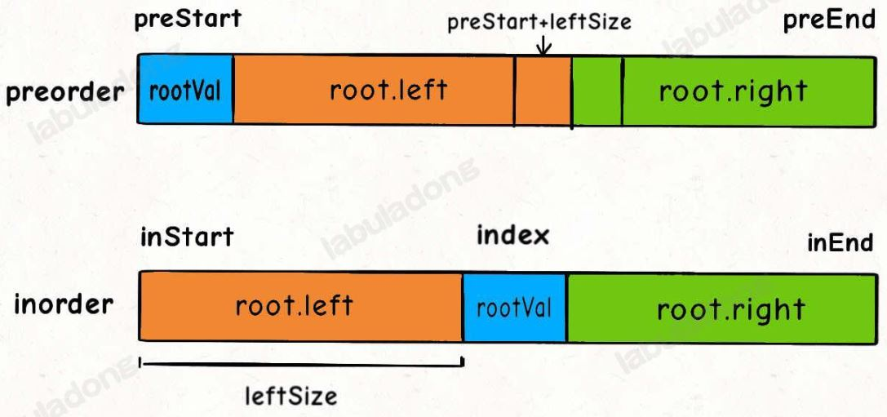

# LeetCode 热题 100

## 哈希

### [1. 两数之和](https://leetcode.cn/problems/two-sum/)

> 给定一个整数数组 `nums` 和一个整数目标值 `target`，请你在该数组中找出 **和为目标值** *`target`* 的那 **两个** 整数，并返回它们的数组下标。
>
> **示例 1：**
>
> ```
> 输入：nums = [2,7,11,15], target = 9
> 输出：[0,1]
> 解释：因为 nums[0] + nums[1] == 9 ，返回 [0, 1] 。
> ```

用哈希表辅助判断。对于一个元素 `nums[i]`，你想知道有没有另一个元素 `nums[j]` 的值为 `target - nums[i]`，这很简单，我们用一个哈希表记录每个元素的值到索引的映射，这样就能快速判断数组中是否有一个值为 `target - nums[i]` 的元素了。

```java

class Solution {
    public int[] twoSum(int[] nums, int target) {
        Map<Integer,Integer> map = new HashMap<>();
        for(int i=0;i<nums.length;i++){
            // 查表，看看是否有能和 nums[i] 凑出 target 的元素
            if(map.containsKey(target - nums[i])){
                return new int[]{i, map.get(target - nums[i])};
            }
            // 存入 val -> index 的映射
            map.put(nums[i],i);
        }
        return new int[0];
    }
}
```

### [49. 字母异位词分组](https://leetcode.cn/problems/group-anagrams/)

> 把输入中是异位词的单词放到一个list中，这些list再放到一个list中
>
> **示例 1:**
>
> ```
> 输入: strs = ["eat", "tea", "tan", "ate", "nat", "bat"]
> 输出: [["bat"],["nat","tan"],["ate","eat","tea"]]
> ```

**方法一：排序**

由于互为字母异位词的两个字符串包含的字母相同，因此对两个字符串分别进行排序之后得到的字符串一定是相同的，故可以将排序之后的字符串作为哈希表的键。

```java
class Solution {
    public List<List<String>> groupAnagrams(String[] strs) {
        Map<String, List<String>> map = new HashMap<String, List<String>>();
        for (String str : strs) {
            char[] array = str.toCharArray();
            Arrays.sort(array);
            String key = new String(array);
            List<String> list = map.getOrDefault(key, new ArrayList<String>());
            list.add(str);
            map.put(key, list);
        }
        return new ArrayList<List<String>>(map.values());
    }
}
```

**方法二：数据编码**

```java
class Solution {
    public List<List<String>> groupAnagrams(String[] strs) {
        // 编码到分组的映射
        HashMap<String, List<String>> codeToGroup = new HashMap<>();
        for (String s : strs) {
            // 对字符串进行编码
            String code = encode(s);
            // 把编码相同的字符串放在一起
            codeToGroup.putIfAbsent(code, new LinkedList<>());
            codeToGroup.get(code).add(s);
        }

        // 获取结果
        List<List<String>> res = new LinkedList<>();
        for (List<String> group : codeToGroup.values()) {
            res.add(group);
        }

        return res;
    }

    // 利用每个字符的出现次数进行编码
    String encode(String s) {
        char[] count = new char[26];
        for (char c : s.toCharArray()) {
            int delta = c - 'a';
            count[delta]++;
        }
        return new String(count);
    }
}
```

### [128. 最长连续序列](https://leetcode.cn/problems/longest-consecutive-sequence/)

> 给定一个未排序的整数数组 `nums` ，找出数字连续的最长序列（不要求序列元素在原数组中连续）的长度。请你设计并实现时间复杂度为 `O(n)` 的算法解决此问题。
>
> **示例 1：**
>
> ```
> 输入：nums = [100,4,200,1,3,2]
> 输出：4
> 解释：最长数字连续序列是 [1, 2, 3, 4]。它的长度为 4。
> ```
>
> **示例 2：**
>
> ```
> 输入：nums = [0,3,7,2,5,8,4,6,0,1]
> 输出：9
> ```

我们可以用空间换时间的思路，把数组元素放到哈希集合里面**去重**，然后去寻找连续序列的第一个元素，即可在 `O(N)` 时间找到答案。

比方说 `nums = [8,4,9,1,3,2]`，我们先找到 1，然后递增，找到了 2, 3, 4，这就是一个长度为 4 的序列。又找到 8，网上递增执照到了 9，这是一个长度为 2 的序列。虽然 for 循环嵌套 while 循环，但是每个元素只会被遍历到最多两次，所以均摊时间复杂度依然为 `O(N)`

```java
class Solution {
    public int longestConsecutive(int[] nums) {
        // 转化成哈希集合，方便快速查找是否存在某个元素
        HashSet<Integer> set = new HashSet<Integer>();
        for (int num : nums) {
            set.add(num);
        }

        int res = 0;

        for (int num : set) {
            if (set.contains(num - 1)) {
                // num 不是连续子序列的第一个，跳过
                continue;
            }
            // num 是连续子序列的第一个，开始向上计算连续子序列的长度
            int curNum = num;
            int curLen = 1;

            while (set.contains(curNum + 1)) {
                curNum += 1;
                curLen += 1;
            }
            // 更新最长连续序列的长度
            res = Math.max(res, curLen);
        }

        return res;
    }
}
```

## 双指针

### [26. 删除有序数组中的重复项](https://leetcode.cn/problems/remove-duplicates-from-sorted-array/)

> 给你一个 **非严格递增排列** 的数组 `nums` ，请你**[ 原地](http://baike.baidu.com/item/原地算法)** 删除重复出现的元素，使每个元素 **只出现一次** ，返回删除后数组的新长度。元素的 **相对顺序** 应该保持 **一致** 。然后返回 `nums` 中唯一元素的个数。
>
> 考虑 `nums` 的唯一元素的数量为 `k` ，你需要做以下事情确保你的题解可以被通过：
>
> - 更改数组 `nums` ，使 `nums` 的前 `k` 个元素包含唯一元素，并按照它们最初在 `nums` 中出现的顺序排列。`nums` 的其余元素与 `nums` 的大小不重要。
> - 返回 `k` 。

我们让慢指针 `slow` 走在后面，快指针 `fast` 走在前面探路，找到一个不重复的元素就告诉 `slow` 并让 `slow` 前进一步。这样当 `fast` 指针遍历完整个数组 `nums` 后，`nums[0..slow]` 就是不重复元素

```java
public int removeDuplicates(int[] nums) {
    if (nums.length == 0) {
        return 0;
    }
    int slow = 0, fast = 0;
    while (fast < nums.length) {
        if (nums[fast] != nums[slow]) {
            slow++;
            // 维护 nums[0..slow] 无重复
            nums[slow] = nums[fast];
        }
        fast++;
    }
    // 数组长度为索引 + 1
    return slow + 1;
}
```

### [80. 删除有序数组中的重复项 II](https://leetcode.cn/problems/remove-duplicates-from-sorted-array-ii/)

> 给你一个有序数组 `nums` ，请你**[ 原地](http://baike.baidu.com/item/原地算法)** 删除重复出现的元素，使得出现次数超过两次的元素**只出现两次** ，返回删除后数组的新长度。不要使用额外的数组空间，你必须在 **[原地 ](https://baike.baidu.com/item/原地算法)修改输入数组** 并在使用 O(1) 额外空间的条件下完成。

因为本题要求相同元素最多出现两次而非一次，所以我们需要检查上上个应该被保留的元素 nums[slow−2] 是否和当前待检查元素 nums[fast] 相同。当且仅当 nums[slow−2]=nums[fast]时，当前待检查元素 nums[fast] 不应该被保留（因为此时必然有 nums[slow−2]=nums[slow−1]）。最后，slow 即为处理好的数组的长度。

```java
public int removeDuplicates(int[] nums) {
    int n = nums.length;
    if (n <= 2) {
        return n;
    }
    int slow = 2, fast = 2;
    while (fast < n) {
        if (nums[slow - 2] != nums[fast]) {
            nums[slow] = nums[fast];
            ++slow;
        }
        ++fast;
    }
    return slow;
}
```


### [283. 移动零](https://leetcode.cn/problems/move-zeroes/)

> 给定一个数组 `nums`，编写一个函数将所有 `0` 移动到数组的末尾，同时保持非零元素的相对顺序。**请注意** ，必须在不复制数组的情况下原地对数组进行操作。
>
> **示例 1:**
>
> ```
>输入: nums = [0,1,0,3,12]
> 输出: [1,3,12,0,0]
> ```
> 
> **示例 2:**
>
> ```
>输入: nums = [0]
> 输出: [0]
> ```

一个快指针一个慢指针，快指针遇到不为0的数则存到慢指针的位置，然后慢指针加1，快指针遍历到最后的时候，再把慢指针以后的所有元素置为0

```java
class Solution {
    public void moveZeroes(int[] nums) {
        int slow = 0, fast = 0;
        while (fast < nums.length) {
            if (nums[fast] != 0) {
                nums[slow] = nums[fast];
                slow++;
            }
            fast++;
        }
        //Arrays.fill(Type[] array, int startIndex, int endIndex, Type value),startIndex和endIndex左闭右开
        Arrays.fill(nums,slow,nums.length,0);        
    }
}
```

### [11. 盛最多水的容器](https://leetcode.cn/problems/container-with-most-water/)

> 给定一个长度为 `n` 的整数数组 `height` 。有 `n` 条垂线，第 `i` 条线的两个端点是 `(i, 0)` 和 `(i, height[i])` 。找出其中的两条线，使得它们与 `x` 轴共同构成的容器可以容纳最多的水。返回容器可以储存的最大水量。
>
> **示例 1：**
>
> 
>
> ```
>输入：[1,8,6,2,5,4,8,3,7]
> 输出：49 
>解释：图中垂直线代表输入数组 [1,8,6,2,5,4,8,3,7]。在此情况下，容器能够容纳水（表示为蓝色部分）的最大值为 49。
> ```

用 left 和 right 两个指针从两端向中心收缩，一边收缩一边计算 [left, right] 之间的矩形面积，取最大的面积值即是答案。

矩形的高度是由 min(height[left], height[right]) 即较低的一边决定的，你**如果移动较低的那一边，那条边可能会变高，使得矩形的高度变大，进而就「有可能」使得矩形的面积变大**；相反，如果你去移动较高的那一边，矩形的高度是无论如何都不会变大的，所以不可能使矩形的面积变得更大。

```java
class Solution {
    public int maxArea(int[] height) {
        int left = 0, right = height.length - 1;
        int res = 0;
        while (left < right) {
            // [left, right] 之间的矩形面积
            int cur_area = Math.min(height[left], height[right]) * (right - left);
            res = Math.max(res, cur_area);
            // 双指针技巧，移动较低的一边
            if (height[left] < height[right]) {
                left++;
            } else {
                right--;
            }
        }
        return res;
    }
}
```

### [15. 三数之和](https://leetcode.cn/problems/3sum/)

> 给你一个整数数组 `nums` ，判断是否存在三元组 `[nums[i], nums[j], nums[k]]` 满足 `i != j`、`i != k` 且 `j != k` ，同时还满足 `nums[i] + nums[j] + nums[k] == 0` 。请你返回所有和为 `0` 且不重复的三元组。
>
> **注意：**答案中不可以包含重复的三元组。
>
> **示例 1：**
>
> ```
> 输入：nums = [-1,0,1,2,-1,-4]
> 输出：[[-1,-1,2],[-1,0,1]]
> 解释：
> nums[0] + nums[1] + nums[2] = (-1) + 0 + 1 = 0 。
> nums[1] + nums[2] + nums[4] = 0 + 1 + (-1) = 0 。
> nums[0] + nums[3] + nums[4] = (-1) + 2 + (-1) = 0 。
> 不同的三元组是 [-1,0,1] 和 [-1,-1,2] 。
> 注意，输出的顺序和三元组的顺序并不重要。
> ```

1. 首先对数组进行排序，然后固定一个数 nums[i]
2. 如果 nums[i]大于 0，则三数之和必然无法等于 0，结束循环
3. 如果 nums[i] == nums[i−1]，则说明该数字重复，会导致结果重复，所以应该跳过
4. 使用左右指针指向 nums[i]后面的两端，分别为 nums[left] 和 nums[right]
5. 计算三个数的和 sum 判断是否满足为 0，满足则添加进结果集
6. 当 sum == 0 时，nums[left] == nums[left+1] 则会导致结果重复，应该跳过，L++

7. 当 sum == 0 时，nums[right] == nums[right-1] 则会导致结果重复，应该跳过，R--

8. 如果sum < 0, 则说明结果偏小，应该增大nums[left]，即left+1 
9. 如果sum > 0, 则说明结果偏大，应该减小nums[right]，即right-1

```java
class Solution {
    public List<List<Integer>> threeSum(int[] nums) {
        List<List<Integer>> res = new ArrayList<>();
        //0.判断边界情况
        if(nums == null || nums.length < 3) {
            return res;
        }
        //1.首先对数组进行排序
        Arrays.sort(nums);
        //2.固定一个数 nums[i]
        for (int i = 0; i < nums.length; i++) {
            //3.如果 nums[i]大于 0，则三数之和必然无法等于 0，结束循环
            if (nums[i] > 0) {
                break;
            }
            //4.如果 nums[i] == nums[i−1]，则说明该数字重复，会导致结果重复，所以应该跳过
            if(i > 0 && nums[i] == nums[i-1]){
                continue;
            }
            //5.使用左右指针指向 nums[i]后面的两端，分别为 nums[left] 和 nums[right]
            int left = i + 1;
            int right = nums.length - 1;
            while (left < right) {
                //6.计算三个数的和 sum 判断是否满足为 0，满足则添加进结果集
                int sum = nums[i] + nums[left] + nums[right];
                if (sum == 0) {
                    res.add(Arrays.asList(nums[i], nums[left], nums[right]));
                    //7.当 sum == 0 时，nums[left] == nums[left+1] 则会导致结果重复，应该跳过，L++
                    //必须加上 left < right 条件，否则数组越界
                    while (left < right && nums[left] == nums[left+1]) {
                        left++;
                    }
                    //8.当 sum == 0 时，nums[right] == nums[right-1] 则会导致结果重复，应该跳过，R--
                    while (left < right && nums[right] == nums[right-1]) {
                        right--;
                    }
                    //再跳过两个结果进入下一个循环
                    left++;
                    right--;
                }
                //9.如果sum < 0, 则说明结果偏小，应该增大nums[left]，即left+1
                else if (sum < 0){
                    left++;
                }
                //9.如果sum > 0, 则说明结果偏大，应该减小nums[right]，即right-1
                else if (sum > 0) {
                    right--;
                }               
            }
        }
        return res;
    }
}
```

### [42. 接雨水](https://leetcode.cn/problems/trapping-rain-water/)

> 给定 `n` 个非负整数表示每个宽度为 `1` 的柱子的高度图，计算按此排列的柱子，下雨之后能接多少雨水。
>
> **示例 1：**
>
> 
>
> ```
> 输入：height = [0,1,0,2,1,0,1,3,2,1,2,1]
> 输出：6
> 解释：上面是由数组 [0,1,0,2,1,0,1,3,2,1,2,1] 表示的高度图，在这种情况下，可以接 6 个单位的雨水（蓝色部分表示雨水）。 
> ```

解题思路：

1. 设置左右指针分别指向数组最左边和最右边，初始化左右最高柱子高度
2. 计算left左边的最高柱子的高度leftMax计算right右边的最高柱子的高度rightMax
3. **left位置能接雨水的量取决于left左边最高柱子的高度, right位置能接雨水的量取决于right左边最高柱子的高度**，如果leftMax < rightMax, 则left 位置能接雨水的量为leftMax - height[left]，如果leftMax >= rightMax, 则right 位置能接雨水的量为rightMax - height[right]

双指针解法中，`leftMax` 和 `rightMax` 代表的是 `height[0..left]` 和 `height[right..end]` 的最高柱子高度。


此时的`leftMax` 是 `left` 指针左边的最高柱子，但是 `rightMax` 并不一定是 `left` 指针右边最高的柱子，这真的可以得到正确答案吗？

其实这个问题要这么思考，我们只在乎 `min(leftMax,rightMax)`。**对于上图的情况，我们已经知道 `leftMax < rightMax` 了，至于这个 `rightMax` 是不是右边最大的，不重要。重要的是 `height[i]` 能够装的水只和较低的 `leftMax` 之差有关**：


```java
class Solution {
    public int trap(int[] height) {
        int res = 0;
        //1.设置左右指针分别指向数组最左边和最右边
        int left = 0, right = height.length - 1;
        //2.初始化左右最高柱子高度
        int leftMax = 0, rightMax = 0;
        //3.开始遍历
        while (left < right) {
            //4.计算left左边的最高柱子的高度leftMax
            leftMax = Math.max(leftMax, height[left]);
            //5.计算right右边的最高柱子的高度rightMax
            rightMax = Math.max(rightMax, height[right]);
            //6.left位置能接雨水的量取决于left左边最高柱子的高度,right位置能接雨水的量取决于right左边最高柱子的高度

            //7.如果leftMax < rightMax, 则left 位置能接雨水的量为leftMax - height[left],加入结果指针继续前进
            if (leftMax < rightMax) {
                res += leftMax - height[left];
                left++;
            }
            //8.如果leftMax >= rightMax, 则right 位置能接雨水的量为rightMax - height[right],加入结果指针继续前进
            else{
                res += rightMax - height[right];
                right--;
            }
        }
        return res;
    }
}
```

## 滑动窗口

### 滑动窗口框架

```java
/* 滑动窗口算法框架 */
void slidingWindow(String s) {
    // 用合适的数据结构记录窗口中的数据
    //Integer包装类型"=="比较的是内存地址，要用"equals()"
    Map<Character, Integer> window = new HashMap<>();
	//Map<Character, Integer> need = new HashMap<>(); //可有可无
    
    int left = 0, right = 0;
    //int valid = 0; //记录结果的其他变量，可有可无
    while (right < s.length()) {
        // -----------进行窗口内数据的一系列更新-------------------
        char c = s.charAt(right);
        right++;
        if(满足扩大窗口的条件) //可有可无
            //window中若没有c则把c的value设置为0, 若有c则把c的value设置为原有值上+1
            window.put(c, window.getOrDefault(c, 0) + 1);
        	//...
        	//Integer包装类型"=="比较的是内存地址，要用"equals()"	
		// ------------------------------------------------------
        
        // 判断左侧窗口是否要收缩
        while ( window needs shrink) {
            // ----------对称进行窗口内数据的一系列更新---------------
            char d = s.charAt(left);
            left++;
            //  if(满足结果){
            //  	加入结果集或返回结果;
        	//  }          
            if(满足缩小窗口的条件) //可有可无
                //...
        		//Integer包装类型"=="比较的是内存地址，要用"equals()"	
                window.put(d, window.get(d) - 1);
            // ------------------------------------------------------
        }
    }
    //返回结果集
}
```

其中两处 `...` 表示的更新窗口数据的地方，到时候你直接往里面填就行了。而且，这两个 `...` 处的操作分别是扩大和缩小窗口的更新操作，它们操作是完全对称的。

### [3. 无重复字符的最长子串](https://leetcode.cn/problems/longest-substring-without-repeating-characters/)

> 给定一个字符串 `s` ，请你找出其中不含有重复字符的 **最长子串** 的长度。
>
> **示例 1:**
>
> ```
> 输入: s = "abcabcbb"
> 输出: 3 
> 解释: 因为无重复字符的最长子串是 "abc"，所以其长度为 3。
> ```


```java
class Solution {
    public int lengthOfLongestSubstring(String s) {
        Map<Character,Integer> window = new HashMap<>();
        int res = 0;
        //初始化滑动窗口
        int left = 0, right = 0;
        //开始向右滑动
        while (right < s.length()) {
            char r = s.charAt(right);
            //扩大窗口右边界，将元素放到窗口，并更新map[right] + 1
            window.put(r, window.getOrDefault(r, 0) + 1);
            right++;
            //出现不符合条件的元素，减小窗口
            while (window.get(r) > 1) {
                //减小窗口左边界,更新map[left] - 1, 直到满足条件
                char l = s.charAt(left);
                window.put(l, window.get(l) - 1);
                left++;
            }
            //更新结果
            res = Math.max(res, right -left);
        }
        return res;
    }
}
```

### [438. 找到字符串中所有字母异位词](https://leetcode.cn/problems/find-all-anagrams-in-a-string/)

> 给定两个字符串 `s` 和 `p`，找到 `s` 中所有 `p` 的 **异位词** 的子串，返回这些子串的起始索引。不考虑答案输出的顺序。**异位词** 指由相同字母重排列形成的字符串（包括相同的字符串）。 
>
> **示例 1:**
>
> ```
> 输入: s = "cbaebabacd", p = "abc"
> 输出: [0,6]
> 解释:
> 起始索引等于 0 的子串是 "cba", 它是 "abc" 的异位词。
> 起始索引等于 6 的子串是 "bac", 它是 "abc" 的异位词。
> ```


```java
class Solution {
    public List<Integer> findAnagrams(String s, String p) {
        //1.两个map记录字符串和窗口中的字符出现的次数
        Map<Character,Integer> need = new HashMap<>();
        Map<Character,Integer> window = new HashMap<>();
        List<Integer> res = new ArrayList<>();
        //2.统计p的各个字符出现的次数
        for (int i = 0; i < p.length(); i++) {
            need.put(p.charAt(i), need.getOrDefault(p.charAt(i), 0)+1);
        }
        //3.初始化窗口
        int left = 0,right = 0;
        //4.初始化有效字符记录
        int valid = 0;
        //5.开始滑动
        while (right < s.length()) {
            char c = s.charAt(right);
            //6.扩大窗口
            right++;
            //7.更新map
            if (need.containsKey(c)) {
                window.put(c, window.getOrDefault(c, 0) + 1);
                //Integer包装类型"=="比较的是内存地址，要用"equals()"
                if (window.get(c).equals(need.get(c))) {
                    valid++;
                }
            }
            //8.判断窗口左侧收缩
            while (right - left >= p.length()) {
                //9.当窗口符合条件时，把起始索引加入 res
                if (valid == need.size()) {
                    res.add(left);
                }
                char d = s.charAt(left);
                left++;
                //10.对称更新map
                if (need.containsKey(d)) {  
                    if (window.get(d).equals(need.get(d))) {
                        valid--;
                    }
                    window.put(d, window.get(d) - 1);
                }
            }

        }
        return res;
    }
}
```


## 字串

### [560. 和为 K 的子数组](https://leetcode.cn/problems/subarray-sum-equals-k/)

> 给你一个整数数组 `nums` 和一个整数 `k` ，请你统计并返回 *该数组中和为 `k` 的子数组的个数* 。子数组是数组中元素的连续非空序列。
>
>  **示例 1：**
>
> ```
> 输入：nums = [1,1,1], k = 2
> 输出：2
> ```

建立哈希表 mp，以前缀和为键，出现次数为对应的值，记录 pre[i] 出现的次数，从左往右边更新 mp 边计算答案，那么以 i 结尾的答案 mp[pre[i]−k]即可在 O(1)时间内得到。最后的答案即为所有下标结尾的和为 k 的子数组个数之和。

```java
class Solution {
    public int subarraySum(int[] nums, int k) {
        int ans = 0, pre = 0;
        //计算前缀和存在map中，key存前缀和的值，value表示这个前缀和出现的次数
        Map<Integer, Integer> preSum = new HashMap<>();
        preSum.put(0, 1);
        for (int i = 0; i < nums.length; i++) {
            //计算前缀和
            pre += nums[i];
            //若存在两个key相减==k则结果加上存在这个值出现的次数
            if (preSum.containsKey(pre - k)) {
                ans += preSum.get(pre - k);
            }
            //此前缀和出现的次数加一
            preSum.put(pre, preSum.getOrDefault(pre, 0) + 1);
        }
        return ans;
    }
}
```

### [53. 最大子数组和](https://leetcode.cn/problems/maximum-subarray/)

> 给你一个整数数组 `nums` ，请你找出一个具有最大和的连续子数组（子数组最少包含一个元素），返回其最大和。子数组 是数组中的一个连续部分。
>
> **示例 1：**
>
> ```
> 输入：nums = [-2,1,-3,4,-1,2,1,-5,4]
> 输出：6
> 解释：连续子数组 [4,-1,2,1] 的和最大，为 6 。
> ```

前缀和数组 `preSum` 就是 `nums` 元素的累加和，`preSum[i+1] - preSum[j]` 其实就是子数组 `nums[j..i]` 之和（根据 `preSum` 数组的实现，索引 0 是占位符，所以 `i` 有一位索引偏移）。**以 `nums[i]` 为结尾的最大子数组之和是多少？其实就是 `preSum[i+1] - min(preSum[0..i])`**。所以，我们可以利用前缀和数组计算以每个元素结尾的子数组之和，进而得到和最大的子数组：

```java
class Solution {
    public int maxSubArray(int[] nums) {
        //构造前缀和数组
        int[] preSum = new int[nums.length + 1];
        preSum[0] = 0;
        for (int i = 1; i < nums.length + 1; i++) {
            preSum[i] = preSum[i - 1] + nums[i - 1];
        }
        
        int minPre = Integer.MAX_VALUE;
        int ans = Integer.MIN_VALUE;
        for (int i = 0; i < nums.length; i++) {
            //寻找最小前缀和，即preSum[0..i] 的最小值
            minPre = Math.min(minPre, preSum[i]);
            //寻找最大连续子数组
            //以 nums[i] 结尾的最大子数组和就是 preSum[i+1] - min(preSum[0..i])
            ans = Math.max(ans, preSum[i + 1] - minPre);
        }
        return ans;
    }
}
```

### [*239. 滑动窗口最大值](https://leetcode.cn/problems/sliding-window-maximum/)

> 给你一个整数数组 `nums`，有一个大小为 `k` 的滑动窗口从数组的最左侧移动到数组的最右侧。你只可以看到在滑动窗口内的 `k` 个数字。滑动窗口每次只向右移动一位。
>
> 返回 *滑动窗口中的最大值* 。
>
> **示例 1：**
>
> ```
> 输入：nums = [1,3,-1,-3,5,3,6,7], k = 3
> 输出：[3,3,5,5,6,7]
> 解释：
> 滑动窗口的位置                最大值
> ---------------               -----
> [1  3  -1] -3  5  3  6  7       3
>  1 [3  -1  -3] 5  3  6  7       3
>  1  3 [-1  -3  5] 3  6  7       5
>  1  3  -1 [-3  5  3] 6  7       5
>  1  3  -1  -3 [5  3  6] 7       6
>  1  3  -1  -3  5 [3  6  7]      7
> ```

利用双端队列实现单调队列

既能够维护队列元素「先进先出」的时间顺序，又能够正确维护队列中所有元素的最值，这就是「单调队列」结构。

遍历数组，将 数 存放在双向队列中，并用 L,R 来标记窗口的左边界和右边界。队列中保存的并不是真的 数，而是该数值对应的数组下标位置，并且数组中的数要从大到小排序。如果当前遍历的数比队尾的值大，则需要弹出队尾值，直到队列重新满足从大到小的要求。刚开始遍历时，L 和 R 都为 0，有一个形成窗口的过程，此过程没有最大值，L 不动，R 向右移。当窗口大小形成时，L 和 R 一起向右移，每次移动时，判断队首的值的数组下标是否在 [L,R] 中，如果不在则需要弹出队首的值，当前窗口的最大值即为队首的数。

```java
public int[] maxSlidingWindow(int[] nums, int k) {
    // 双向队列 保存当前窗口最大值的数组位置 保证队列中数组位置的数值按从大到小排序
    Deque<Integer> queue = new ArrayDeque<>();
    // 结果数组
    int[] result = new int[nums.length-k+1];
    // 遍历nums数组
    for(int i = 0;i < nums.length;i++){
        // 保证从大到小 如果前面数小则需要依次弹出，直至满足要求
        while(!queue.isEmpty() && nums[queue.peekLast()] <= nums[i]){
            queue.pollLast();
        }
        // 添加当前值对应的数组下标
        queue.addLast(i);
        // 判断当前队列中队首的值是否有效
        if(queue.peek() <= i-k){
            queue.poll();   
        } 
        // 当窗口长度为k时 保存当前窗口中最大值
        if(i+1 >= k){
            result[i+1-k] = nums[queue.peek()];
        }
    }
    return result;
}
```

### [76. 最小覆盖子串](https://leetcode.cn/problems/minimum-window-substring/)

> 给你一个字符串 `s` 、一个字符串 `t` 。返回 `s` 中涵盖 `t` 所有字符的最小子串。如果 `s` 中不存在涵盖 `t` 所有字符的子串，则返回空字符串 `""` 。
>
> **注意：**
>
> - 对于 `t` 中重复字符，我们寻找的子字符串中该字符数量必须不少于 `t` 中该字符数量。
> - 如果 `s` 中存在这样的子串，我们保证它是唯一的答案。
>
> **示例 1：**
>
> ```
> 输入：s = "ADOBECODEBANC", t = "ABC"
> 输出："BANC"
> 解释：最小覆盖子串 "BANC" 包含来自字符串 t 的 'A'、'B' 和 'C'。
> ```

滑动窗口

```java
public String minWindow(String s, String t) {
    HashMap<Character,Integer> window = new HashMap<>();
    HashMap<Character,Integer> need = new HashMap<>();
    for (char c : t.toCharArray()) {
        need.put(c, need.getOrDefault(c, 0) + 1);
    }
    int left = 0, right = 0;
    int valid = 0;
    int start = 0, len = Integer.MAX_VALUE;
    while (right < s.length()){
        char c = s.charAt(right);
        right++;
        if (need.containsKey(c)){
            window.put(c, window.getOrDefault(c, 0) + 1);
            if (window.get(c).equals(need.get(c)))
                valid++;
        }
        while (valid == need.size()){
            if (right - left < len){
                start = left;
                len = right - left;
            }
            char d = s.charAt(left);
            left++;
            if (need.containsKey(d)){
                if (window.get(d).equals(need.get(d)))
                    valid--;
                window.put(d, window.getOrDefault(d, 0) - 1);
            }

        }
    }
    return len == Integer.MAX_VALUE ? "" : s.substring(start, start + len);
}
```


## 普通数组

### [56. 合并区间](https://leetcode.cn/problems/merge-intervals/)

> 以数组 `intervals` 表示若干个区间的集合，其中单个区间为 `intervals[i] = [starti, endi]` 。请你合并所有重叠的区间，并返回 *一个不重叠的区间数组，该数组需恰好覆盖输入中的所有区间* 。
>
> **示例 1：**
>
> ```
> 输入：intervals = [[1,3],[2,6],[8,10],[15,18]]
> 输出：[[1,6],[8,10],[15,18]]
> 解释：区间 [1,3] 和 [2,6] 重叠, 将它们合并为 [1,6].
> ```

一个区间可以表示为 `[start, end]`，先按区间的 `start` 排序：再进行 n−1次 两两合并。

```java
class Solution {
    public int[][] merge(int[][] intervals) {
        List<int[]> ans = new LinkedList<>();
        //1.根据每个区间的开始位置排序
        Arrays.sort(intervals,(a,b)-> {
            return a[0] - b[0];
        });
        //2.把第一段区间加入结果
        ans.add(intervals[0]);
        //3.遍历区间列表
        for (int i = 1; i < intervals.length; i++) {
            //4.取出结果列表中最后一个区间和当前区间
            int[] last = ans.getLast();
            int[] cur = intervals[i];
            //5.如果当前区间的起始位置小于最后区间的结束位置，则合并区间
            if (cur[0] <= last[1]) {
                last[1] = Math.max(cur[1], last[1]);
            }
            //6.当前区间与最后区间无重叠，直接加入结果
            else{
                ans.add(cur);
            }
        }
        return ans.toArray(new int[0][]);
    }
}
```

### [189. 轮转数组](https://leetcode.cn/problems/rotate-array/)

> 给定一个整数数组 `nums`，将数组中的元素向右轮转 `k` 个位置，其中 `k` 是非负数。
>
> **示例 1:**
>
> ```
> 输入: nums = [1,2,3,4,5,6,7], k = 3
> 输出: [5,6,7,1,2,3,4]
> 解释:
> 向右轮转 1 步: [7,1,2,3,4,5,6]
> 向右轮转 2 步: [6,7,1,2,3,4,5]
> 向右轮转 3 步: [5,6,7,1,2,3,4]
> ```

1.使用链表空间复杂度O(n)

```java
public void rotate(int[] nums, int k) {
    //1.创建链表进行轮转操作
    List<Integer> list = new LinkedList<>();
    //2.把数组中的元素尾插到链表中
    for (int i = 0; i < nums.length; i++) {
        list.addLast(nums[i]);
    }
    //3.把后k个元素头插到链表中完成轮转操作
    for (int i = 0; i < k; i++) {
        list.addFirst(list.removeLast());
    }
    //4.将轮转后的链表再放回到原来的数组
    for (int i = 0; i < nums.length; i++) {
        nums[i] = list.removeFirst();
    }
}
```

2.原地操作，空间复杂度O(1)

- 首先对整个数组实行翻转，这样子原数组中需要翻转的子数组，就会跑到数组最前面。
- 这时候，从 k 处分隔数组，左右两数组，各自进行翻转即可。

```java
class Solution {
    public void rotate(int[] nums, int k) {
        k %= nums.length;
        reverse(nums, 0, nums.length - 1);
        reverse(nums, 0, k - 1);
        reverse(nums, k, nums.length - 1);
    }
    public void reverse(int[] nums, int start, int end) {
        while (start < end) {
            int temp = nums[start];
            nums[start] = nums[end];
            nums[end] = temp;
            start += 1;
            end -= 1;
        }
    }
}
```

### [238. 除自身以外数组的乘积](https://leetcode.cn/problems/product-of-array-except-self/)

前缀和（空间优化）题目的进阶部分要求我们使用 O(1)空间来做（不算 ans 数组）。这样很好处理，按照我们解法一的思路，将两部分分开算即可：建立 ans 数组，先从前往后遍历 nums，计算每个 ans[i] 前缀乘值部分，再从后往前遍历 nums，计算每个 ans[i] 后缀乘值的部分，两部分相乘即是最终的 ans[i]。

```java
public int[] productExceptSelf(int[] nums) {
    int n = nums.length;
    int[] res = new int[nums.length];
    //1.记录前缀积
    int sum = 1;
    //2.计算前缀积
    for (int i = 1; i <= n; i++) {
        res[i - 1] = sum;
        sum = sum * nums[i - 1];
    }
    sum = 1;
    //3.计算后缀积
    for (int i = n; i >= 1; i--) {
        res[i - 1] = sum * res[i - 1];
        sum = sum * nums[i - 1];
    }
    return res;
}
```

### [41. 缺失的第一个正数](https://leetcode.cn/problems/first-missing-positive/)

> 给你一个未排序的整数数组 `nums` ，请你找出其中没有出现的最小的正整数。请你实现时间复杂度为 `O(n)` 并且只使用常数级别额外空间的解决方案。
>
> **示例 1：**
>
> ```
> 输入：nums = [1,2,0]
> 输出：3
> 解释：范围 [1,2] 中的数字都在数组中。
> ```

可以使用置换的方法，将给定的数组「恢复」成下面的形式：如果数组中包含 x∈[1,N]，那么恢复后，数组的第 x−1个元素为 x。

在恢复后，数组应当有 [1, 2, ..., N] 的形式，但其中有若干个位置上的数是错误的，每一个错误的位置就代表了一个缺失的正数。以题目中的示例二 [3, 4, -1, 1] 为例，恢复后的数组应当为 [1, -1, 3, 4]，我们就可以知道缺失的数为 2。

那么我们如何将数组进行恢复呢？我们可以对数组进行一次遍历，对于遍历到的数 x=nums[i]，如果 x∈[1,N]，我们就知道 x 应当出现在数组中的 x−1 的位置，因此交换 nums[i] 和 nums[x−1]，这样 x 就出现在了正确的位置。在完成交换后，新的 nums[i]可能还在 [1,N] 的范围内，我们需要继续进行交换操作，直到 x∉[1,N]。

注意到上面的方法可能会陷入死循环。如果 nums[i] 恰好与 nums[x−1] 相等，那么就会无限交换下去。此时我们有 nums[i] = x = nums[x−1]，说明 x 已经出现在了正确的位置。因此我们可以跳出循环，开始遍历下一个数。

由于每次的交换操作都会使得某一个数交换到正确的位置，因此交换的次数最多为 N，整个方法的时间复杂度为 O(N)。

```java
public int firstMissingPositive(int[] nums) {
    int n = nums.length;
    for (int i = 0; i < n; ++i) {
        while (nums[i] > 0 && nums[i] <= n && nums[nums[i] - 1] != nums[i]) {
            int temp = nums[nums[i] - 1];
            nums[nums[i] - 1] = nums[i];
            nums[i] = temp;
        }
    }
    for (int i = 0; i < n; ++i) {
        if (nums[i] != i + 1) {
            return i + 1;
        }
    }
    return n + 1;
}
```

### [88. 合并两个有序数组](https://leetcode.cn/problems/merge-sorted-array/)

> 给你两个按 **非递减顺序** 排列的整数数组 `nums1` 和 `nums2`，另有两个整数 `m` 和 `n` ，分别表示 `nums1` 和 `nums2` 中的元素数目。请你 **合并** `nums2` 到 `nums1` 中，使合并后的数组同样按 **非递减顺序** 排列。**注意：**最终，合并后数组不应由函数返回，而是存储在数组 `nums1` 中。为了应对这种情况，`nums1` 的初始长度为 `m + n`，其中前 `m` 个元素表示应合并的元素，后 `n` 个元素为 `0` ，应忽略。`nums2` 的长度为 `n` 。
>
> ```
> 输入：nums1 = [1,2,3,0,0,0], m = 3, nums2 = [2,5,6], n = 3
> 输出：[1,2,2,3,5,6]
> 解释：需要合并 [1,2,3] 和 [2,5,6] 。
> 合并结果是 [1,2,2,3,5,6] ，其中斜体加粗标注的为 nums1 中的元素。
> ```

对于单链表来说，我们直接用双指针从头开始合并即可，但对于数组来说会出问题。因为题目让我直接把结果存到 `nums1` 中，而 `nums1` 的开头有元素，如果我们无脑复制单链表的逻辑，会覆盖掉 `nums1` 的原始元素，导致错误。

但 `nums1` 后面是空的呀，所以这道题需要我们稍微变通一下：**将双指针初始化在数组的尾部，然后从后向前进行合并**，这样即便覆盖了 `nums1` 中的元素，这些元素也必然早就被用过了，不会影响答案的正确性。

```java
public void merge(int[] nums1, int m, int[] nums2, int n) {
    int i = m - 1, j = n -1;
    int p = nums1.length - 1;
    // 从后向前生成结果数组，类似合并两个有序链表的逻辑
    while (i >= 0 && j >= 0){
        if (nums1[i] > nums2[j]){
            nums1[p] = nums1[i];
            i--;
        }
        else {
            nums1[p] = nums2[j];
            j--;
        }
        p--;
    }
    // 可能其中一个数组的指针走到尽头了，而另一个还没走完
    // 因为我们本身就是在往 nums1 中放元素，所以只需考虑 nums2 是否剩元素即可
    while (j >= 0){
        nums1[p] = nums2[j];
        j--;
        p--;
    }
}
```


## 矩阵

### [73. 矩阵置零](https://leetcode.cn/problems/set-matrix-zeroes/)

> 给定一个 `*m* x *n*` 的矩阵，如果一个元素为 **0** ，则将其所在行和列的所有元素都设为 **0** 。请使用 **[原地](http://baike.baidu.com/item/原地算法)** 算法**。**
>
> **示例 1：**
>
> 
>
> ```
> 输入：matrix = [[1,1,1],[1,0,1],[1,1,1]]
> 输出：[[1,0,1],[0,0,0],[1,0,1]]
> ```

两遍扫 matrix , 第一遍用集合记录哪些行 , 哪些列有 0 ; 第二遍置 0

```java
class Solution {
    public void setZeroes(int[][] matrix) {
        //1.初始化集合
        Set<Integer> row = new HashSet<>();
        Set<Integer> column = new HashSet<>();
        //2.遍历网格 若为0 则将此行此列加入集合
        for (int i = 0; i < matrix.length; i++) {
            for (int j = 0; j < matrix[0].length; j++) {
                if (matrix[i][j] == 0) {
                    row.add(i);
                    column.add(j);
                }
            }
        }
        //3.若集合中包含此行或者此列则置为0
        for (int i = 0; i < matrix.length; i++) {
            for (int j = 0; j < matrix[0].length; j++) {
                if (row.contains(i) || column.contains(j)) {
                    matrix[i][j] = 0;
                }
            }
        }
    }
}
```

思路二: 用O(1)空间

用matrix第一行和第一列记录该行该列是否有0,作为标志位，但是对于第一行,和第一列要设置一个标志位,为了防止自己这一行(一列)也有0的情况.注释写在代码里,直接看代码很好理解!

### [54. 螺旋矩阵](https://leetcode.cn/problems/spiral-matrix/)

> 给你一个 `m` 行 `n` 列的矩阵 `matrix` ，请按照 **顺时针螺旋顺序** ，返回矩阵中的所有元素。
>
> **示例 1：**
>
> 
>
> ```
> 输入：matrix = [[1,2,3],[4,5,6],[7,8,9]]
> 输出：[1,2,3,6,9,8,7,4,5]
> ```

**解题的核心思路是按照右、下、左、上的顺序遍历数组，并使用四个变量圈定未遍历元素的边界**：随着螺旋遍历，相应的边界会收缩，直到螺旋遍历完整个数组：

```java
public List<Integer> spiralOrder(int[][] matrix) {
    int m = matrix.length, n = matrix[0].length;
    int upper_bound = 0, lower_bound = m - 1;
    int left_bound = 0, right_bound = n - 1;
    List<Integer> res = new LinkedList<>();
    // res.size() == m * n 则遍历完整个数组
    while (res.size() < m * n) {
        if (upper_bound <= lower_bound) {
            // 在顶部从左向右遍历
            for (int j = left_bound; j <= right_bound; j++) {
                res.add(matrix[upper_bound][j]);
            }
            // 上边界下移
            upper_bound++;
        }
        
        if (left_bound <= right_bound) {
            // 在右侧从上向下遍历
            for (int i = upper_bound; i <= lower_bound; i++) {
                res.add(matrix[i][right_bound]);
            }
            // 右边界左移
            right_bound--;
        }
        
        if (upper_bound <= lower_bound) {
            // 在底部从右向左遍历
            for (int j = right_bound; j >= left_bound; j--) {
                res.add(matrix[lower_bound][j]);
            }
            // 下边界上移
            lower_bound--;
        }
        
        if (left_bound <= right_bound) {
            // 在左侧从下向上遍历
            for (int i = lower_bound; i >= upper_bound; i--) {
                res.add(matrix[i][left_bound]);
            }
            // 左边界右移
            left_bound++;
        }
    }
    return res;
}
```

### [48. 旋转图像](https://leetcode.cn/problems/rotate-image/)

> 给定一个 *n* × *n* 的二维矩阵 `matrix` 表示一个图像。请你将图像顺时针旋转 90 度。你必须在**[ 原地](https://baike.baidu.com/item/原地算法)** 旋转图像，这意味着你需要直接修改输入的二维矩阵。**请不要** 使用另一个矩阵来旋转图像。
>
> **示例 1：**
>
> 
>
> ```
> 输入：matrix = [[1,2,3],[4,5,6],[7,8,9]]
> 输出：[[7,4,1],[8,5,2],[9,6,3]]
> ```

**先把二维矩阵沿对角线反转，然后反转矩阵的每一行，结果就是顺时针反转整个矩阵。**

```java
public void rotate(int[][] matrix) {
    int m = matrix.length, n = matrix[0].length;
    int temp;
    //1.将矩阵根据主对角线对称翻转
    for (int i = 1; i < m; i++) {
        for (int j = 0; j < i; j++) {
            temp = matrix[i][j];
            matrix[i][j] = matrix[j][i];
            matrix[j][i] = temp;
        }
    }
    //2.将矩阵每一行左右翻转
    for (int i = 0; i < m; i++) {
        for (int j = 0; j < n / 2; j++) {
            temp = matrix[i][j];
            matrix[i][j] = matrix[i][n - 1 - j];
            matrix[i][n - 1 - j] = temp;
        }
    }
}
```

### [240. 搜索二维矩阵 II](https://leetcode.cn/problems/search-a-2d-matrix-ii/)

> 编写一个高效的算法来搜索 `*m* x *n*` 矩阵 `matrix` 中的一个目标值 `target` 。该矩阵具有以下特性：
>
> - 每行的元素从左到右升序排列。
> - 每列的元素从上到下升序排列。
>
> **示例 1：**
>
> 
>
> ```
> 输入：matrix = [[1,4,7,11,15],[2,5,8,12,19],[3,6,9,16,22],[10,13,14,17,24],[18,21,23,26,30]], target = 5
> 输出：true
> ```

从右上角开始，规定只能向左或向下移动。如果向左移动，元素在减小，如果向下移动，元素在增大，这样的话我们就可以根据当前位置的元素和 `target` 的相对大小来判断应该往哪移动，不断接近从而找到 `target` 的位置。

```java
public boolean searchMatrix(int[][] matrix, int target) {
    int m = matrix.length, n = matrix[0].length;
    int i = 0, j = n - 1;
    while (i < m && j >= 0){
        if (matrix[i][j] == target)
            return true;
        else if (matrix[i][j] > target) {
            j--;
        } else if (matrix[i][j] < target) {
            i++;
        }
    }
    return false;
}
```


## 链表

### [160. 相交链表](https://leetcode.cn/problems/intersection-of-two-linked-lists/)

> 给你两个单链表的头节点 `headA` 和 `headB` ，请你找出并返回两个单链表相交的起始节点。如果两个链表不存在相交节点，返回 `null` 。
>
> 图示两个链表在节点 `c1` 开始相交**：**
>
> [](https://assets.leetcode-cn.com/aliyun-lc-upload/uploads/2018/12/14/160_statement.png)
>
> 题目数据 **保证** 整个链式结构中不存在环。**注意**，函数返回结果后，链表必须 **保持其原始结构** 。

如果用两个指针 `p1` 和 `p2` 分别在两条链表上前进，并不能**同时**走到公共节点，也就无法得到相交节点 `c1`。**解决这个问题的关键是，通过某些方式，让 `p1` 和 `p2` 能够同时到达相交节点 `c1`。**如果用两个指针 `p1` 和 `p2` 分别在两条链表上前进，我们可以让 `p1` 遍历完链表 `A` 之后开始遍历链表 `B`，让 `p2` 遍历完链表 `B` 之后开始遍历链表 `A`，这样相当于「逻辑上」两条链表接在了一起。如果这样进行拼接，就可以让 `p1` 和 `p2` 同时进入公共部分，也就是同时到达相交节点 `c1`：


```java
public class Solution {
    public ListNode getIntersectionNode(ListNode headA, ListNode headB) {
        //1.初始化前进指针p = A, q = B
        ListNode p = headA, q = headB;
        //2.当两指针不相交时
        while (p != q) {
            //3.p指针若走到头，则指向B
            if (p == null) {
                p = headB;
            }
            else{
                p = p.next;
            }
            //4.q指针若走到头，则指向A
            if (q == null) {
                q = headA;
            }
            else{
                q = q.next;
            }
        }
        //5.返回p或q
        return p;   
    }
}
```

### [206. 反转链表](https://leetcode.cn/problems/reverse-linked-list/)

> 给你单链表的头节点 `head` ，请你反转链表，并返回反转后的链表。
>
> **示例 1：**
>
> 
>
> ```
> 输入：head = [1,2,3,4,5]
> 输出：[5,4,3,2,1]
> ```

1. 申请两个指针，第一个指针叫 pre，最初是指向 null 的。

2. 第二个指针 cur 指向 head，然后不断遍历 cur。
3. 每次迭代到 cur，先把cur的next用next保存起来，再将 cur 的 next 指向 pre，然后 pre 和 cur 前进一位。
4. 都迭代完了(cur 变成 null 了)，pre 就是最后一个节点了。

```java
class Solution {
    public ListNode reverseList(ListNode head) {
        //1.申请cur指向head，pre指向null
        ListNode pre = null;
        ListNode cur = head;
        while (cur != null) {
            //2.记录当前节点下一节点next
            ListNode next = cur.next;
            //3.当前节点指向前驱节点pre
            cur.next = pre;
            //4.当前节点cur和前驱节点pre都前进
            pre = cur;
            cur = next;
        }
        return pre;
    }
}
```

### [234. 回文链表](https://leetcode.cn/problems/palindrome-linked-list/)

> 给你一个单链表的头节点 `head` ，请你判断该链表是否为回文链表。如果是，返回 `true` ；否则，返回 `false` 。
>
> ```
> 输入：head = [1,2,2,1]
> 输出：true
> ```

先遍历一遍链表，将链表压入栈中，再重新遍历链表同时与弹出栈的元素相比较，若不相同则直接返回false

```java
class Solution {
    public boolean isPalindrome(ListNode head) {
        //1.将链表放入栈内
        LinkedList<Integer> stack = new LinkedList<>();
        ListNode p = head;
        while (p != null) {
            stack.push(p.val);
            p = p.next;
        }
        //2.出栈比较链表
        ListNode q = head;
        while (q != null) {
            Integer pop = stack.pop();
            if (pop != q.val) {
                return false;
            }
            q = q.next;
        }
        return true;
    }
}
```

### [141. 环形链表](https://leetcode.cn/problems/linked-list-cycle/)

给你一个链表的头节点 `head` ，判断链表中是否有环。如果链表中存在环 ，则返回 `true` 。 否则，返回 `false` 。

使用双指针技巧中的快慢指针，每当慢指针 `slow` 前进一步，快指针 `fast` 就前进两步。如果 `fast` 最终遇到空指针，说明链表中没有环；如果 `fast` 最终和 `slow` 相遇，那肯定是 `fast` 超过了 `slow` 一圈，说明链表中含有环。

```java
public class Solution {
    public boolean hasCycle(ListNode head) {
        //1.初始化快慢指针
        ListNode slow = head, fast = head;
        //2.慢指针每次前进一步，快指针每次前进两步
        while (fast != null && fast.next != null) {
            fast = fast.next.next;
            slow = slow.next;
            //3.若快慢指针相遇则有环
            if (fast == slow) {
                return true;
            }
        }
        //4.若快指针遇到null则无环
        return false;
    }
}
```

### [*142. 环形链表 II](https://leetcode.cn/problems/linked-list-cycle-ii/)

> 给定一个链表的头节点  `head` ，返回链表开始入环的第一个节点。 *如果链表无环，则返回 `null`。*如果链表中有某个节点，可以通过连续跟踪 `next` 指针再次到达，则链表中存在环。 为了表示给定链表中的环，评测系统内部使用整数 `pos` 来表示链表尾连接到链表中的位置（**索引从 0 开始**）。如果 `pos` 是 `-1`，则在该链表中没有环。**注意：`pos` 不作为参数进行传递**，仅仅是为了标识链表的实际情况。**不允许修改** 链表。 
>
> **示例 1：**
>
> 
>
> ```
> 输入：head = [3,2,0,-4], pos = 1
> 输出：返回索引为 1 的链表节点
> 解释：链表中有一个环，其尾部连接到第二个节点。
> ```

我们假设快慢指针相遇时，慢指针 `slow` 走了 `k` 步，那么快指针 `fast` 一定走了 `2k` 步：


`fast` 一定比 `slow` 多走了 `k` 步，这多走的 `k` 步其实就是 `fast` 指针在环里转圈圈，所以 `k` 的值就是环长度的「整数倍」。

假设相遇点距环的起点的距离为 `m`，那么结合上图的 `slow` 指针，环的起点距头结点 `head` 的距离为 `k - m`，也就是说如果从 `head` 前进 `k - m` 步就能到达环起点。

巧的是，如果从相遇点继续前进 `k - m` 步，也恰好到达环起点：


所以，只要我们把快慢指针中的任一个重新指向 `head`，然后两个指针同速前进，`k - m` 步后一定会相遇，相遇之处就是环的起点了。

```java
public class Solution {
    public ListNode detectCycle(ListNode head) {
        //1.初始化快慢指针
        ListNode slow = head, fast = head;
        //2.开始遍历链表
        while (fast != null && fast.next != null) {
            fast = fast.next.next;
            slow = slow.next;
            //3.若fast和slow相遇 则说明有环 进行后面操作
            if (slow == fast) {
                break;
            }       
        }
        //4.若fast遇到空 则说明没有环 返回null
        if (fast == null || fast.next == null) {
            // fast 遇到空指针说明没有环
            return null;
        }
        //*5.slow重新指向头结点 快慢指针同步前进 相交点就是环起点
        slow = head;
        while (slow != fast) {
            fast = fast.next;
            slow = slow.next;
        }
        return slow;
    }
}
```

### [21. 合并两个有序链表](https://leetcode.cn/problems/merge-two-sorted-lists/)

> 将两个升序链表合并为一个新的 **升序** 链表并返回。新链表是通过拼接给定的两个链表的所有节点组成的。 
>
> **示例 1：**
>
> ```
> 输入：l1 = [1,2,4], l2 = [1,3,4]
> 输出：[1,1,2,3,4,4]
> ```


```java
public ListNode mergeTwoLists(ListNode list1, ListNode list2) {
    //1.初始化头结点
    ListNode dummy = new ListNode();
    ListNode d = dummy;
    ListNode p = list1, q = list2;
    //2.遍历两个链表将较小的节点加入结果
    while(p != null && q != null){
        if(p.val < q.val){
            d.next = p;
            p = p.next;
        }
        else{
            d.next = q;
            q = q.next;
        }
        d = d.next;
    }
    //3.如果第一个链表还有剩余 则接到结果后
    if(p != null){
        d.next = p;
    }
    //4.如果第二个链表还有剩余 则接到结果后
    else if(q != null){
        d.next = q;
    }
    return dummy.next;
}
```

### [2. 两数相加](https://leetcode.cn/problems/add-two-numbers/)

> 给你两个 **非空** 的链表，表示两个非负的整数。它们每位数字都是按照 **逆序** 的方式存储的，并且每个节点只能存储 **一位** 数字。请你将两个数相加，并以相同形式返回一个表示和的链表。你可以假设除了数字 0 之外，这两个数都不会以 0 开头。
>
> **示例 1：**
>
> 
>
> ```
> 输入：l1 = [2,4,3], l2 = [5,6,4]
> 输出：[7,0,8]
> 解释：342 + 465 = 807.
> ```


```java
public ListNode addTwoNumbers(ListNode l1, ListNode l2) {
    //1.初始化两节点和结果集
    ListNode dummy = new ListNode(0);
    ListNode r = dummy;
    ListNode p = l1, q = l2;
    //记录进位
    int carry = 0;
    //2.开始遍历两个链表 两条链表走完且没有进位时才能结束循环
    while(p != null || q != null || carry > 0){
        // 先加上上次的进位
        int sum = carry;
        if (p != null) {
            sum += p.val;
            p = p.next;
        }
        if (q != null) {
            sum += q.val;
            q = q.next;
        }
        carry = sum / 10;
        sum = sum % 10;
        // 构建新节点
        r.next = new ListNode(sum);
        r = r.next;
    }     
    return dummy.next;
}
```

### [19. 删除链表的倒数第 N 个结点](https://leetcode.cn/problems/remove-nth-node-from-end-of-list/)

> 给你一个链表，删除链表的倒数第 `n` 个结点，并且返回链表的头结点。
>
> **示例 1：**
>
> 
>
> ```
> 输入：head = [1,2,3,4,5], n = 2
> 输出：[1,2,3,5]
> ```

在链表头部接一个虚拟节点 `dummy` 是为了避免删除倒数第一个元素时出现空指针异常，在头部加入 `dummy` 节点并不影响尾部倒数第 `k` 个元素是什么。要删除倒数第 `n` 个节点，就得获得倒数第 `n + 1` 个节点的引用，加了虚拟头节点接可以直接获取倒数第n+1个节点

```java
public ListNode removeNthFromEnd(ListNode head, int n) {      
    //1.建立虚拟头节点接在head之前
    ListNode dummy = new ListNode(-1);
    dummy.next = head;
    //2.初始化快慢指针 让快指针先走n步
    ListNode slow = dummy, fast = dummy;
    for (int i = 0; i < n; i++) {
        fast = fast.next;
    }
    //3.让快指针和慢指针一起走直到快指针走到链表末尾最后一个节点
    while (fast.next != null) {
        slow = slow.next;
        fast = fast.next;
    }
    //4.当快指针走到链表末尾最后一个节点时 慢指针下一个节点即为要删除的节点
    slow.next = slow.next.next;
    return dummy.next;
}
```

### [24. 两两交换链表中的节点](https://leetcode.cn/problems/swap-nodes-in-pairs/)

> 给你一个链表，两两交换其中相邻的节点，并返回交换后链表的头节点。你必须在不修改节点内部的值的情况下完成本题（即，只能进行节点交换）。
>
> **示例 1：**
>
> 
>
> ```
> 输入：head = [1,2,3,4]
> 输出：[2,1,4,3]
> ```


```java
public ListNode swapPairs(ListNode head) {
    //1.递归结束条件
    if (head == null || head.next == null) {
        return head;
    }
    ListNode first = head;
    ListNode second = first.next;
    ListNode others = second.next;
    //2.把前两个元素反转
    second.next = first;
    //3.利用递归将后面的节点两两反转接到后面
    first.next = swapPairs(others);
    //4.返回新的头结点
    return second;
}
```

### [138. 随机链表的复制](https://leetcode.cn/problems/copy-list-with-random-pointer/)


```java
public Node copyRandomList(Node head) {
    //1.新链表的虚拟头节点
    Node dummy = new Node(-1);
    Node p = head, q = dummy;
    //2.建立 原链表 到 新链表 的映射
    Map<Node, Node> map = new HashMap<>();
    //3.第一次遍历链表 构建新链表填充next域 并构建映射
    while (p != null) {
        Node newNode = new Node(p.val);
        q.next = newNode;
        map.put(p, newNode);
        q = q.next;
        p = p.next;
    }
    Node p2 = head, q2 = dummy.next;
    //4.第二次遍历链表 利用map填充random域
    while (p2 != null) {
        q2.random = map.get(p2.random);
        p2 = p2.next;
        q2 = q2.next;
    }
    return dummy.next;
}
```

### [146. LRU 缓存](https://leetcode.cn/problems/lru-cache/)

> 请你设计并实现一个满足 [LRU (最近最少使用) 缓存](https://baike.baidu.com/item/LRU) 约束的数据结构。
>
> 实现 `LRUCache` 类：
>
> - `LRUCache(int capacity)` 以 **正整数** 作为容量 `capacity` 初始化 LRU 缓存
> - `int get(int key)` 如果关键字 `key` 存在于缓存中，则返回关键字的值，否则返回 `-1` 。
> - `void put(int key, int value)` 如果关键字 `key` 已经存在，则变更其数据值 `value` ；如果不存在，则向缓存中插入该组 `key-value` 。如果插入操作导致关键字数量超过 `capacity` ，则应该 **逐出** 最久未使用的关键字。
>
> 函数 `get` 和 `put` 必须以 `O(1)` 的平均时间复杂度运行。
>
> **示例：**
>
> ```
> 输入
> ["LRUCache", "put", "put", "get", "put", "get", "put", "get", "get", "get"]
> [[2], [1, 1], [2, 2], [1], [3, 3], [2], [4, 4], [1], [3], [4]]
> 输出
> [null, null, null, 1, null, -1, null, -1, 3, 4]
> ```

要让 `put` 和 `get` 方法的时间复杂度为 `O(1)`，我们可以总结出 `cache` 这个数据结构必要的条件：

1、显然 `cache` 中的元素必须有时序，以区分最近使用的和久未使用的数据，当容量满了之后要删除最久未使用的那个元素腾位置。

2、我们要在 `cache` 中快速找某个 `key` 是否已存在并得到对应的 `val`；

3、每次访问 `cache` 中的某个 `key`，需要将这个元素变为最近使用的，也就是说 `cache` 要支持在任意位置快速插入和删除元素。

哈希表查找快，但是数据无固定顺序；链表有顺序之分，插入删除快，但是查找慢，所以结合二者的长处，可以形成一种新的数据结构：哈希链表 `LinkedHashMap`：

```java
class LRUCache {
    int cap;
    LinkedHashMap<Integer, Integer> cache = new LinkedHashMap<>();
    public LRUCache(int capacity) {
        this.cap = capacity;
    }
    
    public int get(int key) {
        if (!cache.containsKey(key)) {
            return -1;
        }
        //把访问的节点放到队尾
        int val = cache.get(key);
        cache.remove(key);
        cache.put(key, val);

        return cache.get(key);

    }
    
    public void put(int key, int value) {
        //如果存在该键 先删除
        if (cache.containsKey(key)) {
            cache.remove(key);       
        }
        //如果超出容量 则删除队头元素
        if (cache.size() >= this.cap) {
            int oldestKey = cache.keySet().iterator().next();
            cache.remove(oldestKey);
        }
        //把要加入的元素加到队尾
        cache.put(key, value);
    }
}
```

### [*25. K 个一组翻转链表](https://leetcode.cn/problems/reverse-nodes-in-k-group/)

> 给你链表的头节点 `head` ，每 `k` 个节点一组进行翻转，请你返回修改后的链表。`k` 是一个正整数，它的值小于或等于链表的长度。如果节点总数不是 `k` 的整数倍，那么请将最后剩余的节点保持原有顺序。你不能只是单纯的改变节点内部的值，而是需要实际进行节点交换。
>
> 
>
> ```
> 输入：head = [1,2,3,4,5], k = 2
> 输出：[2,1,4,3,5]
> ```

1、先反转以 `head` 开头的 `k` 个元素。

2、将第 `k + 1` 个元素作为 `head` 递归调用 `reverseKGroup` 函数。

3、将上述两个过程的结果连接起来。

```java
class Solution {
    // 反转区间 [a, b) 的元素，注意是左闭右开
    public ListNode reverseBetween(ListNode a, ListNode b) {
        //1.申请cur指向head，pre指向null
        ListNode pre, cur, next;
        pre = null;
        cur = a;
        next = a;
        while(cur != b){
            //2.记录当前节点下一节点next
            next = cur.next;
            //3.当前节点指向前驱节点pre
            cur.next = pre;
            //4.当前节点cur和前驱节点pre都前进
            pre = cur;
            cur = next;
        }
        return pre;
    }
    public ListNode reverseKGroup(ListNode head, int k) {
        if (head == null)
            return head;
        // 区间 [a, b) 包含 k 个待反转元素
        ListNode a, b;
        a = b = head;
        for (int i = 0; i < k; i++) {
            // 不足 k 个，不需要反转，base case
            if (b == null) return head;
            b = b.next;
        }
        // 此时b为第k+1个元素 反转前 k 个元素
        ListNode newHead = reverseBetween(a, b);
        // 递归反转后续链表并连接起来
        a.next = reverseKGroup(b, k);
        return newHead;
    }
}
```

### [*23. 合并 K 个升序链表](https://leetcode.cn/problems/merge-k-sorted-lists/)

给你一个链表数组，每个链表都已经按升序排列。请你将所有链表合并到一个升序链表中，返回合并后的链表。

```
输入：lists = [[1,4,5],[1,3,4],[2,6]]
输出：[1,1,2,3,4,4,5,6]
解释：链表数组如下：
[
  1->4->5,
  1->3->4,
  2->6
]
将它们合并到一个有序链表中得到。
1->1->2->3->4->4->5->6
```

把链表节点放入一个最小堆，就可以每次获得 `k` 个节点中的最小节点：优先队列 `pq` 中的元素个数最多是 `k`，所以一次 `poll` 或者 `add` 方法的时间复杂度是 `O(logk)`；所有的链表节点都会被加入和弹出 `pq`，**所以算法整体的时间复杂度是 `O(Nlogk)`，其中 `k` 是链表的条数，`N` 是这些链表的节点总数**。

```java
public ListNode mergeKLists(ListNode[] lists) {
    if (lists.length == 0) {
        return null;
    }
    //1.建立虚拟头节点和优先队列
    ListNode dummy = new ListNode(0);
    ListNode p = dummy;
    PriorityQueue<ListNode> pq = new PriorityQueue<>(lists.length,(a,b)->(a.val - b.val));
    //2.将k个链表的头结点放进优先队列
    for (int i = 0; i < lists.length; i++) {
        if (lists[i] != null) {
            pq.offer(lists[i]);
        }
    }
    //3.当pq不为空的时候将队首元素出队并将下个元素入队
    while (!pq.isEmpty()) {
        ListNode cur = pq.poll();
        p.next = cur;
        if (cur.next != null) {
            pq.offer(cur.next);
        }
        p = p.next;
    }
    return dummy.next;
}
```

### [148. 排序链表](https://leetcode.cn/problems/sort-list/)

> 给你链表的头结点 `head` ，请将其按 **升序** 排列并返回 **排序后的链表** 。
>
> **示例 1：**
>
> 
>
> ```
> 输入：head = [4,2,1,3]
> 输出：[1,2,3,4]
> ```

自己的方法时间复杂度O(nlogn)空间复杂度O(n)

```java
public ListNode sortList(ListNode head) {
    PriorityQueue<ListNode> pq = new PriorityQueue<>((a,b)->(a.val - b.val));
    ListNode p = head;
    while (p != null){
        pq.offer(p);
        p = p.next;
    }
    ListNode dummy = new ListNode(0);
    ListNode q = dummy;
    while (!pq.isEmpty()){
        q.next = pq.poll();
        q = q.next;
    }
    q.next = null;
    return dummy.next;
}
```


## 二叉树

### [94. 二叉树的中序遍历](https://leetcode.cn/problems/binary-tree-inorder-traversal/)

无需多言

```java
class Solution {
    List<Integer> ans = new ArrayList<>();
    public List<Integer> inorderTraversal(TreeNode root) {
        inOrder(root);
        return ans;
    }
    public void inOrder(TreeNode root){
        if (root == null) {
            return;
        }
        inOrder(root.left);
        ans.add(root.val);
        inOrder(root.right);
    }
}
```

### [104. 二叉树的最大深度](https://leetcode.cn/problems/maximum-depth-of-binary-tree/)

无需多言

```java
class Solution {
    public int maxDepth(TreeNode root) {
        //1.递归结束条件
        if (root == null) {
            return 0;
        }
        //2.递归左右子树的最大深度加一       
        return Math.max(maxDepth(root.left), maxDepth(root.right)) + 1;
    }
}
```

### [226. 翻转二叉树](https://leetcode.cn/problems/invert-binary-tree/)

给你一棵二叉树的根节点 `root` ，翻转这棵二叉树，并返回其根节点。

**示例 1：**


```
输入：root = [4,2,7,1,3,6,9]
输出：[4,7,2,9,6,3,1]
```


```java
class Solution { 
    public TreeNode invertTree(TreeNode root) {
        //调用递归函数
        return traverse(root);
    }
    public TreeNode traverse(TreeNode root){
        //1.判断递归结束条件
        if (root == null) {
            return root;
        }
        //2.递归交换左右子树
        TreeNode temp = traverse(root.left);
        root.left =  traverse(root.right);
        root.right = temp;
        return root;
    }
}
```

### [*101. 对称二叉树](https://leetcode.cn/problems/symmetric-tree/)

给你一个二叉树的根节点 `root` ， 检查它是否轴对称。

**示例 1：**


```
输入：root = [1,2,2,3,4,4,3]
输出：true
```

递归的终止条件为left 和 right 不等，其中一个为空或者 left 和 right 都为空
递归的比较 left，left 和 right.right，递归比较 left，right 和 right.left

```java
class Solution {
    public boolean isSymmetric(TreeNode root) {
        if(root == null) return true;
        return traverse(root.left, root.right);
    }
    public boolean traverse(TreeNode left, TreeNode right){
        //1.递归的终止条件是：
        //两个节点都为空，两个节点中有一个为空，两个节点的值不相等
        if (left == null && right == null) {
            return true;
        }
        if (left == null || right == null) {
            return false;
        }
        if (left.val != right.val) {
            return false;
        }
        //2.递归比较左子树的左子树，右子树的右子树 和 左子树的右子树，右子树的左子树
        return traverse(left.left, right.right) && traverse(left.right, right.left);
    } 
}
```

### [*543. 二叉树的直径](https://leetcode.cn/problems/diameter-of-binary-tree/)

> 你一棵二叉树的根节点，返回该树的 **直径** 。二叉树的 **直径** 是指树中任意两个节点之间最长路径的 **长度** 。这条路径可能经过也可能不经过根节点 `root` 。两节点之间路径的 **长度** 由它们之间边数表示。
>
> **示例 1：**
>
> 
>
> ```
> 输入：root = [1,2,3,4,5]
> 输出：3
> 解释：3 ，取路径 [4,2,1,3] 或 [5,2,1,3] 的长度。
> ```

所谓二叉树的直径，就是左右子树的最大深度之和，那么直接的想法是对每个节点计算左右子树的最大高度，得出每个节点的直径，从而得出最大的那个直径。但是由于 `maxDepth` 也是递归函数，所以上述方式时间复杂度较高。

```java
class Solution {
    //记录最大直径
    int max = 0;
    public int diameterOfBinaryTree(TreeNode root) {
        maxDepth(root);
        return max;
    }
    
    public int maxDepth(TreeNode root){
        if (root == null) {
            return 0;
        }
        int leftMax = maxDepth(root.left);
        int rightMax = maxDepth(root.right);
        
        // 后序遍历位置顺便计算最大直径
        max = Math.max(max, leftMax + rightMax);
        
        return 1 + Math.max(leftMax, rightMax);
    }
}
```

### [102. 二叉树的层序遍历](https://leetcode.cn/problems/binary-tree-level-order-traversal/)

> 给你二叉树的根节点 `root` ，返回其节点值的 **层序遍历** 。 （即逐层地，从左到右访问所有节点）。
>
> **示例 1：**
>
> 
>
> ```
> 输入：root = [3,9,20,null,null,15,7]
> 输出：[[3],[9,20],[15,7]]
> ```


通过一个 while 循环控制从上向下一层层遍历，for 循环控制每一层从左向右遍历。遍历到一个节点就将其出队并记录，然后将他的左右子节点入队，直到队列为空。

```java
public List<List<Integer>> levelOrder(TreeNode root) {
    //1.初始化结果集和队列
    List<List<Integer>> res = new ArrayList<>();
    Queue<TreeNode> q = new LinkedList<>();
    q.offer(root);
    if (root == null) {
        return res;
    }
    //2.while循环遍历层数
    while (!q.isEmpty()) {
        //3.初始化记录每层结果的list
        List<Integer> level = new ArrayList<>();
        int size = q.size();
        //4.for循环遍历一层中的节点
        for (int i = 0; i < size; i++) {
            //5.出队队首元素加入这层的结果集 并将其子节点入队
            TreeNode cur = q.poll();
            level.add(cur.val);
            if (cur.left != null) {
                q.offer(cur.left);
            }
            if (cur.right != null) {
                q.offer(cur.right);
            }
        } 
        res.add(level);  
    }
    return res;  
}    
```

### [108. 将有序数组转换为二叉搜索树](https://leetcode.cn/problems/convert-sorted-array-to-binary-search-tree/)

> 给你一个整数数组 `nums` ，其中元素已经按 **升序** 排列，请你将其转换为一棵 **高度平衡** 二叉搜索树。
>
> **高度平衡** 二叉树是一棵满足「每个节点的左右两个子树的高度差的绝对值不超过 1 」的二叉树。
>
> **示例 1：**
>
> 
>
> ```
> 输入：nums = [-10,-3,0,5,9]
> 输出：[0,-3,9,-10,null,5]
> 解释：[0,-10,5,null,-3,null,9] 也将被视为正确答案：
> ```

BST 的中序遍历是升序的，因此本题等同于根据中序遍历的序列恢复二叉搜索树。因此我们可以以升序序列中的任一个元素作为根节点，以该元素左边的升序序列构建左子树，以该元素右边的升序序列构建右子树，这样得到的树就是一棵二叉搜索树啦～ 又因为本题要求高度平衡，因此我们需要选择升序序列的中间元素作为根节点奥～

```java
class Solution {
    public TreeNode sortedArrayToBST(int[] nums) {
        return dfs(nums, 0, nums.length - 1);
    }
    public TreeNode dfs(int[] nums, int left, int right) {
        //0.递归结束条件
        if (left > right) {
            return null;
        }
        //1.获取数组中间元素作为根节点
        int middle = left + (right - left) / 2;
        TreeNode root = new TreeNode(nums[middle]);
        //2.递归构建左右子树
        root.left = dfs(nums, left, middle - 1);
        root.right = dfs(nums, middle + 1, right);
        return root;
    }
}
```

### [*98. 验证二叉搜索树](https://leetcode.cn/problems/validate-binary-search-tree/)

> 给你一个二叉树的根节点 `root` ，判断其是否是一个有效的二叉搜索树。**有效** 二叉搜索树定义如下：节点的左子树只包含 **小于** 当前节点的数。节点的右子树只包含 **大于** 当前节点的数。所有左子树和右子树自身必须也是二叉搜索树。
>
> **示例 1：**
>
> 
>
> ```
> 输入：root = [2,1,3]
> 输出：true
> ```

中序遍历，用pre记录前一个节点的值。中序遍历时，判断当前节点是否大于中序遍历的前一个节点，如果大于，说明满足 BST，继续遍历；否则直接返回 false。

```java
class Solution {
    long pre = Long.MIN_VALUE;
    public boolean isValidBST(TreeNode root) {
        if (root == null) {
            return true;
        }
        // 访问左子树
        if (!isValidBST(root.left)) {
            return false;
        }
        // 访问当前节点：如果当前节点小于等于中序遍历的前一个节点，说明不满足BST，返回 false；否则继续遍历。
        if (root.val <= pre) {
            return false;
        }
        pre = root.val;
        // 访问右子树
        return isValidBST(root.right);
    }
}
```

### [230. 二叉搜索树中第K小的元素](https://leetcode.cn/problems/kth-smallest-element-in-a-bst/)

> 给定一个二叉搜索树的根节点 `root` ，和一个整数 `k` ，请你设计一个算法查找其中第 `k` 个最小元素（从 1 开始计数）。**示例 1：**
>
> 
>
> ```
> 输入：root = [3,1,4,null,2], k = 1
> 输出：1
> ```

BST 的中序遍历结果是有序的（升序），所以用一个外部变量记录中序遍历结果第 `k` 个元素即是第 `k` 小的元素。

```java
class Solution {
    //1.记录顺序和结果
    int count = 0;
    int res = 0;
    public int kthSmallest(TreeNode root, int k) {
        traverse(root, k);
        return res;
    }
    public void traverse(TreeNode root, int k){
        //2.递归结束条件
        if (root == null) {
            return;
        }
        //3.中序遍历
        traverse(root.left, k);
        count++;
        if (count == k) {
            res = root.val; 
            return;
        }
        traverse(root.right, k);
    }
}
```

### [*199. 二叉树的右视图](https://leetcode.cn/problems/binary-tree-right-side-view/)

> 给定一个二叉树的 **根节点** `root`，想象自己站在它的右侧，按照从顶部到底部的顺序，返回从右侧所能看到的节点值。示例 1:
>
> 
>
> ```
> 输入: [1,2,3,null,5,null,4]
> 输出: [1,3,4]
> ```

BFS思路： 利用 BFS 进行层次遍历，记录下每层的最后一个元素。时间复杂度： O(N)，每个节点都入队出队了 1 次。空间复杂度： O(N)，使用了额外的队列空间。

```java
class Solution {
    //1.记录结果
    List<Integer> res = new ArrayList<>();
    public List<Integer> rightSideView(TreeNode root) {
        levelTraverse(root);
        return res;
    }
    public void levelTraverse(TreeNode root){
        if (root == null) {
            return;
        }
        Queue<TreeNode> q = new LinkedList<>();
        q.offer(root);
        //2.层序遍历
        while (!q.isEmpty()) {
            int size = q.size();
            for (int i = 0; i < size; i++) {
                TreeNode cur = q.poll();
                if (cur.left != null) {
                    q.offer(cur.left);
                }
                if (cur.right != null) {
                    q.offer(cur.right);
                }
                //3.该层最后一个元素加入结果
                if (i == size - 1) {
                    res.add(cur.val);
                }
            }
        }
    }
}
```

DFS思路： 我们按照 「根结点 -> 右子树 -> 左子树」 的顺序访问，就可以保证每层都是最先访问最右边的节点的。（与先序遍历 「根结点 -> 左子树 -> 右子树」 正好相反，先序遍历每层最先访问的是最左边的节点）时间复杂度： O(N)，每个节点都访问了 1 次。空间复杂度： O(N)，因为这不是一棵平衡二叉树，二叉树的深度最少是 logN, 最坏的情况下会退化成一条链表，深度就是 N，因此递归时使用的栈空间是 O(N)的。

```java
class Solution {
    List<Integer> res = new ArrayList<>();

    public List<Integer> rightSideView(TreeNode root) {
        dfs(root, 0); // 从根节点开始访问，根节点深度是0
        return res;
    }

    private void dfs(TreeNode root, int depth) {
        if (root == null) {
            return;
        }

        // 如果当前节点所在深度还没有出现在res里
        // 说明在该深度下当前节点是第一个被访问的节点，因此将当前节点加入res中。
        if (depth == res.size()) {
            res.add(root.val);
        }
        depth++;
        // 先访问 当前节点，再递归地访问 右子树 和 左子树。
        dfs(root.right, depth);
        dfs(root.left, depth);
    }
}
```

### [114. 二叉树展开为链表](https://leetcode.cn/problems/flatten-binary-tree-to-linked-list/)

> 给你二叉树的根结点 `root` ，请你将它展开为一个单链表：
>
> - 展开后的单链表应该同样使用 `TreeNode` ，其中 `right` 子指针指向链表中下一个结点，而左子指针始终为 `null` 。
> - 展开后的单链表应该与二叉树 [**先序遍历**](https://baike.baidu.com/item/先序遍历/6442839?fr=aladdin) 顺序相同。
>
> **示例 1：**
>
> 
>
> ```
> 输入：root = [1,2,5,3,4,null,6]
> 输出：[1,null,2,null,3,null,4,null,5,null,6]
> ```


```java
class Solution {
    public void flatten(TreeNode root) {
        traverse(root);
    }

    public TreeNode traverse(TreeNode root){
        //1.base case
        if (root == null) {
            return null;
        }
        //2.取出根节点的右子树
        TreeNode rightTree = root.right;
        //3.将左子树展平之后作为根节点的右子树
        root.right = traverse(root.left);
        //4.将根节点的左子树置空
        root.left = null;
        //5.走到右子树最后一个节点
        TreeNode t = root;
        while (t.right != null) {
            t = t.right;
        }
        //6.将之前保存的右子树作为最后一个节点的右子树
        t.right = traverse(rightTree);
        return root;
    }
}
```

### [105. 从前序与中序遍历序列构造二叉树](https://leetcode.cn/problems/construct-binary-tree-from-preorder-and-inorder-traversal/)

**二叉树的构造问题一般都是使用「分解问题」的思路：构造整棵树 = 根节点 + 构造左子树 + 构造右子树**。

对于左右子树对应的 `inorder` 数组的起始索引和终止索引比较容易确定：


对于 `preorder` 数组可以通过左子树的节点数推导出来，假设左子树的节点数为 `leftSize`，那么 `preorder` 数组上的索引情况是这样的：



```java
class Solution {
    // 存储 inorder 中值到索引的映射
    //因为题目说二叉树节点的值不存在重复，所以可以使用一个 HashMap 存储元素到索引的映射
    //这样就可以直接通过 HashMap 查到 rootVal 对应的 index
    HashMap<Integer, Integer> valToIndex = new HashMap<>();

    public TreeNode buildTree(int[] preorder, int[] inorder) {
        for (int i = 0; i < inorder.length; i++) {
            valToIndex.put(inorder[i], i);
        }
        return build(preorder, 0, preorder.length - 1,inorder, 0, inorder.length - 1);
    }
    public TreeNode build(int[] preorder, int preStart, int preEnd, int[] inorder, int inStart, int inEnd) {
        if (preStart > preEnd) {
            return null;
        }
        // root 节点对应的值就是前序遍历数组的第一个元素
        int rootVal = preorder[preStart];
        // rootVal 在中序遍历数组中的索引
        int index = valToIndex.get(rootVal);
        int leftSize = index - inStart;
        // 先构造出当前根节点
        TreeNode root = new TreeNode(rootVal);
        // 递归构造左右子树
        root.left = build(preorder, preStart + 1, preStart + leftSize,inorder, inStart, index - 1);
        root.right = build(preorder, preStart + leftSize + 1, preEnd,inorder, index + 1, inEnd);
        return root;
    }
}
```

### [236. 二叉树的最近公共祖先](https://leetcode.cn/problems/lowest-common-ancestor-of-a-binary-tree/)

> 给定一个二叉树, 找到该树中两个指定节点的最近公共祖先。[百度百科](https://baike.baidu.com/item/最近公共祖先/8918834?fr=aladdin)中最近公共祖先的定义为：“对于有根树 T 的两个节点 p、q，最近公共祖先表示为一个节点 x，满足 x 是 p、q 的祖先且 x 的深度尽可能大（**一个节点也可以是它自己的祖先**）。”
>
> **示例 1：**
>
> 
>
> ```
> 输入：root = [3,5,1,6,2,0,8,null,null,7,4], p = 5, q = 1
> 输出：3
> 解释：节点 5 和节点 1 的最近公共祖先是节点 3 。
> ```

情况 1，如果 `p` 和 `q` 都在以 `root` 为根的树中，函数返回的即使 `p` 和 `q` 的最近公共祖先节点。

情况 2，那如果 `p` 和 `q` 都不在以 `root` 为根的树中怎么办呢？函数理所当然地返回 `null` 呗。

情况 3，那如果 `p` 和 `q` 只有一个存在于 `root` 为根的树中呢？函数就会返回那个节点。

```java
public TreeNode lowestCommonAncestor(TreeNode root, TreeNode p, TreeNode q) {
    if (root == null || root == p || root == q) {
        //只要当前根节点是p和q中的任意一个，就返回（因为不能比这个更深了，再深p和q中的一个就没了）
        return root;
    }
    //根节点不是p和q中的任意一个，那么就继续分别往左子树和右子树找p和q
    TreeNode left = lowestCommonAncestor(root.left, p, q);
    TreeNode right = lowestCommonAncestor(root.right, p, q);
    //p和q都没找到，那就没有
    if(left == null && right == null) {
        return null;
    }
    //左子树没有p也没有q，就返回右子树的结果
    if (left == null) {
        return right;
    }
    //右子树没有p也没有q就返回左子树的结果
    if (right == null) {
        return left;
    }
    //左右子树都找到p和q了，那就说明p和q分别在左右两个子树上，所以此时的最近公共祖先就是root
    return root;
}
```

### [112. 路径总和](https://leetcode.cn/problems/path-sum/)

给你二叉树的根节点 `root` 和一个表示目标和的整数 `targetSum` 。判断该树中是否存在 **根节点到叶子节点** 的路径，这条路径上所有节点值相加等于目标和 `targetSum` 。如果存在，返回 `true` ；否则，返回 `false` 。**叶子节点** 是指没有子节点的节点。

```java
public boolean hasPathSum(TreeNode root, int targetSum) {
    //1.递归结束条件
    if (root == null){
        return false;
    }
    //2.目标值减去当前节点值
    targetSum -= root.val;
    //3.找到路径结束
    if (targetSum == 0 && root.left == null && root.right == null){
        return true;
    }
    //4.递归遍历左右子树
    return hasPathSum(root.left,targetSum) || hasPathSum(root.right, targetSum);
}
```

### [113. 路径总和 II](https://leetcode.cn/problems/path-sum-ii/)

给你二叉树的根节点 `root` 和一个整数目标和 `targetSum` ，找出所有 **从根节点到叶子节点** 路径总和等于给定目标和的路径。

```java
class Solution {
    //1.记录结果和路径
    List<List<Integer>> res = new ArrayList<>();
    List<Integer> track = new LinkedList<>();
    public List<List<Integer>> pathSum(TreeNode root, int targetSum) {
        hasPathSum(root,targetSum);
        return res;
    }
    public void hasPathSum(TreeNode root, int targetSum) {
        //2.递归终止条件
        if (root == null){
            return;
        }
        targetSum -= root.val;
        //3.将当前节点加入路径
        track.addLast(root.val);
        //4.满足结果加入结果集
        if (targetSum == 0 && root.left == null && root.right == null){
            res.add(new ArrayList(track));
        }
        //5.递归遍历左右子树
        hasPathSum(root.left,targetSum);
        hasPathSum(root.right, targetSum);
        //6.遍历完成将节点删除出路径
        track.removeLast();
    }
}
```

### [*437. 路径总和 III](https://leetcode.cn/problems/path-sum-iii/)

给定一个二叉树的根节点 `root` ，和一个整数 `targetSum` ，求该二叉树里节点值之和等于 `targetSum` 的 **路径** 的数目。**路径** 不需要从根节点开始，也不需要在叶子节点结束，但是路径方向必须是向下的（只能从父节点到子节点）。


## 图论

### [200. 岛屿数量](https://leetcode.cn/problems/number-of-islands/)

> 给你一个由 `'1'`（陆地）和 `'0'`（水）组成的的二维网格，请你计算网格中岛屿的数量。岛屿总是被水包围，并且每座岛屿只能由水平方向和/或竖直方向上相邻的陆地连接形成。此外，你可以假设该网格的四条边均被水包围。
>
> **示例 1：**
>
> ```
> 输入：grid = [
>   ["1","1","1","1","0"],
>   ["1","1","0","1","0"],
>   ["1","1","0","0","0"],
>   ["0","0","0","0","0"]
> ]
> 输出：1
> ```

每次遇到一个岛屿中的陆地，就用 DFS 算法吧这个岛屿「淹掉」。为什么每次遇到岛屿，都要用 DFS 算法把岛屿「淹了」呢？主要是为了省事，避免维护 `visited` 数组。遍历图是需要 `visited` 数组记录遍历过的节点防止走回头路。因为 `dfs` 函数遍历到值为 `0` 的位置会直接返回，所以只要把经过的位置都设置为 `0`，就可以起到不走回头路的作用。

```java
class Solution {
    public int numIslands(char[][] grid) {
        //1.初始化结果集
        int res = 0;
        int m = grid.length, n = grid[0].length;
        //2.开始遍历网格
        for (int i = 0; i < m; i++) {
            for (int j = 0; j < n; j++) {
                //3.发现一块陆地，则岛屿数量加一
                if (grid[i][j] == '1') {
                    res++;
                    //4.调用dfs将此陆地和与其相连的陆地淹没
                    dfs(grid, i, j);
                } 
            }
        }
        return res;
    }

    public void dfs(char[][] grid, int i, int j){
        //1.如果超出边界，则返回
        if (i < 0 || j < 0 || i >= grid.length || j >= grid[0].length) {
            return;
        }
        //2.如果陆地则淹没
        if (grid[i][j] == '1') {
            grid[i][j] = '0';
            //3.递归调用遍历相邻四个网格
            dfs(grid, i + 1, j);
            dfs(grid, i, j + 1);
            dfs(grid, i - 1, j);
            dfs(grid, i, j - 1);
        }     
    }
}
```

### [994. 腐烂的橘子](https://leetcode.cn/problems/rotting-oranges/)

> 在给定的 `m x n` 网格 `grid` 中，每个单元格可以有以下三个值之一：
>
> - 值 `0` 代表空单元格；
> - 值 `1` 代表新鲜橘子；
> - 值 `2` 代表腐烂的橘子。
>
> 每分钟，腐烂的橘子 **周围 4 个方向上相邻** 的新鲜橘子都会腐烂。
>
> 返回 *直到单元格中没有新鲜橘子为止所必须经过的最小分钟数。如果不可能，返回 `-1`* 。

有了计算最短路径的层序 BFS 代码框架，写这道题就很简单了。这道题的主要思路是：

- 一开始，我们找出所有腐烂的橘子，将它们放入队列，作为第 0 层的结点。

- 然后进行 BFS 遍历，每个结点的相邻结点可能是上、下、左、右四个方向的结点，注意判断结点位于网格边界的特殊情况。
- 由于可能存在无法被污染的橘子，我们需要记录新鲜橘子的数量。在 BFS 中，每遍历到一个橘子（污染了一个橘子），就将新鲜橘子的数量减一。如果 BFS 结束后这个数量仍未减为零，说明存在无法被污染的橘子。

```java
public int orangesRotting(int[][] grid) {
    int M = grid.length;
    int N = grid[0].length;
    Queue<int[]> queue = new LinkedList<>();

    int count = 0; // count 表示新鲜橘子的数量
    for (int r = 0; r < M; r++) {
        for (int c = 0; c < N; c++) {
            if (grid[r][c] == 1) {
                count++;
            } else if (grid[r][c] == 2) {
                queue.add(new int[]{r, c});
            }
        }
    }

    int round = 0; // round 表示腐烂的轮数，或者分钟数
    while (count > 0 && !queue.isEmpty()) {
        round++;
        int n = queue.size();
        for (int i = 0; i < n; i++) {
            int[] orange = queue.poll();
            int r = orange[0];
            int c = orange[1];
            if (r-1 >= 0 && grid[r-1][c] == 1) {
                grid[r-1][c] = 2;
                count--;
                queue.add(new int[]{r-1, c});
            }
            if (r+1 < M && grid[r+1][c] == 1) {
                grid[r+1][c] = 2;
                count--;
                queue.add(new int[]{r+1, c});
            }
            if (c-1 >= 0 && grid[r][c-1] == 1) {
                grid[r][c-1] = 2;
                count--;
                queue.add(new int[]{r, c-1});
            }
            if (c+1 < N && grid[r][c+1] == 1) {
                grid[r][c+1] = 2;
                count--;
                queue.add(new int[]{r, c+1});
            }
        }
    }

    if (count > 0) {
        return -1;
    } else {
        return round;
    }
}
```


## 回溯

### [46. 全排列](https://leetcode.cn/problems/permutations/)

> 给定一个不含重复数字的数组 `nums` ，返回其 *所有可能的全排列* 。你可以 **按任意顺序** 返回答案。
>
> **示例 1：**
>
> ```
> 输入：nums = [1,2,3]
> 输出：[[1,2,3],[1,3,2],[2,1,3],[2,3,1],[3,1,2],[3,2,1]]
> ```


```java
class Solution {
    List<List<Integer>> res = new ArrayList<>();
    List<Integer> track = new ArrayList<>();
    
    public List<List<Integer>> permute(int[] nums) {
        int[] used = new int[nums.length];
        backtrack(nums, used);
        return res;
    }
    public void backtrack(int[] nums, int[] used){
        
        //1.判断路径是否满足结果条件
        if (track.size() == nums.length) {
            res.add(new ArrayList<>(track));
            return;
        }
        
        for (int i = 0; i < nums.length; i++) {
            if (used[i] == 1) {
                continue;
            }
            //2.做选择
            track.add(nums[i]);
            used[i] = 1;
            //3.递归调用回溯函数
            backtrack(nums, used);
            //4.取消选择
            track.removeLast();
            used[i] = 0;
        }
    }
}
```

### [78. 子集](https://leetcode.cn/problems/subsets/)

> 给你一个整数数组 `nums` ，数组中的元素 **互不相同** 。返回该数组所有可能的子集（幂集）。
>
> 解集 **不能** 包含重复的子集。你可以按 **任意顺序** 返回解集。
>
> **示例 1：**
>
> ```
> 输入：nums = [1,2,3]
> 输出：[[],[1],[2],[1,2],[3],[1,3],[2,3],[1,2,3]]
> ```


```java
class Solution {
    List<List<Integer>> res = new LinkedList<>();
    List<Integer> track = new LinkedList<>();
    
    public List<List<Integer>> subsets(int[] nums) {
        backtrack(nums, 0);
        return res;
    }
    public void backtrack(int[] nums, int start){
        //1.每一次更新track的结果都加入结果集
        res.add(new LinkedList<Integer>(track));
        //2.遍历当前元素之后的元素
        for (int i = start; i < nums.length; i++) {
            //3.做选择
            track.add(nums[i]);
            backtrack(nums, i + 1);
            //4.取消选择
            track.removeLast();
        }
    }
}
```

### [17. 电话号码的字母组合](https://leetcode.cn/problems/letter-combinations-of-a-phone-number/)

给定一个仅包含数字 `2-9` 的字符串，返回所有它能表示的字母组合。答案可以按 **任意顺序** 返回。

给出数字到字母的映射如下（与电话按键相同）。注意 1 不对应任何字母。


**示例 1：**

```
输入：digits = "23"
输出：["ad","ae","af","bd","be","bf","cd","ce","cf"]
```

套用回溯算法

```java
class Solution {
    // 每个数字到字母的映射
    String[] mapping = new String[] {
            "", "", "abc", "def", "ghi", "jkl", "mno", "pqrs", "tuv", "wxyz"
    };
    List<String> res = new LinkedList<>();
    public List<String> letterCombinations(String digits) {
        if (digits.isEmpty()) {
            return res;
        }
        backtrack(digits, 0, new StringBuilder());
        return res;
    }

    public void backtrack(String digits, int start, StringBuilder sb){
        //1.递归结束条件
        if (sb.length() == digits.length()) {
            res.add(sb.toString());
            return;
        }
        //2.开始循环
        for (int i = start; i < digits.length(); i++) {
            int digit = digits.charAt(i) - '0';
            for (char c : mapping[digit].toCharArray()) {
                //3.做选择
                sb.append(c);
                //4.递归
                backtrack(digits, i+1, sb);
                //5.取消选择
                sb.deleteCharAt(sb.length() - 1);
            }
        }
    }
}
```

### [39. 组合总和](https://leetcode.cn/problems/combination-sum/)

> 给你一个 **无重复元素** 的整数数组 `candidates` 和一个目标整数 `target` ，找出 `candidates` 中可以使数字和为目标数 `target` 的 所有 **不同组合** ，并以列表形式返回。你可以按 **任意顺序** 返回这些组合。`candidates` 中的 **同一个** 数字可以 **无限制重复被选取** 。如果至少一个数字的被选数量不同，则两种组合是不同的。 对于给定的输入，保证和为 `target` 的不同组合数少于 `150` 个。**示例 1：**
>
> ```
> 输入：candidates = [2,3,6,7], target = 7
> 输出：[[2,2,3],[7]]
> 解释：
> 2 和 3 可以形成一组候选，2 + 2 + 3 = 7 。注意 2 可以使用多次。
> 7 也是一个候选， 7 = 7 。
> 仅有这两种组合。
> ```


```java
class Solution {
    List<List<Integer>> res = new LinkedList<>();
    LinkedList<Integer> track = new LinkedList<>();

    public void backtrack(int[] candidates, int target, int start, LinkedList<Integer> track) {
        if (target == 0) {
            // 找到目标和
            res.add(new LinkedList(track));
            return;
        } else if (target < 0 ) {
            // 超过目标和，直接结束
            return;
        }
        // 回溯算法框架
        for (int i = start; i < candidates.length; i++) {
            track.add(candidates[i]);
            backtrack(candidates, target-candidates[i], i, track);
            track.removeLast();
        }
    }
    public List<List<Integer>> combinationSum(int[] candidates, int target) {
        backtrack(candidates, target, 0, track);
        return res;
    }
}
```

### [22. 括号生成](https://leetcode.cn/problems/generate-parentheses/)

> 数字 `n` 代表生成括号的对数，请你设计一个函数，用于能够生成所有可能的并且 **有效的** 括号组合。
>
> **示例 1：**
>
> ```
> 输入：n = 3
> 输出：["((()))","(()())","(())()","()(())","()()()"]
> ```

现在有 `2n` 个位置，每个位置可以放置字符 `(` 或者 `)`，组成的所有括号组合中，有多少个是合法的？

这就是典型的回溯算法提醒，暴力穷举就行了。

不过为了减少不必要的穷举，我们要知道合法括号串有以下性质：

1、一个「合法」括号组合的左括号数量一定等于右括号数量，这个很好理解。

**2、对于一个「合法」的括号字符串组合 `p`，必然对于任何 `0 <= i < len(p)` 都有：子串 `p[0..i]` 中左括号的数量都大于或等于右括号的数量**。

因为从左往右算的话，肯定是左括号多嘛，到最后左右括号数量相等，说明这个括号组合是合法的。

```java
class Solution {
    // 记录所有合法的括号组合
    List<String> res = new ArrayList<>();
    // 回溯过程中的路径
    StringBuilder track = new StringBuilder();

    public List<String> generateParenthesis(int n) {
        if (n == 0) {
            return new ArrayList<>();
        }
        // 可用的左括号和右括号数量初始化为 n
        backtrace(n, n);
        return res;
    }
    // 可用的左括号数量为 left 个，可用的右括号数量为 right 个
    public void backtrace(int left, int right) {
        // 若左括号剩下的多，说明不合法
        if (right < left) {
            return;
        }
        // 数量小于 0 肯定是不合法的
        if (left < 0 || right < 0) {
            return;
        }
        // 当所有括号都恰好用完时，得到一个合法的括号组合
        if (left == 0 && right == 0) {
            res.add(new String(track));
            return;
        }
        // 尝试放一个左括号
        track.append('(');
        backtrace(left - 1, right);
        track.deleteCharAt(track.length() - 1);

        // 尝试放一个右括号
        track.append(')');
        backtrace(left, right - 1);
        track.deleteCharAt(track.length() - 1);
    }
}
```

### [79. 单词搜索](https://leetcode.cn/problems/word-search/)

> 给定一个 `m x n` 二维字符网格 `board` 和一个字符串单词 `word` 。如果 `word` 存在于网格中，返回 `true` ；否则，返回 `false` 。单词必须按照字母顺序，通过相邻的单元格内的字母构成，其中“相邻”单元格是那些水平相邻或垂直相邻的单元格。同一个单元格内的字母不允许被重复使用。示例 1：
>
> 
>
> ```
> 输入：board = [["A","B","C","E"],["S","F","C","S"],["A","D","E","E"]], word = "ABCCED"
> 输出：true
> ```

注意我们要对已经匹配过的字符做标记，比如用图论算法基础中讲到的 `visited` 数组，或者使用其他方法标记 `board` 中已经匹配过的字符。如果不做标记的话会出现错误的结果，比如这个测试用例：

```java
[["A","B","C","E"],
 ["S","F","C","S"],
 ["A","D","E","E"]]
```

你如果在其中搜索 `"ABCB"`，按道理不应该搜到，但如果你不对已经匹配过的字符做标记的话，算法可能匹配了第一行前三列的 `"ABC"` 之后又回头匹配了第二列的 `"B"`，导致出现错误的结果。

```java
class Solution {
    boolean found = false;

    public boolean exist(char[][] board, String word) {
        int m = board.length, n = board[0].length;
        for (int i = 0; i < m; i++) {
            for (int j = 0; j < n; j++) {
                dfs(board, i, j, word, 0);
            }
        }
        return found;
    }

    // 从 (i, j) 开始向四周搜索，试图匹配 word[p..]
    public void dfs(char[][] board, int i, int j, String word, int p) {
        if (p == word.length()) {
            // 整个 word 已经被匹配完，找到了一个答案
            found = true;
            return;
        }
        if (found) {
            // 已经找到了一个答案，不用再搜索了
            return;
        }
        int m = board.length, n = board[0].length;
        if (i < 0 || j < 0 || i >= m || j >= n) {
            return;
        }
        if (board[i][j] != word.charAt(p)) {
            return;
        }
        // 已经匹配过的字符，我们给它添一个负号作为标记，避免走回头路，相当于做选择
        board[i][j] = (char) (-board[i][j]);
        // word[p] 被 board[i][j] 匹配，开始向四周搜索 word[p+1..]
        dfs(board, i + 1, j, word, p + 1);
        dfs(board, i, j + 1, word, p + 1);
        dfs(board, i - 1, j, word, p + 1);
        dfs(board, i, j - 1, word, p + 1);
        // 取消选择
        board[i][j] = (char) (-board[i][j]);
    }
}
```

### [131. 分割回文串](https://leetcode.cn/problems/palindrome-partitioning/)

> 给你一个字符串 `s`，请你将 `s` 分割成一些子串，使每个子串都是 **回文串** 。返回 `s` 所有可能的分割方案。
>
> **示例 1：**
>
> ```
> 输入：s = "aab"
> 输出：[["a","a","b"],["aa","b"]]
> ```

从 `s` 的头部开始暴力穷举，如果发现 `s[0..i]` 是一个回文子串，那么我们就可以把 `s` 切分为 `s[0..i]` 和 `s[i+1..]`，然后我们去尝试把 `s[i+1..]` 去暴力切分成多个回文子串即可。


只有树枝上的子串是回文串时才能继续往下走，最后如果能够走到空串节点，就说明整个 `s` 完成了切分，也就是得到了一个合法的答案。

```java
class Solution {
    List<List<String>> res = new ArrayList<>();
    LinkedList<String> track = new LinkedList<>();

    public List<List<String>> partition(String s) {
        backtrack(s, 0);
        return res;
    }

    public void backtrack(String s, int start) {
        if (start == s.length()) {
            // base case，走到叶子节点
            // 即整个 s 被成功分割为若干个回文子串，记下答案
            res.add(new ArrayList<String>(track));
        }
        for (int i = start; i < s.length(); i++) {
            if (!isPalindrome(s, start, i)) {
                // s[start..i] 不是回文串，不能分割
                continue;
            }
            // s[start..i] 是一个回文串，可以进行分割
            // 做选择，把 s[start..i] 放入路径列表中
            track.addLast(s.substring(start, i + 1));
            // 进入回溯树的下一层，继续切分 s[i+1..]
            backtrack(s, i + 1);
            // 撤销选择
            track.removeLast();
        }
    }

    public boolean isPalindrome(String s, int low, int high) {
        while (low < high) {
            if (s.charAt(low) != s.charAt(high)) {
                return false;
            }
            low++;
            high--;
        }
        return true;
    }
}
```


## 二分查找

### 最基本的二分查找算法

```java
int binary_search(int[] nums, int target) {
    int left = 0, right = nums.length - 1; 
    while(left <= right) {
        int mid = left + (right - left) / 2;
        if (nums[mid] < target) {
            left = mid + 1;
        } else if (nums[mid] > target) {
            right = mid - 1; 
        } else if(nums[mid] == target) {
            // 直接返回
            return mid;
        }
    }
    // 直接返回
    return -1;
}
```

### 寻找左侧边界的二分查找

```java
int left_bound(int[] nums, int target) {
    int left = 0, right = nums.length - 1;
    while (left <= right) {
        int mid = left + (right - left) / 2;
        if (nums[mid] < target) {
            left = mid + 1;
        } else if (nums[mid] > target) {
            right = mid - 1;
        } else if (nums[mid] == target) {
            // 别返回，锁定左侧边界
            right = mid - 1;
        }
    }
    // 判断 target 是否存在于 nums 中
    if (left < 0 || left >= nums.length) {
        return -1;
    }
    // 判断一下 nums[left] 是不是 target
    return nums[left] == target ? left : -1;
}
```

### 寻找右侧边界的二分查找

```java
int right_bound(int[] nums, int target) {
    int left = 0, right = nums.length - 1;
    while (left <= right) {
        int mid = left + (right - left) / 2;
        if (nums[mid] < target) {
            left = mid + 1;
        } else if (nums[mid] > target) {
            right = mid - 1;
        } else if (nums[mid] == target) {
            // 别返回，锁定右侧边界
            left = mid + 1;
        }
    }
    // 判断 target 是否存在于 nums 中
    // if (left - 1 < 0 || left - 1 >= nums.length) {
    //     return -1;
    // }
    
    // 由于 while 的结束条件是 right == left - 1，且现在在求右边界
    // 所以用 right 替代 left - 1 更好记
    if (right < 0 || right >= nums.length) {
        return -1;
    }
    return nums[right] == target ? right : -1;
}
```


### [35. 搜索插入位置](https://leetcode.cn/problems/search-insert-position/)

> 给定一个排序数组和一个目标值，在数组中找到目标值，并返回其索引。如果目标值不存在于数组中，返回它将会被按顺序插入的位置。请必须使用时间复杂度为 `O(log n)` 的算法。
>
> **示例 1:**
>
> ```
> 输入: nums = [1,3,5,6], target = 5
> 输出: 2
> ```
>
> **示例 2:**
>
> ```
> 输入: nums = [1,3,5,6], target = 2
> 输出: 1
> ```

```java
class Solution {
    public int searchInsert(int[] nums, int target) {
        //1.初始化左右边界和中间元素
        int left = 0, right = nums.length - 1;
        int middle = -1; 
        //2.开始遍历
        while (left <= right) {
            middle = left + (right - left) / 2;
            //3.若目标元素大于中间元素，则更新左边界
            if ( target > nums[middle] ) {
                left = middle + 1;
            }
            //4.若目标元素小于中间元素，则更新右边界
            else if ( target < nums[middle] ) {
                right = middle - 1;
            }
            else if( target == nums[middle] ){
                return middle;
            }
        }
        return left;
    }
}
```

### [74. 搜索二维矩阵](https://leetcode.cn/problems/search-a-2d-matrix/)

> 给你一个满足下述两条属性的 `m x n` 整数矩阵：
>
> - 每行中的整数从左到右按非严格递增顺序排列。
> - 每行的第一个整数大于前一行的最后一个整数。
>
> 给你一个整数 `target` ，如果 `target` 在矩阵中，返回 `true` ；否则，返回 `false` 。
>
> **示例 1：**
>
> 
>
> ```
> 输入：matrix = [[1,3,5,7],[10,11,16,20],[23,30,34,60]], target = 3
> 输出：true
> ```

只要知道二维数组的的行数 `m` 和列数 `n`，二维数组的坐标 `(i, j)` 可以映射成一维的 `index = i * n + j`；反过来也可以通过一维 `index` 反解出二维坐标 **i = index / n** ,  j = index % n。本题可以实现一个 `get` 函数把二维数组 `matrix` 的元素访问抽象成在一维数组中访问元素，然后直接施展最基本的二分搜索即可。

```java
class Solution {
    public boolean searchMatrix(int[][] matrix, int target) {
        //基本二分查找
        int m = matrix.length, n = matrix[0].length;
        int left = 0, right = m * n - 1;
        while (left <= right) {
            int middle = left + (right - left) / 2;
            if (target == get(matrix, middle)) {
                return true;
            }
            else if(target < get(matrix, middle)){
                right = right - 1;
            }
            else if(target > get(matrix, middle)){
                left = middle + 1;
            }
        }
        return false;
    }  
    public int get(int[][] matrix, int index) {
        int n = matrix[0].length;
        // 注意横坐标和纵坐标都只需要列数
        int i = index / n, j = index % n;
        return matrix[i][j];
    }
```

### [34. 在排序数组中查找元素的第一个和最后一个位置](https://leetcode.cn/problems/find-first-and-last-position-of-element-in-sorted-array/)

> 给你一个按照非递减顺序排列的整数数组 `nums`，和一个目标值 `target`。请你找出给定目标值在数组中的开始位置和结束位置。如果数组中不存在目标值 `target`，返回 `[-1, -1]`。你必须设计并实现时间复杂度为 `O(log n)` 的算法解决此问题。
>
> **示例 1：**
>
> ```
> 输入：nums = [5,7,7,8,8,10], target = 8
> 输出：[3,4]
> ```


```java
class Solution {
    public int left_bound(int[] nums, int target) {
        int left = 0, right = nums.length - 1;
        while (left <= right) {
            int mid = left + (right - left) / 2;
            if (nums[mid] < target) {
                left = mid + 1;
            } else if (nums[mid] > target) {
                right = mid - 1;
            } else if (nums[mid] == target) {
                // 别返回，锁定左侧边界
                right = mid - 1;
            }
        }
        // 判断 target 是否存在于 nums 中
        if (left < 0 || left >= nums.length) {
            return -1;
        }
        // 判断一下 nums[left] 是不是 target
        return nums[left] == target ? left : -1;
    }
    public int right_bound(int[] nums, int target) {
        int left = 0, right = nums.length - 1;
        while (left <= right) {
            int mid = left + (right - left) / 2;
            if (nums[mid] < target) {
                left = mid + 1;
            } else if (nums[mid] > target) {
                right = mid - 1;
            } else if (nums[mid] == target) {
                // 别返回，锁定右侧边界
                left = mid + 1;
            }
        }
        if (right < 0 || right >= nums.length) {
            return -1;
        }
        return nums[right] == target ? right : -1;
    }
    public int[] searchRange(int[] nums, int target) {
         return new int[]{left_bound(nums,target),right_bound(nums,target)};
    }
}
```


## 栈

### [20. 有效的括号](https://leetcode.cn/problems/valid-parentheses/)

> 给定一个只包括 `'('`，`')'`，`'{'`，`'}'`，`'['`，`']'` 的字符串 `s` ，判断字符串是否有效。有效字符串需满足：左括号必须用相同类型的右括号闭合。左括号必须以正确的顺序闭合。每个右括号都有一个对应的相同类型的左括号。
>
> **示例 2：**
>
> ```
> 输入：s = "()[]{}"
> 输出：true
> ```
>
> **示例 3：**
>
> ```
> 输入：s = "(]"
> 输出：false
> ```

遇到左括号就入栈，遇到右括号就看栈顶是否为与其匹配的左括号，是则弹出栈顶元素，不是则压入栈

```java
class Solution {
    public boolean isValid(String s) {
        //1.建立栈
        LinkedList<Character> stack = new LinkedList<>();
        stack.addFirst('#');
        //2.遍历字符串，压入栈中
        for (char c : s.toCharArray()) {
            //3.遇到成对的括号则一起出栈
            if (stack.getFirst() == '(' && c == ')') {
                stack.removeFirst();
            }
            else if (stack.getFirst() == '[' && c == ']') {
                stack.removeFirst();
            }
            else if (stack.getFirst() == '{' && c == '}') {
                stack.removeFirst();
            }
            else{
                stack.addFirst(c);
            }
        }
        //4.若栈中有元素则字符串失效
        if (stack.size() != 1) {
            return false;
        }
        return true;
    }
}
```

### [155. 最小栈](https://leetcode.cn/problems/min-stack/)

> 设计一个支持 `push` ，`pop` ，`top` 操作，并能在常数时间内检索到最小元素的栈。

假设你有若干数字，你用一个 `min` 变量维护了其中的最小值，如果现在给这些数字中添加一个新数字，那么只要比较这个新数字和 `min` 的大小就可以得出最新的最小值。但如果现在从这些数字钟删除一个数字，你还能用 `min` 变量得到最小值吗？答案是不能，因为**如果这个被删除的数字恰好是最小值，那么新的 `min` 变量应该更新为第二小的元素**对吧，但是我没有记录第二小的元素是多少，所以只能把所有数字重新遍历一遍。

明确了难点再回到本题，就可以对症下药了。**删除栈顶元素的时候，不确定新的最小值是多少，但楼下那哥们知道啊，他当时入栈时的最小值，就是现在的最小值呗。**

所以这道题的关键就是，**每个元素入栈时，还要记下来当前栈中的最小值**。比方说，可以用一个额外的栈 `minStk` 来记录栈中每个元素入栈时的栈中的最小元素是多少，这样每次删除元素时就能快速得到剩余栈中的最小元素了。


```java
class MinStack {

    // 记录栈中的所有元素
    private Stack<Integer> stk;
    // 阶段性记录栈中的最小元素
    private Stack<Integer> minStk;

    public MinStack() {
        stk = new Stack<>();
        minStk = new Stack<>();
    }
    
    public void push(int val) {
        stk.push(val);
        // 维护 minStk 栈顶为全栈最小元素
        if (minStk.isEmpty() || val <= minStk.peek()) {
            // 新插入的这个元素就是全栈最小的
            minStk.push(val);
        }
    }
    
    public void pop() {
        // 注意 Java 的语言特性，比较 Integer 相等要用 equals 方法
        if (stk.peek().equals(minStk.peek())) {
            // 弹出的元素是全栈最小的
            minStk.pop();
        }
        stk.pop();

    }
    
    public int top() {
        return stk.peek();
    }
    
    public int getMin() {
        // minStk 栈顶为全栈最小元素
        return minStk.peek();
    }
}
```

### [394. 字符串解码](https://leetcode.cn/problems/decode-string/)

> 给定一个经过编码的字符串，返回它解码后的字符串。
>
> 编码规则为: `k[encoded_string]`，表示其中方括号内部的 `encoded_string` 正好重复 `k` 次。注意 `k` 保证为正整数。
>
> 你可以认为输入字符串总是有效的；输入字符串中没有额外的空格，且输入的方括号总是符合格式要求的。
>
> 此外，你可以认为原始数据不包含数字，所有的数字只表示重复的次数 `k` ，例如不会出现像 `3a` 或 `2[4]` 的输入。
>
> **示例 1：**
>
> ```
> 输入：s = "3[a]2[bc]"
> 输出："aaabcbc"
> ```


```java
class Solution {
    public String decodeString(String s) {
        //1.申请一个栈和一个存储结果的字符串sb
        Stack<Character> stack = new Stack<>();
        StringBuilder sb = new StringBuilder();
        //2.记录出栈的字符串
        List<Character> track = new ArrayList<>();
        for(char c : s.toCharArray()) {
            //3.如果遇到] 则出栈直到[
            if (c == ']') {
                while (stack.peek() != '[') {
                    track.addFirst(stack.pop());
                }
                //4.将[出栈
                stack.pop();
                //5.获取[]前的数字
                StringBuilder number = new StringBuilder();
                while (!stack.isEmpty() && stack.peek() >= '0' && stack.peek() <= '9') {
                    number.insert(0, stack.pop());
                }
                int count = Integer.parseInt(number.toString());
                //6.将括号内的字符串重复 count次再压入栈中
                for (int i = 0; i < count; i++) {
                    stack.addAll(track);
                }
                //7.清空本次操作的出栈的字符串
                track.clear();
            }
            //没遇到] 直接压入栈中
            else{
                stack.push(c);
            }
        }
        //8.此时栈中不再有括号 直接出栈头插放到track
        while (!stack.isEmpty()) {
            track.addFirst(stack.pop());
        }
        //9.把出栈的字符依次放在结果里 
        for (Character t : track) {
            sb.append(t);
        }
        return sb.toString();
    }
}
```


## 堆

### [215. 数组中的第K个最大元素](https://leetcode.cn/problems/kth-largest-element-in-an-array/)

> 给定整数数组 `nums` 和整数 `k`，请返回数组中第 `**k**` 个最大的元素。请注意，你需要找的是数组排序后的第 `k` 个最大的元素，而不是第 `k` 个不同的元素。你必须设计并实现时间复杂度为 `O(n)` 的算法解决此问题。
>
> **示例 1:**
>
> ```
> 输入: [3,2,1,5,6,4], k = 2
> 输出: 5
> ```


小顶堆 `pq` 较大的元素会沉下去，较小的元素会浮上来；当堆大小超过 `k` 的时候就删掉堆顶的元素，因为这些元素比较小，而我们想要的是前 `k` 个最大元素。当 `nums` 中的所有元素都过了一遍之后，筛子里面留下的就是最大的 `k` 个元素，而堆顶元素是堆中最小的元素，也就是「第 `k` 个最大的元素」。

二叉堆插入和删除的时间复杂度和堆中的元素个数有关，在这里我们堆的大小不会超过 `k`，所以插入和删除元素的复杂度是 `O(logK)`，再套一层 for 循环，总的时间复杂度就是 `O(NlogK)`。

```java
class Solution {
    public int findKthLargest(int[] nums, int k) {
        //1.建立小顶堆
        PriorityQueue<Integer> pq = new PriorityQueue<>();
        //2.遍历数组每个元素放入优先队列
        for (int i = 0; i < nums.length; i++) {
            pq.offer(nums[i]);
            if (pq.size() > k) {
                //3.判断队列中个数是否大于k，若大于k则出队队首元素
                pq.poll();
            }
        }
        //4.当前队首元素即为第k个最大元素
        return pq.peek();
    }
}
```

### [347. 前 K 个高频元素](https://leetcode.cn/problems/top-k-frequent-elements/)

> 给你一个整数数组 `nums` 和一个整数 `k` ，请你返回其中出现频率前 `k` 高的元素。你可以按 **任意顺序** 返回答案。
>
> **示例 1:**
>
> ```
> 输入: nums = [1,1,1,2,2,3], k = 2
> 输出: [1,2]
> ```


```java
class Solution {
    public int[] topKFrequent(int[] nums, int k) {
        //1.将数组元素的值和出现频率存入map
        Map<Integer,Integer> map = new HashMap<>();
        for (int i = 0; i < nums.length; i++) {
            map.put(nums[i], map.getOrDefault(nums[i], 0) + 1);
        }
        //2.建立优先队列 排列规则为entry键值对的值升序排序
        PriorityQueue<Map.Entry<Integer,Integer>> pq = new PriorityQueue<>(
            (entry1,entry2)->(entry1.getValue() - entry2.getValue())
        );
        //3.遍历map存入队列 如果队列长度超过k则弹出队首元素
        for(Map.Entry<Integer,Integer> entry : map.entrySet()){
            pq.offer(entry);
            if (pq.size() > k) {
                pq.poll();
            }          
        }
        //4.将队列中k个元素存入数组
        int[] res = new int[k];
        for (int i = 0; i < res.length; i++) {
            res[i] = pq.poll().getKey();
        }
        return res;
    }
}
```


## 贪心算法


## 动态规划


### [121. 买卖股票的最佳时机](https://leetcode.cn/problems/best-time-to-buy-and-sell-stock/)


### [70. 爬楼梯](https://leetcode.cn/problems/climbing-stairs/)

> 假设你正在爬楼梯。需要 `n` 阶你才能到达楼顶。每次你可以爬 `1` 或 `2` 个台阶。你有多少种不同的方法可以爬到楼顶呢？**示例 1：**
>
> ```
> 输入：n = 2
> 输出：2
> 解释：有两种方法可以爬到楼顶。
> 1. 1 阶 + 1 阶
> 2. 2 阶
> ```

注意到「先爬 1个台阶，再爬 2 个台阶」和「先爬 2个台阶，再爬 1 个台阶」，都相当于爬 3 个台阶，都会从 dfs(i)递归到 dfs(i−3)。一叶知秋，整个递归中有大量重复递归调用（递归入参相同）。由于递归函数没有副作用，同样的入参无论计算多少次，算出来的结果都是一样的，因此可以用记忆化搜索来优化：

- 如果一个状态（递归入参）是第一次遇到，那么可以在返回前，把状态及其结果记到一个 memo 数组中。
- 如果一个状态不是第一次遇到（memo 中保存的结果不等于 memo 的初始值），那么可以直接返回 memo中保存的结果。

注意：memo 数组的初始值一定不能等于要记忆化的值！例如初始值设置为 0，并且要记忆化的 dfs(i)也等于 0，那就没法判断 0 到底表示第一次遇到这个状态，还是表示之前遇到过了，从而导致记忆化失效。一般把初始值设置为 −1。本题由于方案数均为正数，所以可以初始化成 0。

```java
class Solution {
    int[] memo; 
    public int climbStairs(int n) {
        memo = new int[n + 1];
        return makedp(n);
    }

    public int makedp(int n){
        if (n == 1 || n == 0) {
            return 1;
        }
        if (memo[n] != 0) {
            return memo[n];
        }
        memo[n] = makedp(n - 1) + makedp(n - 2);
        return memo[n];
    }
}
```

### [118. 杨辉三角](https://leetcode.cn/problems/pascals-triangle/)

> 给定一个非负整数 *`numRows`，*生成「杨辉三角」的前 *`numRows`* 行。
>
> 在「杨辉三角」中，每个数是它左上方和右上方的数的和。
>
> 
>
>  
>
> **示例 1:**
>
> ```
> 输入: numRows = 5
> 输出: [[1],[1,1],[1,2,1],[1,3,3,1],[1,4,6,4,1]]
> ```


```java
class Solution {
    List<List<Integer>> res = new ArrayList<>();
    public List<List<Integer>> generate(int numRows) {
        //1.将第一行加入结果集
        List<Integer> firstRow = new ArrayList<>();
        firstRow.add(1);
        //存到res[0]
        res.add(firstRow);
        //2.生成其他行 从res[1]开始
        for (int i = 1; i < numRows; i++) {
            res.add(generateRow(i));
        }
        return res;
    }
    public List<Integer> generateRow(int row){
        List<Integer> irow = new ArrayList<>();
        //1.加入1
        irow.add(1);
        //2.遍历上一行的元素
        for (int i = 0; i < res.get(row - 1).size() - 1; i++) {
            irow.add(res.get(row - 1).get(i) + res.get(row - 1).get(i+1));
        }
        //3.加入最后一个1
        irow.add(1);
        return irow;
    }
}
```

### [198. 打家劫舍](https://leetcode.cn/problems/house-robber/)

假想你就是这个强盗，从左到右走过这一排房子，在每间房子前都有两种**选择**：抢或者不抢。

当你走过了最后一间房子后，你就没得抢了，能抢到的钱显然是 0（**base case**）。

以上已经明确了「状态」和「选择」：**你面前房子的索引就是状态，抢和不抢就是选择**。


状态转移方程：

```java
int res = Math.max(
    // 不抢，去下家
    dp(nums, start + 1),
    // 抢，去下下家
    nums[start] + dp(nums, start + 2)
);
```


```java
class Solution {
    // 备忘录
    private int[] memo;
    // 主函数
    public int rob(int[] nums) {
        // 初始化备忘录
        memo = new int[nums.length];
        Arrays.fill(memo, -1);
        // 强盗从第 0 间房子开始抢劫
        return dp(nums, 0);
    }

    // 返回 dp[start..] 能抢到的最大值
    private int dp(int[] nums, int start) {
        if (start >= nums.length) {
            return 0;
        }
        // 避免重复计算
        if (memo[start] != -1) return memo[start];

        int res = Math.max(dp(nums, start + 1),
                nums[start] + dp(nums, start + 2));
        // 记入备忘录
        memo[start] = res;
        return res;
    }
}
```


## 多维动态规划

### [1143. 最长公共子序列](https://leetcode.cn/problems/longest-common-subsequence/)

> 给定两个字符串 `text1` 和 `text2`，返回这两个字符串的最长 **公共子序列** 的长度。如果不存在 **公共子序列** ，返回 `0` 。
>
> 一个字符串的 **子序列** 是指这样一个新的字符串：它是由原字符串在不改变字符的相对顺序的情况下删除某些字符（也可以不删除任何字符）后组成的新字符串。
>
> - 例如，`"ace"` 是 `"abcde"` 的子序列，但 `"aec"` 不是 `"abcde"` 的子序列。
>
> 两个字符串的 **公共子序列** 是这两个字符串所共同拥有的子序列。
>
> **示例 1：**
>
> ```
> 输入：text1 = "abcde", text2 = "ace" 
> 输出：3  
> 解释：最长公共子序列是 "ace" ，它的长度为 3 。
> ```


```java
class Solution {
    //备忘录
    int[][] memo;
    public int longestCommonSubsequence(String text1, String text2) {
        int m = text1.length(), n = text2.length();
        //1.初始化备忘录 -1代表未计算过
        memo = new int[m + 1][n + 1];
        for (int i = 0; i < memo.length; i++) {
            Arrays.fill(memo[i], -1);
        }
        //2.计算text1[0...]和text2[0...]的最长公共子序列长度
        return dp(text1, 0, text2, 0);
    }
    //方法功能：计算text1[i...]和text2[j...]的最长公共子序列长度
    public int dp(String text1, int i, String text2, int j)
    {
        //1.base case
        if (i == text1.length() || j == text2.length()) {
            return 0;
        }
        //2.如果备忘录中存在则直接返回
        if (memo[i][j] != -1) {
            return memo[i][j];
        }
        //3.text1[i]和text2[j]一定在最长公共子序列中
        if (text1.charAt(i) == text2.charAt(j)) {
            memo[i][j] = 1 + dp(text1, i + 1, text2, j + 1); 
        }
        //4.text1[i]和text2[j]至少有一个在最长公共子序列中
        else{
            memo[i][j] = Math.max(dp(text1, i, text2, j + 1), dp(text1, i + 1, text2, j));
            //text1[i]和text2[j]都不在最长公共子序列中 不必考虑 一定比上述情况小
            //dp(text1, i + 1, text2, j + 1)          
        }
        return memo[i][j];
    }
}
```


## 技巧


